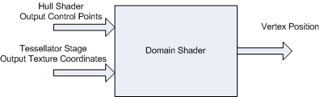

# Tessellation Stages

The Direct3D 11 runtime supports three new stages that implement tessellation, which converts low-detail subdivision surfaces into higher-detail primitives on the GPU. Tessellation tiles (or breaks up) high-order surfaces into suitable structures for rendering.

By implementing tessellation in hardware, a graphics pipeline can evaluate lower detail (lower polygon count) models and render in higher detail. While software tessellation can be done, tessellation implemented by hardware can generate an incredible amount of visual detail (including support for displacement mapping) without adding the visual detail to the model sizes and paralyzing refresh rates.

-   [Tessellation Benefits](#tessellation-benefits)
-   [New Pipeline Stages](#new-pipeline-stages)
    -   [Hull-Shader Stage](#hull-shader-stage)
    -   [Tessellator Stage](#tessellator-stage)
    -   [Domain-Shader Stage](#domain-shader-stage)
-   [APIs for initializing Tessellation Stages](#apis-for-initializing-tessellation-stages)
-   [How to's:](#how-tos)
-   [Related topics](#related-topics)

## Tessellation Benefits

Tessellation:

-   Saves lots of memory and bandwidth, which allows an application to render higher detailed surfaces from low-resolution models. The tessellation technique implemented in the Direct3D 11 pipeline also supports displacement mapping, which can produce stunning amounts of surface detail.
-   Supports scalable-rendering techniques, such as continuous or view dependent levels-of-detail which can be calculated on the fly.
-   Improves performance by performing expensive computations at lower frequency (doing calculations on a lower-detail model). This could include blending calculations using blend shapes or morph targets for realistic animation or physics calculations for collision detection or soft body dynamics.

The Direct3D 11 pipeline implements tessellation in hardware, which off-loads the work from the CPU to the GPU. This can lead to very large performance improvements if an application implements large numbers of morph targets and/or more sophisticated skinning/deformation models. To access the new tessellation features, you must learn about some new pipeline stages.

## New Pipeline Stages

Tessellation uses the GPU to calculate a more detailed surface from a surface constructed from quad patches, triangle patches or isolines. To approximate the high-ordered surface, each patch is subdivided into triangles, points, or lines using tessellation factors. The Direct3D 11 pipeline implements tessellation using three new pipeline stages:

-   [Hull-Shader Stage](#hull-shader-stage) - A programmable shader stage that produces a geometry patch (and patch constants) that correspond to each input patch (quad, triangle, or line).
-   [Tessellator Stage](#tessellator-stage) - A fixed function pipeline stage that creates a sampling pattern of the domain that represents the geometry patch and generates a set of smaller objects (triangles, points, or lines) that connect these samples.
-   [Domain-Shader Stage](#domain-shader-stage) - A programmable shader stage that calculates the vertex position that corresponds to each domain sample.

The following diagram highlights the new stages of the Direct3D 11 pipeline.


The following diagram shows the progression through the tessellation stages. The progression starts with the low-detail subdivision surface. The progression next highlights the input patch with the corresponding geometry patch, domain samples, and triangles that connect these samples. The progression finally highlights the vertices that correspond to these samples.


### Hull-Shader Stage

A hull shader -- which is invoked once per patch -- transforms input control points that define a low-order surface into control points that make up a patch. It also does some per patch calculations to provide data for the tessellation stage and the domain stage. At the simplest black-box level, the hull-shader stage would look something like the following diagram.


A hull shader is implemented with an HLSL function, and has the following properties:

-   The shader input is between 1 and 32 control points.
-   The shader output is between 1 and 32 control points, regardless of the number of tessellation factors. The control-points output from a hull shader can be consumed by the domain-shader stage. Patch constant data can be consumed by a domain shader; tessellation factors can be consumed by the domain shader and the tessellation stage.
-   Tessellation factors determine how much to subdivide each patch.
-   The shader declares the state required by the tessellator stage. This includes information such as the number of control points, the type of patch face and the type of partitioning to use when tessellating. This information appears as declarations typically at the front of the shader code.
-   If the hull-shader stage sets any edge tessellation factor to = 0 or NaN, the patch will be culled. As a result, the tessellator stage may or may not run, the domain shader will not run, and no visible output will be produced for that patch.

At a deeper level, a hull-shader actually operates in two phases: a control-point phase and a patch-constant phase, which are run in parallel by the hardware. The HLSL compiler extracts the parallelism in a hull shader and encodes it into bytecode that drives the hardware.

-   The control-point phase operates once for each control-point, reading the control points for a patch, and generating one output control point (identified by a ControlPointID).
-   The patch-constant phase operates once per patch to generate edge tessellation factors and other per-patch constants. Internally, many patch-constant phases may run at the same time. The patch-constant phase has read-only access to all input and output control points.

Here's an example of a hull shader:


```
[patchsize(12)]
[patchconstantfunc(MyPatchConstantFunc)]
MyOutPoint main(uint Id : SV_ControlPointID,
     InputPatch<MyInPoint, 12> InPts)
{
     MyOutPoint result;
     
     ...
     
     result = TransformControlPoint( InPts[Id] );

     return result;
}
```


For an example that creates a hull shader, see [How To: Create a Hull Shader](direct3d-11-advanced-stages-hull-shader-create.md).

### Tessellator Stage

The tessellator is a fixed-function stage initialized by binding a hull shader to the pipeline (see [How To: Initialize the Tessellator Stage](direct3d-11-advanced-stages-tessellator-initialize.md)). The purpose of the tessellator stage is to subdivide a domain (quad, tri, or line) into many smaller objects (triangles, points or lines). The tessellator tiles a canonical domain in a normalized (zero-to-one) coordinate system. For example, a quad domain is tessellated to a unit square.

The tessellator operates once per patch using the tessellation factors (which specify how finely the domain will be tessellated) and the type of partitioning (which specifies the algorithm used to slice up a patch) that are passed in from the hull-shader stage. The tessellator outputs uv (and optionally w) coordinates and the surface topology to the domain-shader stage.

Internally, the tessellator operates in two phases:

-   The first phase processes the tessellation factors, fixing rounding problems, handling very small factors, reducing and combining factors, using 32-bit floating-point arithmetic.
-   The second phase generates point or topology lists based on the type of partitioning selected. This is the core task of the tessellator stage and uses 16-bit fractions with fixed-point arithmetic. Fixed-point arithmetic allows hardware acceleration while maintaining acceptable precision. For example, given a 64 meter wide patch, this precision can place points at a 2 mm resolution.


| Type of Partitioning | Range                       |
|----------------------|-----------------------------|
| fractional\_odd      | \[1...63\]                  |
| fractional\_even     | TessFactor range: \[2..64\] |
| integer              | TessFactor range: \[1..64\] |
| pow2                 | TessFactor range: \[1..64\] |


 

### Domain-Shader Stage

A domain shader calculates the vertex position of a subdivided point in the output patch. A domain shader is run once per tessellator stage output point and has read-only access to the tessellator stage output UV coordinates, the hull shader output patch, and the hull shader output patch constants, as the following diagram shows.



Properties of the domain shader include:

-   A domain shader is invoked once per output coordinate from the tessellator stage.
-   A domain shader consumes output control points from the hull-shader stage.
-   A domain shader outputs the position of a vertex.
-   Inputs are the hull shader outputs including control points, patch constant data and tessellation factors. The tessellation factors can include the values used by the fixed function tessellator as well as the raw values (before rounding by integer tessellation, for example), which facilitates geomorphing, for example.

After the domain shader completes, tessellation is finished and pipeline data continues to the next pipeline stage (geometry shader, pixel shader etc). A geometry shader that expects primitives with adjacency (for example, 6 vertices per triangle) is not valid when tessellation is active (this results in undefined behavior, which the debug layer will complain about).

Here is an example of a domain shader:


```
void main( out    MyDSOutput result, 
           float2 myInputUV : SV_DomainPoint, 
           MyDSInput DSInputs,
           OutputPatch<MyOutPoint, 12> ControlPts, 
           MyTessFactors tessFactors)
{
     ...

     result.Position = EvaluateSurfaceUV(ControlPoints, myInputUV);
}
```


## APIs for initializing Tessellation Stages

Tessellation is implemented with two new programmable shader stages: a hull shader and a domain shader. These new shader stages are programmed with HLSL code that is defined in shader model 5. The new shader targets are: hs\_5\_0 and ds\_5\_0. Like all programmable shader stages, code for the hardware is extracted from compiled shaders passed into the runtime when shaders are bound to the pipeline using APIs such as [**DSSetShader**](/windows/desktop/api/D3D11/nf-d3d11-id3d11devicecontext-dssetshader) and [**HSSetShader**](/windows/desktop/api/D3D11/nf-d3d11-id3d11devicecontext-hssetshader). But first, the shader must be created using APIs such as [**CreateHullShader**](/windows/desktop/api/D3D11/nf-d3d11-id3d11device-createhullshader) and [**CreateDomainShader**](/windows/desktop/api/D3D11/nf-d3d11-id3d11device-createdomainshader).

Enable tessellation by creating a hull shader and binding it to the hull-shader stage (this automatically sets up the tessellator stage). To generate the final vertex positions from the tessellated patches, you will also need to create a domain shader and bind it to the domain-shader stage. Once tessellation is enabled, the data input to the input-assembler stage must be patch data. That is, the input assembler topology must be a patch constant topology from [**D3D11\_PRIMITIVE\_TOPOLOGY**](/previous-versions/windows/desktop/legacy/ff476189(v=vs.85)) set with [**IASetPrimitiveTopology**](/windows/desktop/api/D3D11/nf-d3d11-id3d11devicecontext-iasetprimitivetopology).

To disable tessellation, set the hull shader and the domain shader to **NULL**. Neither the geometry-shader stage nor the stream-output stage can read hull-shader output-control points or patch data.

-   New topologies for the input-assembler stage, which are extensions to this enumeration.

    ```
    enum D3D11_PRIMITIVE_TOPOLOGY
    ```

    

    The topology is set to the input-assembler stage using [**IASetPrimitiveTopology**](/windows/desktop/api/D3D11/nf-d3d11-id3d11devicecontext-iasetprimitivetopology)

-   Of course, the new programmable shader stages require other state to be set, to bind constant buffers, samples, and shader resources to the appropriate pipeline stages. These new ID3D11Device methods are implemented for setting this state.
    -   [**DSGetConstantBuffers**](/windows/desktop/api/D3D11/nf-d3d11-id3d11devicecontext-dsgetconstantbuffers)
    -   [**DSGetSamplers**](/windows/desktop/api/D3D11/nf-d3d11-id3d11devicecontext-dsgetsamplers)
    -   [**DSGetShader**](/windows/desktop/api/D3D11/nf-d3d11-id3d11devicecontext-dsgetshader)
    -   [**DSGetShaderResources**](/windows/desktop/api/D3D11/nf-d3d11-id3d11devicecontext-dsgetshaderresources)
    -   [**DSSetConstantBuffers**](/windows/desktop/api/D3D11/nf-d3d11-id3d11devicecontext-dssetconstantbuffers)
    -   [**DSSetSamplers**](/windows/desktop/api/D3D11/nf-d3d11-id3d11devicecontext-dssetsamplers)
    -   [**DSSetShader**](/windows/desktop/api/D3D11/nf-d3d11-id3d11devicecontext-dssetshader)
    -   [**DSSetShaderResources**](/windows/desktop/api/D3D11/nf-d3d11-id3d11devicecontext-dssetshaderresources)
    -   [**HSGetConstantBuffers**](/windows/desktop/api/D3D11/nf-d3d11-id3d11devicecontext-hsgetconstantbuffers)
    -   [**HSGetShaderResources**](/windows/desktop/api/D3D11/nf-d3d11-id3d11devicecontext-hsgetshaderresources)
    -   [**HSGetSamplers**](/windows/desktop/api/D3D11/nf-d3d11-id3d11devicecontext-hsgetsamplers)
    -   [**HSGetShader**](/windows/desktop/api/D3D11/nf-d3d11-id3d11devicecontext-hsgetshader)
    -   [**HSSetConstantBuffers**](/windows/desktop/api/D3D11/nf-d3d11-id3d11devicecontext-hssetconstantbuffers)
    -   [**HSSetSamplers**](/windows/desktop/api/D3D11/nf-d3d11-id3d11devicecontext-hssetsamplers)
    -   [**HSSetShader**](/windows/desktop/api/D3D11/nf-d3d11-id3d11devicecontext-hssetshader)
    -   [**HSSetShaderResources**](/windows/desktop/api/D3D11/nf-d3d11-id3d11devicecontext-hssetshaderresources)

## How to's:

The documentation also contains examples for initializing the tessellation stages.


| Item                                                                                                                                                                                                                                                                                           | Description                                   |
|------------------------------------------------------------------------------------------------------------------------------------------------------------------------------------------------------------------------------------------------------------------------------------------------|-----------------------------------------------|
| <span id="How_To__Create_a_Hull_Shader"></span><span id="how_to__create_a_hull_shader"></span><span id="HOW_TO__CREATE_A_HULL_SHADER"></span>[How To: Create a Hull Shader](direct3d-11-advanced-stages-hull-shader-create.md)<br/>                                                     | Create a hull shader.<br/>              |
| <span id="How_To__Design_a_Hull_Shader"></span><span id="how_to__design_a_hull_shader"></span><span id="HOW_TO__DESIGN_A_HULL_SHADER"></span>[How To: Design a Hull Shader](direct3d-11-advanced-stages-hull-shader-design.md)<br/>                                                     | Design a hull shader.<br/>              |
| <span id="How_To__Initialize_the_Tessellator_Stage"></span><span id="how_to__initialize_the_tessellator_stage"></span><span id="HOW_TO__INITIALIZE_THE_TESSELLATOR_STAGE"></span>[How To: Initialize the Tessellator Stage](direct3d-11-advanced-stages-tessellator-initialize.md)<br/> | Initialize the tessellation stage.<br/> |
| <span id="How_To__Create_a_Domain_Shader"></span><span id="how_to__create_a_domain_shader"></span><span id="HOW_TO__CREATE_A_DOMAIN_SHADER"></span>[How To: Create a Domain Shader](direct3d-11-advanced-stages-domain-shader-create.md)<br/>                                           | Create a domain shader.<br/>            |
| <span id="How_To__Design_a_Domain_Shader"></span><span id="how_to__design_a_domain_shader"></span><span id="HOW_TO__DESIGN_A_DOMAIN_SHADER"></span>[How To: Design a Domain Shader](direct3d-11-advanced-stages-domain-shader-design.md)<br/>                                           | Create a domain shader.<br/>            |


 

## Related topics

<dl> <dt>

[Graphics Pipeline](overviews-direct3d-11-graphics-pipeline.md)
</dt> </dl>

 

