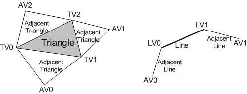

# Geometry Shader Stage

The geometry-shader (GS) stage runs application-specified shader code with vertices as input and the ability to generate vertices on output.

## The Geometry Shader

Unlike vertex shaders, which operate on a single vertex, the geometry shader's inputs are the vertices for a full primitive (two vertices for lines, three vertices for triangles, or single vertex for point). Geometry shaders can also bring in the vertex data for the edge-adjacent primitives as input (an additional two vertices for a line, an additional three for a triangle). The following illustration shows a triangle and a line with adjacent vertices.

|     | Type                |
|-----|-----------------|
| **TV**  | Triangle vertex |
| **AV**  | Adjacent vertex |
| **LV**  | Line vertex     |

 

The geometry-shader stage can consume the SV\_PrimitiveID [system-generated value](d3d10-graphics-programming-guide-input-assembler-stage-using.md) that is auto-generated by the IA. This allows per-primitive data to be fetched or computed if desired.

The geometry-shader stage is capable of outputting multiple vertices forming a single selected topology (GS stage output topologies available are: tristrip, linestrip, and pointlist). The number of primitives emitted can vary freely within any invocation of the geometry shader, though the maximum number of vertices that could be emitted must be declared statically. Strip lengths emitted from a geometry shader invocation can be arbitrary, and new strips can be created via the [RestartStrip](/windows/desktop/direct3dhlsl/dx-graphics-hlsl-so-restartstrip) HLSL function.

Geometry shader output may be fed to the rasterizer stage and/or to a vertex buffer in memory via the stream output stage. Output fed to memory is expanded to individual point/line/triangle lists (exactly as they would be passed to the rasterizer).

When a geometry shader is active, it is invoked once for every primitive passed down or generated earlier in the pipeline. Each invocation of the geometry shader sees as input the data for the invoking primitive, whether that is a single point, a single line, or a single triangle. A triangle strip from earlier in the pipeline would result in an invocation of the geometry shader for each individual triangle in the strip (as if the strip were expanded out into a triangle list). All the input data for each vertex in the individual primitive is available (i.e. 3 vertices for triangle), plus adjacent vertex data if applicable/available.

A geometry shader outputs data one vertex at a time by appending vertices to an output stream object. The topology of the streams is determined by a fixed declaration, choosing one of: PointStream, LineStream, or TriangleStream as the output for the GS stage. There are three types of stream objects available, PointStream, LineStream and TriangleStream which are all templated objects. The topology of the output is determined by their respective object type, while the format of the vertices appended to the stream is determined by the template type. Execution of a geometry shader instance is atomic from other invocations, except that data added to the streams is serial. The outputs of a given invocation of a geometry shader are independent of other invocations (though ordering is respected). A geometry shader generating triangle strips will start a new strip on every invocation.

When a geometry shader output is identified as a System Interpreted Value (e.g. SV\_RenderTargetArrayIndex or SV\_Position), hardware looks at this data and performs some behavior dependent on the value, in addition to being able to pass the data itself to the next shader stage for input. When such data output from the geometry shader has meaning to the hardware on a per-primitive basis (such as SV\_RenderTargetArrayIndex or SV\_ViewportArrayIndex), rather than on a per-vertex basis (such as SV\_ClipDistance\[n\] or SV\_Position), the per-primitive data is taken from the leading vertex emitted for the primitive.

Partially completed primitives could be generated by the geometry shader if the geometry shader ends and the primitive is incomplete. Incomplete primitives are silently discarded. This is similar to the way the IA treats partially completed primitives.

The geometry shader can perform load and texture sampling operations where screen-space derivatives are not required (samplelevel, samplecmplevelzero, samplegrad).

Algorithms that can be implemented in the geometry shader include:

-   Point Sprite Expansion
-   Dynamic Particle Systems
-   Fur/Fin Generation
-   Shadow Volume Generation
-   Single Pass Render-to-Cubemap
-   Per-Primitive Material Swapping
-   Per-Primitive Material Setup - Including generation of barycentric coordinates as primitive data so that a pixel shader can perform custom attribute interpolation (for an example of higher-order normal interpolation, see [CubeMapGS Sample](https://msdn.microsoft.com/library/Ee416398(v=VS.85).aspx)).

## Related topics

<dl> <dt>

[Graphics Pipeline](overviews-direct3d-11-graphics-pipeline.md)
</dt> <dt>

[Pipeline Stages (Direct3D 10)](/windows/desktop/direct3d10/d3d10-graphics-programming-guide-pipeline-stages)
</dt> </dl>

 

 