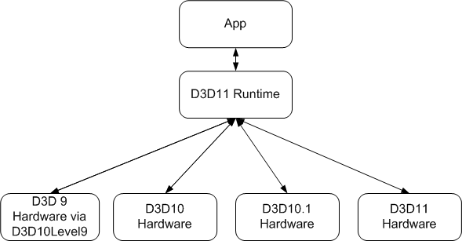

# Direct3D 11 on Downlevel Hardware

This section discusses how Direct3D 11 is designed to support both new and existing hardware, from DirectX 9 to DirectX 11.

This diagram shows how Direct3D 11 supports new and existing hardware.

With Direct3D 11, a new paradigm is introduced called feature levels. A feature level is a well defined set of GPU functionality. Using a feature level, you can target a Direct3D application to run on a downlevel version of Direct3D hardware.

The [10Level9 Reference](d3d11-graphics-reference-10level9.md) section lists the differences between how various [**ID3D11Device**](/windows/desktop/api/D3D11/nn-d3d11-id3d11device) and [**ID3D11DeviceContext**](/windows/desktop/api/D3D11/nn-d3d11-id3d11devicecontext) methods behave at various 10Level9 feature levels.

## In this section

| Topic                                                                                                                  | Description                                                                                                                                                                    |
|------------------------------------------------------------------------------------------------------------------------|--------------------------------------------------------------------------------------------------------------------------------------------------------------------------------|
| [Direct3D feature levels](overviews-direct3d-11-devices-downlevel-intro.md)                                 | This topic discusses Direct3D feature levels.                                                                                                                        |
| [Exceptions](overviews-direct3d-11-devices-downlevel-exceptions.md)                                         | This topic describes exceptions when using Direct3D 11 on downlevel hardware.                                                                                        |
| [Compute Shaders on Downlevel Hardware](overviews-direct3d-11-devices-downlevel-compute-shaders.md)         | This topic discusses how to make use of [compute shaders](direct3d-11-advanced-stages-compute-shader.md) in a Direct3D 11 app on Direct3D 10 hardware.              |
| [Preventing Unwanted NULL Pixel Shader SRVs](overviews-direct3d-11-devices-downlevel-prevent-null-srvs.md)  | This topic discusses how to work around the driver receiving **NULL** shader-resource views (SRVs) even when non-**NULL** SRVs are bound to the pixel shader stage.  |

 

## How to topics about feature levels

| Topic                                                                                                                                                                                                                                                                   | Description                            |
|-------------------------------------------------------------------------------------------------------------------------------------------------------------------------------------------------------------------------------------------------------------------------|----------------------------------------|
| [How To: Get the Device Feature Level](overviews-direct3d-11-devices-downlevel-get.md)  | How to get a feature level.  |

 

## Related topics

<dl> <dt>

[Devices](overviews-direct3d-11-devices.md)
</dt> </dl>

 

 

