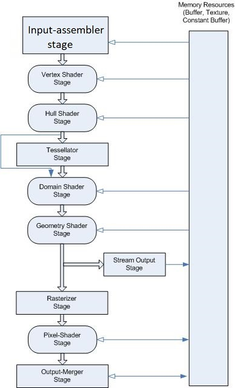

# Graphics Pipeline

The Direct3D 11 programmable pipeline is designed for generating graphics for realtime gaming applications. This section describes the Direct3D 11 programmable pipeline. The following diagram shows the data flow from input to output through each of the programmable stages.

 // TODO: alter the text on the image

The graphics pipeline for Microsoft Direct3D 11 supports the same stages as the [Direct3D 10 graphics pipeline](/windows/desktop/direct3d10/d3d10-graphics-programming-guide-pipeline-stages), with additional stages to support advanced features.

You can use the Direct3D 11API to configure all of the stages. Stages that feature common shader cores (the rounded rectangular blocks) are programmable by using the [HLSL](/windows/desktop/direct3dhlsl/dx-graphics-hlsl) programming language. As you will see, this makes the pipeline extremely flexible and adaptable.

## In this section

| Topic                                                                                          | Description                                                                                                                                                                                                                                                                                                                                                                                                                                                                                      |
|------------------------------------------------------------------------------------------------|--------------------------------------------------------------------------------------------------------------------------------------------------------------------------------------------------------------------------------------------------------------------------------------------------------------------------------------------------------------------------------------------------------------------------------------------------------------------------------------------------|
| [Input-Assembler Stage](d3d10-graphics-programming-guide-input-assembler-stage.md)  | The Direct3D 10 and higher API separates functional areas of the pipeline into stages; the first stage in the pipeline is the input-assembler (IA) stage.                                                                                                                                                                                                                                                                                                                              |
| [Vertex Shader Stage](vertex-shader-stage.md)                                       | The vertex-shader (VS) stage processes vertices from the input assembler, performing per-vertex operations such as transformations, skinning, morphing, and per-vertex lighting. Vertex shaders always operate on a single input vertex and produce a single output vertex. The vertex shader stage must always be active for the pipeline to execute. If no vertex modification or transformation is required, a pass-through vertex shader must be created and set to the pipeline.  |
| [Tessellation Stages](direct3d-11-advanced-stages-tessellation.md)                  | The Direct3D 11 runtime supports three new stages that implement tessellation, which converts low-detail subdivision surfaces into higher-detail primitives on the GPU. Tessellation tiles (or breaks up) high-order surfaces into suitable structures for rendering.                                                                                                                                                                                                                  |
| [Geometry Shader Stage](geometry-shader-stage.md)                                   | The geometry-shader (GS) stage runs application-specified shader code with vertices as input and the ability to generate vertices on output.                                                                                                                                                                                                                                                                                                                                           |
| [Stream-Output Stage](d3d10-graphics-programming-guide-output-stream-stage.md)      | The purpose of the stream-output stage is to continuously output (or stream) vertex data from the geometry-shader stage (or the vertex-shader stage if the geometry-shader stage is inactive) to one or more buffers in memory (see [Getting Started with the Stream-Output Stage](d3d10-graphics-programming-guide-output-stream-stage-getting-started.md)).                                                                                                                         |
| [Rasterizer Stage](d3d10-graphics-programming-guide-rasterizer-stage.md)            | The rasterization stage converts vector information (composed of shapes or primitives) into a raster image (composed of pixels) for the purpose of displaying real-time 3D graphics.                                                                                                                                                                                                                                                                                                   |
| [Pixel Shader Stage](pixel-shader-stage.md)                                         | The pixel-shader stage (PS) enables rich shading techniques such as per-pixel lighting and post-processing. A pixel shader is a program that combines constant variables, texture data, interpolated per-vertex values, and other data to produce per-pixel outputs. The rasterizer stage invokes a pixel shader once for each pixel covered by a primitive, however, it is possible to specify a **NULL** shader to avoid running a shader.                                           |
| [Output-Merger Stage](d3d10-graphics-programming-guide-output-merger-stage.md)      | The output-merger (OM) stage generates the final rendered pixel color using a combination of pipeline state, the pixel data generated by the pixel shaders, the contents of the render targets, and the contents of the depth/stencil buffers. The OM stage is the final step for determining which pixels are visible (with depth-stencil testing) and blending the final pixel colors.                                                                                               |

 

## Related topics

<dl> <dt>

[Compute Shader](direct3d-11-advanced-stages-compute-shader.md)
</dt> <dt>

[Programming Guide for Direct3D 11](dx-graphics-overviews.md)
</dt> </dl>

 

