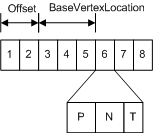
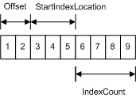

# Introduction to Buffers in Direct3D 11

A buffer resource is a collection of fully typed data grouped into elements. You can use buffers to store a wide variety of data, including position vectors, normal vectors, texture coordinates in a vertex buffer, indexes in an index buffer, or device state. A buffer element is made up of 1 to 4 components. Buffer elements can include packed data values (like R8G8B8A8 surface values), single 8-bit integers, or four 32-bit floating point values.

A buffer is created as an unstructured resource. Because it is unstructured, a buffer cannot contain any mipmap levels, it cannot get filtered when read, and it cannot be multisampled.

## Buffer Types

The following are the buffer resource types supported by Direct3D 11. All buffer types are encapsulated by the [**ID3D11Buffer**](/windows/desktop/api/D3D11/nn-d3d11-id3d11buffer) interface.

-   [Vertex Buffer](#vertex-buffer)
-   [Index Buffer](#index-buffer)
-   [Constant Buffer](#constant-buffer)

### Vertex Buffer

A vertex buffer contains the vertex data used to define your geometry. Vertex data includes position coordinates, color data, texture coordinate data, normal data, and so on.

The simplest example of a vertex buffer is one that only contains position data. It can be visualized like the following illustration.

More often, a vertex buffer contains all the data needed to fully specify 3D vertices. An example of this could be a vertex buffer that contains per-vertex position, normal and texture coordinates. This data is usually organized as sets of per-vertex elements, as shown in the following illustration.

This vertex buffer contains per-vertex data; each vertex stores three elements (position, normal, and texture coordinates). The position and normal are each typically specified using three 32-bit floats (DXGI\_FORMAT\_R32G32B32\_FLOAT) and the texture coordinates using two 32-bit floats (DXGI\_FORMAT\_R32G32\_FLOAT).

To access data from a vertex buffer you need to know which vertex to access, plus the following additional buffer parameters:

-   Offset - the number of bytes from the start of the buffer to the data for the first vertex. You can specify the offset using the [**ID3D11DeviceContext::IASetVertexBuffers**](/windows/desktop/api/D3D11/nf-d3d11-id3d11devicecontext-iasetvertexbuffers) method.
-   BaseVertexLocation - a value added to each index before reading a vertex from the vertex buffer.

Before you create a vertex buffer, you need to define its layout by creating an [**ID3D11InputLayout**](/windows/win32/api/d3d11/nn-d3d11-id3d11inputlayout) interface; this is done by calling the [**ID3D11Device::CreateInputLayout**](/windows/desktop/api/D3D11/nf-d3d11-id3d11device-createinputlayout) method. After the input-layout object is created, you can bind it to the input-assembler stage by calling the [**ID3D11DeviceContext::IASetInputLayout**](/windows/desktop/api/D3D11/nf-d3d11-id3d11devicecontext-iasetinputlayout).

To create a vertex buffer, call [**ID3D11Device::CreateBuffer**](/windows/desktop/api/D3D11/nf-d3d11-id3d11device-createbuffer).

### Index Buffer

Index buffers contain integer offsets into vertex buffers and are used to render primitives more efficiently. An index buffer contains a sequential set of 16-bit or 32-bit indices; each index is used to identify a vertex in a vertex buffer. An index buffer can be visualized like the following illustration.

The sequential indices stored in an index buffer are located with the following parameters:

-   Offset - the number of bytes from the base address of the index buffer. The offset is supplied to the [**ID3D11DeviceContext::IASetIndexBuffer**](/windows/desktop/api/D3D11/nf-d3d11-id3d11devicecontext-iasetindexbuffer) method.
-   StartIndexLocation - specifies the first index buffer element from the base address and the offset provided in [**IASetIndexBuffer**](/windows/desktop/api/D3D11/nf-d3d11-id3d11devicecontext-iasetindexbuffer). The start location is supplied to the [**ID3D11DeviceContext::DrawIndexed**](/windows/desktop/api/D3D11/nf-d3d11-id3d11devicecontext-drawindexed) or [**ID3D11DeviceContext::DrawIndexedInstanced**](/windows/desktop/api/D3D11/nf-d3d11-id3d11devicecontext-drawindexedinstanced) method and represents the first index to render.
-   IndexCount - the number of indices to render. The number is supplied to the [**DrawIndexed**](/windows/desktop/api/D3D11/nf-d3d11-id3d11devicecontext-drawindexed) method

Start of Index Buffer = Index Buffer Base Address + Offset (bytes) + StartIndexLocation \* ElementSize (bytes);

In this calculation, ElementSize is the size of each index buffer element, which is either two or four bytes.

To create an index buffer, call [**ID3D11Device::CreateBuffer**](/windows/desktop/api/D3D11/nf-d3d11-id3d11device-createbuffer).

### Constant Buffer

A constant buffer allows you to efficiently supply shader constants data to the pipeline. You can use a constant buffer to store the results of the stream-output stage. Conceptually, a constant buffer looks just like a single-element vertex buffer, as shown in the following illustration.

Each element stores a 1-to-4 component constant, determined by the format of the data stored. To create a shader-constant buffer, call [**ID3D11Device::CreateBuffer**](/windows/desktop/api/D3D11/nf-d3d11-id3d11device-createbuffer) and specify the **D3D11\_BIND\_CONSTANT\_BUFFER** member of the [**D3D11\_BIND\_FLAG**](/windows/desktop/api/D3D11/ne-d3d11-d3d11_bind_flag) enumerated type.

A constant buffer can only use a single bind flag (**D3D11\_BIND\_CONSTANT\_BUFFER**), which cannot be combined with any other bind flag. To bind a shader-constant buffer to the pipeline, call one of the following methods: [**ID3D11DeviceContext::GSSetConstantBuffers**](/windows/desktop/api/D3D11/nf-d3d11-id3d11devicecontext-gssetconstantbuffers), [**ID3D11DeviceContext::PSSetConstantBuffers**](/windows/desktop/api/D3D11/nf-d3d11-id3d11devicecontext-pssetconstantbuffers), or [**ID3D11DeviceContext::VSSetConstantBuffers**](/windows/desktop/api/D3D11/nf-d3d11-id3d11devicecontext-vssetconstantbuffers).

To read a shader-constant buffer from a shader, use a HLSL load function (for example, [**Load**](/windows/desktop/direct3dhlsl/dx-graphics-hlsl-to-load)). Each shader stage allows up to 15 shader-constant buffers; each buffer can hold up to 4096 constants.

## Related topics

<dl> <dt>

[Buffers](overviews-direct3d-11-resources-buffers.md)
</dt> </dl>

 

 
