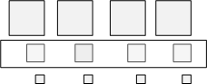

# Subresources (Direct3D 11 Graphics)

This topic describes texture subresources, or portions of a resource.

Direct3D can reference an entire resource or it can reference subsets of a resource. The term subresource refers to a subset of a resource.

A buffer is defined as a single subresource. Textures are a little more complicated because there are several different texture types (1D, 2D, etc.) some of which support mipmap levels and/or texture arrays. Beginning with the simplest case, a 1D texture is defined as a single subresource, as shown in the following illustration.

This means that the array of texels that make up a 1D texture are contained in a single subresource.

If you expand a 1D texture with three mipmap levels, it can be visualized like the following illustration.

Think of this as a single texture that is made up of three subresources. A subresource can be indexed using the level-of-detail (LOD) for a single texture. When using an array of textures, accessing a particular subresource requires both the LOD and the particular texture. Alternately, the API combines these two pieces of information into a single zero-based subresource index, as shown in the following illustration.

## Selecting Subresources

Some APIs access an entire resource (for example the [**ID3D11DeviceContext::CopyResource**](/windows/desktop/api/D3D11/nf-d3d11-id3d11devicecontext-copyresource) method), others access a portion of a resource (for example the [**ID3D11DeviceContext::UpdateSubresource**](/windows/desktop/api/D3D11/nf-d3d11-id3d11devicecontext-updatesubresource) method or the [**ID3D11DeviceContext::CopySubresourceRegion**](/windows/desktop/api/D3D11/nf-d3d11-id3d11devicecontext-copysubresourceregion) method). The methods that access a portion of a resource generally use a view description (such as the [**D3D11\_TEX2D\_ARRAY\_DSV**](/windows/desktop/api/D3D11/ns-d3d11-d3d11_tex2d_array_dsv) structure) to specify the subresources to access.

The illustrations in the following sections show the terms used by a view description when accessing an array of textures.

### Array Slice

Given an array of textures, each texture with mipmaps, an *array slice* (represented by the white rectangle) includes one texture and all of its subresources, as shown in the following illustration.

### Mip Slice

A *mip slice* (represented by the white rectangle) includes one mipmap level for every texture in an array, as shown in the following illustration.

### Selecting a Single Subresource

You can use these two types of slices to choose a single subresource, as shown in the following illustration.

### Selecting Multiple Subresources

Or you can use these two types of slices with the number of mipmap levels and/or number of textures, to choose multiple subresources, as shown in the following illustration.

> [!Note]  
> A [**render-target view**](/windows/desktop/api/D3D11/ns-d3d11-d3d11_render_target_view_desc) can only use a single subresource or mip slice and cannot include subresources from more than one mip slice. That is, every texture in a render-target view must be the same size. A [**shader-resource view**](/windows/desktop/api/d3d11/ns-d3d11-d3d11_shader_resource_view_desc) can select any rectangular region of subresources, as shown in the figure.

 

## Related topics

<dl> <dt>

[Resources](overviews-direct3d-11-resources.md)
</dt> </dl>

 

 

