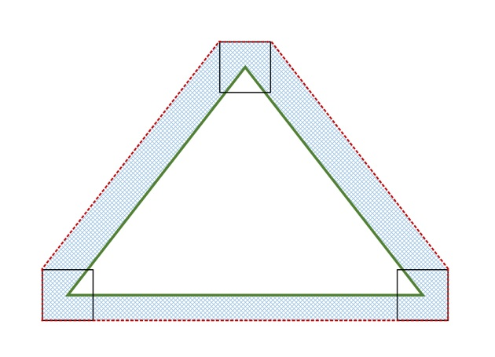
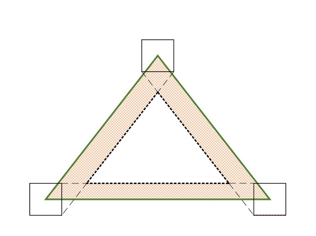

# Direct3D 12 Conservative Rasterization

Conservative Rasterization adds some certainty to pixel rendering, which is helpful in particular to collision detection algorithms.

-   [Overview](#overview)
-   [Interactions with the pipeline](#interactions-with-the-pipeline)
    -   [Rasterization Rules interaction](#rasterization-rules-interaction)
    -   [Multisampling interaction](#multisampling-interaction)
    -   [SampleMask interaction](#samplemask-interaction)
    -   [Depth/Stencil Test interaction](#depthstencil-test-interaction)
    -   [Helper Pixel interaction](#helper-pixel-interaction)
    -   [Output Coverage interaction](#output-coverage-interaction)
    -   [InputCoverage interaction](#inputcoverage-interaction)
    -   [InnerCoverage interaction](#innercoverage-interaction)
    -   [Attribute Interpolation interaction](#attribute-interpolation-interaction)
    -   [Clipping interaction](#clipping-interaction)
    -   [Clip Distance interaction](#clip-distance-interaction)
    -   [Target Independent Rasterization interaction](#target-independent-rasterization-interaction)
    -   [IA Primitive Topology interaction](#ia-primitive-topology-interaction)
    -   [Query interaction](#query-interaction)
    -   [Cull State interaction](#cull-state-interaction)
    -   [IsFrontFace interaction](#isfrontface-interaction)
    -   [Fill Modes interaction](#fill-modes-interaction)
-   [Implementation details](#implementation-details)
-   [API summary](#api-summary)
-   [Related topics](#related-topics)

## Overview

Conservative Rasterization means that all pixels that are at least partially covered by a rendered primitive are rasterized, which means that the pixel shader is invoked. Normal behavior is sampling, which is not used if Conservative Rasterization is enabled.

Conservative Rasterization is useful in a number of situations, including for certainty in collision detection, occlusion culling, and tiled rendering.

For example, the following figure shows a green triangle rendered using Conservative Rasterization, as it would appear in the rasterizer (that is, using 16.8 fixed point vertex coordinates). The brown area is known as an "uncertainty region" - a conceptual region that represents the extended bounds of the triangle, required to ensure the primitive in the rasterizer is conservative with respect to the original floating point vertex coordinates. The red squares at each vertex shows how the uncertainty region is calculated: as a swept square.

The large gray squares show the pixels that will be rendered. The pink squares show pixels rendered using the "Top-Left Rule", which comes into play as the edge of the triangle crosses the edge of the pixels. There can be false positives (pixels set that should not have been) which the system will normally but not always cull.

## Interactions with the pipeline

### Rasterization Rules interaction

In Conservative Rasterization mode, Rasterization Rules apply the same way as when Conservative Rasterization mode is not enabled with exceptions for the Top-Left Rule, described above, and Pixel Coverage. 16.8 Fixed-Point Rasterizer precision must be used.

Pixels that would not be covered if hardware was using full floating point vertex coordinates may only be included if they are within an uncertainty region no larger half a pixel in the fixed point domain. Future hardware is expected to reach the tightened uncertainty region specified in Tier 2. Note that this requirement prevents sliver triangles from extending further than necessary.

A similar valid uncertainty region applies to `InnerCoverage` as well, but it is tighter since no implementations require a larger uncertainty region for this case. See [InnerCoverage interaction](#innercoverage-interaction) for more detail.

Inner and outer uncertainty regions must be greater than or equal to the size of half the sub-pixel grid, or 1/512 of a pixel, in the fixed point domain. This is the minimum valid uncertainty region. 1/512 comes from the 16.8 fixed point Rasterizer coordinate representation and the round-to-nearest rule that applies when converting floating point vertex coordinates to 16.8 fixed point coordinates. 1/512 can change if the Rasterizer precision changes. If an implementation implements this minimum uncertainty region, then they must follow the Top-Left Rule when an edge or corner of the uncertainty region falls along the edge or corner of a pixel. The clipped edges of the uncertainty region should be treated as the closest vertex, meaning that it counts as two edges: the two that join at the associated vertex. Top-Left Rule is required when the minimum uncertainty region is used because if it is not, then a Conservative Rasterization implementation would fail to rasterize pixels that could be covered when Conservative Rasterization mode is disabled.

The following diagram illustrates a valid outer uncertainty region produced by sweeping a square around the edges of the primitive in the fixed point domain (i.e. the vertices have been quantized by the 16.8 fixed point representation). The dimensions of this square are based on the valid outer uncertainty region size: for the 1/2 of a pixel, the square is 1 pixel in width and height, for 1/512 of a pixel, the square is 1/256 of a pixel in width and height. The green triangle represents a given primitive, the red dotted line represents the bound on Overestimated Conservative Rasterization, the solid black squares represent the square that is swept along the primitive edges, and the blue checkered area is the outer uncertainty region:

### Multisampling interaction

Regardless of the number of samples in **RenderTarget**/**DepthStencil** surfaces (or whether *ForcedSampleCount* is being used or not), all samples are covered for pixels rasterized by Conservative Rasterization. Individual sample locations are not tested for whether they fall in the primitive or not.

### SampleMask interaction

The *SampleMask* Rasterizer State applies the same way as when Conservative Rasterization is not enabled for `InputCoverage`, but does not affect `InnerCoverage` (i.e. it is not AND’ed into an input declared with `InnerCoverage`). This is because `InnerCoverage` is unrelated to whether MSAA samples are masked out: 0 `InnerCoverage` only means that the pixel is not guaranteed to be fully covered, not that no samples will be updated.

### Depth/Stencil Test interaction

Depth/Stencil Testing proceeds for a conservatively rasterized pixel the same way as if all samples are covered when Conservative Rasterization is not enabled.

Proceeding with all samples covered can cause Depth Extrapolation, which is valid and must be clamped to the viewport as specified when Conservative Rasterization is not enabled. This is similar to when pixel-frequency interpolation modes are used on a **RenderTarget** with sample count greater than 1, although in the case of Conservative Rasterization, it is the depth value going into the fixed function depth test that can be extrapolated.

Early Depth culling behavior with Depth Extrapolation is undefined. This is because some Early Depth culling hardware cannot properly support extrapolated depth values. However, Early Depth culling behavior in the presence of Depth Extrapolation is problematic even with hardware that can support extrapolated depth values. This issue can be worked around by clamping the Pixel Shader input depth to the min and max depth values of the primitive being rasterized and writing that value to `oDepth` (the pixel shader output depth register). Implementations are required to disable Early Depth culling in this case, due to the `oDepth` write.

### Helper Pixel interaction

Helper Pixel rules apply the same way as when Conservative Rasterization is not enabled. As part of this, all pixels including Helper Pixels must report `InputCoverage` accurately as specified in the `InputCoverage` interaction section. So fully non-covered pixels report 0 coverage.

### Output Coverage interaction

Output Coverage (`oMask`) behaves for a conservatively rasterized pixel as it does when Conservative Rasterization is not enabled with all samples covered.

### InputCoverage interaction

In Conservative Rasterization mode, this input register is populated as if all samples are covered when Conservative Rasterization is not enabled for a given conservatively rasterized pixel. That is to say, all existing interactions apply (e.g. *SampleMask* is applied), and the first n bits in `InputCoverage` from the LSB are set to 1 for a conservatively rasterized pixel, given an n sample per pixel **RenderTarget** and/or **DepthStencil** buffer bound at the **Output Merger**, or an n sample *ForcedSampleCount*. The rest of the bits are 0.

This input is available in a shader regardless of the use of Conservative Rasterization, though Conservative Rasterization changes its behavior to only show all samples covered (or none for Helper Pixels).

### InnerCoverage interaction

This feature is required by, and only available in, Tier 3. The runtime will fail shader creation for shaders that use this mode when an implementation supports a Tier less than Tier 3.

The Pixel Shader has a 32-bit scalar integer System Generate Value available: `InnerCoverage`. This is a bit-field that has bit 0 from the LSB set to 1 for a given conservatively rasterized pixel, only when that pixel is guaranteed to be entirely inside the current primitive. All other input register bits must be set to 0 when bit 0 is not set, but are undefined when bit 0 is set to 1 (essentially, this bit-field represents a Boolean value where false must be exactly 0, but true can be any odd (i.e. bit 0 set) non-zero value). This input is used for underestimated Conservative Rasterization information. It informs the Pixel Shader whether the current pixel lies completely inside the geometry.

This must account for snapping error at resolutions greater than or equal to the resolution at which the current Draw is operating. There must not be false positives (setting `InnerCoverage` bits when the pixel is not fully covered for any snapping error at resolutions greater than or equal to the resolution at which the current Draw is operating), but false negatives are allowed. In summary, the implementation must not incorrectly identify pixels as fully covered that would not be with full floating point vertex coordinates in the Rasterizer.

Pixels that would be fully covered if hardware was using full floating point vertex coordinates may only be omitted if they intersect the inner uncertainty region, which must be no larger than the size of the sub-pixel grid, or 1/256 of a pixel, in the fixed point domain. Said another way, pixels entirely within the inner boundary of the inner uncertainty region must be marked as fully covered. The inner boundary of the uncertainty region is illustrated in the diagram below by the bold black dotted line. 1/256 comes from the 16.8 fixed point Rasterizer coordinate representation, which can change if the Rasterizer precision changes. This uncertainty region is enough to account for snapping error caused by the conversion of floating point vertex coordinates to fixed point vertex coordinates in the Rasterizer.

The same 1/512 minimum uncertainty region requirements defined in Rasterization Rules interaction apply here as well.

The following diagram illustrates a valid inner uncertainty region produced by sweeping a square around the edges of the primitive in the fixed point domain (i.e. the vertices have been quantized by the 16.8 fixed point representation). The dimensions of this square are based on the valid inner uncertainty region size: for 1/256 of a pixel, the square is 1/128 of a pixel in width and height. The green triangle represents a given primitive, the bold black dotted line represents the boundary of the inner uncertainty region, the solid black squares represent the square that is swept along the primitive edges, and the orange checkered area is the inner uncertainty region:

The use of `InnerCoverage` does not affect whether a pixel is conservatively rasterized, i.e. using one of these `InputCoverage` modes does not affect which pixels are rasterized when Conservative Rasterization mode is enabled. Therefore, when `InnerCoverage` is used and the Pixel Shader is processing a pixel that is not completely covered by the geometry its value will be 0, but the Pixel Shader invocation will have samples updated. This is different from when `InputCoverage` is 0, meaning that no samples will be updated.

This input is mutually exclusive with `InputCoverage` : both cannot be used.

To access `InnerCoverage`, it must be declared as a single component out of one of the Pixel Shader input registers. The interpolation mode on the declaration must be constant (interpolation does not apply).

The `InnerCoverage` bit-field is not affected by depth/stencil tests, nor is it ANDed with the *SampleMask* Rasterizer state.

This input is only valid in Conservative Rasterization mode. When Conservative Rasterization is not enabled, `InnerCoverage` produces an undefined value.

Pixel Shader invocations caused by the need for Helper Pixels, but otherwise not covered by the primitive, must have the `InnerCoverage` register set to 0.

### Attribute Interpolation interaction

Attribute interpolation modes are unchanged and proceed the same way as when Conservative Rasterization is not enabled, where the viewport-scaled and fixed-point-converted vertices are used. Because all samples in a conservatively rasterized pixel are considered covered, it is valid for values to be extrapolated, similar to when pixel-frequency interpolation modes are used on a **RenderTarget** with sample count greater than 1. Centroid interpolation modes produce results identical to the corresponding non-centroid interpolation mode; the notion of centroid is meaningless in this scenario – where sample coverage is only either full or 0.

Conservative Rasterization allows for degenerate triangles to produce Pixel Shader invocations, therefore, degenerate triangles must use the values assigned to Vertex 0 for all interpolated values.

### Clipping interaction

When Conservative Rasterization mode is enabled and depth clip is disabled (when the *DepthClipEnable* Rasterizer State is set to FALSE), there may be variances in attribute interpolation for segments of a primitive that fall outside the 0 <= z <= w range, depending on implementation: either constant values are used from a point where the primitive intersects the relevant plane (near or far), or attribute interpolation behaves as when Conservative Rasterization mode is disabled. However, the depth value behavior is the same regardless of Conservative Rasterization mode, i.e. primitives that fall outside of the depth range must still be given the value of the nearest limit of the viewport depth range. Attribute interpolation behavior inside the 0 <= z <= w range must remain unchanged.

### Clip Distance interaction

Clip Distance is valid when Conservative Rasterization mode is enabled, and behaves for a conservatively rasterized pixel as it does when Conservative Rasterization is not enabled with all samples covered.

Note that Conservative Rasterization can cause extrapolation of the W vertex coordinate, which may cause W <= 0. This could cause per-pixel Clip Distance implementations to operate on a Clip Distance that has been Perspective Divided by an invalid W value. Clip Distance implementations must guard against invoking rasterization for pixels where vertex coordinate W <= 0 (e.g. due to extrapolation when in Conservative Rasterization mode).

### Target Independent Rasterization interaction

Conservative Rasterization mode is compatible with Target Independent Rasterization (TIR). TIR rules and restrictions apply, behaving for a conservatively rasterized pixel as if all samples are covered.

### IA Primitive Topology interaction

Conservative Rasterization is not defined for line or point primitives. Therefore, Primitive Topologies that specify points or lines produce undefined behavior if they are fed to the rasterizer unit when Conservative Rasterization is enabled.

The debug layer validation verifies applications do not use these Primitive Topologies.

### Query interaction

For a conservatively rasterized pixel, queries behave as they do when Conservative Rasterization is not enabled when all samples are covered. For example, for a conservatively rasterized pixel, D3D12\_QUERY\_TYPE\_OCCLUSION and D3D12\_QUERY\_TYPE\_PIPELINE\_STATISTICS (from [**D3D12\_QUERY\_TYPE**](/windows/desktop/api/d3d12/ne-d3d12-d3d12_query_type)) must behave as they would when Conservative Rasterization is not enabled when all samples are covered.

Pixel Shader invocations should increment for every conservatively rasterized pixel in Conservative Rasterization mode.

### Cull State interaction

All Cull States are valid in Conservative Rasterization mode and follow the same rules as when Conservative Rasterization is not enabled.

When comparing Conservative Rasterization across resolutions to itself or without Conservative Rasterization enabled, there is the possibility that some primitives may have mismatched facedness (i.e. one back facing, the other front facing). Applications can avoid this uncertainty by using D3D12\_CULL\_MODE\_NONE (from [**D3D12\_CULL\_MODE**](/windows/desktop/api/d3d12/ne-d3d12-d3d12_cull_mode)) and not using the `IsFrontFace` System Generated Value.

### IsFrontFace interaction

The `IsFrontFace` System Generated Value is valid to use in Conservative Rasterization mode, and follows the behavior defined when Conservative Rasterization is not enabled.

### Fill Modes interaction

The only valid [**D3D12\_FILL\_MODE**](/windows/desktop/api/d3d12/ne-d3d12-d3d12_fill_mode) for Conservative Rasterization is D3D12\_FILL\_SOLID, any other fill mode is an invalid parameter for the Rasterizer State.

This is because D3D12 functional specification specifies that wireframe fill mode should convert triangle edges to lines and follow the line rasterization rules and conservative line rasterization behavior has not been defined.

## Implementation details

The type of rasterization supported in Direct3D 12 is sometimes referred to as "Overestimated Conservative Rasterization". There is also the concept of "Underestimated Conservative Rasterization", which means that only pixels that are fully covered by a rendered primitive are rasterized. Underestimated Conservative Rasterization information is available through the pixel shader through the use of input coverage data, and only overestimated Conservative Rasterization is available as a rasterizing mode.

If any part of a primitive overlaps a pixel, then that pixel is considered covered and is then rasterized. When an edge or corner of a primitive falls along the edge or corner of a pixel, the application of the "top-left rule" is implementation-specific. However, for implementations that support degenerate triangles, a degenerate triangle along an edge or corner must cover at least one pixel.

Conservative Rasterization implementations can vary on different hardware, and do produce false positives, meaning that they can incorrectly decide that pixels are covered. This can occur because of implementation-specific details like primitive growing or snapping errors inherent in the fixed-point vertex coordinates used in rasterization. The reason false positives (with respect to fixed point vertex coordinates) are valid is because some amount of false positives are needed to allow an implementation to do coverage evaluation against post-snapped vertices (i.e. vertex coordinates that have been converted from floating point to the 16.8 fixed-point used in the rasterizer), but honor the coverage produced by the original floating point vertex coordinates.

Conservative Rasterization implementations do not produce false negatives with respect to the floating-point vertex coordinates for non-degenerate post-snap primitives: if any part of a primitive overlaps any part of a pixel, then that pixel is rasterized.

Triangles that are degenerate (duplicate indices in an index buffer or collinear in 3D), or become degenerate after fixed-point conversion (collinear vertices in the rasterizer), may or may not be culled; both are valid behaviors. Degenerate triangles must be considered back facing, so if a specific behavior is required by an application, it can use back-face culling or test for front facing. Degenerate triangles use the values assigned to Vertex 0 for all interpolated values.

There are three tiers of hardware support, in addition to the possibility that the hardware does not support this feature.

-   Tier 1 enforces a maximum 1/2 pixel uncertainty region and does not support post-snap degenerates. This is good for tiled rendering, a texture atlas, light map generation and sub-pixel shadow maps.
-   Tier 2 reduces the maximum uncertainty region to 1/256 and requires post-snap degenerates not be culled. This tier is helpful for CPU-based algorithm acceleration (such as voxelization).
-   Tier 3 maintains a maximum 1/256 uncertainty region and adds support for inner input coverage. Inner input coverage adds the new value `SV_InnerCoverage` to High Level Shading Language (HLSL). This is a 32-bit scalar integer that can be specified on input to a pixel shader, and represents the underestimated Conservative Rasterization information (that is, whether a pixel is guaranteed-to-be-fully covered). This tier is helpful for occlusion culling.

## API summary

The following methods, structures, enums, and helper classes reference Conservative Rasterization:

-   [**D3D12\_RASTERIZER\_DESC**](/windows/desktop/api/d3d12/ns-d3d12-d3d12_rasterizer_desc) : structure holding the rasterizer description.
-   [**D3D12\_CONSERVATIVE\_RASTERIZATION\_MODE**](/windows/desktop/api/d3d12/ne-d3d12-d3d12_conservative_rasterization_mode) : enum values for the mode (on or off).
-   [**D3D12\_FEATURE\_DATA\_D3D12\_OPTIONS**](/windows/desktop/api/d3d12/ns-d3d12-d3d12_feature_data_d3d12_options) : structure holding the tier of support.
-   [**D3D12\_CONSERVATIVE\_RASTERIZATION\_TIER**](/windows/desktop/api/d3d12/ne-d3d12-d3d12_conservative_rasterization_tier) : enum values for each tier of support by the hardware.
-   [**CheckFeatureSupport**](/windows/desktop/api/d3d12/nf-d3d12-id3d12device-checkfeaturesupport) : method to access the supported features.
-   [**CD3DX12\_RASTERIZER\_DESC**](cd3dx12-rasterizer-desc.md) : helper class for creating rasterizer descriptions.

## Related topics

<dl> <dt>

[DirectX advanced learning video tutorials : Conservative Rasterization](https://www.youtube.com/watch?v=zL0oSY_YmDY)
</dt> <dt>

[Rasterizer Ordered Views](rasterizer-order-views.md)
</dt> <dt>

[Rendering](rendering.md)
</dt> </dl>

 

 

