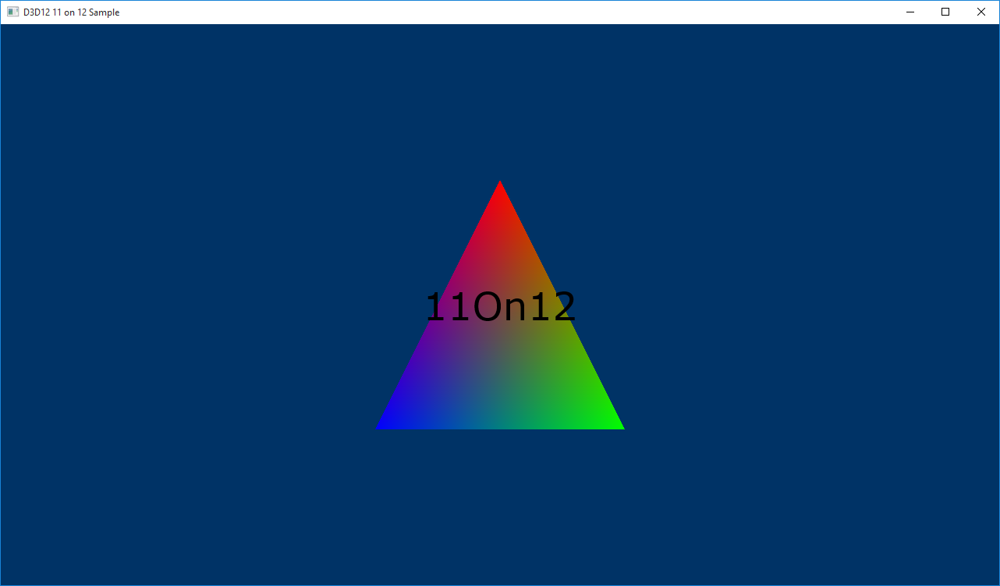

# D2D using D3D11on12

The **D3D1211on12** sample demonstrates how to render D2D content over D3D12 content by sharing resources between an 11 based device and a 12 based device.

-   [Create an ID3D11On12Device](#create-an-id3d11on12device)
-   [Create a D2D factory](#create-a-d2d-factory)
-   [Create a render target for D2D](#create-a-render-target-for-d2d)
-   [Create basic D2D text objects](#create-basic-d2d-text-objects)
-   [Updating the main render loop](#updating-the-main-render-loop)
-   [Run the sample](#run-the-sample)
-   [Related topics](#related-topics)

## Create an ID3D11On12Device

The first step is to create an [**ID3D11On12Device**](/windows/desktop/api/d3d11on12/nn-d3d11on12-id3d11on12device) after the [**ID3D12Device**](/windows/desktop/api/d3d12/nn-d3d12-id3d12device) has been created, which involves creating an [**ID3D11Device**](/windows/desktop/api/d3d11/nn-d3d11-id3d11device) that is wrapped around the **ID3D12Device** via the API [**D3D11On12CreateDevice**](/windows/desktop/api/d3d11on12/nf-d3d11on12-d3d11on12createdevice). This API also takes in, among other parameters, an [**ID3D12CommandQueue**](/windows/desktop/api/d3d12/nn-d3d12-id3d12commandqueue) so that the 11On12 device can submit its commands. After the **ID3D11Device** is created, you can query the **ID3D11On12Device** interface from it. This is the primary device object that will be used to set up D2D.

In the **LoadPipeline** method, setup the devices.

``` syntax
 // Create an 11 device wrapped around the 12 device and share
    // 12's command queue.
    ComPtr<ID3D11Device> d3d11Device;
    ThrowIfFailed(D3D11On12CreateDevice(
        m_d3d12Device.Get(),
        d3d11DeviceFlags,
        nullptr,
        0,
        reinterpret_cast<IUnknown**>(m_commandQueue.GetAddressOf()),
        1,
        0,
        &d3d11Device,
        &m_d3d11DeviceContext,
        nullptr
        ));

    // Query the 11On12 device from the 11 device.
    ThrowIfFailed(d3d11Device.As(&m_d3d11On12Device));
```


| Call flow                                              | Parameters |
|--------------------------------------------------------|------------|
| [**ID3D11Device**](/windows/desktop/api/d3d11/nn-d3d11-id3d11device)            |            |
| [**D3D11On12CreateDevice**](/windows/desktop/api/d3d11on12/nf-d3d11on12-d3d11on12createdevice) |            |


 

## Create a D2D factory

Now that we have an 11On12 device, we use it to create a D2D factory and device just as it would normally be done with D3D11.

Add to the **LoadAssets** method.

``` syntax
 // Create D2D/DWrite components.
    {
        D2D1_DEVICE_CONTEXT_OPTIONS deviceOptions = D2D1_DEVICE_CONTEXT_OPTIONS_NONE;
        ThrowIfFailed(D2D1CreateFactory(D2D1_FACTORY_TYPE_SINGLE_THREADED, __uuidof(ID2D1Factory3), &d2dFactoryOptions, &m_d2dFactory));
        ComPtr<IDXGIDevice> dxgiDevice;
        ThrowIfFailed(m_d3d11On12Device.As(&dxgiDevice));
        ThrowIfFailed(m_d2dFactory->CreateDevice(dxgiDevice.Get(), &m_d2dDevice));
        ThrowIfFailed(m_d2dDevice->CreateDeviceContext(deviceOptions, &m_d2dDeviceContext));
        ThrowIfFailed(DWriteCreateFactory(DWRITE_FACTORY_TYPE_SHARED, __uuidof(IDWriteFactory), &m_dWriteFactory));
    }
```


| Call flow                                                                        | Parameters                                                   |
|----------------------------------------------------------------------------------|--------------------------------------------------------------|
| [**D2D1\_DEVICE\_CONTEXT\_OPTIONS**](/windows/desktop/api/d2d1_1/ne-d2d1_1-d2d1_device_context_options)     |                                                              |
| [**D2D1CreateFactory**](/windows/desktop/api/d2d1/nf-d2d1-d2d1createfactory)                              | [**D2D1\_FACTORY\_TYPE**](/windows/desktop/api/d2d1/ne-d2d1-d2d1_factory_type)        |
| [**IDXGIDevice**](/windows/desktop/api/dxgi/nn-dxgi-idxgidevice)                                      |                                                              |
| [**ID2D1Factory3::CreateDevice**](/windows/desktop/api/d2d1_3/nf-d2d1_3-id2d1factory3-createdevice)           |                                                              |
| [**ID2D1Device::CreateDeviceContext**](/windows/desktop/api/d2d1_1/nf-d2d1_1-id2d1device-createdevicecontext) |                                                              |
| [**DWriteCreateFactory**](/windows/desktop/api/dwrite/nf-dwrite-dwritecreatefactory)                       | [**DWRITE\_FACTORY\_TYPE**](/windows/desktop/api/dwrite/ne-dwrite-dwrite_factory_type) |


 

## Create a render target for D2D

D3D12 owns the swap chain, so if we want to render to the back buffer using our 11On12 device (D2D content), then we need to create wrapped resources of type [**ID3D11Resource**](/windows/desktop/api/d3d11/nn-d3d11-id3d11resource) from the back buffers of type [**ID3D12Resource**](/windows/desktop/api/d3d12/nn-d3d12-id3d12resource). This links the **ID3D12Resource** with a D3D11 based interface so that it can be used with the 11On12 device. After we have a wrapped resource, we can then create a render target surface for D2D to render to, also in the **LoadAssets** method.

``` syntax
 // Query the desktop's dpi settings, which will be used to create
    // D2D's render targets.
    float dpiX;
    float dpiY;
    m_d2dFactory->GetDesktopDpi(&dpiX, &dpiY);
    D2D1_BITMAP_PROPERTIES1 bitmapProperties = D2D1::BitmapProperties1(
        D2D1_BITMAP_OPTIONS_TARGET | D2D1_BITMAP_OPTIONS_CANNOT_DRAW,
        D2D1::PixelFormat(DXGI_FORMAT_UNKNOWN, D2D1_ALPHA_MODE_PREMULTIPLIED),
        dpiX,
        dpiY
        );  

    // Create frame resources.
    {
        CD3DX12_CPU_DESCRIPTOR_HANDLE rtvHandle(m_rtvHeap->GetCPUDescriptorHandleForHeapStart());

        // Create a RTV, D2D render target, and a command allocator for each frame.
        for (UINT n = 0; n < FrameCount; n++)
        {
            ThrowIfFailed(m_swapChain->GetBuffer(n, IID_PPV_ARGS(&m_renderTargets[n])));
            m_d3d12Device->CreateRenderTargetView(m_renderTargets[n].Get(), nullptr, rtvHandle);

            // Create a wrapped 11On12 resource of this back buffer. Since we are 
            // rendering all D3D12 content first and then all D2D content, we specify 
            // the In resource state as RENDER_TARGET - because D3D12 will have last 
            // used it in this state - and the Out resource state as PRESENT. When 
            // ReleaseWrappedResources() is called on the 11On12 device, the resource 
            // will be transitioned to the PRESENT state.
            D3D11_RESOURCE_FLAGS d3d11Flags = { D3D11_BIND_RENDER_TARGET };
            ThrowIfFailed(m_d3d11On12Device->CreateWrappedResource(
                m_renderTargets[n].Get(),
                &d3d11Flags,
                D3D12_RESOURCE_STATE_RENDER_TARGET,
                D3D12_RESOURCE_STATE_PRESENT,
                IID_PPV_ARGS(&m_wrappedBackBuffers[n])
                ));

            // Create a render target for D2D to draw directly to this back buffer.
            ComPtr<IDXGISurface> surface;
            ThrowIfFailed(m_wrappedBackBuffers[n].As(&surface));
            ThrowIfFailed(m_d2dDeviceContext->CreateBitmapFromDxgiSurface(
                surface.Get(),
                &bitmapProperties,
                &m_d2dRenderTargets[n]
                ));

            rtvHandle.Offset(1, m_rtvDescriptorSize);

            ThrowIfFailed(m_d3d12Device->CreateCommandAllocator(D3D12_COMMAND_LIST_TYPE_DIRECT, IID_PPV_ARGS(&m_commandAllocators[n])));
        }
    }
```


<table>
<thead>
<tr class="header">
<th>Call flow</th>
<th>Parameters</th>
</tr>
</thead>
<tbody>
<tr class="odd">
<td><a href="/windows/desktop/api/d2d1/nf-d2d1-id2d1factory-getdesktopdpi"><strong>ID2D1Factory::GetDesktopDpi</strong></a></td>

</tr>
<tr class="even">
<td><a href="/windows/desktop/api/d2d1_1/ns-d2d1_1-d2d1_bitmap_properties1"><strong>D2D1_BITMAP_PROPERTIES1</strong></a></td>
<td><dl><a href="/windows/desktop/api/d2d1_1helper/nf-d2d1_1helper-bitmapproperties1"><strong>BitmapProperties1</strong></a><br />
[<strong>D2D1_BITMAP_OPTIONS</strong>](/windows/desktop/api/d2d1_1/ne-d2d1_1-d2d1_bitmap_options)<br />
[<strong>PixelFormat</strong>](/windows/desktop/api/d2d1helper/nf-d2d1helper-pixelformat)<br />
[<strong>DXGI_FORMAT</strong>](/windows/desktop/api/dxgiformat/ne-dxgiformat-dxgi_format)<br />
[<strong>D2D1_ALPHA_MODE</strong>](/windows/desktop/api/dcommon/ne-dcommon-d2d1_alpha_mode)<br />
</dl></td>
</tr>
<tr class="odd">
<td><a href="cd3dx12-cpu-descriptor-handle.md"><strong>CD3DX12_CPU_DESCRIPTOR_HANDLE</strong></a></td>
<td><a href="/windows/desktop/api/d3d12/nf-d3d12-id3d12descriptorheap-getcpudescriptorhandleforheapstart"><strong>GetCPUDescriptorHandleForHeapStart</strong></a></td>
</tr>
<tr class="even">
<td><a href="/windows/desktop/api/dxgi/nf-dxgi-idxgiswapchain-getbuffer"><strong>IDXGISwapChain::GetBuffer</strong></a></td>

</tr>
<tr class="odd">
<td><a href="/windows/desktop/api/d3d12/nf-d3d12-id3d12device-createrendertargetview"><strong>CreateRenderTargetView</strong></a></td>

</tr>
<tr class="even">
<td><a href="/windows/desktop/api/d3d11on12/ns-d3d11on12-d3d11_resource_flags"><strong>D3D11_RESOURCE_FLAGS</strong></a></td>
<td><a href="/windows/desktop/api/d3d11/ne-d3d11-d3d11_bind_flag"><strong>D3D11_BIND_FLAG</strong></a></td>
</tr>
<tr class="odd">
<td><a href="/windows/desktop/api/d3d11on12/nf-d3d11on12-id3d11on12device-createwrappedresource"><strong>CreateWrappedResource</strong></a></td>
<td><a href="/windows/desktop/api/d3d12/ne-d3d12-d3d12_resource_states"><strong>D3D12_RESOURCE_STATES</strong></a></td>
</tr>
<tr class="even">
<td><a href="/windows/desktop/api/dxgi/nn-dxgi-idxgisurface"><strong>IDXGISurface</strong></a></td>

</tr>
<tr class="odd">
<td><a href="/windows/desktop/api/d2d1_1/nf-d2d1_1-id2d1devicecontext-createbitmapfromdxgisurface(idxgisurface_constd2d1_bitmap_properties1__id2d1bitmap1)"><strong>ID2D1DeviceContext::CreateBitmapFromDxgiSurface</strong></a></td>

</tr>
<tr class="even">
<td><a href="/windows/desktop/api/d3d12/nf-d3d12-id3d12device-createcommandallocator"><strong>CreateCommandAllocator</strong></a></td>
<td><a href="/windows/desktop/api/d3d12/ne-d3d12-d3d12_command_list_type"><strong>D3D12_COMMAND_LIST_TYPE</strong></a></td>
</tr>
</tbody>
</table>


 

## Create basic D2D text objects

Now we have an [**ID3D12Device**](/windows/desktop/api/d3d12/nn-d3d12-id3d12device) to render 3D content, an [**ID2D1Device**](/windows/desktop/api/d2d1_1/nn-d2d1_1-id2d1device) that is shared with our 12 device via an [**ID3D11On12Device**](/windows/desktop/api/d3d11on12/nn-d3d11on12-id3d11on12device) - which we can use to render 2D content - and they are both configured to render to the same swap chain. This sample simply uses the D2D device to render text over the 3D scene, similar to how games render their UI. For that, we need to create some basic D2D objects, still in the **LoadAssets** method.

``` syntax
 // Create D2D/DWrite objects for rendering text.
    {
        ThrowIfFailed(m_d2dDeviceContext->CreateSolidColorBrush(D2D1::ColorF(D2D1::ColorF::Black), &m_textBrush));
        ThrowIfFailed(m_dWriteFactory->CreateTextFormat(
            L"Verdana",
            NULL,
            DWRITE_FONT_WEIGHT_NORMAL,
            DWRITE_FONT_STYLE_NORMAL,
            DWRITE_FONT_STRETCH_NORMAL,
            50,
            L"en-us",
            &m_textFormat
            ));
        ThrowIfFailed(m_textFormat->SetTextAlignment(DWRITE_TEXT_ALIGNMENT_CENTER));
        ThrowIfFailed(m_textFormat->SetParagraphAlignment(DWRITE_PARAGRAPH_ALIGNMENT_CENTER));
    }
```


| Call flow                                                                                           | Parameters                                                                 |
|-----------------------------------------------------------------------------------------------------|----------------------------------------------------------------------------|
| [**ID2D1RenderTarget::CreateSolidColorBrush**](/windows/win32/api/d2d1/nf-d2d1-id2d1rendertarget-createsolidcolorbrush(constd2d1_color_f__id2d1solidcolorbrush))    | [**ColorF**](/windows/desktop/api/d2d1helper/nl-d2d1helper-colorf)                                              |
| [**IDWriteFactory::CreateTextFormat**](/windows/desktop/api/dwrite/nf-dwrite-idwritefactory-createtextformat)                 | [**DWRITE\_FONT\_WEIGHT**](/windows/desktop/api/dwrite/ne-dwrite-dwrite_font_weight)                 |
| [**IDWriteTextFormat::SetTextAlignment**](/windows/desktop/api/dwrite/nf-dwrite-idwritetextformat-settextalignment)           | [**DWRITE\_TEXT\_ALIGNMENT**](/windows/desktop/api/dwrite/ne-dwrite-dwrite_text_alignment)           |
| [**IDWriteTextFormat::SetParagraphAlignment**](/windows/desktop/api/dwrite/nf-dwrite-idwritetextformat-setparagraphalignment) | [**DWRITE\_PARAGRAPH\_ALIGNMENT**](/windows/desktop/api/dwrite/ne-dwrite-dwrite_paragraph_alignment) |


 

## Updating the main render loop

Now that the initialization of the sample is complete, we can move on to the main render loop.

``` syntax
// Render the scene.
void D3D1211on12::OnRender()
{
    // Record all the commands we need to render the scene into the command list.
    PopulateCommandList();

    // Execute the command list.
    ID3D12CommandList* ppCommandLists[] = { m_commandList.Get() };
    m_commandQueue->ExecuteCommandLists(_countof(ppCommandLists), ppCommandLists);

    RenderUI();

    // Present the frame.
    ThrowIfFailed(m_swapChain->Present(0, 0));

    MoveToNextFrame();
}
```


| Call flow                                                              | Parameters |
|------------------------------------------------------------------------|------------|
| [**ID3D12CommandList**](/windows/desktop/api/d3d12/nn-d3d12-id3d12commandlist)                         |            |
| [**ExecuteCommandLists**](/windows/desktop/api/d3d12/nf-d3d12-id3d12commandqueue-executecommandlists)  |            |
| [**IDXGISwapChain1::Present1**](/windows/desktop/api/dxgi1_2/nf-dxgi1_2-idxgiswapchain1-present1) |            |


 

The only thing new to our render loop is the **RenderUI** call, which will use D2D to render our UI. Notice that we execute all of our D3D12 command lists first to render our 3D scene, and then we render our UI on top of that. Before we dive into **RenderUI**, we must look at a change to **PopulateCommandLists**. In other samples we commonly put a resource barrier on the command list prior to closing it to transition the back buffer from the render target state to the present state. However, in this sample we remove that resource barrier, because we still need to render to the back buffers with D2D. Note that when we created our wrapped resources of the back buffer that we specified the render target state as the “IN” state and the present state as the “OUT” state.

**RenderUI** is fairly straight-forward in terms of D2D usage. We set our render target and render our text. However, before using any wrapped resources on an 11On12 device, such as our back buffer render targets, we must call the [**AcquireWrappedResources**](/windows/desktop/api/d3d11on12/nf-d3d11on12-id3d11on12device-acquirewrappedresources) API on the 11On12 device. After rendering we call the [**ReleaseWrappedResources**](/windows/desktop/api/d3d11on12/nf-d3d11on12-id3d11on12device-releasewrappedresources) API on the 11On12 device. By calling **ReleaseWrappedResources** we incur a resource barrier behind the scenes that will transition the specified resource to the “OUT” state specified at creation time. In our case, this is the present state. Finally, in order to submit all of our commands performed on the 11On12 device to the shared [**ID3D12CommandQueue**](/windows/desktop/api/d3d12/nn-d3d12-id3d12commandqueue), we must call [**Flush**](/windows/desktop/api/d3d11/nf-d3d11-id3d11devicecontext-flush) on the [**ID3D11DeviceContext**](/windows/desktop/api/d3d11/nn-d3d11-id3d11devicecontext).

``` syntax
// Render text over D3D12 using D2D via the 11On12 device.
void D3D1211on12::RenderUI()
{
    D2D1_SIZE_F rtSize = m_d2dRenderTargets[m_frameIndex]->GetSize();
    D2D1_RECT_F textRect = D2D1::RectF(0, 0, rtSize.width, rtSize.height);
    static const WCHAR text[] = L"11On12";

    // Acquire our wrapped render target resource for the current back buffer.
    m_d3d11On12Device->AcquireWrappedResources(m_wrappedBackBuffers[m_frameIndex].GetAddressOf(), 1);

    // Render text directly to the back buffer.
    m_d2dDeviceContext->SetTarget(m_d2dRenderTargets[m_frameIndex].Get());
    m_d2dDeviceContext->BeginDraw();
    m_d2dDeviceContext->SetTransform(D2D1::Matrix3x2F::Identity());
    m_d2dDeviceContext->DrawTextW(
        text,
        _countof(text) - 1,
        m_textFormat.Get(),
        &textRect,
        m_textBrush.Get()
        );
    ThrowIfFailed(m_d2dDeviceContext->EndDraw());

    // Release our wrapped render target resource. Releasing 
    // transitions the back buffer resource to the state specified
    // as the OutState when the wrapped resource was created.
    m_d3d11On12Device->ReleaseWrappedResources(m_wrappedBackBuffers[m_frameIndex].GetAddressOf(), 1);

    // Flush to submit the 11 command list to the shared command queue.
    m_d3d11DeviceContext->Flush();
}
```


| Call flow                                                                                                                                                                                 | Parameters                            |
|-------------------------------------------------------------------------------------------------------------------------------------------------------------------------------------------|---------------------------------------|
| [**D2D1\_SIZE\_F**](/windows/desktop/Direct2D/d2d1-size-f)                                                                                                                                                 |                                       |
| [**D2D1\_RECT\_F**](/windows/desktop/Direct2D/d2d1-rect-f)                                                                                                                                                 | [**RectF**](/windows/desktop/api/d2d1helper/nf-d2d1helper-rectf)           |
| [**AcquireWrappedResources**](/windows/desktop/api/d3d11on12/nf-d3d11on12-id3d11on12device-acquirewrappedresources)                                                                                                               |                                       |
| [**ID2D1DeviceContext::SetTarget**](/windows/desktop/api/d2d1_1/nf-d2d1_1-id2d1devicecontext-settarget)                                                                                                                |                                       |
| [**ID2D1RenderTarget::BeginDraw**](/windows/desktop/api/d2d1/nf-d2d1-id2d1rendertarget-begindraw)                                                                                                                  |                                       |
| [**ID2D1RenderTarget::SetTransform**](/windows/desktop/Direct2D/id2d1rendertarget-settransform)                                                                                                            | [**Matrix3x2F**](/windows/desktop/api/d2d1helper/nl-d2d1helper-matrix3x2f) |
| [**ID2D1RenderTarget::DrawTextW**](/windows/desktop/api/d2d1/nf-d2d1-id2d1rendertarget-drawtext(constwchar_uint32_idwritetextformat_constd2d1_rect_f__id2d1brush_d2d1_draw_text_options_dwrite_measuring_mode)) |                                       |
| [**ID2D1RenderTarget::EndDraw**](/windows/desktop/api/d2d1/nf-d2d1-id2d1rendertarget-enddraw)                                                                                                                      |                                       |
| [**ReleaseWrappedResources**](/windows/desktop/api/d3d11on12/nf-d3d11on12-id3d11on12device-releasewrappedresources)                                                                                                               |                                       |
| [**ID3D11DeviceContext::Flush**](/windows/desktop/api/d3d11/nf-d3d11-id3d11devicecontext-flush)                                                                                                                    |                                       |


 

## Run the sample



## Related topics

<dl> <dt>

[D3D12 Code Walk-Throughs](d3d12-code-walk-throughs.md)
</dt> <dt>

[Direct3D 11 on 12](direct3d-11-on-12.md)
</dt> <dt>

[Direct3D 12 Interop](direct3d-12-interop.md)
</dt> <dt>

[11on12 Reference](direct3d-11on12-reference.md)
</dt> </dl>

 

 
