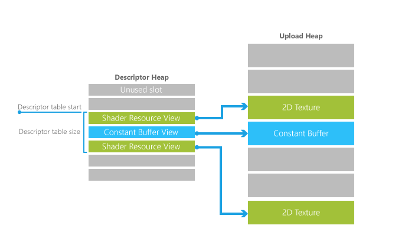

# Descriptor Tables Overview

Each descriptor table stores descriptors of one or more types&mdash;SRVs, UAVe, CBVs, and samplers. A descriptor table isn't an allocation of memory; it's simply an offset and length into a descriptor heap.

## Referencing descriptor tables

The graphics pipeline, through the root signature, gain access to resources by referencing into descriptor tables by index.

A descriptor table is actually just a sub-range of a descriptor heap. Descriptor heaps represent the underlying memory allocation for a collection of descriptors. Since memory allocation is a property of a creating a descriptor heap, defining a descriptor table out of one is guaranteed to be as cheap as identifying a region in the heap to the hardware. Descriptor tables don’t need to be created or destroyed at the API level– they are merely identified to drivers as an offset and size out of a heap whenever referenced.

It is certainly possible for an app to define very large descriptor tables when its shaders want the freedom to select from a vast set of available descriptors (often referencing textures) on the fly (perhaps driven by material data).

The Root Signature references the descriptor table entry with a reference to the heap, the start location of the table (an offset from the start of the heap), and the length (in entries) of the table. The image below shows these concepts: the descriptor table pointers from the Root Signature and the descriptors within the descriptor heap referencing the full texture or buffer data in a heap (in the case of a texture, the default heap).

## Related topics

* [Descriptor Tables](descriptor-tables.md)
