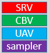

# Descriptors Overview

Descriptors are created by API calls and identify resources.

-   [Descriptor data](#descriptor-data)
-   [Descriptor handles](#descriptor-handles)
-   [Null descriptors](#null-descriptors)
-   [Default descriptors](#default-descriptors)
-   [Related topics](#related-topics)

## Descriptor data

A descriptor is a relatively small block of data that fully describes an object to the GPU, in a GPU specific opaque format. There are many different types of descriptors: Shader Resource Views (SRVs), Unordered Access Views (UAVs), Constant Buffer Views (CBVs) and Samplers are a few examples.

Descriptors are of varying size, typically 32 to 64 bytes for an SRV, UAV or CBV (depending on the GPU hardware), and are shown in this documentation as indivisible units, for example:

Descriptors are created by API calls, and will include information such as the resource and mip-maps you want the descriptor to contain.

The driver does not track or hold references to descriptors, it is up to the app to ensure the correct descriptor type is in use, and that the information is current. There is one small exception to this; the driver does inspect render target bindings to ensure swap chains work correctly.

Object descriptors do not need to be freed or released. Drivers do not attach any allocations to the creation of a descriptor. A descriptor may, however, encode references to other allocations for which the application owns the lifetime. For instance, a descriptor for an SRV must contain the virtual address of the D3D resource (e.g. a texture) that the SRV refers to. It is the application's responsibility to make sure that it does not use an SRV descriptor when the underlying D3D resource it depends on has been destroyed or is being modified (such as being declared as nonresident).

The primary way to use descriptors is to place them in descriptor heaps, which are backing memory for descriptors.

## Descriptor handles

A descriptor handle is the unique address of the descriptor. It is similar to a pointer, but is opaque as its implementation is hardware specific. The handle is unique across descriptor heaps, so, for example, an array of handles can reference descriptors in multiple heaps.

CPU handles are for immediate use, such as copying where both the source and destination need to be identified.

GPU handles are not for immediate use, they identify locations from a command list, for use at GPU execution time.

To create a descriptor handle for the start of a heap, after creating the descriptor heap itself, call one of the following methods:

-   [**ID3D12DescriptorHeap::GetCPUDescriptorHandleForHeapStart**](/windows/desktop/api/d3d12/nf-d3d12-id3d12descriptorheap-getcpudescriptorhandleforheapstart)
-   [**ID3D12DescriptorHeap::GetGPUDescriptorHandleForHeapStart**](/windows/desktop/api/d3d12/nf-d3d12-id3d12descriptorheap-getgpudescriptorhandleforheapstart)

These methods return the following structures:

-   [**D3D12\_CPU\_DESCRIPTOR\_HANDLE**](/windows/desktop/api/d3d12/ns-d3d12-d3d12_cpu_descriptor_handle)
-   [**D3D12\_GPU\_DESCRIPTOR\_HANDLE**](/windows/desktop/api/d3d12/ns-d3d12-d3d12_gpu_descriptor_handle)

As the size of the descriptors varies by hardware, to get the increment between each descriptor in a heap use:

-   [**ID3D12Device::GetDescriptorHandleIncrementSize**](/windows/desktop/api/d3d12/nf-d3d12-id3d12device-getdescriptorhandleincrementsize)

It is safe to offset a starting location with a number of increments, to copy handles, and to pass handles into API calls. It is not safe to dereference a handle as if it was a valid CPU pointer, nor to analyze the bits within a handle.

Some helper structures have been added, with initialization members, to make managing handles a little easier.

-   [**CD3DX12\_CPU\_DESCRIPTOR\_HANDLE**](cd3dx12-cpu-descriptor-handle.md)
-   [**CD3DX12\_GPU\_DESCRIPTOR\_HANDLE**](cd3dx12-gpu-descriptor-handle.md)

## Null descriptors

When creating descriptors using API calls, applications pass NULL for the resource pointer in the descriptor definition to achieve the effect of nothing bound when accessed by a shader.

The rest of the descriptor must be populated as much as possible. For example, in the case of Shader Resource Views (SRVs), the descriptor can be used to distinguish the type of view it is (Texture1D, Texture2D, and so on). Numerical parameters in the view descriptor, such as the number of mipmaps, must all be set to values that are valid for a resource.

In many cases, there is a defined behavior for accessing an unbound resource, such as SRVs which return default values. Those will be honored when accessing a NULL descriptor as long as the type of shader access is compatible with the descriptor type. For example, if a shader expects a Texture2D SRV and accesses a NULL SRV defined as a Texture1D, the behavior is undefined and could result in device reset.

In summary, to create a null descriptor, pass `null` for the *pResource* parameter when creating the view with methods such as [**CreateShaderResourceView**](/windows/desktop/api/d3d12/nf-d3d12-id3d12device-createshaderresourceview). For the view description parameter *pDesc*, set a configuration that would work if the resource was not null (otherwise a crash may occur on some hardware).

Root descriptors however, should not be set to null.

## Default descriptors

To create a default descriptor for a particular view, pass in a valid *pResource* parameter to the create view method (such as [**CreateShaderResourceView**](/windows/desktop/api/d3d12/nf-d3d12-id3d12device-createshaderresourceview)) but pass in null for the *pDesc* parameter. For example, if the resource contained 14 mips, then the view would contain 14 mips. The default case covers the most obvious mapping of a resource to a view. This does require that the resource is allocated with a fully qualified format name (such as DXGI\_FORMAT\_R8G8B8A8\_UNORM\_SRGB rather than DXGI\_FORMAT\_R8G8B8A8\_TYPELESS).

## Related topics

<dl> <dt>

[Descriptors](descriptors.md)
</dt> </dl>

 

 

