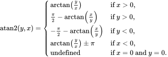

# DML_ELEMENT_WISE_ATAN_YX_OPERATOR_DESC (directml.h)

Computes the 2-argument arctangent for each element of *ATensor* and *BTensor*, where *ATensor* is the *Y-axis* and *BTensor* is the *X-axis*, placing the result into the corresponding element of *OutputTensor*. This operator is undefined for the origin (that is, when *ATensor* and *BTensor* are both 0 for corresponding elements).



```
f(y, x) = atan2(y, x)
```

This operator supports in-place execution, meaning that the output tensor is permitted to alias *ATensor* or *BTensor* during binding.

> [!IMPORTANT]
> This API is available as part of the DirectML standalone redistributable package (see [Microsoft.AI.DirectML](https://www.nuget.org/packages/Microsoft.AI.DirectML/) version 1.5 and later. Also see [DirectML version history](../dml-version-history.md).

## Syntax
```cpp
struct DML_ELEMENT_WISE_ATAN_YX_OPERATOR_DESC
{
    const DML_TENSOR_DESC* ATensor;
    const DML_TENSOR_DESC* BTensor;
    const DML_TENSOR_DESC* OutputTensor;
};
```

## Members

`ATensor`

Type: **const [DML_TENSOR_DESC](/windows/win32/api/directml/ns-directml-dml_tensor_desc)\***

The input tensor to read the Y-axis values from.

`BTensor`

Type: **const [DML_TENSOR_DESC](/windows/win32/api/directml/ns-directml-dml_tensor_desc)\***

The input tensor to read the X-axis values from.

`OutputTensor`

Type: **const [DML_TENSOR_DESC](/windows/win32/api/directml/ns-directml-dml_tensor_desc)\***

The output tensor to write the results to.

## Availability
This operator was introduced in `DML_FEATURE_LEVEL_3_1`.

## Tensor constraints
*ATensor*, *BTensor*, and *OutputTensor* must have the same *DataType*, *DimensionCount*, and *Sizes*.

## Tensor support
| Tensor | Kind | Supported dimension counts | Supported data types |
| ------ | ---- | -------------------------- | -------------------- |
| ATensor | Input | 1 to 8 | FLOAT32, FLOAT16 |
| BTensor | Input | 1 to 8 | FLOAT32, FLOAT16 |
| OutputTensor | Output | 1 to 8 | FLOAT32, FLOAT16 |

## Requirements
| &nbsp; | &nbsp; |
| ---- |:---- |
| **Header** | directml.h |
