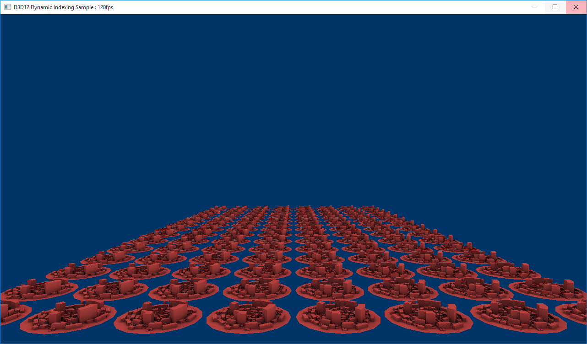
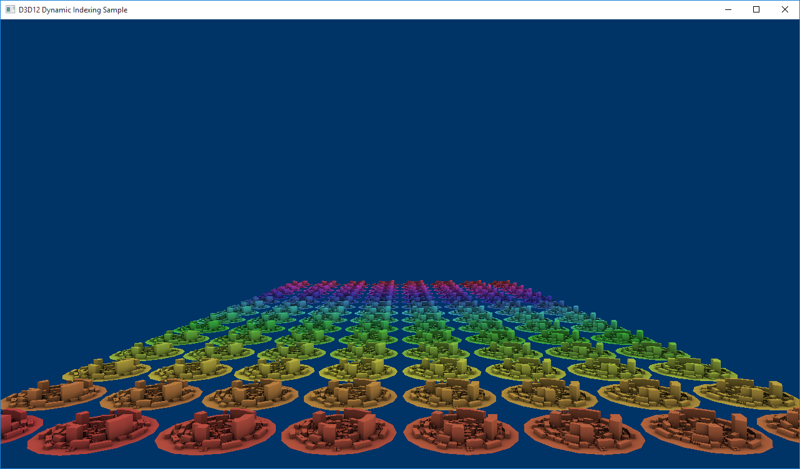

# Dynamic Indexing using HLSL 5.1

The **D3D12DynamicIndexing** sample demonstrates some of the new HLSL features available in Shader Model 5.1 - particularly dynamic indexing and unbounded arrays - to render the same mesh multiple times, each time rendering it with a dynamically selected material. With dynamic indexing, shaders can now index into an array without knowing the value of the index at compile time. When combined with unbounded arrays, this adds another level of indirection and flexibility for shader authors and art pipelines.

-   [Set up the pixel shader](#set-up-the-pixel-shader)
-   [Set up the root signature](#set-up-the-root-signature)
-   [Create the textures](#create-the-textures)
-   [Upload the texture data](#upload-the-texture-data)
-   [Load the diffuse texture](#load-the-diffuse-texture)
-   [Create a sampler](#create-a-sampler)
-   [Dynamically change the root parameter index](#dynamically-change-the-root-parameter-index)
-   [Run the sample](#run-the-sample)
-   [Related topics](#related-topics)

## Set up the pixel shader

Let's first look at the shader itself, which for this sample is a pixel shader.

``` syntax
Texture2D        g_txDiffuse : register(t0);
Texture2D        g_txMats[]  : register(t1);
SamplerState     g_sampler   : register(s0);

struct PSSceneIn
{
    float4 pos : SV_Position;
    float2 tex : TEXCOORD0;
};

struct MaterialConstants
{
    uint matIndex;  // Dynamically set index for looking up from g_txMats[].
};
ConstantBuffer<MaterialConstants> materialConstants : register(b0, space0);

float4 PSSceneMain(PSSceneIn input) : SV_Target
{
    float3 diffuse = g_txDiffuse.Sample(g_sampler, input.tex).rgb;
    float3 mat = g_txMats[materialConstants.matIndex].Sample(g_sampler, input.tex).rgb;
    return float4(diffuse * mat, 1.0f);
}
```

The unbounded array feature is illustrated by the `g_txMats[]` array as it does not specify an array size. Dynamic indexing is used to index into `g_txMats[]` with `matIndex`, which is defined as a root constant. The shader has no knowledge of the size or the array or the value of the index at compile-time. Both attributes are defined in the root signature of the pipeline state object used with the shader.

To take advantage of the dynamic indexing features in HLSL requires that the shader be compiled with SM 5.1. Additionally, to make use of unbounded arrays, the **/enable\_unbounded\_descriptor\_tables** flag must also be used. The following command line options are used to compile this shader with the [Effect-Compiler Tool](/windows/desktop/direct3dtools/fxc) (FXC):

``` syntax
fxc /Zi /E"PSSceneMain" /Od /Fo"dynamic_indexing_pixel.cso" /ps"_5_1" /nologo /enable_unbounded_descriptor_tables
```

## Set up the root signature

Now, let's look at the root signature definition, particularly, how we define the size of the unbounded array and link a root constant to `matIndex`. For the pixel shader, we define three things: a descriptor table for SRVs (our Texture2Ds), a descriptor table for Samplers and a single root constant. The descriptor table for our SRVs contains `CityMaterialCount + 1` entries. `CityMaterialCount` is a constant that defines the length of `g_txMats[]` and the + 1 is for `g_txDiffuse`. The descriptor table for our Samplers contains only one entry and we only define one 32-bit root constant value via **InitAsConstants**(…)., in the **LoadAssets** method.

``` syntax
 // Create the root signature.
    {
        CD3DX12_DESCRIPTOR_RANGE ranges[3];
        ranges[0].Init(D3D12_DESCRIPTOR_RANGE_TYPE_SRV, 1 + CityMaterialCount, 0);  // Diffuse texture + array of materials.
        ranges[1].Init(D3D12_DESCRIPTOR_RANGE_TYPE_SAMPLER, 1, 0);
        ranges[2].Init(D3D12_DESCRIPTOR_RANGE_TYPE_CBV, 1, 0);

        CD3DX12_ROOT_PARAMETER rootParameters[4];
        rootParameters[0].InitAsDescriptorTable(1, &ranges[0], D3D12_SHADER_VISIBILITY_PIXEL);
        rootParameters[1].InitAsDescriptorTable(1, &ranges[1], D3D12_SHADER_VISIBILITY_PIXEL);
        rootParameters[2].InitAsDescriptorTable(1, &ranges[2], D3D12_SHADER_VISIBILITY_VERTEX);
        rootParameters[3].InitAsConstants(1, 0, 0, D3D12_SHADER_VISIBILITY_PIXEL);

        CD3DX12_ROOT_SIGNATURE_DESC rootSignatureDesc;
        rootSignatureDesc.Init(_countof(rootParameters), rootParameters, 0, nullptr, D3D12_ROOT_SIGNATURE_FLAG_ALLOW_INPUT_ASSEMBLER_INPUT_LAYOUT);

        ComPtr<ID3DBlob> signature;
        ComPtr<ID3DBlob> error;
        ThrowIfFailed(D3D12SerializeRootSignature(&rootSignatureDesc, D3D_ROOT_SIGNATURE_VERSION_1, &signature, &error));
        ThrowIfFailed(m_device->CreateRootSignature(0, signature->GetBufferPointer(), signature->GetBufferSize(), IID_PPV_ARGS(&m_rootSignature)));
    }
```


| Call flow                                                             | Parameters                                                            |
|-----------------------------------------------------------------------|-----------------------------------------------------------------------|
| [**CD3DX12\_DESCRIPTOR\_RANGE**](cd3dx12-descriptor-range.md)        | [**D3D12\_DESCRIPTOR\_RANGE\_TYPE**](/windows/desktop/api/d3d12/ne-d3d12-d3d12_descriptor_range_type) |
| [**CD3DX12\_ROOT\_PARAMETER**](cd3dx12-root-parameter.md)            | [**D3D12\_SHADER\_VISIBILITY**](/windows/desktop/api/d3d12/ne-d3d12-d3d12_shader_visibility)          |
| [**CD3DX12\_ROOT\_SIGNATURE\_DESC**](cd3dx12-root-signature-desc.md) | [**D3D12\_ROOT\_SIGNATURE\_FLAGS**](/windows/desktop/api/d3d12/ne-d3d12-d3d12_root_signature_flags)   |
| [**ID3DBlob**](/previous-versions/windows/desktop/legacy/ff728743(v=vs.85))                                   |                                                                       |
| [**D3D12SerializeRootSignature**](/windows/desktop/api/d3d12/nf-d3d12-d3d12serializerootsignature)    | [**D3D\_ROOT\_SIGNATURE\_VERSION**](/windows/desktop/api/d3d12/ne-d3d12-d3d_root_signature_version)   |
| [**CreateRootSignature**](/windows/desktop/api/d3d12/nf-d3d12-id3d12device-createrootsignature)       |                                                                       |


 

## Create the textures

The contents of `g_txMats[]` are procedurally generated textures created in **LoadAssets**. Each city rendered in the scene shares the same diffuse texture but each also has its own procedurally generated texture. The array of textures span the rainbow spectrum to easily visualize the indexing technique.

``` syntax
 // Create the textures and sampler.
    {
        // Procedurally generate an array of textures to use as city materials.
        {
            // All of these materials use the same texture desc.
            D3D12_RESOURCE_DESC textureDesc = {};
            textureDesc.MipLevels = 1;
            textureDesc.Format = DXGI_FORMAT_R8G8B8A8_UNORM;
            textureDesc.Width = CityMaterialTextureWidth;
            textureDesc.Height = CityMaterialTextureHeight;
            textureDesc.Flags = D3D12_RESOURCE_FLAG_NONE;
            textureDesc.DepthOrArraySize = 1;
            textureDesc.SampleDesc.Count = 1;
            textureDesc.SampleDesc.Quality = 0;
            textureDesc.Dimension = D3D12_RESOURCE_DIMENSION_TEXTURE2D;

            // The textures evenly span the color rainbow so that each city gets
            // a different material.
            float materialGradStep = (1.0f / static_cast<float>(CityMaterialCount));

            // Generate texture data.
            vector<vector<unsigned char>> cityTextureData;
            cityTextureData.resize(CityMaterialCount);
            for (int i = 0; i < CityMaterialCount; ++i)
            {
                CD3DX12_HEAP_PROPERTIES heapProps(D3D12_HEAP_TYPE_DEFAULT);
                ThrowIfFailed(m_device->CreateCommittedResource(
                    &heapProps,
                    D3D12_HEAP_FLAG_NONE,
                    &textureDesc,
                    D3D12_RESOURCE_STATE_COPY_DEST,
                    nullptr,
                    IID_PPV_ARGS(&m_cityMaterialTextures[i])));

                // Fill the texture.
                float t = i * materialGradStep;
                cityTextureData[i].resize(CityMaterialTextureWidth * CityMaterialTextureHeight * CityMaterialTextureChannelCount);
                for (int x = 0; x < CityMaterialTextureWidth; ++x)
                {
                    for (int y = 0; y < CityMaterialTextureHeight; ++y)
                    {
                        // Compute the appropriate index into the buffer based on the x/y coordinates.
                        int pixelIndex = (y * CityMaterialTextureChannelCount * CityMaterialTextureWidth) + (x * CityMaterialTextureChannelCount);

                        // Determine this row's position along the rainbow gradient.
                        float tPrime = t + ((static_cast<float>(y) / static_cast<float>(CityMaterialTextureHeight)) * materialGradStep);

                        // Compute the RGB value for this position along the rainbow
                        // and pack the pixel value.
                        XMVECTOR hsl = XMVectorSet(tPrime, 0.5f, 0.5f, 1.0f);
                        XMVECTOR rgb = XMColorHSLToRGB(hsl);
                        cityTextureData[i][pixelIndex + 0] = static_cast<unsigned char>((255 * XMVectorGetX(rgb)));
                        cityTextureData[i][pixelIndex + 1] = static_cast<unsigned char>((255 * XMVectorGetY(rgb)));
                        cityTextureData[i][pixelIndex + 2] = static_cast<unsigned char>((255 * XMVectorGetZ(rgb)));
                        cityTextureData[i][pixelIndex + 3] = 255;
                    }
                }
            }
        }
```


<table>
<thead>
<tr class="header">
<th>Call flow</th>
<th>Parameters</th>
</tr>
</thead>
<tbody>
<tr class="odd">
<td><a href="/windows/desktop/api/d3d12/ns-d3d12-d3d12_resource_desc"><strong>D3D12_RESOURCE_DESC</strong></a></td>
<td><dl><a href="/windows/desktop/api/dxgiformat/ne-dxgiformat-dxgi_format"><strong>DXGI_FORMAT</strong></a><br />
<a href="/windows/desktop/api/d3d12/ne-d3d12-d3d12_resource_flags"><strong>D3D12_RESOURCE_FLAGS</strong></a><br />
<a href=""></a>[<strong>D3D12_RESOURCE_DIMENSION</strong>](/windows/desktop/api/d3d12/ne-d3d12-d3d12_resource_dimension)<br />
</dl></td>
</tr>
<tr class="even">
<td><a href="/windows/desktop/api/d3d12/nf-d3d12-id3d12device-createcommittedresource"><strong>CreateCommittedResource</strong></a></td>
<td><dl><a href="cd3dx12-heap-properties.md"><strong>CD3DX12_HEAP_PROPERTIES</strong></a><br />
<a href="/windows/desktop/api/d3d12/ne-d3d12-d3d12_heap_type"><strong>D3D12_HEAP_TYPE</strong></a><br />
<a href=""></a>[<strong>D3D12_HEAP_FLAG</strong>](/windows/desktop/api/d3d12/ne-d3d12-d3d12_heap_flags)<br />
<a href="/windows/desktop/direct3d12/cd3dx12-resource-desc"><strong>CD3DX12_RESOURCE_DESC</strong></a><br />
<a href=""></a>[<strong>D3D12_RESOURCE_STATES</strong>](/windows/desktop/api/d3d12/ne-d3d12-d3d12_resource_states)<br />
</dl></td>
</tr>
<tr class="odd">
<td><a href="/windows/desktop/dxmath/xmvector-data-type"><strong>XMVECTOR</strong></a></td>
<td><dl><a href="/windows/desktop/api/directxmath/nf-directxmath-xmvectorset"><strong>XMVectorSet</strong></a><br />
<a href=""></a>[<strong>XMColorHSLToRGB</strong>](/windows/desktop/api/directxmath/nf-directxmath-xmcolorhsltorgb)<br />
</dl></td>
</tr>
</tbody>
</table>


 

## Upload the texture data

Texture data is uploaded to the GPU via an upload heap and SRVs are created for each and stored in an SRV descriptor heap.

``` syntax
         // Upload texture data to the default heap resources.
            {
                const UINT subresourceCount = textureDesc.DepthOrArraySize * textureDesc.MipLevels;
                const UINT64 uploadBufferStep = GetRequiredIntermediateSize(m_cityMaterialTextures[0].Get(), 0, subresourceCount); // All of our textures are the same size in this case.
                const UINT64 uploadBufferSize = uploadBufferStep * CityMaterialCount;
                CD3DX12_HEAP_PROPERTIES uploadHeap(D3D12_HEAP_TYPE_UPLOAD);
                auto uploadDesc = CD3DX12_RESOURCE_DESC::Buffer(uploadBufferSize);
                ThrowIfFailed(m_device->CreateCommittedResource(
                    &uploadHeap,
                    D3D12_HEAP_FLAG_NONE,
                    &uploadDesc,
                    D3D12_RESOURCE_STATE_GENERIC_READ,
                    nullptr,
                    IID_PPV_ARGS(&materialsUploadHeap)));

                for (int i = 0; i < CityMaterialCount; ++i)
                {
                    // Copy data to the intermediate upload heap and then schedule 
                    // a copy from the upload heap to the appropriate texture.
                    D3D12_SUBRESOURCE_DATA textureData = {};
                    textureData.pData = &cityTextureData[i][0];
                    textureData.RowPitch = static_cast<LONG_PTR>((CityMaterialTextureChannelCount * textureDesc.Width));
                    textureData.SlicePitch = textureData.RowPitch * textureDesc.Height;

                    UpdateSubresources(m_commandList.Get(), m_cityMaterialTextures[i].Get(), materialsUploadHeap.Get(), i * uploadBufferStep, 0, subresourceCount, &textureData);
                    auto barrier = CD3DX12_RESOURCE_BARRIER::Transition(m_cityMaterialTextures[i].Get(), D3D12_RESOURCE_STATE_COPY_DEST, D3D12_RESOURCE_STATE_PIXEL_SHADER_RESOURCE);
                    m_commandList->ResourceBarrier(1, &barrier);
                }
            }
```


<table>
<thead>
<tr class="header">
<th>Call flow</th>
<th>Parameters</th>
</tr>
</thead>
<tbody>
<tr class="odd">
<td><a href="getrequiredintermediatesize.md"><strong>GetRequiredIntermediateSize</strong></a></td>

</tr>
<tr class="even">
<td><a href="/windows/desktop/api/d3d12/nf-d3d12-id3d12device-createcommittedresource"><strong>CreateCommittedResource</strong></a></td>
<td><dl><a href="cd3dx12-heap-properties.md"><strong>CD3DX12_HEAP_PROPERTIES</strong></a><br />
<a href="/windows/desktop/api/d3d12/ne-d3d12-d3d12_heap_type"><strong>D3D12_HEAP_TYPE</strong></a><br />
<a href="/windows/desktop/api/d3d12/ne-d3d12-d3d12_heap_flags"><strong>D3D12_HEAP_FLAG</strong></a><br />
<a href="/windows/desktop/direct3d12/cd3dx12-resource-desc"><strong>CD3DX12_RESOURCE_DESC</strong></a><br />
<a href="/windows/desktop/api/d3d12/ne-d3d12-d3d12_resource_states"><strong>D3D12_RESOURCE_STATES</strong></a><br />
</dl></td>
</tr>
<tr class="odd">
<td><a href="/windows/desktop/api/d3d12/ns-d3d12-d3d12_subresource_data"><strong>D3D12_SUBRESOURCE_DATA</strong></a></td>

</tr>
<tr class="even">
<td><a href="updatesubresources1.md"><strong>UpdateSubresources</strong></a></td>

</tr>
<tr class="odd">
<td><a href="/windows/desktop/api/d3d12/nf-d3d12-id3d12graphicscommandlist-resourcebarrier"><strong>ResourceBarrier</strong></a></td>
<td><dl><a href="/windows/desktop/direct3d12/cd3dx12-resource-barrier"><strong>CD3DX12_RESOURCE_BARRIER</strong></a><br />
<a href="/windows/desktop/api/d3d12/ne-d3d12-d3d12_resource_states"><strong>D3D12_RESOURCE_STATES</strong></a><br />
</dl></td>
</tr>
</tbody>
</table>


 

## Load the diffuse texture

The diffuse texture, g\_`txDiffuse`, is uploaded in a similar manner and also gets its own SRV, but the texture data is already defined in occcity.bin.

``` syntax
// Load the occcity diffuse texture with baked-in ambient lighting.
        // This texture will be blended with a texture from the materials
        // array in the pixel shader.
        {
            D3D12_RESOURCE_DESC textureDesc = {};
            textureDesc.MipLevels = SampleAssets::Textures[0].MipLevels;
            textureDesc.Format = SampleAssets::Textures[0].Format;
            textureDesc.Width = SampleAssets::Textures[0].Width;
            textureDesc.Height = SampleAssets::Textures[0].Height;
            textureDesc.Flags = D3D12_RESOURCE_FLAG_NONE;
            textureDesc.DepthOrArraySize = 1;
            textureDesc.SampleDesc.Count = 1;
            textureDesc.SampleDesc.Quality = 0;
            textureDesc.Dimension = D3D12_RESOURCE_DIMENSION_TEXTURE2D;

            CD3DX12_HEAP_PROPERTIES heapProps(D3D12_HEAP_TYPE_DEFAULT);
            ThrowIfFailed(m_device->CreateCommittedResource(
                &heapProps,
                D3D12_HEAP_FLAG_NONE,
                &textureDesc,
                D3D12_RESOURCE_STATE_COPY_DEST,
                nullptr,
                IID_PPV_ARGS(&m_cityDiffuseTexture)));

            const UINT subresourceCount = textureDesc.DepthOrArraySize * textureDesc.MipLevels;
            const UINT64 uploadBufferSize = GetRequiredIntermediateSize(m_cityDiffuseTexture.Get(), 0, subresourceCount);
            CD3DX12_HEAP_PROPERTIES uploadHeap(D3D12_HEAP_TYPE_UPLOAD);
            auto uploadDesc = CD3DX12_RESOURCE_DESC::Buffer(uploadBufferSize);
            ThrowIfFailed(m_device->CreateCommittedResource(
                &uploadHeap,
                D3D12_HEAP_FLAG_NONE,
                &uploadDesc,
                D3D12_RESOURCE_STATE_GENERIC_READ,
                nullptr,
                IID_PPV_ARGS(&textureUploadHeap)));

            // Copy data to the intermediate upload heap and then schedule 
            // a copy from the upload heap to the diffuse texture.
            D3D12_SUBRESOURCE_DATA textureData = {};
            textureData.pData = pMeshData + SampleAssets::Textures[0].Data[0].Offset;
            textureData.RowPitch = SampleAssets::Textures[0].Data[0].Pitch;
            textureData.SlicePitch = SampleAssets::Textures[0].Data[0].Size;

            UpdateSubresources(m_commandList.Get(), m_cityDiffuseTexture.Get(), textureUploadHeap.Get(), 0, 0, subresourceCount, &textureData);
            auto barrier = CD3DX12_RESOURCE_BARRIER::Transition(m_cityDiffuseTexture.Get(), D3D12_RESOURCE_STATE_COPY_DEST, D3D12_RESOURCE_STATE_PIXEL_SHADER_RESOURCE);
            m_commandList->ResourceBarrier(1, &barrier);
        }
```


<table>
<thead>
<tr class="header">
<th>Call flow</th>
<th>Parameters</th>
</tr>
</thead>
<tbody>
<tr class="odd">
<td><a href="/windows/desktop/api/d3d12/ns-d3d12-d3d12_resource_desc"><strong>D3D12_RESOURCE_DESC</strong></a></td>
<td><dl><a href="/windows/desktop/api/d3d12/ne-d3d12-d3d12_resource_flags"><strong>D3D12_RESOURCE_FLAGS</strong></a><br />
<a href="/windows/desktop/api/d3d12/ne-d3d12-d3d12_resource_dimension"><strong>D3D12_RESOURCE_DIMENSION</strong></a><br />
</dl></td>
</tr>
<tr class="even">
<td><a href="/windows/desktop/api/d3d12/nf-d3d12-id3d12device-createcommittedresource"><strong>CreateCommittedResource</strong></a></td>
<td><dl><a href="cd3dx12-heap-properties.md"><strong>CD3DX12_HEAP_PROPERTIES</strong></a><br />
<a href="/windows/desktop/api/d3d12/ne-d3d12-d3d12_heap_type"><strong>D3D12_HEAP_TYPE</strong></a><br />
<a href="/windows/desktop/api/d3d12/ne-d3d12-d3d12_heap_flags"><strong>D3D12_HEAP_FLAG</strong></a><br />
<a href="/windows/desktop/direct3d12/cd3dx12-resource-desc"><strong>CD3DX12_RESOURCE_DESC</strong></a><br />
<a href="/windows/desktop/api/d3d12/ne-d3d12-d3d12_resource_states"><strong>D3D12_RESOURCE_STATES</strong></a><br />
</dl></td>
</tr>
<tr class="odd">
<td><a href="getrequiredintermediatesize.md"><strong>GetRequiredIntermediateSize</strong></a></td>

</tr>
<tr class="even">
<td><a href="/windows/desktop/api/d3d12/nf-d3d12-id3d12device-createcommittedresource"><strong>CreateCommittedResource</strong></a></td>
<td><dl><a href="cd3dx12-heap-properties.md"><strong>CD3DX12_HEAP_PROPERTIES</strong></a><br />
<a href="/windows/desktop/api/d3d12/ne-d3d12-d3d12_heap_type"><strong>D3D12_HEAP_TYPE</strong></a><br />
<a href="/windows/desktop/api/d3d12/ne-d3d12-d3d12_heap_flags"><strong>D3D12_HEAP_FLAG</strong></a><br />
<a href="/windows/desktop/direct3d12/cd3dx12-resource-desc"><strong>CD3DX12_RESOURCE_DESC</strong></a><br />
<a href="/windows/desktop/api/d3d12/ne-d3d12-d3d12_resource_states"><strong>D3D12_RESOURCE_STATES</strong></a><br />
</dl></td>
</tr>
<tr class="odd">
<td><a href="/windows/desktop/api/d3d12/ns-d3d12-d3d12_subresource_data"><strong>D3D12_SUBRESOURCE_DATA</strong></a></td>

</tr>
<tr class="even">
<td><a href="/windows/desktop/api/d3d12/nf-d3d12-id3d12graphicscommandlist-resourcebarrier"><strong>ResourceBarrier</strong></a></td>
<td><dl><a href="/windows/desktop/direct3d12/cd3dx12-resource-barrier"><strong>CD3DX12_RESOURCE_BARRIER</strong></a><br />
<a href="/windows/desktop/api/d3d12/ne-d3d12-d3d12_resource_states"><strong>D3D12_RESOURCE_STATES</strong></a><br />
</dl></td>
</tr>
</tbody>
</table>


 

## Create a sampler

Finally for **LoadAssets**, a single sampler is created to sample from either the diffuse texture or the texture array.

``` syntax
 // Describe and create a sampler.
        D3D12_SAMPLER_DESC samplerDesc = {};
        samplerDesc.Filter = D3D12_FILTER_MIN_MAG_MIP_LINEAR;
        samplerDesc.AddressU = D3D12_TEXTURE_ADDRESS_MODE_WRAP;
        samplerDesc.AddressV = D3D12_TEXTURE_ADDRESS_MODE_WRAP;
        samplerDesc.AddressW = D3D12_TEXTURE_ADDRESS_MODE_WRAP;
        samplerDesc.MinLOD = 0;
        samplerDesc.MaxLOD = D3D12_FLOAT32_MAX;
        samplerDesc.MipLODBias = 0.0f;
        samplerDesc.MaxAnisotropy = 1;
        samplerDesc.ComparisonFunc = D3D12_COMPARISON_FUNC_ALWAYS;
        m_device->CreateSampler(&samplerDesc, m_samplerHeap->GetCPUDescriptorHandleForHeapStart());

        // Create SRV for the city's diffuse texture.
        CD3DX12_CPU_DESCRIPTOR_HANDLE srvHandle(m_cbvSrvHeap->GetCPUDescriptorHandleForHeapStart(), 0, m_cbvSrvDescriptorSize);
        D3D12_SHADER_RESOURCE_VIEW_DESC diffuseSrvDesc = {};
        diffuseSrvDesc.Shader4ComponentMapping = D3D12_DEFAULT_SHADER_4_COMPONENT_MAPPING;
        diffuseSrvDesc.Format = SampleAssets::Textures->Format;
        diffuseSrvDesc.ViewDimension = D3D12_SRV_DIMENSION_TEXTURE2D;
        diffuseSrvDesc.Texture2D.MipLevels = 1;
        m_device->CreateShaderResourceView(m_cityDiffuseTexture.Get(), &diffuseSrvDesc, srvHandle);
        srvHandle.Offset(m_cbvSrvDescriptorSize);

        // Create SRVs for each city material.
        for (int i = 0; i < CityMaterialCount; ++i)
        {
            D3D12_SHADER_RESOURCE_VIEW_DESC materialSrvDesc = {};
            materialSrvDesc.Shader4ComponentMapping = D3D12_DEFAULT_SHADER_4_COMPONENT_MAPPING;
            materialSrvDesc.Format = DXGI_FORMAT_R8G8B8A8_UNORM;
            materialSrvDesc.ViewDimension = D3D12_SRV_DIMENSION_TEXTURE2D;
            materialSrvDesc.Texture2D.MipLevels = 1;
            m_device->CreateShaderResourceView(m_cityMaterialTextures[i].Get(), &materialSrvDesc, srvHandle);

            srvHandle.Offset(m_cbvSrvDescriptorSize);
        }   
```


<table>
<thead>
<tr class="header">
<th>Call flow</th>
<th>Parameters</th>
</tr>
</thead>
<tbody>
<tr class="odd">
<td><a href="/windows/desktop/api/d3d12/ns-d3d12-d3d12_sampler_desc"><strong>D3D12_SAMPLER_DESC</strong></a></td>
<td><dl><a href="/windows/desktop/api/d3d12/ne-d3d12-d3d12_filter"><strong>D3D12_FILTER</strong></a><br />
<a href="/windows/desktop/api/d3d12/ne-d3d12-d3d12_texture_address_mode"></a><br />
D3D12_FLOAT32_MAX (<a href="constants.md"><strong>Constants</strong></a>)<br />
<a href="/windows/desktop/api/d3d12/ne-d3d12-d3d12_comparison_func"><strong>D3D12_COMPARISON_FUNC</strong></a><br />
</dl></td>
</tr>
<tr class="even">
<td><a href="/windows/desktop/api/d3d12/nf-d3d12-id3d12device-createsampler"><strong>CreateSampler</strong></a></td>

</tr>
<tr class="odd">
<td><a href="cd3dx12-cpu-descriptor-handle.md"><strong>CD3DX12_CPU_DESCRIPTOR_HANDLE</strong></a></td>
<td><a href="/windows/desktop/api/d3d12/nf-d3d12-id3d12descriptorheap-getcpudescriptorhandleforheapstart"><strong>GetCPUDescriptorHandleForHeapStart</strong></a></td>
</tr>
<tr class="even">
<td><a href="/windows/desktop/api/d3d12/ns-d3d12-d3d12_shader_resource_view_desc"><strong>D3D12_SHADER_RESOURCE_VIEW_DESC</strong></a></td>
<td><dl><a href="constants.md">D3D12_DEFAULT_SHADER_4_COMPONENT_MAPPING</a><br />
<a href="/windows/desktop/api/d3d12/ne-d3d12-d3d12_srv_dimension"><strong>D3D12_SRV_DIMENSION</strong></a><br />
</dl></td>
</tr>
<tr class="odd">
<td><a href="/windows/desktop/api/d3d12/nf-d3d12-id3d12device-createshaderresourceview"><strong>CreateShaderResourceView</strong></a></td>

</tr>
<tr class="even">
<td><a href="/windows/desktop/api/d3d12/ns-d3d12-d3d12_shader_resource_view_desc"><strong>D3D12_SHADER_RESOURCE_VIEW_DESC</strong></a></td>
<td><dl><a href="constants.md">D3D12_DEFAULT_SHADER_4_COMPONENT_MAPPING</a><br />
<a href="/windows/desktop/api/dxgiformat/ne-dxgiformat-dxgi_format"><strong>DXGI_FORMAT</strong></a><br />
<a href="/windows/desktop/api/d3d12/ne-d3d12-d3d12_srv_dimension"><strong>D3D12_SRV_DIMENSION</strong></a><br />
</dl></td>
</tr>
<tr class="odd">
<td><a href="/windows/desktop/api/d3d12/nf-d3d12-id3d12device-createshaderresourceview"><strong>CreateShaderResourceView</strong></a></td>

</tr>
</tbody>
</table>


 

## Dynamically change the root parameter index

If we were to render the scene now, all of the cities would appear the same, because we have not set the value of our root constant, `matIndex`. Each pixel shader would index into the 0th slot of `g_txMats` and the scene would look like this:



The value of the root constant is set in **FrameResource::PopulateCommandLists**. In the double **for** loop where a draw command is recorded for each city, we record a call to [**SetGraphicsRoot32BitConstants**](/windows/desktop/api/d3d12/nf-d3d12-id3d12graphicscommandlist-setgraphicsroot32bitconstants) specifying our root parameter index in regards to the root signature – in this case 3 – the value of the dynamic index and an offset – in this case 0. Since the length of `g_txMats` is equal to the number of cities we render, the value of the index is incrementally set for each city.

``` syntax
 for (UINT i = 0; i < m_cityRowCount; i++)
    {
        for (UINT j = 0; j < m_cityColumnCount; j++)
        {
            pCommandList->SetPipelineState(pPso);

            // Set the city's root constant for dynamically indexing into the material array.
            pCommandList->SetGraphicsRoot32BitConstant(3, (i * m_cityColumnCount) + j, 0);

            // Set this city's CBV table and move to the next descriptor.
            pCommandList->SetGraphicsRootDescriptorTable(2, cbvSrvHandle);
            cbvSrvHandle.Offset(cbvSrvDescriptorSize);

            pCommandList->DrawIndexedInstanced(numIndices, 1, 0, 0, 0);
        }
    }
```


| Call flow                                                                                          | Parameters |
|----------------------------------------------------------------------------------------------------|------------|
| [**SetPipelineState**](/windows/desktop/api/d3d12/nf-d3d12-id3d12graphicscommandlist-setpipelinestate)                             |            |
| [**SetGraphicsRoot32BitConstant**](/windows/desktop/api/d3d12/nf-d3d12-id3d12graphicscommandlist-setgraphicsroot32bitconstant)     |            |
| [**SetGraphicsRootDescriptorTable**](/windows/desktop/api/d3d12/nf-d3d12-id3d12graphicscommandlist-setgraphicsrootdescriptortable) |            |
| [**DrawIndexedInstanced**](/windows/desktop/api/d3d12/nf-d3d12-id3d12graphicscommandlist-drawindexedinstanced)                     |            |

## Run the sample

Now when we render the scene, each city will have a different value for `matIndex` and will thus look up a different texture from `g_txMats[]` making the scene look like this:



## Related topics

<dl> <dt>

[D3D12 Code Walk-Throughs](d3d12-code-walk-throughs.md)
</dt> <dt>

[Effect-Compiler Tool](/windows/desktop/direct3dtools/fxc)
</dt> <dt>

[HLSL Shader Model 5.1 Features for Direct3D 12](/windows/desktop/direct3dhlsl/hlsl-shader-model-5-1-features-for-direct3d-12)
</dt> <dt>

[Resource Binding in HLSL](resource-binding-in-hlsl.md)
</dt> <dt>

[Shader Model 5.1](/windows/desktop/direct3dhlsl/shader-model-5-1)
</dt> <dt>

[Specifying Root Signatures in HLSL](specifying-root-signatures-in-hlsl.md)
</dt> </dl>
