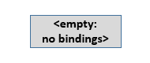
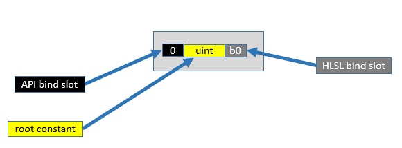
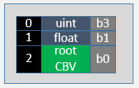
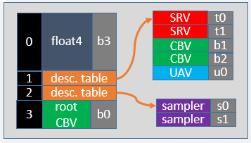
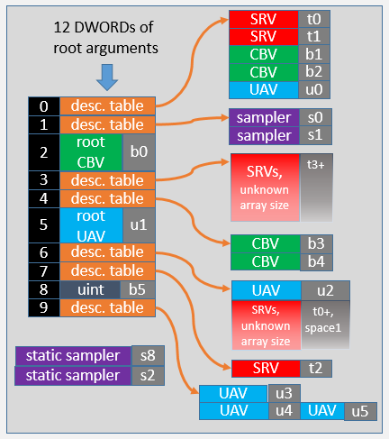
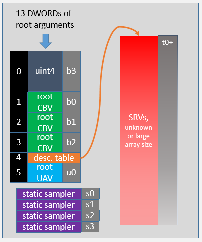

# Example Root Signatures

The following section shows root signatures varying in complexity from empty to completely full.

-   [An empty root signature](#an-empty-root-signature)
-   [One constant](#one-constant)
-   [Adding a root Constant Buffer View](#adding-a-root-constant-buffer-view)
-   [Binding descriptor tables](#binding-descriptor-tables)
-   [A more complex root signature](#a-more-complex-root-signature)
-   [Streaming Shader Resource Views](#streaming-shader-resource-views)
-   [Related topics](#related-topics)

## An empty root signature



An empty root signature is unlikely to be useful, but could be used in a trivial rendering pass with use of only the input assembler, and minimal vertex and pixel shaders that do not access any descriptors. Also the blend stage, render target and depth-stencil stages are available, even with an empty root signature.

## One constant



The API bind slot is where the root argument for this parameter will be bound at command list record time. The number of the API bind slots is implicit, based on the order of the parameters in the root signature (the first is always zero). The HLSL bind slot is where the shader will see the root parameter show up. The type ("uint" in the above example) is not known to the hardware but is just a comment in the image, the hardware will simply see the single DWORD as the contents.

To bind a constant at command-list record time, a command similar to the following would be used:

``` syntax
pCmdList->SetComputeRoot32BitConstant(0,seed); // 0 is the parameter index, seed is used by the shaders
```

## Adding a root Constant Buffer View



This example shows two root constants, and a root Constant Buffer View (CBV) that costs two DWORD slots.

To bind a constant buffer view use a command such as the following. Note the first parameter (2) is the slot shown in the image. Typically an array of constants will be set up and then made available to the shaders at b0 as a CBV.

``` syntax
pCmdList->SetGraphicsRootConstantBufferView(2,GPUVAForCurrDynamicConstants);
```

## Binding descriptor tables



This example shows the use of two descriptor tables; one declaring a table of five descriptors that will be available at execution time in a CBV\_SRV\_UAV descriptor heap, and another declaring a table of two descriptors that will show up at execution time in a sampler descriptor heap.

To bind descriptor tables when recording a command list.

``` syntax
pCmdList->SetComputeRootDescriptorTable(1, handleToCurrentMaterialDataInHeap);
pCmdList->SetComputeRootDescriptorTable(2, handleToCurrentMaterialDataInSamplerHeap);
```

Another feature of the root signature is the float4 root constant that is four DWORDS in size. The following command binds just the middle two DWORDS of the four.

``` syntax
pCmdList->SetComputeRoot32BitConstants(0,2,myFloat2Array,1);  // 2 constants starting at offset 1 (middle 2 values in float4)
```

## A more complex root signature



This example shows a dense root signature with most types of entries. Two of the descriptor tables (at slots 3 and 6) include unbounded size arrays. The burden here is on the application to only touch valid descriptors in a heap. Unbounded, or very large arrays, require hardware tier 2+ of resource binding support.

There are two static samplers (bound without requiring root signature slots).

At slot 9, UAV u4 and UAV u5 are declared at the same descriptor table offset. This is use of an aliased descriptor, one descriptor in memory will show up as both u4 and u5 in the HLSL shaders. In this case the shader must be compiled with the D3D10\_SHADER\_RESOURCES\_MAY\_ALIAS option, or the or `/res_may_alias` option in FXC. Aliased descriptors enable one descriptor to be bound to multiple bind points, without having to make any changes to the shaders.

## Streaming Shader Resource Views



This root signature illustrates a scenario where all SRVs are streamed in and out of one large array. At execution time, a descriptor table can be set once when the root signature is set. Then all texture reads are done by indexing into the array via constants fed via the first few root arguments. Only a single descriptor heap is needed, and is only updated as textures are streamed in or out of free descriptor slots.

The descriptor offsets in the large heap are identified by shaders using the constants in the Constant Buffer Views. For example, if a shader is given a material ID, it can index into the one large array using the constant to access the required descriptor (which references the required texture).

This scenario requires hardware with resource binding tier2+.

## Related topics

<dl> <dt>

[Resource Binding Hardware Tiers](hardware-support.md)
</dt> <dt>

[Resource Binding in HLSL](resource-binding-in-hlsl.md)
</dt> <dt>

[Root Signatures](root-signatures.md)
</dt> </dl>

 

 


