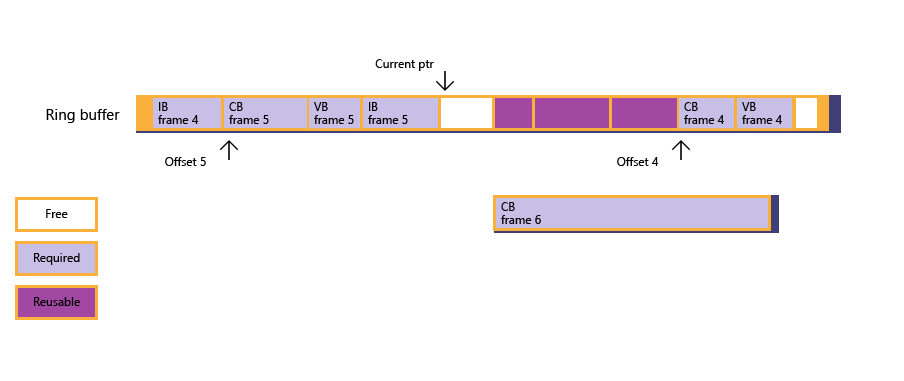
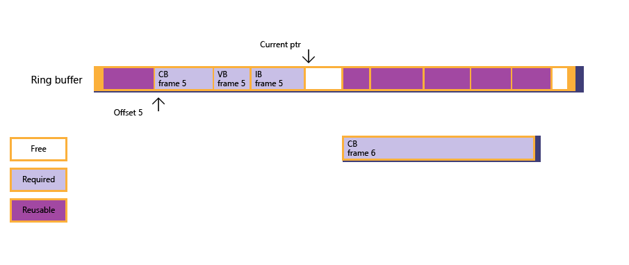
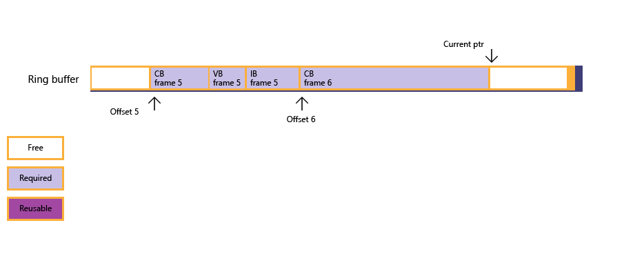

# Fence-Based Resource Management

Shows how to manage resource data life-span by tracking GPU progress via fences. Memory can be effectively re-used with fences carefully managing the availability of free space in memory, such as in a ring buffer implementation for an Upload heap.

-   [Ring buffer scenario](#ring-buffer-scenario)
-   [Ring buffer sample](#ring-buffer-sample)
-   [Related topics](#related-topics)

## Ring buffer scenario

The following is an example in which an app experiences a rare demand for upload heap memory.

A ring buffer is one way to manage an upload heap. The ring buffer holds data required for the next few frames. The app maintains a current data input pointer, and a frame offset queue to record each frame and starting offset of resource data for that frame.

An app creates a ring-buffer based upon a buffer to upload data to the GPU for each frame. Currently frame 2 has been rendered, the ring buffer wraps around the data for frame 4, all the data required for frame 5 is present, and a large constant buffer required for frame 6 needs to be sub-allocated.

**Figure 1** : the app tries to sub-allocate for the constant buffer, but finds insufficient free memory.


**Figure 2** : through fence polling, the app discovers that frame 3 has been rendered, the frame offset queue is then updated, and the current state of the ring buffer follows - however, free memory is still not large enough to accommodate the constant buffer.



**Figure 3** : given the situation, the CPU blocks itself (via fence waiting) until frame 4 has been rendered, which frees up the memory sub-allocated for frame 4.



**Figure 4** : now free memory is large enough for the constant buffer, and sub-allocation succeeds; the app copies the big constant buffer data to memory previously used by resource data for both frames 3 and 4. The current input pointer is finally updated.



If an app implements a ring buffer, the ring buffer must be large enough to cope with the worse-case scenario of the sizes of resource data.

## Ring buffer sample

The following sample code shows how a ring buffer can be managed, paying attention to the sub-allocation routine that handles fence polling and waiting. For simplicity, the sample uses NOT\_SUFFICIENT\_MEMORY to hide the details of “not sufficient free memory found in the heap” since that logic (based on *m\_pDataCur* and offsets inside *FrameOffsetQueue*) is not tightly related to heaps or fences. The sample is simplified to sacrifice frame rate instead of memory utilization.

Note that, ring-buffer support is expected to be a popular scenario; however, the heap design does not preclude other usage, such as command list parameterization and re-use.

``` syntax
struct FrameResourceOffset
{
    UINT frameIndex;
    UINT8* pResourceOffset;
};
std::queue<FrameResourceOffset> frameOffsetQueue;

void DrawFrame()
{
    float vertices[] = ...;
    UINT verticesOffset = 0;
    ThrowIfFailed(
        SetDataToUploadHeap(
            vertices, sizeof(float), sizeof(vertices) / sizeof(float), 
            4, // Max alignment requirement for vertex data is 4 bytes.
            verticesOffset
            ));

    float constants[] = ...;
    UINT constantsOffset = 0;
    ThrowIfFailed(
        SetDataToUploadHeap(
            constants, sizeof(float), sizeof(constants) / sizeof(float), 
            D3D12_CONSTANT_BUFFER_DATA_PLACEMENT_ALIGNMENT,
            constantsOffset
            ));

    // Create vertex buffer views for the new binding model. 
    // Create constant buffer views for the new binding model. 
    // ...

    commandQueue->Execute(commandList);
    commandQueue->AdvanceFence();
}

HRESULT SuballocateFromHeap(SIZE_T uSize, UINT uAlign)
{
    if (NOT_SUFFICIENT_MEMORY(uSize, uAlign))
    {
        // Free up resources for frames processed by GPU; see Figure 2.
        UINT lastCompletedFrame = commandQueue->GetLastCompletedFence();
        FreeUpMemoryUntilFrame( lastCompletedFrame );

        while ( NOT_SUFFICIENT_MEMORY(uSize, uAlign)
            && !frameOffsetQueue.empty() )
        {
            // Block until a new frame is processed by GPU, then free up more memory; see Figure 3.
            UINT nextGPUFrame = frameOffsetQueue.front().frameIndex;
            commandQueue->SetEventOnFenceCompletion(nextGPUFrame, hEvent);
            WaitForSingleObject(hEvent, INFINITE);
            FreeUpMemoryUntilFrame( nextGPUFrame );
        }
    }

    if (NOT_SUFFICIENT_MEMORY(uSize, uAlign))
    {
        // Apps need to create a new Heap that is large enough for this resource.
        return E_HEAPNOTLARGEENOUGH;
    }
    else
    {
        // Update current data pointer for the new resource.
        m_pDataCur = reinterpret_cast<UINT8*>(
            Align(reinterpret_cast<SIZE_T>(m_pHDataCur), uAlign)
            );

        // Update frame offset queue if this is the first resource for a new frame; see Figure 4.
        UINT currentFrame = commandQueue->GetCurrentFence();
        if ( frameOffsetQueue.empty()
            || frameOffsetQueue.back().frameIndex < currentFrame )
        {
            FrameResourceOffset offset = {currentFrame, m_pDataCur};
            frameOffsetQueue.push(offset);
        }

        return S_OK;
    }
}

void FreeUpMemoryUntilFrame(UINT lastCompletedFrame)
{
    while ( !frameOffsetQueue.empty() 
        && frameOffsetQueue.first().frameIndex <= lastCompletedFrame )
    {
        frameOffsetQueue.pop();
    }
}
```

## Related topics

<dl> <dt>

[**ID3D12Fence**](/windows/desktop/api/d3d12/nn-d3d12-id3d12fence)
</dt> <dt>

[Suballocation Within Buffers](large-buffers.md)
</dt> </dl>

 

 


