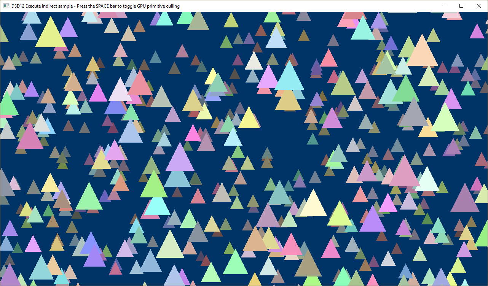

# Indirect drawing and GPU culling

The D3D12ExecuteIndirect sample demonstrates how to use indirect commands to draw content. It also demonstrates how these commands can be manipulated on the GPU in a compute shader before they are issued.

-   [Define the indirect commands](#define-the-indirect-commands)
-   [Create a graphics and compute root signature](#create-a-graphics-and-compute-root-signature)
-   [Create a shader resource view (SRV) for the compute shader](#create-a-shader-resource-view-srv-for-the-compute-shader)
-   [Create the indirect command buffers](#create-the-indirect-command-buffers)
-   [Create the compute UAVs](#create-the-compute-uavs)
-   [Drawing the frame](#drawing-the-frame)
-   [Run the sample](#run-the-sample)
-   [Related topics](#related-topics)

The sample creates a command buffer that describes 1024 draw calls. Each draw call renders a triangle with a random color, position, and velocity. The triangles animate endlessly across the screen. There are two modes in this sample. In the first mode, a compute shader inspects the indirect commands and decides whether or not to add that command to an unordered access view (UAV) describing which commands that should be executed. In the second mode, all commands are simply executed. Pressing the spacebar will toggle between modes.

## Define the indirect commands

We start out by defining what the indirect commands should look like. In this sample the commands we want to execute are to:

<dl> 1. Update the constant buffer view (CBV).  
2. Draw the triangle.  
</dl>

These drawing commands are represented by the following structure in the **D3D12ExecuteIndirect** class definition. Commands are executed sequentially in the order they are defined in this structure.

``` syntax
  
// Data structure to match the command signature used for ExecuteIndirect.
struct IndirectCommand
{
       D3D12_GPU_VIRTUAL_ADDRESS cbv;
       D3D12_DRAW_ARGUMENTS drawArguments;
};
```


| Call flow                                              | Parameters |
|--------------------------------------------------------|------------|
| D3D12\_GPU\_VIRTUAL\_ADDRESS (simply a UINT64)         |            |
| [**D3D12\_DRAW\_ARGUMENTS**](/windows/desktop/api/d3d12/ns-d3d12-d3d12_draw_arguments) |            |


 

To accompany the data structure, a command signature is also created which instructs the GPU how to interpret the data passed in to the [**ExecuteIndirect**](/windows/desktop/api/d3d12/nf-d3d12-id3d12graphicscommandlist-executeindirect) API. This, and the most of the following code, is added to the **LoadAssets** method.

``` syntax
// Create the command signature used for indirect drawing.
{
       // Each command consists of a CBV update and a DrawInstanced call.
       D3D12_INDIRECT_ARGUMENT_DESC argumentDescs[2] = {};
       argumentDescs[0].Type = D3D12_INDIRECT_ARGUMENT_TYPE_CONSTANT_BUFFER_VIEW;
       argumentDescs[0].ConstantBufferView.RootParameterIndex = Cbv;
       argumentDescs[1].Type = D3D12_INDIRECT_ARGUMENT_TYPE_DRAW;

       D3D12_COMMAND_SIGNATURE_DESC commandSignatureDesc = {};
       commandSignatureDesc.pArgumentDescs = argumentDescs;
       commandSignatureDesc.NumArgumentDescs = _countof(argumentDescs);
       commandSignatureDesc.ByteStride = sizeof(IndirectCommand);

       ThrowIfFailed(m_device->CreateCommandSignature(&commandSignatureDesc, m_rootSignature.Get(), IID_PPV_ARGS(&m_commandSignature)));
}
```


| Call flow                                                               | Parameters                                                              |
|-------------------------------------------------------------------------|-------------------------------------------------------------------------|
| [**D3D12\_INDIRECT\_ARGUMENT\_DESC**](/windows/desktop/api/d3d12/ns-d3d12-d3d12_indirect_argument_desc) | [**D3D12\_INDIRECT\_ARGUMENT\_TYPE**](/windows/desktop/api/d3d12/ne-d3d12-d3d12_indirect_argument_type) |
| [**D3D12\_COMMAND\_SIGNATURE\_DESC**](/windows/desktop/api/d3d12/ns-d3d12-d3d12_command_signature_desc) |                                                                         |
| [**CreateCommandSignature**](/windows/desktop/api/d3d12/nf-d3d12-id3d12device-createcommandsignature)   |                                                                         |


 

## Create a graphics and compute root signature

We also create both a graphics and a compute root signature. The graphics root signature just defines a root CBV. Note that we map the index of this root parameter in the [**D3D12\_INDIRECT\_ARGUMENT\_DESC**](/windows/desktop/api/d3d12/ns-d3d12-d3d12_indirect_argument_desc) (shown above) when the command signature is defined. The compute root signature defines:

-   A common descriptor table with three slots (two SRV’s and one UAV):
    -   One SRV exposes the constant buffers to the compute shader
    -   One SRV exposes the command buffer to the compute shader
    -   The UAV is where the compute shader saves the commands for the visible triangles
-   Four root constants:
    -   Half the width of one side of the triangle
    -   The z position of the triangle vertices
    -   The +/- x offset of the culling plane in homogenous space \[-1,1\]
    -   The number of indirect commands in the command buffer

``` syntax
// Create the root signatures.
{
       CD3DX12_ROOT_PARAMETER rootParameters[GraphicsRootParametersCount];
       rootParameters[Cbv].InitAsConstantBufferView(0, 0, D3D12_SHADER_VISIBILITY_VERTEX);

       CD3DX12_ROOT_SIGNATURE_DESC rootSignatureDesc;
       rootSignatureDesc.Init(_countof(rootParameters), rootParameters, 0, nullptr, D3D12_ROOT_SIGNATURE_FLAG_ALLOW_INPUT_ASSEMBLER_INPUT_LAYOUT);

       ComPtr<ID3DBlob> signature;
       ComPtr<ID3DBlob> error;
       ThrowIfFailed(D3D12SerializeRootSignature(&rootSignatureDesc, D3D_ROOT_SIGNATURE_VERSION_1, &signature, &error));
       ThrowIfFailed(m_device->CreateRootSignature(0, signature->GetBufferPointer(), signature->GetBufferSize(), IID_PPV_ARGS(&m_rootSignature)));

       // Create compute signature.
       CD3DX12_DESCRIPTOR_RANGE ranges[2];
       ranges[0].Init(D3D12_DESCRIPTOR_RANGE_TYPE_SRV, 2, 0);
       ranges[1].Init(D3D12_DESCRIPTOR_RANGE_TYPE_UAV, 1, 0);

       CD3DX12_ROOT_PARAMETER computeRootParameters[ComputeRootParametersCount];
       computeRootParameters[SrvUavTable].InitAsDescriptorTable(2, ranges);
       computeRootParameters[RootConstants].InitAsConstants(4, 0);

       CD3DX12_ROOT_SIGNATURE_DESC computeRootSignatureDesc;
       computeRootSignatureDesc.Init(_countof(computeRootParameters), computeRootParameters);

       ThrowIfFailed(D3D12SerializeRootSignature(&computeRootSignatureDesc, D3D_ROOT_SIGNATURE_VERSION_1, &signature, &error));
       ThrowIfFailed(m_device->CreateRootSignature(0, signature->GetBufferPointer(), signature->GetBufferSize(), IID_PPV_ARGS(&m_computeRootSignature)));
}
```


| Call flow                                                             | Parameters                                                            |
|-----------------------------------------------------------------------|-----------------------------------------------------------------------|
| [**CD3DX12\_ROOT\_PARAMETER**](cd3dx12-root-parameter.md)            | [**D3D12\_SHADER\_VISIBILITY**](/windows/desktop/api/d3d12/ne-d3d12-d3d12_shader_visibility)          |
| [**CD3DX12\_ROOT\_SIGNATURE\_DESC**](cd3dx12-root-signature-desc.md) | [**D3D12\_ROOT\_SIGNATURE\_FLAGS**](/windows/desktop/api/d3d12/ne-d3d12-d3d12_root_signature_flags)   |
| [**ID3DBlob**](/previous-versions/windows/desktop/legacy/ff728743(v=vs.85))                                   |                                                                       |
| [**D3D12SerializeRootSignature**](/windows/desktop/api/d3d12/nf-d3d12-d3d12serializerootsignature)    | [**D3D\_ROOT\_SIGNATURE\_VERSION**](/windows/desktop/api/d3d12/ne-d3d12-d3d_root_signature_version)   |
| [**CreateRootSignature**](/windows/desktop/api/d3d12/nf-d3d12-id3d12device-createrootsignature)       |                                                                       |
| [**CD3DX12\_DESCRIPTOR\_RANGE**](cd3dx12-descriptor-range.md)        | [**D3D12\_DESCRIPTOR\_RANGE\_TYPE**](/windows/desktop/api/d3d12/ne-d3d12-d3d12_descriptor_range_type) |
| [**CD3DX12\_ROOT\_PARAMETER**](cd3dx12-root-parameter.md)            | [**D3D12\_SHADER\_VISIBILITY**](/windows/desktop/api/d3d12/ne-d3d12-d3d12_shader_visibility)          |
| [**CD3DX12\_ROOT\_SIGNATURE\_DESC**](cd3dx12-root-signature-desc.md) | [**D3D12\_ROOT\_SIGNATURE\_FLAGS**](/windows/desktop/api/d3d12/ne-d3d12-d3d12_root_signature_flags)   |
| [**ID3DBlob**](/previous-versions/windows/desktop/legacy/ff728743(v=vs.85))                                   |                                                                       |
| [**D3D12SerializeRootSignature**](/windows/desktop/api/d3d12/nf-d3d12-d3d12serializerootsignature)    | [**D3D\_ROOT\_SIGNATURE\_VERSION**](/windows/desktop/api/d3d12/ne-d3d12-d3d_root_signature_version)   |
| [**CreateRootSignature**](/windows/desktop/api/d3d12/nf-d3d12-id3d12device-createrootsignature)       |                                                                       |


 

## Create a shader resource view (SRV) for the compute shader

After creating the pipeline state objects, vertex buffers, a depth stencil, and the constant buffers, the sample then creates a shader resource view (SRV) of the constant buffer so that the compute shader can access the data in the constant buffer.

``` syntax
// Create shader resource views (SRV) of the constant buffers for the
// compute shader to read from.
       D3D12_SHADER_RESOURCE_VIEW_DESC srvDesc = {};
       srvDesc.Format = DXGI_FORMAT_UNKNOWN;
       srvDesc.ViewDimension = D3D12_SRV_DIMENSION_BUFFER;
       srvDesc.Shader4ComponentMapping = D3D12_DEFAULT_SHADER_4_COMPONENT_MAPPING;
       srvDesc.Buffer.NumElements = TriangleCount;
       srvDesc.Buffer.StructureByteStride = sizeof(ConstantBufferData);
       srvDesc.Buffer.Flags = D3D12_BUFFER_SRV_FLAG_NONE;

       CD3DX12_CPU_DESCRIPTOR_HANDLE cbvSrvHandle(m_cbvSrvUavHeap->GetCPUDescriptorHandleForHeapStart(), CbvSrvOffset, m_cbvSrvUavDescriptorSize);
       for (UINT frame = 0; frame < FrameCount; frame++)
       {
              srvDesc.Buffer.FirstElement = frame * TriangleCount;
              m_device->CreateShaderResourceView(m_constantBuffer.Get(), &srvDesc, cbvSrvHandle);
              cbvSrvHandle.Offset(CbvSrvUavDescriptorCountPerFrame, m_cbvSrvUavDescriptorSize);
       }
```


<table>
<thead>
<tr class="header">
<th>Call flow</th>
<th>Parameters</th>
</tr>
</thead>
<tbody>
<tr class="odd">
<td><a href="/windows/desktop/api/d3d12/ns-d3d12-d3d12_shader_resource_view_desc"><strong>D3D12_SHADER_RESOURCE_VIEW_DESC</strong></a></td>
<td><dl><a href="/windows/desktop/api/dxgiformat/ne-dxgiformat-dxgi_format"><strong>DXGI_FORMAT</strong></a><br />
<a href="/windows/desktop/api/d3d12/ne-d3d12-d3d12_srv_dimension"><strong>D3D12_SRV_DIMENSION</strong></a><br />
<a href="constants.md">D3D12_DEFAULT_SHADER_4_COMPONENT_MAPPING</a><br />
</dl></td>
</tr>
<tr class="even">
<td><a href="cd3dx12-cpu-descriptor-handle.md"><strong>CD3DX12_CPU_DESCRIPTOR_HANDLE</strong></a></td>
<td><a href="/windows/desktop/api/d3d12/nf-d3d12-id3d12descriptorheap-getcpudescriptorhandleforheapstart"><strong>GetCPUDescriptorHandleForHeapStart</strong></a></td>
</tr>
<tr class="odd">
<td><a href="/windows/desktop/api/d3d12/nf-d3d12-id3d12device-createshaderresourceview"><strong>CreateShaderResourceView</strong></a></td>

</tr>
</tbody>
</table>


 

## Create the indirect command buffers

We then create the indirect command buffers and define their content using the following code. We draw the same triangle vertices 1024 times, but point to a different constant buffer location with each draw call.

``` syntax
       D3D12_GPU_VIRTUAL_ADDRESS gpuAddress = m_constantBuffer->GetGPUVirtualAddress();
       UINT commandIndex = 0;

       for (UINT frame = 0; frame < FrameCount; frame++)
       {
              for (UINT n = 0; n < TriangleCount; n++)
              {
                    commands[commandIndex].cbv = gpuAddress;
                    commands[commandIndex].drawArguments.VertexCountPerInstance = 3;
                    commands[commandIndex].drawArguments.InstanceCount = 1;
                    commands[commandIndex].drawArguments.StartVertexLocation = 0;
                    commands[commandIndex].drawArguments.StartInstanceLocation = 0;

                    commandIndex++;
                    gpuAddress += sizeof(ConstantBufferData);
              }
       }
```


| Call flow                    | Parameters                                                          |
|------------------------------|---------------------------------------------------------------------|
| D3D12\_GPU\_VIRTUAL\_ADDRESS | [**GetGPUVirtualAddress**](/windows/desktop/api/d3d12/nf-d3d12-id3d12resource-getgpuvirtualaddress) |


 

After uploading the command buffers to the GPU, we also create an SRV of them for the compute shader to read from. This is very similar to the SRV created of the constant buffer.

``` syntax
// Create SRVs for the command buffers.
       D3D12_SHADER_RESOURCE_VIEW_DESC srvDesc = {};
       srvDesc.Format = DXGI_FORMAT_UNKNOWN;
       srvDesc.ViewDimension = D3D12_SRV_DIMENSION_BUFFER;
       srvDesc.Shader4ComponentMapping = D3D12_DEFAULT_SHADER_4_COMPONENT_MAPPING;
       srvDesc.Buffer.NumElements = TriangleCount;
       srvDesc.Buffer.StructureByteStride = sizeof(IndirectCommand);
       srvDesc.Buffer.Flags = D3D12_BUFFER_SRV_FLAG_NONE;

       CD3DX12_CPU_DESCRIPTOR_HANDLE commandsHandle(m_cbvSrvUavHeap->GetCPUDescriptorHandleForHeapStart(), CommandsOffset, m_cbvSrvUavDescriptorSize);
       for (UINT frame = 0; frame < FrameCount; frame++)
       {
              srvDesc.Buffer.FirstElement = frame * TriangleCount;
              m_device->CreateShaderResourceView(m_commandBuffer.Get(), &srvDesc, commandsHandle);
              commandsHandle.Offset(CbvSrvUavDescriptorCountPerFrame, m_cbvSrvUavDescriptorSize);
       }
```


<table>
<thead>
<tr class="header">
<th>Call flow</th>
<th>Parameters</th>
</tr>
</thead>
<tbody>
<tr class="odd">
<td><a href="/windows/desktop/api/d3d12/ns-d3d12-d3d12_shader_resource_view_desc"><strong>D3D12_SHADER_RESOURCE_VIEW_DESC</strong></a></td>
<td><dl><a href="/windows/desktop/api/dxgiformat/ne-dxgiformat-dxgi_format"><strong>DXGI_FORMAT</strong></a><br />
<a href="/windows/desktop/api/d3d12/ne-d3d12-d3d12_srv_dimension"><strong>D3D12_SRV_DIMENSION</strong></a><br />
<a href="constants.md">D3D12_DEFAULT_SHADER_4_COMPONENT_MAPPING</a><br />
<a href="/windows/desktop/api/d3d12/ne-d3d12-d3d12_buffer_srv_flags"><strong>D3D12_BUFFER_SRV_FLAG</strong></a><br />
</dl></td>
</tr>
<tr class="even">
<td><a href="cd3dx12-cpu-descriptor-handle.md"><strong>CD3DX12_CPU_DESCRIPTOR_HANDLE</strong></a></td>
<td><a href="/windows/desktop/api/d3d12/nf-d3d12-id3d12descriptorheap-getcpudescriptorhandleforheapstart"><strong>GetCPUDescriptorHandleForHeapStart</strong></a></td>
</tr>
<tr class="odd">
<td><a href="/windows/desktop/api/d3d12/nf-d3d12-id3d12device-createshaderresourceview"><strong>CreateShaderResourceView</strong></a></td>

</tr>
</tbody>
</table>


 

## Create the compute UAVs

We need to create the UAVs that will store the results of the compute work. When a triangle is deemed by the compute shader to be visible to the render target, it will be appended to this UAV and then consumed by the [**ExecuteIndirect**](/windows/desktop/api/d3d12/nf-d3d12-id3d12graphicscommandlist-executeindirect) API.

``` syntax
CD3DX12_CPU_DESCRIPTOR_HANDLE processedCommandsHandle(m_cbvSrvUavHeap->GetCPUDescriptorHandleForHeapStart(), ProcessedCommandsOffset, m_cbvSrvUavDescriptorSize);
for (UINT frame = 0; frame < FrameCount; frame++)
{
       // Allocate a buffer large enough to hold all of the indirect commands
       // for a single frame as well as a UAV counter.
       commandBufferDesc = CD3DX12_RESOURCE_DESC::Buffer(CommandBufferSizePerFrame + sizeof(UINT), D3D12_RESOURCE_FLAG_ALLOW_UNORDERED_ACCESS);
       CD3DX12_HEAP_PROPERTIES heapProps(D3D12_HEAP_TYPE_DEFAULT);
       ThrowIfFailed(m_device->CreateCommittedResource(
             &heapProps,
             D3D12_HEAP_FLAG_NONE,
             &commandBufferDesc,
             D3D12_RESOURCE_STATE_COPY_DEST,
             nullptr,
             IID_PPV_ARGS(&m_processedCommandBuffers[frame])));

       D3D12_UNORDERED_ACCESS_VIEW_DESC uavDesc = {};
       uavDesc.Format = DXGI_FORMAT_UNKNOWN;
       uavDesc.ViewDimension = D3D12_UAV_DIMENSION_BUFFER;
       uavDesc.Buffer.FirstElement = 0;
       uavDesc.Buffer.NumElements = TriangleCount;
       uavDesc.Buffer.StructureByteStride = sizeof(IndirectCommand);
       uavDesc.Buffer.CounterOffsetInBytes = CommandBufferSizePerFrame;
       uavDesc.Buffer.Flags = D3D12_BUFFER_UAV_FLAG_NONE;

       m_device->CreateUnorderedAccessView(
             m_processedCommandBuffers[frame].Get(),
             m_processedCommandBuffers[frame].Get(),
             &uavDesc,
             processedCommandsHandle);

       processedCommandsHandle.Offset(CbvSrvUavDescriptorCountPerFrame, m_cbvSrvUavDescriptorSize);
}
```


<table>
<thead>
<tr class="header">
<th>Call flow</th>
<th>Parameters</th>
</tr>
</thead>
<tbody>
<tr class="odd">
<td><a href="cd3dx12-cpu-descriptor-handle.md"><strong>CD3DX12_CPU_DESCRIPTOR_HANDLE</strong></a></td>
<td><a href="/windows/desktop/api/d3d12/nf-d3d12-id3d12descriptorheap-getcpudescriptorhandleforheapstart"><strong>GetCPUDescriptorHandleForHeapStart</strong></a></td>
</tr>
<tr class="even">
<td><a href="cd3dx12-resource-desc.md"><strong>CD3DX12_RESOURCE_DESC</strong></a></td>
<td><a href="/windows/desktop/api/d3d12/ne-d3d12-d3d12_resource_flags"><strong>D3D12_RESOURCE_FLAGS</strong></a></td>
</tr>
<tr class="odd">
<td><a href="/windows/desktop/api/d3d12/nf-d3d12-id3d12device-createcommittedresource"><strong>CreateCommittedResource</strong></a></td>
<td><dl><a href="cd3dx12-heap-properties.md"><strong>CD3DX12_HEAP_PROPERTIES</strong></a><br />
<a href="/windows/desktop/api/d3d12/ne-d3d12-d3d12_heap_type"><strong>D3D12_HEAP_TYPE</strong></a><br />
<a href="/windows/desktop/api/d3d12/ne-d3d12-d3d12_heap_flags"><strong>D3D12_HEAP_FLAG</strong></a><br />
<a href="/windows/desktop/api/d3d12/ne-d3d12-d3d12_resource_states"><strong>D3D12_RESOURCE_STATES</strong></a><br />
</dl></td>
</tr>
<tr class="even">
<td><a href="/windows/desktop/api/d3d12/ns-d3d12-d3d12_unordered_access_view_desc"><strong>D3D12_UNORDERED_ACCESS_VIEW_DESC</strong></a></td>
<td><dl><a href="/windows/desktop/api/dxgiformat/ne-dxgiformat-dxgi_format"><strong>DXGI_FORMAT</strong></a><br />
<a href="/windows/desktop/api/d3d12/ne-d3d12-d3d12_uav_dimension"><strong>D3D12_UAV_DIMENSION</strong></a><br />
<a href="/windows/desktop/api/d3d12/ne-d3d12-d3d12_buffer_uav_flags"><strong>D3D12_BUFFER_UAV_FLAGS</strong></a><br />
</dl></td>
</tr>
<tr class="odd">
<td><a href="/windows/desktop/api/d3d12/nf-d3d12-id3d12device-createunorderedaccessview"><strong>CreateUnorderedAccessView</strong></a></td>

</tr>
</tbody>
</table>


 

## Drawing the frame

When it comes time to draw the frame, if we are in the mode when the compute shader is being invoked and indirect commands are being processed by the GPU, we will first [**Dispatch**](/windows/desktop/api/d3d12/nf-d3d12-id3d12graphicscommandlist-dispatch) that work to populate our command buffer for [**ExecuteIndirect**](/windows/desktop/api/d3d12/nf-d3d12-id3d12graphicscommandlist-executeindirect). The following code snippets are added to the **PopulateCommandLists** method.

``` syntax
// Record the compute commands that will cull triangles and prevent them from being processed by the vertex shader.
if (m_enableCulling)
{
       UINT frameDescriptorOffset = m_frameIndex * CbvSrvUavDescriptorCountPerFrame;
       D3D12_GPU_DESCRIPTOR_HANDLE cbvSrvUavHandle = m_cbvSrvUavHeap->GetGPUDescriptorHandleForHeapStart();

       m_computeCommandList->SetComputeRootSignature(m_computeRootSignature.Get());

       ID3D12DescriptorHeap* ppHeaps[] = { m_cbvSrvUavHeap.Get() };
       m_computeCommandList->SetDescriptorHeaps(_countof(ppHeaps), ppHeaps);

       m_computeCommandList->SetComputeRootDescriptorTable(
              SrvUavTable,
              CD3DX12_GPU_DESCRIPTOR_HANDLE(cbvSrvUavHandle, CbvSrvOffset + frameDescriptorOffset, m_cbvSrvUavDescriptorSize));

       m_computeCommandList->SetComputeRoot32BitConstants(RootConstants, 4, reinterpret_cast<void*>(&m_csRootConstants), 0);

       // Reset the UAV counter for this frame.
       m_computeCommandList->CopyBufferRegion(m_processedCommandBuffers[m_frameIndex].Get(), CommandBufferSizePerFrame, m_processedCommandBufferCounterReset.Get(), 0, sizeof(UINT));

       D3D12_RESOURCE_BARRIER barrier = CD3DX12_RESOURCE_BARRIER::Transition(m_processedCommandBuffers[m_frameIndex].Get(), D3D12_RESOURCE_STATE_COPY_DEST, D3D12_RESOURCE_STATE_UNORDERED_ACCESS);
       m_computeCommandList->ResourceBarrier(1, &barrier);

       m_computeCommandList->Dispatch(static_cast<UINT>(ceil(TriangleCount / float(ComputeThreadBlockSize))), 1, 1);
}

ThrowIfFailed(m_computeCommandList->Close());
```


<table>
<thead>
<tr class="header">
<th>Call flow</th>
<th>Parameters</th>
</tr>
</thead>
<tbody>
<tr class="odd">
<td><a href="/windows/desktop/api/d3d12/ns-d3d12-d3d12_gpu_descriptor_handle"><strong>D3D12_GPU_DESCRIPTOR_HANDLE</strong></a></td>
<td><a href="/windows/desktop/api/d3d12/nf-d3d12-id3d12descriptorheap-getgpudescriptorhandleforheapstart"><strong>GetGPUDescriptorHandleForHeapStart</strong></a></td>
</tr>
<tr class="even">
<td><a href="/windows/desktop/api/d3d12/nf-d3d12-id3d12graphicscommandlist-setcomputerootsignature"><strong>SetComputeRootSignature</strong></a></td>

</tr>
<tr class="odd">
<td><a href="/windows/desktop/api/d3d12/nn-d3d12-id3d12descriptorheap"><strong>ID3D12DescriptorHeap</strong></a></td>

</tr>
<tr class="even">
<td><a href="/windows/desktop/api/d3d12/nf-d3d12-id3d12graphicscommandlist-setdescriptorheaps"><strong>SetDescriptorHeaps</strong></a></td>

</tr>
<tr class="odd">
<td><a href="/windows/desktop/api/d3d12/nf-d3d12-id3d12graphicscommandlist-setcomputerootdescriptortable"><strong>SetComputeRootDescriptorTable</strong></a></td>
<td><a href="cd3dx12-gpu-descriptor-handle.md"><strong>CD3DX12_GPU_DESCRIPTOR_HANDLE</strong></a></td>
</tr>
<tr class="even">
<td><a href="/windows/desktop/api/d3d12/nf-d3d12-id3d12graphicscommandlist-setcomputeroot32bitconstants"><strong>SetComputeRoot32BitConstants</strong></a></td>

</tr>
<tr class="odd">
<td><a href="/windows/desktop/api/d3d12/nf-d3d12-id3d12graphicscommandlist-copybufferregion"><strong>CopyBufferRegion</strong></a></td>

</tr>
<tr class="even">
<td><a href="/windows/desktop/api/d3d12/ns-d3d12-d3d12_resource_barrier"><strong>D3D12_RESOURCE_BARRIER</strong></a></td>
<td><dl><a href="cd3dx12-resource-barrier.md"><strong>CD3DX12_RESOURCE_BARRIER</strong></a><br />
<a href="/windows/desktop/api/d3d12/ne-d3d12-d3d12_resource_states"><strong>D3D12_RESOURCE_STATES</strong></a><br />
</dl></td>
</tr>
<tr class="odd">
<td><a href="/windows/desktop/api/d3d12/nf-d3d12-id3d12graphicscommandlist-resourcebarrier"><strong>ResourceBarrier</strong></a></td>

</tr>
<tr class="even">
<td><a href="/windows/desktop/api/d3d12/nf-d3d12-id3d12graphicscommandlist-dispatch"><strong>Dispatch</strong></a></td>

</tr>
<tr class="odd">
<td><a href="/windows/desktop/api/d3d12/nf-d3d12-id3d12graphicscommandlist-close"><strong>Close</strong></a></td>

</tr>
</tbody>
</table>


 

Then we will execute the commands in either the UAV (GPU culling enabled) or the full command buffer (GPU culling disabled).

``` syntax
// Record the rendering commands.
{
       // Set necessary state.
       m_commandList->SetGraphicsRootSignature(m_rootSignature.Get());

       ID3D12DescriptorHeap* ppHeaps[] = { m_cbvSrvUavHeap.Get() };
       m_commandList->SetDescriptorHeaps(_countof(ppHeaps), ppHeaps);

       m_commandList->RSSetViewports(1, &m_viewport);
       m_commandList->RSSetScissorRects(1, m_enableCulling ? &m_cullingScissorRect : &m_scissorRect);

       // Indicate that the command buffer will be used for indirect drawing
       // and that the back buffer will be used as a render target.
       D3D12_RESOURCE_BARRIER barriers[2] = {
              CD3DX12_RESOURCE_BARRIER::Transition(
                    m_enableCulling ? m_processedCommandBuffers[m_frameIndex].Get() : m_commandBuffer.Get(),
                    m_enableCulling ? D3D12_RESOURCE_STATE_UNORDERED_ACCESS : D3D12_RESOURCE_STATE_NON_PIXEL_SHADER_RESOURCE,
                    D3D12_RESOURCE_STATE_INDIRECT_ARGUMENT),
              CD3DX12_RESOURCE_BARRIER::Transition(
                    m_renderTargets[m_frameIndex].Get(),
                    D3D12_RESOURCE_STATE_PRESENT,
                    D3D12_RESOURCE_STATE_RENDER_TARGET)
       };

       m_commandList->ResourceBarrier(_countof(barriers), barriers);

       CD3DX12_CPU_DESCRIPTOR_HANDLE rtvHandle(m_rtvHeap->GetCPUDescriptorHandleForHeapStart(), m_frameIndex, m_rtvDescriptorSize);
       CD3DX12_CPU_DESCRIPTOR_HANDLE dsvHandle(m_dsvHeap->GetCPUDescriptorHandleForHeapStart());
       m_commandList->OMSetRenderTargets(1, &rtvHandle, FALSE, &dsvHandle);

       // Record commands.
       const float clearColor[] = { 0.0f, 0.2f, 0.4f, 1.0f };
       m_commandList->ClearRenderTargetView(rtvHandle, clearColor, 0, nullptr);
       m_commandList->ClearDepthStencilView(dsvHandle, D3D12_CLEAR_FLAG_DEPTH, 1.0f, 0, 0, nullptr);

       m_commandList->IASetPrimitiveTopology(D3D_PRIMITIVE_TOPOLOGY_TRIANGLESTRIP);
       m_commandList->IASetVertexBuffers(0, 1, &m_vertexBufferView);

       if (m_enableCulling)
       {
              // Draw the triangles that have not been culled.
              m_commandList->ExecuteIndirect(
                    m_commandSignature.Get(),
                    TriangleCount,
                    m_processedCommandBuffers[m_frameIndex].Get(),
                    0,
                    m_processedCommandBuffers[m_frameIndex].Get(),
                    CommandBufferSizePerFrame);
       }
       else
       {
              // Draw all of the triangles.
              m_commandList->ExecuteIndirect(
                    m_commandSignature.Get(),
                    TriangleCount,
                    m_commandBuffer.Get(),
                    CommandBufferSizePerFrame * m_frameIndex,
                    nullptr,
                    0);
       }

       // Indicate that the command buffer may be used by the compute shader
       // and that the back buffer will now be used to present.
       barriers[0].Transition.StateBefore = D3D12_RESOURCE_STATE_INDIRECT_ARGUMENT;
       barriers[0].Transition.StateAfter = m_enableCulling ? D3D12_RESOURCE_STATE_COPY_DEST : D3D12_RESOURCE_STATE_NON_PIXEL_SHADER_RESOURCE;
       barriers[1].Transition.StateBefore = D3D12_RESOURCE_STATE_RENDER_TARGET;
       barriers[1].Transition.StateAfter = D3D12_RESOURCE_STATE_PRESENT;

       m_commandList->ResourceBarrier(_countof(barriers), barriers);

       ThrowIfFailed(m_commandList->Close());
}
```


<table>
<thead>
<tr class="header">
<th>Call flow</th>
<th>Parameters</th>
</tr>
</thead>
<tbody>
<tr class="odd">
<td><a href="/windows/desktop/api/d3d12/nf-d3d12-id3d12graphicscommandlist-setgraphicsrootsignature"><strong>SetGraphicsRootSignature</strong></a></td>

</tr>
<tr class="even">
<td><a href="/windows/desktop/api/d3d12/nn-d3d12-id3d12descriptorheap"><strong>ID3D12DescriptorHeap</strong></a></td>

</tr>
<tr class="odd">
<td><a href="/windows/desktop/api/d3d12/nf-d3d12-id3d12graphicscommandlist-setdescriptorheaps"><strong>SetDescriptorHeaps</strong></a></td>

</tr>
<tr class="even">
<td><a href="/windows/desktop/api/d3d12/nf-d3d12-id3d12graphicscommandlist-rssetviewports"><strong>RSSetViewports</strong></a></td>

</tr>
<tr class="odd">
<td><a href="/windows/desktop/api/d3d12/nf-d3d12-id3d12graphicscommandlist-rssetscissorrects"><strong>RSSetScissorRects</strong></a></td>

</tr>
<tr class="even">
<td><a href="/windows/desktop/api/d3d12/ns-d3d12-d3d12_resource_barrier"><strong>D3D12_RESOURCE_BARRIER</strong></a></td>
<td><dl><a href="cd3dx12-resource-barrier.md"><strong>CD3DX12_RESOURCE_BARRIER</strong></a><br />
<a href="/windows/desktop/api/d3d12/ne-d3d12-d3d12_resource_states"><strong>D3D12_RESOURCE_STATES</strong></a><br />
</dl></td>
</tr>
<tr class="odd">
<td><a href="/windows/desktop/api/d3d12/nf-d3d12-id3d12graphicscommandlist-resourcebarrier"><strong>ResourceBarrier</strong></a></td>

</tr>
<tr class="even">
<td><a href="cd3dx12-cpu-descriptor-handle.md"><strong>CD3DX12_CPU_DESCRIPTOR_HANDLE</strong></a></td>
<td><a href="/windows/desktop/api/d3d12/nf-d3d12-id3d12descriptorheap-getcpudescriptorhandleforheapstart"><strong>GetCPUDescriptorHandleForHeapStart</strong></a></td>
</tr>
<tr class="odd">
<td><a href="/windows/desktop/api/d3d12/nf-d3d12-id3d12graphicscommandlist-omsetrendertargets"><strong>OMSetRenderTargets</strong></a></td>

</tr>
<tr class="even">
<td><a href="/windows/desktop/api/d3d12/nf-d3d12-id3d12graphicscommandlist-clearrendertargetview"><strong>ClearRenderTargetView</strong></a></td>

</tr>
<tr class="odd">
<td><a href="/windows/desktop/api/d3d12/nf-d3d12-id3d12graphicscommandlist-cleardepthstencilview"><strong>ClearDepthStencilView</strong></a></td>
<td><a href="/windows/desktop/api/d3d12/ne-d3d12-d3d12_clear_flags"><strong>D3D12_CLEAR_FLAGS</strong></a></td>
</tr>
<tr class="even">
<td><a href="/windows/desktop/api/d3d12/nf-d3d12-id3d12graphicscommandlist-iasetprimitivetopology"><strong>IASetPrimitiveTopology</strong></a></td>
<td><a href="/windows/desktop/api/d3dcommon/ne-d3dcommon-d3d_primitive_topology"><strong>D3D_PRIMITIVE_TOPOLOGY</strong></a></td>
</tr>
<tr class="odd">
<td><a href="/windows/desktop/api/d3d12/nf-d3d12-id3d12graphicscommandlist-iasetvertexbuffers"><strong>IASetVertexBuffers</strong></a></td>

</tr>
<tr class="even">
<td><a href="/windows/desktop/api/d3d12/nf-d3d12-id3d12graphicscommandlist-executeindirect"><strong>ExecuteIndirect</strong></a></td>

</tr>
<tr class="odd">
<td><a href="/windows/desktop/api/d3d12/nf-d3d12-id3d12graphicscommandlist-resourcebarrier"><strong>ResourceBarrier</strong></a></td>
<td><a href="/windows/desktop/api/d3d12/ne-d3d12-d3d12_resource_states"><strong>D3D12_RESOURCE_STATES</strong></a></td>
</tr>
<tr class="even">
<td><a href="/windows/desktop/api/d3d12/nf-d3d12-id3d12graphicscommandlist-close"><strong>Close</strong></a></td>

</tr>
</tbody>
</table>


 

If we are in GPU culling mode, we will have the graphics command queue wait for the compute work to complete before it begins executing the indirect commands. In the **OnRender** method the following snippet is added.

``` syntax
// Execute the compute work.
if (m_enableCulling)
{
       ID3D12CommandList* ppCommandLists[] = { m_computeCommandList.Get() };
       m_computeCommandQueue->ExecuteCommandLists(_countof(ppCommandLists), ppCommandLists);
       m_computeCommandQueue->Signal(m_computeFence.Get(), m_fenceValues[m_frameIndex]);

       // Execute the rendering work only when the compute work is complete.
       m_commandQueue->Wait(m_computeFence.Get(), m_fenceValues[m_frameIndex]);
}

// Execute the rendering work.
ID3D12CommandList* ppCommandLists[] = { m_commandList.Get() };
m_commandQueue->ExecuteCommandLists(_countof(ppCommandLists), ppCommandLists);
```


| Call flow                                                             | Parameters |
|-----------------------------------------------------------------------|------------|
| [**ID3D12CommandList**](/windows/desktop/api/d3d12/nn-d3d12-id3d12commandlist)                        |            |
| [**ExecuteCommandLists**](/windows/desktop/api/d3d12/nf-d3d12-id3d12commandqueue-executecommandlists) |            |
| [**Signal**](/windows/desktop/api/d3d12/nf-d3d12-id3d12commandqueue-signal)                           |            |
| [**Wait**](/windows/desktop/api/d3d12/nf-d3d12-id3d12commandqueue-wait)                               |            |
| [**ID3D12CommandList**](/windows/desktop/api/d3d12/nn-d3d12-id3d12commandlist)                        |            |
| [**ExecuteCommandLists**](/windows/desktop/api/d3d12/nf-d3d12-id3d12commandqueue-executecommandlists) |            |


 

## Run the sample

The sample with GPU primitive culling.


The sample without GPU primitive culling.



## Related topics

<dl> <dt>

[D3D12 Code Walk-Throughs](d3d12-code-walk-throughs.md)
</dt> <dt>

[DirectX advanced learning video tutorials : Execute Indirect and Async GPU culling](https://www.youtube.com/watch?v=fKD-VKJeeds)
</dt> <dt>

[Indirect Drawing](indirect-drawing.md)
</dt> </dl>

 

 
