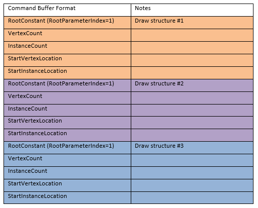

# Indirect Drawing

Indirect drawing enables some scene-traversal and culling to be moved from the CPU to the GPU, which can improve performance. The command buffer can be generated by the CPU or GPU.

-   [Command Signatures](#command-signatures)
-   [Indirect Argument Buffer Structures](#indirect-argument-buffer-structures)
-   [Command Signature Creation](#command-signature-creation)
    -   [No Argument Changes](#no-argument-changes)
    -   [Root Constants and Vertex Buffers](#root-constants-and-vertex-buffers)
-   [Related topics](#related-topics)

## Command Signatures

The command signature object ([**ID3D12CommandSignature**](/windows/win32/api/d3d12/nn-d3d12-id3d12commandsignature)) enables apps to specify indirect drawing, in particular setting the following:

-   The indirect argument buffer format.
-   The command type that will be used (from the [**ID3D12GraphicsCommandList**](/windows/desktop/api/d3d12/nn-d3d12-id3d12graphicscommandlist) methods [**DrawInstanced**](/windows/desktop/api/d3d12/nf-d3d12-id3d12graphicscommandlist-drawinstanced), [**DrawIndexedInstanced**](/windows/desktop/api/d3d12/nf-d3d12-id3d12graphicscommandlist-drawindexedinstanced), or [**Dispatch**](/windows/desktop/api/d3d12/nf-d3d12-id3d12graphicscommandlist-dispatch)).
-   The set of resource bindings which will change per-command call versus the set which will be inherited.

At startup, an app creates a small set of **command signatures**. At runtime, the application fills a buffer with commands (via whatever means the app developer chooses). The commands optionally containing state to set for vertex buffer views, index buffer views, root constants and root descriptors (raw or structured SRV/UAV/CBVs). These argument layouts are not hardware specific so apps can generate the buffers directly. The command signature inherits the remaining state from the command list. Then the app calls [**ExecuteIndirect**](/windows/desktop/api/d3d12/nf-d3d12-id3d12graphicscommandlist-executeindirect) to instruct the GPU to interpret the contents of the indirect argument buffer according to the format defined by a particular command signature.

If the command signature changes any root arguments, this is stored within the command signature as a subset of a root signature.

Note that no command signature state leaks back to the command list when the execution is complete.

For example, suppose an app developer wants a unique root constant to be specified per-draw call in the indirect argument buffer. The app would create a command signature that enables the indirect argument buffer to specify the following parameters per draw call:

-   The value of one root constant.
-   The draw arguments (vertex count, instance count, etc).

The indirect argument buffer generated by the application would contain an array of fixed-size records. Each structure corresponds to one draw call. Each structure contains the drawing arguments, and the value of the root constant. The number of draw calls is specified in a separate GPU-visible buffer.

An example command buffer generated by the app follows:



## Indirect Argument Buffer Structures

The following structures define how particular arguments appear in an indirect argument buffer. These structures do not appear in any D3D12 API. Applications use these definitions when writing to an indirect argument buffer (with the CPU or GPU):

-   [**D3D12\_DRAW\_ARGUMENTS**](/windows/desktop/api/d3d12/ns-d3d12-d3d12_draw_arguments)
-   [**D3D12\_DRAW\_INDEXED\_ARGUMENTS**](/windows/desktop/api/d3d12/ns-d3d12-d3d12_draw_indexed_arguments)
-   [**D3D12\_DISPATCH\_ARGUMENTS**](/windows/desktop/api/d3d12/ns-d3d12-d3d12_dispatch_arguments)
-   [**D3D12\_VERTEX\_BUFFER\_VIEW**](/windows/desktop/api/d3d12/ns-d3d12-d3d12_vertex_buffer_view)
-   [**D3D12\_INDEX\_BUFFER\_VIEW**](/windows/desktop/api/d3d12/ns-d3d12-d3d12_index_buffer_view)
-   D3D12\_GPU\_VIRTUAL\_ADDRESS (a typedef'd synonym of UINT64).
-   [**D3D12\_CONSTANT\_BUFFER\_VIEW**](/windows/desktop/api/d3d12/ns-d3d12-d3d12_constant_buffer_view_desc)

## Command Signature Creation

To create a command signature, use the following API items:

-   [**ID3D12Device::CreateCommandSignature**](/windows/desktop/api/d3d12/nf-d3d12-id3d12device-createcommandsignature) (outputs an [**ID3D12CommandSignature**](/windows/win32/api/d3d12/nn-d3d12-id3d12commandsignature))
-   [**D3D12\_INDIRECT\_ARGUMENT\_TYPE**](/windows/desktop/api/d3d12/ne-d3d12-d3d12_indirect_argument_type)
-   [**D3D12\_INDIRECT\_ARGUMENT\_DESC**](/windows/desktop/api/d3d12/ns-d3d12-d3d12_indirect_argument_desc)
-   [**D3D12\_COMMAND\_SIGNATURE\_DESC**](/windows/desktop/api/d3d12/ns-d3d12-d3d12_command_signature_desc)

The ordering of arguments within an indirect argument buffer is defined to exactly match the order of arguments specified in the *pArguments* parameter of [**D3D12\_COMMAND\_SIGNATURE\_DESC**](/windows/desktop/api/d3d12/ns-d3d12-d3d12_command_signature_desc). All of the arguments for one draw (graphics)/dispatch (compute) call within an indirect argument buffer are tightly packed. However, applications are allowed to specify an arbitrary byte stride between draw/dispatch commands in an indirect argument buffer.

The root signature must be specified if and only if the command signature changes one of the root arguments.

For root SRV/UAV/CBV, the application specified size is in bytes. The debug layer will validate the following restrictions on the address:

-   CBV – address must be a multiple of 256 bytes.
-   Raw SRV/UAV – address must be a multiple of 4 bytes.
-   Structured SRV/UAV – address must be a multiple of the structure byte stride (declared in the shader).

A given command signature is either a draw or a compute command signature. If a command signature contains a drawing operation, then it is a graphics command signature. Otherwise, the command signature must contain a dispatch operation, and it is a compute command signature.

The following sections show some example command signatures.

### No Argument Changes

In this example, the indirect argument buffer generated by the application holds an array of 36-byte structures. Each structure only contains the five parameters passed to [**DrawIndexedInstanced**](/windows/desktop/api/d3d12/nf-d3d12-id3d12graphicscommandlist-drawindexedinstanced) (plus padding).

The code to create the command signature description follows:

``` syntax
D3D12_INDIRECT_ARGUMENT_DESC Args[1];
Args[0].Type = D3D12_INDIRECT_ARGUMENT_TYPE_DRAW_INDEXED;

D3D12_COMMAND_SIGNATURE_DESC ProgramDesc;
ProgramDesc.ByteStride = 36;
ProgramDesc.NumArgumentDescs = 1;
ProgramDesc.pArguments = Args;
```

The layout of a single structure within an indirect argument buffer is:


| Bytes | Description           |
|-------|-----------------------|
| 0:3   | IndexCountPerInstance |
| 4:7   | InstanceCount         |
| 8:11  | StartIndexLocation    |
| 12:15 | BaseVertexLocation    |
| 16:19 | StartInstanceLocation |
| 20:35 | Padding               |


 

### Root Constants and Vertex Buffers

In this example, each structure in an indirect argument buffer changes two root constants, changes one vertex buffer binding, and performs one drawing non-indexed operation. There is no padding between structures.

The code to create the command signature description is:

``` syntax
D3D12_INDIRECT_ARGUMENT_DESC Args[4];
Args[0].Type = D3D12_INDIRECT_ARGUMENT_TYPE_CONSTANT;
Args[0].Constant.RootParameterIndex = 2;
Args[0].Constant.DestOffsetIn32BitValues = 0;
Args[0].Constant.Num32BitValuesToSet = 1;

Args[1].Type = D3D12_INDIRECT_ARGUMENT_TYPE_CONSTANT;
Args[1].Constant.RootParameterIndex = 6;
Args[1].Constant.DestOffsetIn32BitValues = 0;
Args[1].Constant.Num32BitValuesToSet = 1;

Args[2].Type = D3D12_INDIRECT_ARGUMENT_TYPE_VERTEX_BUFFER_VIEW;
Args[2].VertexBuffer.Slot = 3;

Args[3].Type = D3D12_INDIRECT_ARGUMENT_TYPE_DRAW;

D3D12_COMMAND_SIGNATURE_DESC ProgramDesc;
ProgramDesc.ByteStride = 40;
ProgramDesc.NumArgumentDescs = 4;
ProgramDesc.pArguments = Args;
```

The layout of a single structure within the indirect argument buffer is the following:


| Bytes | Description                               |
|-------|-------------------------------------------|
| 0:3   | Data for root parameter index 2           |
| 4:7   | Data for root parameter index 6           |
| 8:15  | Virtual address of VB at slot 3 (64-bit)  |
| 16:19 | VB size                                   |
| 20:23 | VB stride                                 |
| 24:27 | VertexCountPerInstance                    |
| 28:31 | InstanceCount                             |
| 32:35 | StartVertexLocation                       |
| 36:39 | StartInstanceLocation                     |


 

## Related topics

<dl> <dt>

[DirectX advanced learning video tutorials : Execute Indirect and Async GPU culling](https://www.youtube.com/watch?v=fKD-VKJeeds)
</dt> <dt>

[Indirect drawing and GPU culling : code walk-through](indirect-drawing-and-gpu-culling-.md)
</dt> <dt>

[Rendering](rendering.md)
</dt> </dl>

 

 
