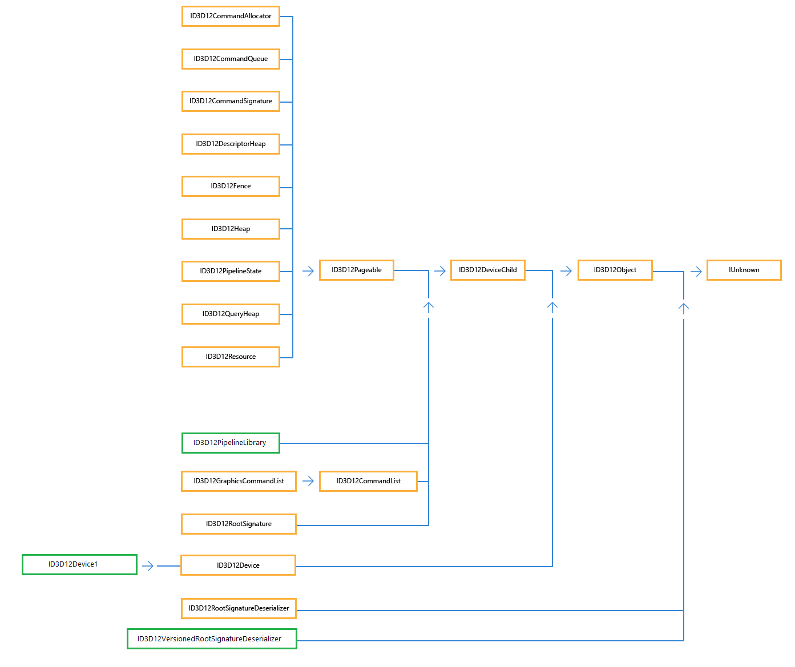

# Interface Hierarchy

The diagram shows the interface inheritance hierarchy.

Most apps will use only the interfaces at the top of the hierarchy, and not directly use the inherited interfaces; [**ID3D12Pageable**](/windows/win32/D3D12/?branch=master), [**ID3D12DeviceChild**](/windows/win32/D3D12/nn-d3d12-id3d12devicechild?branch=master), [**ID3D12Object**](/windows/win32/D3D12/nn-d3d12-id3d12object?branch=master) and [**ID3D12CommandList**](/windows/win32/D3D12/nn-d3d12-id3d12commandlist?branch=master).

New interfaces are shown in a green box.

## Related topics

<dl> <dt>

[Core Interfaces](direct3d-12-interfaces.md)
</dt> <dt>

[Direct3D 12 Reference](direct3d-12-reference.md)
</dt> </dl>

 

 

