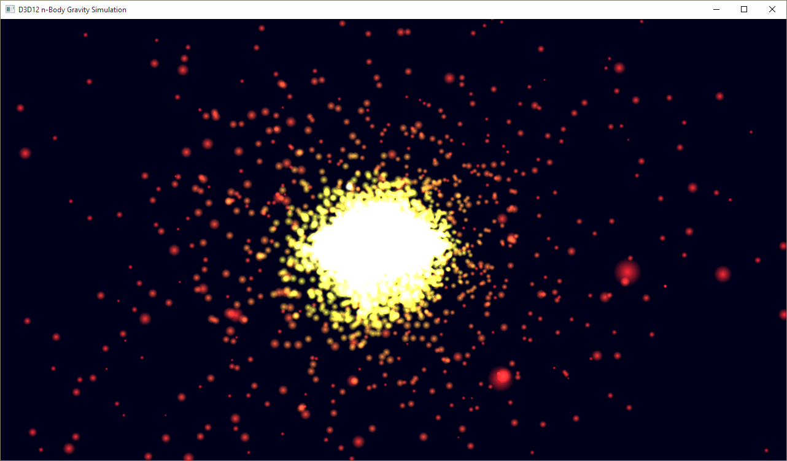

# Multi-engine n-body gravity simulation

The **D3D12nBodyGravity** sample demonstrates how to do compute work asynchronously. The sample spins up a number of threads each with a compute command queue and schedules compute work on the GPU that performs an n-body gravity simulation. Each thread operates on two buffers full of position and velocity data. With each iteration, the compute shader reads the current position and velocity data from one buffer and writes the next iteration into the other buffer. When the iteration completes, the compute shader swaps which buffer is the SRV for reading position/velocity data and which is the UAV for writing position/velocity updates by changing the resource state on each buffer.

-   [Create the root signatures](#create-the-root-signatures)
-   [Create the SRV and UAV buffers](#create-the-srv-and-uav-buffers)
-   [Create the CBV and vertex buffers](#create-the-cbv-and-vertex-buffers)
-   [Synchronize the rendering and compute threads](#synchronize-the-rendering-and-compute-threads)
-   [Run the sample](#run-the-sample)
-   [Related topics](#related-topics)

## Create the root signatures

We start out by creating both a graphics and a compute root signature, in the **LoadAssets** method. Both root signatures have a root constant buffer view (CBV) and a shader resource view (SRV) descriptor table. The compute root signature also has an unordered access view (UAV) descriptor table.

``` syntax
 // Create the root signatures.
       {
              CD3DX12_DESCRIPTOR_RANGE ranges[2];
              ranges[0].Init(D3D12_DESCRIPTOR_RANGE_TYPE_SRV, 1, 0);
              ranges[1].Init(D3D12_DESCRIPTOR_RANGE_TYPE_UAV, 1, 0);

              CD3DX12_ROOT_PARAMETER rootParameters[RootParametersCount];
              rootParameters[RootParameterCB].InitAsConstantBufferView(0, 0, D3D12_SHADER_VISIBILITY_ALL);
              rootParameters[RootParameterSRV].InitAsDescriptorTable(1, &ranges[0], D3D12_SHADER_VISIBILITY_VERTEX);
              rootParameters[RootParameterUAV].InitAsDescriptorTable(1, &ranges[1], D3D12_SHADER_VISIBILITY_ALL);

              // The rendering pipeline does not need the UAV parameter.
              CD3DX12_ROOT_SIGNATURE_DESC rootSignatureDesc;
              rootSignatureDesc.Init(_countof(rootParameters) - 1, rootParameters, 0, nullptr, D3D12_ROOT_SIGNATURE_FLAG_ALLOW_INPUT_ASSEMBLER_INPUT_LAYOUT);

              ComPtr<ID3DBlob> signature;
              ComPtr<ID3DBlob> error;
              ThrowIfFailed(D3D12SerializeRootSignature(&rootSignatureDesc, D3D_ROOT_SIGNATURE_VERSION_1, &signature, &error));
              ThrowIfFailed(m_device->CreateRootSignature(0, signature->GetBufferPointer(), signature->GetBufferSize(), IID_PPV_ARGS(&m_rootSignature)));

              // Create compute signature. Must change visibility for the SRV.
              rootParameters[RootParameterSRV].ShaderVisibility = D3D12_SHADER_VISIBILITY_ALL;

              CD3DX12_ROOT_SIGNATURE_DESC computeRootSignatureDesc(_countof(rootParameters), rootParameters, 0, nullptr);
              ThrowIfFailed(D3D12SerializeRootSignature(&computeRootSignatureDesc, D3D_ROOT_SIGNATURE_VERSION_1, &signature, &error));

              ThrowIfFailed(m_device->CreateRootSignature(0, signature->GetBufferPointer(), signature->GetBufferSize(), IID_PPV_ARGS(&m_computeRootSignature)));
       }
```


| Call flow                                                             | Parameters                                                            |
|-----------------------------------------------------------------------|-----------------------------------------------------------------------|
| [**CD3DX12\_DESCRIPTOR\_RANGE**](cd3dx12-descriptor-range.md)        | [**D3D12\_DESCRIPTOR\_RANGE\_TYPE**](/windows/win32/api/d3d12/ne-d3d12-d3d12_descriptor_range_type) |
| [**CD3DX12\_ROOT\_PARAMETER**](cd3dx12-root-parameter.md)            | [**D3D12\_SHADER\_VISIBILITY**](/windows/win32/api/d3d12/ne-d3d12-d3d12_shader_visibility)          |
| [**CD3DX12\_ROOT\_SIGNATURE\_DESC**](cd3dx12-root-signature-desc.md) | [**D3D12\_ROOT\_SIGNATURE\_FLAGS**](/windows/win32/api/d3d12/ne-d3d12-d3d12_root_signature_flags)   |
| [**ID3DBlob**](/previous-versions/windows/desktop/legacy/ff728743(v=vs.85))                                   |                                                                       |
| [**D3D12SerializeRootSignature**](/windows/win32/api/d3d12/nf-d3d12-d3d12serializerootsignature)    | [**D3D\_ROOT\_SIGNATURE\_VERSION**](/windows/win32/api/d3d12/ne-d3d12-d3d_root_signature_version)   |
| [**CreateRootSignature**](/windows/win32/api/d3d12/nf-d3d12-id3d12device-createrootsignature)       |                                                                       |
| [**CD3DX12\_ROOT\_SIGNATURE\_DESC**](cd3dx12-root-signature-desc.md) |                                                                       |
| [**D3D12SerializeRootSignature**](/windows/win32/api/d3d12/nf-d3d12-d3d12serializerootsignature)    | [**D3D\_ROOT\_SIGNATURE\_VERSION**](/windows/win32/api/d3d12/ne-d3d12-d3d_root_signature_version)   |
| [**CreateRootSignature**](/windows/win32/api/d3d12/nf-d3d12-id3d12device-createrootsignature)       |                                                                       |


 

## Create the SRV and UAV buffers

The SRV and UAV buffers consist of an array of position and velocity data.

``` syntax
 // Position and velocity data for the particles in the system.
       // Two buffers full of Particle data are utilized in this sample.
       // The compute thread alternates writing to each of them.
       // The render thread renders using the buffer that is not currently
       // in use by the compute shader.
       struct Particle
       {
              XMFLOAT4 position;
              XMFLOAT4 velocity;
       };
```


| Call flow                       | Parameters |
|---------------------------------|------------|
| [**XMFLOAT4**](/windows/win32/api/directxmath/ns-directxmath-xmfloat4) |            |


 

## Create the CBV and vertex buffers

For the graphics pipeline, the CBV is a **struct** containing two matrices used by the geometry shader. The geometry shader takes the position of each particle in the system and generates a quad to represent it using these matrices.

``` syntax
 struct ConstantBufferGS
       {
              XMMATRIX worldViewProjection;
              XMMATRIX inverseView;

              // Constant buffers are 256-byte aligned in GPU memory. Padding is added
              // for convenience when computing the struct's size.
              float padding[32];
       };
```


| Call flow                       | Parameters |
|---------------------------------|------------|
| [**XMMATRIX**](/windows/win32/api/directxmath/ns-directxmath-xmmatrix) |            |


 

As a result, the vertex buffer used by the vertex shader actually does not contain any positional data.

``` syntax
 // "Vertex" definition for particles. Triangle vertices are generated 
       // by the geometry shader. Color data will be assigned to those 
       // vertices via this struct.
       struct ParticleVertex
       {
              XMFLOAT4 color;
       };
```


| Call flow                       | Parameters |
|---------------------------------|------------|
| [**XMFLOAT4**](/windows/win32/api/directxmath/ns-directxmath-xmfloat4) |            |


 

For the compute pipeline, the CBV is a **struct** containing some constants used by the n-body gravity simulation in the compute shader.

``` syntax
 struct ConstantBufferCS
       {
              UINT param[4];
              float paramf[4];
       };
```

## Synchronize the rendering and compute threads

After the buffers are all initialized, the rendering and compute work will begin. The compute thread will be changing the state of the two position/velocity buffers back and forth between SRV and UAV as it iterates on the simulation, and the rendering thread needs to ensure that it schedules work on the graphics pipeline that operates on the SRV. Fences are used to synchronize access to the two buffers.

On the Render thread:

``` syntax
// Render the scene.
void D3D12nBodyGravity::OnRender()
{
       // Let the compute thread know that a new frame is being rendered.
       for (int n = 0; n < ThreadCount; n++)
       {
              InterlockedExchange(&m_renderContextFenceValues[n], m_renderContextFenceValue);
       }

       // Compute work must be completed before the frame can render or else the SRV 
       // will be in the wrong state.
       for (UINT n = 0; n < ThreadCount; n++)
       {
              UINT64 threadFenceValue = InterlockedGetValue(&m_threadFenceValues[n]);
              if (m_threadFences[n]->GetCompletedValue() < threadFenceValue)
              {
                     // Instruct the rendering command queue to wait for the current 
                     // compute work to complete.
                     ThrowIfFailed(m_commandQueue->Wait(m_threadFences[n].Get(), threadFenceValue));
              }
       }

       // Record all the commands we need to render the scene into the command list.
       PopulateCommandList();

       // Execute the command list.
       ID3D12CommandList* ppCommandLists[] = { m_commandList.Get() };
       m_commandQueue->ExecuteCommandLists(_countof(ppCommandLists), ppCommandLists);

       // Present the frame.
       ThrowIfFailed(m_swapChain->Present(0, 0));

       MoveToNextFrame();
}
```


| Call flow                                                              | Parameters |
|------------------------------------------------------------------------|------------|
| [**InterlockedExchange**](/windows-hardware/drivers/ddi/content/wdm/nf-wdm-interlockedexchange)                  |            |
| [**InterlockedGetValue**](/windows-hardware/drivers/ddi/content/wdm/nf-wdm-interlockedcompareexchange)           |            |
| [**GetCompletedValue**](/windows/win32/api/d3d12/nf-d3d12-id3d12fence-getcompletedvalue)             |            |
| [**Wait**](/windows/win32/api/d3d12/nf-d3d12-id3d12commandqueue-wait)                                |            |
| [**ID3D12CommandList**](/windows/win32/api/d3d12/nn-d3d12-id3d12commandlist)                         |            |
| [**ExecuteCommandLists**](/windows/win32/api/d3d12/nf-d3d12-id3d12commandqueue-executecommandlists)  |            |
| [**IDXGISwapChain1::Present1**](/windows/win32/api/dxgi1_2/nf-dxgi1_2-idxgiswapchain1-present1) |            |


 

To simplify the sample a bit, the compute thread waits for the GPU to complete each iteration before scheduling any more compute work. In practice, applications will likely want to keep the compute queue full to achieve maximum performance from the GPU.

On the Compute thread:

``` syntax
DWORD D3D12nBodyGravity::AsyncComputeThreadProc(int threadIndex)
{
       ID3D12CommandQueue* pCommandQueue = m_computeCommandQueue[threadIndex].Get();
       ID3D12CommandAllocator* pCommandAllocator = m_computeAllocator[threadIndex].Get();
       ID3D12GraphicsCommandList* pCommandList = m_computeCommandList[threadIndex].Get();
       ID3D12Fence* pFence = m_threadFences[threadIndex].Get();

       while (0 == InterlockedGetValue(&m_terminating))
       {
              // Run the particle simulation.
              Simulate(threadIndex);

              // Close and execute the command list.
              ThrowIfFailed(pCommandList->Close());
              ID3D12CommandList* ppCommandLists[] = { pCommandList };

              pCommandQueue->ExecuteCommandLists(1, ppCommandLists);

              // Wait for the compute shader to complete the simulation.
              UINT64 threadFenceValue = InterlockedIncrement(&m_threadFenceValues[threadIndex]);
              ThrowIfFailed(pCommandQueue->Signal(pFence, threadFenceValue));
              ThrowIfFailed(pFence->SetEventOnCompletion(threadFenceValue, m_threadFenceEvents[threadIndex]));
              WaitForSingleObject(m_threadFenceEvents[threadIndex], INFINITE);

              // Wait for the render thread to be done with the SRV so that
              // the next frame in the simulation can run.
              UINT64 renderContextFenceValue = InterlockedGetValue(&m_renderContextFenceValues[threadIndex]);
              if (m_renderContextFence->GetCompletedValue() < renderContextFenceValue)
              {
                     ThrowIfFailed(pCommandQueue->Wait(m_renderContextFence.Get(), renderContextFenceValue));
                     InterlockedExchange(&m_renderContextFenceValues[threadIndex], 0);
              }

              // Swap the indices to the SRV and UAV.
              m_srvIndex[threadIndex] = 1 - m_srvIndex[threadIndex];

              // Prepare for the next frame.
              ThrowIfFailed(pCommandAllocator->Reset());
              ThrowIfFailed(pCommandList->Reset(pCommandAllocator, m_computeState.Get()));
       }

       return 0;
}
```


| Call flow                                                                   | Parameters |
|-----------------------------------------------------------------------------|------------|
| [**ID3D12CommandQueue**](/windows/win32/api/d3d12/nn-d3d12-id3d12commandqueue)                            |            |
| [**ID3D12CommandAllocator**](/windows/win32/api/d3d12/nn-d3d12-id3d12commandallocator)                    |            |
| [**ID3D12GraphicsCommandList**](/windows/win32/api/d3d12/nn-d3d12-id3d12graphicscommandlist)              |            |
| [**ID3D12Fence**](/windows/win32/api/d3d12/nn-d3d12-id3d12fence)                                          |            |
| [**InterlockedGetValue**](/windows-hardware/drivers/ddi/content/wdm/nf-wdm-interlockedcompareexchange)                |            |
| [**Close**](/windows/win32/api/d3d12/nf-d3d12-id3d12graphicscommandlist-close)                            |            |
| [**ID3D12CommandList**](/windows/win32/api/d3d12/nn-d3d12-id3d12commandlist)                              |            |
| [**ExecuteCommandLists**](/windows/win32/api/d3d12/nf-d3d12-id3d12commandqueue-executecommandlists)       |            |
| [**InterlockedIncrement**](/windows-hardware/drivers/ddi/content/wdm/nf-wdm-interlockedincrement)                     |            |
| [**Signal**](/windows/win32/api/d3d12/nf-d3d12-id3d12commandqueue-signal)                                 |            |
| [**SetEventOnCompletion**](/windows/win32/api/d3d12/nf-d3d12-id3d12fence-seteventoncompletion)            |            |
| [**WaitForSingleObject**](/windows/win32/api/synchapi/nf-synchapi-waitforsingleobject)                         |            |
| [**InterlockedGetValue**](/windows-hardware/drivers/ddi/content/wdm/nf-wdm-interlockedcompareexchange)                |            |
| [**GetCompletedValue**](/windows/win32/api/d3d12/nf-d3d12-id3d12fence-getcompletedvalue)                  |            |
| [**Wait**](/windows/win32/api/d3d12/nf-d3d12-id3d12commandqueue-wait)                                     |            |
| [**InterlockedExchange**](/windows-hardware/drivers/ddi/content/wdm/nf-wdm-interlockedexchange)                       |            |
| [**ID3D12CommandAllocator::Reset**](/windows/win32/api/d3d12/nf-d3d12-id3d12commandallocator-reset)       |            |
| [**ID3D12GraphicsCommandList::Reset**](/windows/win32/api/d3d12/nf-d3d12-id3d12graphicscommandlist-reset) |            |


 

## Run the sample



## Related topics

[D3D12 Code Walk-Throughs](d3d12-code-walk-throughs.md)

[Multi-engine synchronization](./user-mode-heap-synchronization.md)
