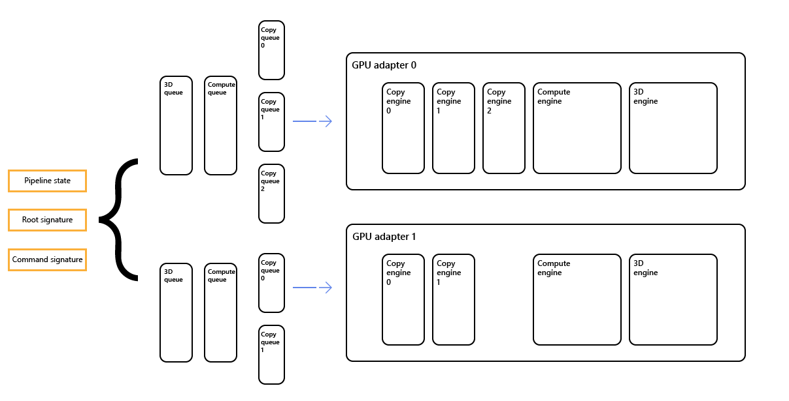

# Multi-adapter systems

Describes support in Direct3D 12 for systems that have multiple adapters installed, covering scenarios where your application explicitly targets multiple GPU adapters, and scenarios where drivers implicitly use multiple GPU adapters on behalf of your application.

## Multi-adapter overview

A GPU adapter can be any adapter (graphics or compute, discrete or integrated), from any manufacturer, that supports Direct3D 12.

Multiple adapters are referenced as *nodes*. A number of elements, such as the queues, apply to each node, so if there are two nodes, there will be two default 3D queues. Other elements, such as the pipeline state and root and command signatures, can refer to one or more or all of the nodes, as shown in the diagram.

## Sharing heaps across adapters

See the [Shared Heaps](shared-heaps.md) topic.

## Multi-adapter APIs, and node masks

Similar to previous Direct3D APIs, each set of linked adapters is enumerated as a single [**IDXGIAdapter3**](/windows/win32/api/dxgi1_4/nn-dxgi1_4-idxgiadapter3) object. All outputs attached to any adapter in the link are enumerated as attached to the single **IDXGIAdapter3** object.

Your application can determine the number of physical adapters associated with a given device by calling [**ID3D12Device::GetNodeCount**](/windows/win32/api/d3d12/nf-d3d12-id3d12device-getnodecount).

Many APIs in Direct3D 12 accept a *node mask* (a bit mask), which indicates the set of nodes to which the API call refers. Each node has a zero-based index. But in the node mask, zero translates to bit 1; 1 translates to bit 2; and so on.

### Single nodes

When calling the following (single node) APIs, your application specifies a single node with which the API call will be associated. Most of the time, this is specified by a node mask. Each bit in the mask corresponds to a single node. For all of the APIs described in this section, you must set exactly one bit in the node mask.

-   [**D3D12\_COMMAND\_QUEUE\_DESC**](/windows/win32/api/d3d12/ns-d3d12-d3d12_command_queue_desc) : has a *NodeMask* member.
-   [**CreateCommandQueue**](/windows/win32/api/d3d12/nf-d3d12-id3d12device-createcommandqueue) : creates a queue from a [**D3D12\_COMMAND\_QUEUE\_DESC**](/windows/win32/api/d3d12/ns-d3d12-d3d12_command_queue_desc) structure.
-   [**CreateCommandList**](/windows/win32/api/d3d12/nf-d3d12-id3d12device-createcommandlist) : takes a *nodeMask* parameter.
-   [**D3D12\_DESCRIPTOR\_HEAP\_DESC**](/windows/win32/api/d3d12/ns-d3d12-d3d12_descriptor_heap_desc) : has a *NodeMask* member.
-   [**CreateDescriptorHeap**](/windows/win32/api/d3d12/nf-d3d12-id3d12device-createdescriptorheap) : creates a descriptor heap from a [**D3D12\_DESCRIPTOR\_HEAP\_DESC**](/windows/win32/api/d3d12/ns-d3d12-d3d12_descriptor_heap_desc) structure.
-   [**D3D12\_QUERY\_HEAP\_DESC**](/windows/win32/api/d3d12/ns-d3d12-d3d12_query_heap_desc) : has a *NodeMask* member.
-   [**CreateQueryHeap**](/windows/win32/api/d3d12/nf-d3d12-id3d12device-createqueryheap) : creates a query heap from a [**D3D12\_QUERY\_HEAP\_DESC**](/windows/win32/api/d3d12/ns-d3d12-d3d12_query_heap_desc) structure.

### Multiple nodes

When calling the following (multiple node) APIs, your application specifies a set of nodes with which the API call will be associated. You specify node affinity as a node mask, potentially with multiple bits set. If your application passes 0 for this bit mask, then the Direct3D 12 driver converts that to the bit mask 1 (indicating that the object is associated with node 0).

-   [**D3D12\_CROSS\_NODE\_SHARING\_TIER**](/windows/win32/api/d3d12/ne-d3d12-d3d12_cross_node_sharing_tier) : determines the support for cross node sharing.
-   [**D3D12\_FEATURE\_DATA\_D3D12\_OPTIONS**](/windows/win32/api/d3d12/ns-d3d12-d3d12_feature_data_d3d12_options) : structure referencing [**D3D12\_CROSS\_NODE\_SHARING\_TIER**](/windows/win32/api/d3d12/ne-d3d12-d3d12_cross_node_sharing_tier).
-   [**D3D12\_FEATURE\_DATA\_ARCHITECTURE**](/windows/win32/api/d3d12/ns-d3d12-d3d12_feature_data_architecture) : contains a *NodeIndex* member.
-   [**D3D12\_GRAPHICS\_PIPELINE\_STATE\_DESC**](/windows/win32/api/d3d12/ns-d3d12-d3d12_graphics_pipeline_state_desc) : has a *NodeMask* member.
-   [**CreateGraphicsPipelineState**](/windows/win32/api/d3d12/nf-d3d12-id3d12device-creategraphicspipelinestate) : creates a graphics pipeline state object from a [**D3D12\_GRAPHICS\_PIPELINE\_STATE\_DESC**](/windows/win32/api/d3d12/ns-d3d12-d3d12_graphics_pipeline_state_desc) structure.
-   [**D3D12\_COMPUTE\_PIPELINE\_STATE\_DESC**](/windows/win32/api/d3d12/ns-d3d12-d3d12_compute_pipeline_state_desc) : has a *NodeMask* member.
-   [**CreateComputePipelineState**](/windows/win32/api/d3d12/nf-d3d12-id3d12device-createcomputepipelinestate) : creates a compute pipeline state object from a [**D3D12\_COMPUTE\_PIPELINE\_STATE\_DESC**](/windows/win32/api/d3d12/ns-d3d12-d3d12_compute_pipeline_state_desc) structure.
-   [**CreateRootSignature**](/windows/win32/api/d3d12/nf-d3d12-id3d12device-createrootsignature): takes a *nodeMask* parameter.
-   [**D3D12\_COMMAND\_SIGNATURE\_DESC**](/windows/win32/api/d3d12/ns-d3d12-d3d12_command_signature_desc): has a *NodeMask* member.
-   [**CreateCommandSignature**](/windows/win32/api/d3d12/nf-d3d12-id3d12device-createcommandsignature) : creates a command signature object from a [**D3D12\_COMMAND\_SIGNATURE\_DESC**](/windows/win32/api/d3d12/ns-d3d12-d3d12_command_signature_desc) structure.

### Resource creation APIs

The following APIs reference node masks.

-   [**D3D12\_HEAP\_PROPERTIES**](/windows/win32/api/d3d12/ns-d3d12-d3d12_heap_properties) : has both *CreationNodeMask* and *VisibleNodeMask* members.
-   [**GetResourceAllocationInfo**](/windows/win32/api/d3d12/nf-d3d12-id3d12device-getresourceallocationinfo) : has a *visibleMask* parameter.
-   [**GetCustomHeapProperties**](/windows/win32/api/d3d12/nf-d3d12-id3d12device-getcustomheapproperties) : has a *nodeMask* parameter.

When creating a reserved resource, no node index or mask is specified. The reserved resource can be mapped onto a heap on any node (following the cross-node sharing rules).

The method [**MakeResident**](/windows/win32/api/d3d12/nf-d3d12-id3d12device-makeresident) works internally with adapter queues, there is no need for your application to specify anything for this.

When calling the following [**ID3D12Device**](/windows/win32/api/d3d12/nn-d3d12-id3d12device) APIs, your application doesn't need to specify a set of nodes that the API call will be associated with because the API call applies to all nodes.

-   [**CreateFence**](/windows/win32/api/d3d12/nf-d3d12-id3d12device-createfence)
-   [**GetDescriptorHandleIncrementSize**](/windows/win32/api/d3d12/nf-d3d12-id3d12device-getdescriptorhandleincrementsize)
-   [**SetStablePowerState**](/windows/win32/api/d3d12/nf-d3d12-id3d12device-setstablepowerstate)
-   [**CheckFeatureSupport**](/windows/win32/api/d3d12/nf-d3d12-id3d12device-checkfeaturesupport)
-   [**CreateSampler**](/windows/win32/api/d3d12/nf-d3d12-id3d12device-createsampler)
-   [**CopyDescriptors**](/windows/win32/api/d3d12/nf-d3d12-id3d12device-copydescriptors)
-   [**CopyDescriptorsSimple**](/windows/win32/api/d3d12/nf-d3d12-id3d12device-copydescriptorssimple)
-   [**CreateSharedHandle**](/windows/win32/api/d3d12/nf-d3d12-id3d12device-createsharedhandle)
-   [**OpenSharedHandleByName**](/windows/win32/api/d3d12/nf-d3d12-id3d12device-opensharedhandlebyname)
-   [**OpenSharedHandle**](/windows/win32/api/d3d12/nf-d3d12-id3d12device-opensharedhandle) : with a *fence* as a parameter. With a *resource* or a *heap* as parameters this method does not accept nodes as parameters because node masks are inherited from previously created objects.
-   [**CreateCommandAllocator**](/windows/win32/api/d3d12/nf-d3d12-id3d12device-createcommandallocator)
-   [**CreateConstantBufferView**](/windows/win32/api/d3d12/nf-d3d12-id3d12device-createconstantbufferview)
-   [**CreateRenderTargetView**](/windows/win32/api/d3d12/nf-d3d12-id3d12device-createrendertargetview)
-   [**CreateUnorderedAccessView**](/windows/win32/api/d3d12/nf-d3d12-id3d12device-createunorderedaccessview)
-   [**CreateDepthStencilView**](/windows/win32/api/d3d12/nf-d3d12-id3d12device-createdepthstencilview)
-   [**CreateShaderResourceView**](/windows/win32/api/d3d12/nf-d3d12-id3d12device-createshaderresourceview)

## Related topics

[Direct3D 12 Programming Guide](directx-12-programming-guide.md)
