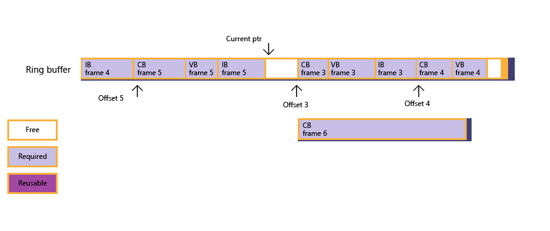

# Porting from Direct3D 11 to Direct3D 12

This section provides some guidance on porting from a custom Direct3D 11 graphics engine to Direct3D 12.

-   [Device creation](#device-creation)
-   [Committed resources](#committed-resources)
-   [Reserved resources](#reserved-resources)
-   [Uploading data](#uploading-data)
-   [Shaders and shader objects](#shaders-and-shader-objects)
-   [Submitting work to the GPU](#submitting-work-to-the-gpu)
-   [CPU/GPU Synchronization](#cpugpu-synchronization)
-   [Resource Binding](#resource-binding)
-   [Resource state](#resource-state)
-   [Swapchains](#swapchains)
-   [Fixed function rendering](#fixed-function-rendering)
-   [Odds and ends](#odds-and-ends)
-   [Related topics](#related-topics)

## Device creation

Both Direct3D 11 and Direct3D 12 share a similar device creation pattern. Existing Direct3D 12 drivers are all **D3D_FEATURE_LEVEL_11_0** or better, so you can ignore the older feature levels and associated lmitations.

Also keep in mind that with Direct3D 12, you should explicitly enumerate device information using DXGI interfaces. In Direct3D 11, you could *chain back* to the DXGI device from the Direct3D device, and this is not supported for Direct3D 12.

Creating a WARP software device on Direct3D 12 is done by providing an explicit adapter obtained from **IDXGIFactory4::EnumWarpAdapter**. The WARP device for Direct3D 12 is available only on systems with the **Graphics Tools** optional feature enabled.

> [!NOTE]
> There is no equivalent to **D3D11CreateDeviceAndSwapChain**. Even with Direct3D 11, we discourage the use of this function as it's often better to create the device and swapchain in distinct steps.

## Committed resources

Objects created with the following interfaces in Direct3D 11, translate to what are called "committed resources" in Direct3D 12. A committed resource is a resource which has both virtual address space and physical pages associated with it. This is a concept of the Microsoft Windows Device Driver 2 (WDD2) Memory Model, on which Direct3D 12 is based.

Direct3D 11 resources:

-   [**ID3D11Resource**](/windows/win32/api/d3d11/nn-d3d11-id3d11resource)
-   [**ID3D11Buffer**](/windows/win32/api/d3d11/nn-d3d11-id3d11buffer) and [**ID3D11Device::CreateBuffer**](/windows/win32/api/d3d11/nf-d3d11-id3d11device-createbuffer)
-   [**ID3D11Texture1D**](/windows/win32/api/d3d11/nn-d3d11-id3d11texture1d) and [**ID3D11Device:CreateTexture1D**](/windows/win32/api/d3d11/nf-d3d11-id3d11device-createtexture1d)
-   [**ID3D11Texture2D**](/windows/win32/api/d3d11/nn-d3d11-id3d11texture2d) and [**ID3D11Device::CreateTexture2D**](/windows/win32/api/d3d11/nf-d3d11-id3d11device-createtexture2d)
-   [**ID3D11Texture3D**](/windows/win32/api/d3d11/nn-d3d11-id3d11texture3d) and [**ID3D11Device::CreateTexture3D**](/windows/win32/api/d3d11/nf-d3d11-id3d11device-createtexture3d)

In Direct3D 12 these are all represented by [**ID3D12Resource**](/windows/win32/api/d3d12/nn-d3d12-id3d12resource) and [**ID3D12Device::CreateCommittedResource**](/windows/win32/api/d3d12/nf-d3d12-id3d12device-createcommittedresource).

## Reserved resources

Reserved resources are resources where only virtual address space has been allocated, physical memory is not allocated until there is a call to [**ID3D12Device::CreateHeap**](/windows/win32/api/d3d12/nf-d3d12-id3d12device-createheap). This is essentially the same concept as tiled resources in Direct3D 11.

The flags ([**D3D11\_RESOURCE\_MISC\_FLAG**](/windows/win32/api/d3d11/ne-d3d11-d3d11_resource_misc_flag)) used in Direct3D 11 to set up tiled resources, then map them to physical memory.

-   D3D11\_RESOURCE\_MISC\_TILED
-   D3D11\_RESOURCE\_MISC\_TILE\_POOL

## Uploading data

In Direct3D 11 there is the appearance of a single timeline (calls following a sequence, such as data initialized with [**D3D11\_SUBRESOURCE\_DATA**](/windows/win32/api/d3d11/ns-d3d11-d3d11_subresource_data), then a call is made to [**ID3D11DeviceContext::UpdateSubresource**](/windows/win32/api/d3d11/nf-d3d11-id3d11devicecontext-updatesubresource), and then a call to [**ID3D11DeviceContext::Map**](/windows/win32/api/d3d11/nf-d3d11-id3d11devicecontext-map)). The number of copies created of the data is not obvious to a Direct3D 11 developer.

In Direct3D 12 there are two timelines, the GPU timeline (set up by calls to [**CopyTextureRegion**](/windows/win32/api/d3d12/nf-d3d12-id3d12graphicscommandlist-copytextureregion), and [**CopyBufferRegion**](/windows/win32/api/d3d12/nf-d3d12-id3d12graphicscommandlist-copybufferregion) from mappable memory) and the CPU timeline (determined by calls to [**Map**](/windows/win32/api/d3d12/nf-d3d12-id3d12resource-map)). Helper functions are provided (in the d3dx12.h file) called [**Updatesubresources**](updatesubresources1.md) that use a shared timeline. There are several variations of this helper function, one that uses [**ID3D12Device::GetCopyableFootprints**](/windows/win32/api/d3d12/nf-d3d12-id3d12device-getcopyablefootprints), another that uses a heap-allocating mechanism, and another that uses a stack-allocating mechanism. These helper functions copy resources to both the GPU and CPU, via an intermediate staging area of memory.

Typically the GPU and CPU each have their own copy of a resource tied to their own timeline. The shared timeline approach similarly maintains two copies.

## Shaders and shader objects

In Direct3D 11 there is a lot of creation of shader and state objects, and setting the state of those objects, using the [**ID3D11Device**](/windows/win32/api/d3d11/nn-d3d11-id3d11device) creation methods and the [**ID3D11DeviceContext**](/windows/win32/api/d3d11/nn-d3d11-id3d11devicecontext) set methods. Typically a large number of calls are made to these methods, which are then combined at draw time by the driver to set the correct pipeline state.

In Direct3D 12 this setting of pipeline state has been combined into a single object ([**CreateComputePipelineState**](/windows/win32/api/d3d12/nf-d3d12-id3d12device-createcomputepipelinestate) for a compute engine, and [**CreateGraphicsPipelineState**](/windows/win32/api/d3d12/nf-d3d12-id3d12device-creategraphicspipelinestate) for a graphics engine), which is then attached to a command list before the draw call with a call to [**SetPipelineState**](/windows/win32/api/d3d12/nf-d3d12-id3d12graphicscommandlist-setpipelinestate).

These calls replace all the individual calls to set shaders, input layout, blend state, rasterizer state, depth stencil state, and so on, in Direct3D 11

- Device 11 methods: ``CreateInputLayout``, ``CreateXShader``, ``CreateDepthStencilState``, andD ``CreateRasterizerState``.
- Device Context 11 methods:  ``IASetInputLayout``, ``xxSetShader``, ``OMSetBlendState``, ``OMSetDepthStencilState``, and ``RSSetState``.

While Direct3D 12 can support older compiled shader blobs, shaders should be built using either Shader Model 5.1 with the FXC/D3DCompile APIs, or using Shader Model 6 using the DXIL DXC compiler. You should validate Shader Model 6 support with [**CheckFeatureSupport**](/windows/win32/api/d3d12/nf-d3d12-id3d12device-checkfeaturesupport) and **D3D12_FEATURE_SHADER_MODEL**.

## Submitting work to the GPU

in Direct3D 11 there is little control over actually how work is submitted, it is largely handled by the driver, though some control is enabled through the [**ID3D11DeviceContext::Flush**](/windows/win32/api/d3d11/nf-d3d11-id3d11devicecontext-flush) and [**IDXGISwapChain1::Present1**](/windows/win32/api/dxgi1_2/nf-dxgi1_2-idxgiswapchain1-present1) calls.

In Direct3D 12 work submission is very explicit and controlled by the app. The primary construct for submitting work is the [**ID3D12GraphicsCommandList**](/windows/win32/api/d3d12/nn-d3d12-id3d12graphicscommandlist), which is used to record all the apps commands (and is quite similar in concept to the ID3D11 deferred context). Backing store for a command list is provided by the [**ID3D12CommandAllocator**](/windows/win32/api/d3d12/nn-d3d12-id3d12commandallocator), which enables the app to manage the memory utilization of the command list by actually exposing the memory that the Direct3D 12 driver is going to use to store the command list.

Finally the [**ID3D12CommandQueue**](/windows/win32/api/d3d12/nn-d3d12-id3d12commandqueue) is a first-in first-out queue, that stores the correct order of the command lists for submission to the GPU. Only when one command list has completed execution on the GPU, will the next command list from the queue be submitted by the driver.

In Direct3D 11 there is no explicit concept of a command queue. In the common setup for Direct3D 12, the currently open **D3D12_COMMAND_LIST_TYPE_DIRECT** command list for the current frame can be considered analogous to the Direct3D 11 immediate context. This provides many of the same functions.

| D3D11DeviceContext                  | ID3D12GraphicsCommand List     |
|-------------------------------------|--------------------------------|
| ClearDepthStencilView               | ClearDepthStencilView          |
| ClearRenderTargetView               | ClearRenderTargetView          |
| ClearUnorderedAccess*               | ClearUnorderedAccess*          |
| Draw, DrawInstanced                 | DrawInstanced                  |
| DrawIndexed, DrawIndexedInstanced   | DrawIndexedInstanced           |
| Dispatch                            | Dispatch                       |
| IASetInputLayout, xxSetShader, etc. | SetPipelineState               |
| OMSetBlendState                     | OMSetBlendFactor               |
| OMSetDepthStencilState              | OMSetStencilRef                |
| OMSetRenderTargets                  | OMSetRenderTargets             |
| RSSetViewports                      | RSSetViewports                 |
| RSSetScissorRects                   | RSSetScissorRects              |
| IASetPrimitiveTopology              | IASetPrimitiveTopology         |
| IASetVertexBuffers                  | IASetVertexBuffers             |
| IASetIndexBuffer                    | IASetIndexBuffer               |
| ResolveSubresource                  | ResolveSubresource             |
| CopySubresourceRegion               | CopyBufferRegion               |
| UpdateSubresource                   | CopyTextureRegion              |
| CopyResource                        | CopyResource                   |

> [!NOTE]
> A command list created with **D3D12_COMMAND_LIST_TYPE_BUNDLE** is simliar to a deferred context. Direct3D 12 also supports the abiilty to access some features of an *immediate context* simultaneous to rendering via **D3D12_COMMAND_LIST_TYPE_COPY** and **D3D12_COMMAND_LIST_TYPE_COMPUTE** command list types.

## CPU/GPU Synchronization

In Direct3D 11 CPU/GPU synchronization was largely automatic, and there was no need for the app to maintain the status of physical memory.

in Direct3D 12 the app must manage the two timelines (CPU and GPU) explicitly. This requires that information needs to be maintained, by the app, on what resources are required by the GPU, and for how long. This also means that the app is responsible for ensuring the contents of resources (committed resources, heaps, command allocators, for example) do not change until the GPU has finished using them.

The main object for synchronizing the timelines is the [**ID3D12Fence**](/windows/win32/api/d3d12/nn-d3d12-id3d12fence) object. The operation of fences is failry simple, they enable the GPU to signal when it has completed a task. The GPU and CPU can both signal, and can both wait on fences.

Typically the approach is that when submitting a command list for execution, a fence signal is transmitted by the GPU on completion (when it has finished reading the data), enabling the CPU to reuse or destroy the resources.

In Direct3D 11 the [**ID3D11DeviceContext::Map**](/windows/win32/api/d3d11/nf-d3d11-id3d11devicecontext-map) flag D3D11\_MAP\_WRITE\_DISCARD essentially treated each resource as an endless supply of memory the app could write to (a process known as "renaming"). In Direct3D 12 again the process is explicit: additional memory needs to be allocated, and fences should be used to sync the operations. Ring buffers (consisting of large buffers) might be a good technique for this, refer to the ring buffer scenario in [Fence-Based Resource Management](fence-based-resource-management.md).

## Resource Binding

Views in Direct3D 11 (shader resource views, render target views, and so on), have largely been replaced in Direct3D 12 with the concept of a descriptor. The creation methods still exist in Direct3D 12 (such as [**CreateShaderResourceView**](/windows/win32/api/d3d12/nf-d3d12-id3d12device-createshaderresourceview) and [**CreateRenderTargetView**](/windows/win32/api/d3d12/nf-d3d12-id3d12device-createrendertargetview)), which are called after the descriptor heap has been created, to write the data into the heap. Binding in Direct3D 12 is now handled by descriptor handles described in a root signature, and submitted using the [**SetGraphicsRootDescriptorTable**](/windows/win32/api/d3d12/nf-d3d12-id3d12graphicscommandlist-setgraphicsrootdescriptortable) or [**SetComputeRootDescriptorTable**](/windows/win32/api/d3d12/nf-d3d12-id3d12graphicscommandlist-setcomputerootdescriptortable) methods.

Root signatures details mappings between the root signature slot number and descriptor tables, where the descriptor table can contain references to resources available to vertex shaders, pixel shaders, and the other shaders, such as constant buffers, shader resource views and samplers. This flexibility disconnects the HLSL register space from the API binding space in Direct3D 12, unlike Direct3D 11 where there is a one to one mapping between these.

One of the implications of this system is that the app is responsible for renaming descriptor tables, which enables developers to understand the performance cost of changing even a single descriptor per draw call.

A new feature of Direct3D 12 is that an app can control which descriptors are shared between which shader stages. In Direct3D 11 resources such as UAVs are shared between all shader stages. By enabling descriptors to be disabled for certain shader stages, the registers used by descriptors that have been disabled are available to be used by descriptors which are enabled for a particular shader stage.

The following table shows an example root signature.

| Root Parameter Slot | Descriptor Table Entry         |
|---------------------|--------------------------------|
| 0                   | VS Descriptor Range b0-b13     |
| 1                   | VS Descriptor Range t0-t127    |
| 2                   | VS Descriptor Range s0-s16     |
| 3                   | PS Descriptor Range b0-b13     |
| ...                 |                                |
| 14                  | DS Descriptor Range s0-16      |
| 15                  | Shared Descriptor Range u0-u63 |

 

## Resource state

In Direct3D 11 resource state is not maintained by the app, but by the driver.

In Direct3D 12 maintaining resource state becomes the responsibility of the app, to enable full parallelism in the recording of command lists: the app must handle the recording timelines for command lists (which can be done in parallel), and the execution timelines which must be sequential.

A resource state transition is handled by the [**ResourceBarrier**](/windows/win32/api/d3d12/nf-d3d12-id3d12graphicscommandlist-resourcebarrier) method. Primarily the app must inform the driver when resource usage is changing. For example if a resource is being used as a render target, and then it is to be used as input to a vertex shader on the next draw call, then this might require a short stall in GPU operation to complete the render target operation before handling the vertex shader.

This system enables fine grain synchronization (the GPU stalls) of the graphics pipeline, as well as cache flushes and possibly some memory layout changes (such as render target view to depth stencil view decompression).

This is known as a transition barrier. There are other kinds of barriers, in Direct3D 11 the [**ID3D11DeviceContext2::TiledResourceBarrier**](/windows/win32/api/d3d11_2/nf-d3d11_2-id3d11devicecontext2-tiledresourcebarrier) enabled the same physical memory to be used by two different tiled resources. In Direct3D 12 this is referred to as an "aliasing barrier". Aliasing barriers can be used for both tiled and placed resources in Direct3D 12. Additionally there is the UAV barrier. In Direct3D 11 all UAV dispatch and draw operations are required to be serialized, even though these operations can be pipelined or work in parallel. For Direct3D 12 this restriction is removed by the addition of a UAV barrier. A UAV barrier ensures that UAV operations are sequential, so if a second operation requires that the first complete, the second will be forced to wait by the addition of the barrier. The default operation for UAVs is simply that the operations will proceed as quickly as possible.

Clearly there are performance gains if a workload can be parallelized.

## Swapchains

The DXGI swap chain is the basis for swap chains in both Direct3D 11 and 12. There are some minor differences, in Direct3D 11 the three types of swap chain are SEQUENTIAL, DISCARD, and FLIP\_SEQUENTIAL. For Direct3D 12 there are just two types: FLIP\_SEQUENTIAL and FLIP\_DISCARD. As noted above, you should be explicitly creating your swapchain via **IDXGIFactory4**, or later, and using the same interface for any adapter enumeration.

In Direct3D 11 there is automatic backbuffer rotation: only one render target view is needed for back buffer 0. In Direct3D 12 buffer rotation is explicit, there needs to be a render target view for each back buffer. Use the [**IDXGISwapChain3::GetCurrentBackBufferIndex**](/windows/win32/api/dxgi1_4/nf-dxgi1_4-idxgiswapchain3-getcurrentbackbufferindex) method to select which one to render to. Again this additional flexibility enables greater parallelization.

> [!NOTE]
> While there are numerous ways to set up your application, generally applications have one **ID3D12CommandAllocator** per swap-chain buffer. This allows the application to proceed to building up a set of commands for the next frame while the GPU renders the previous.

## Fixed function rendering

In Direct3D 11 there were a few methods that simplified various higher level operations, such as [**GenerateMips**](/windows/win32/api/d3d11/nf-d3d11-id3d11devicecontext-generatemips) (creating full mip chains) and [**DrawAuto**](/windows/win32/api/d3d11/nf-d3d11-id3d11devicecontext-drawauto) (using stream output as shader input without further input from the app). These methods are not available in Direct3D 12, the app needs to handle these operations by creating shaders to perform them.

## Odds and ends

The following table shows a number of features that are similar between Direct3D 11 and 12, but are not identical.

| Direct3D 11                                                                            | Direct3D 12                                                                                                                                                                                                                                                                                                                                                                                                                              |
|----------------------------------------------------------------------------------------|------------------------------------------------------------------------------------------------------------------------------------------------------------------------------------------------------------------------------------------------------------------------------------------------------------------------------------------------------------------------------------------------------------------------------------------|
| [**ID3D11Query**](/windows/win32/api/d3d11/nn-d3d11-id3d11query)                                              | [**ID3D12QueryHeap**](/windows/win32/api/d3d12/nn-d3d12-id3d12queryheap) allows queries to be grouped together, reducing the cost.                                                                                                                                                                                                                                                                                                                                     |
| [**ID3D11Predicate**](/windows/win32/api/d3d11/nn-d3d11-id3d11predicate)                                      | Predication is now enabled by having data in a fully transparent buffer. The Direct3D 11 [**ID3D11Predicate**](/windows/win32/api/d3d11/nn-d3d11-id3d11predicate) object is replaced by [**ID3D12Resource::Map**](/windows/win32/api/d3d12/nf-d3d12-id3d12resource-map), which must follow a call to [**ResolveQueryData**](/windows/win32/api/d3d12/nf-d3d12-id3d12graphicscommandlist-resolvequerydata) and a GPU sync operation using a fence to wait for the data to be ready. Refer to [Predication](predication.md). |
| UAV/SO hidden counter                                                                  | The app is responsible for allocation and management of SO/UAV counters. Refer to [Stream Output Counters](stream-output-counters.md) and [UAV Counters](uav-counters.md).                                                                                                                                                                                                                                                             |
| Resource dynamic MinLOD (minium level of detail)                                       | This has been moved to the SRV descriptor static MinLOD.                                                                                                                                                                                                                                                                                                                                                                                 |
| Draw\*Indirect/[**DispatchIndirect**](/windows/win32/api/d3d11/nf-d3d11-id3d11devicecontext-dispatchindirect) | Drawing indirect methods are all merged into the one [**ExecuteIndirect**](/windows/win32/api/d3d12/nf-d3d12-id3d12graphicscommandlist-executeindirect) method.                                                                                                                                                                                                                                                                                                        |
| DepthStencil formats are interleaved                                                   | DepthStencil formats are planar. For example a format of 24 bits of depth, 8 bits of stencil would be stored in the format 24/8/24/8... etc in Direct3D 11, but as 24/24/24... followed by 8/8/8... in Direct3D 12. Note that each plane is its own subresource in D3D12 (refer to [Subresources](subresources.md)).                                                                                                                    |
| [**ResizeTilePool**](/windows/win32/api/d3d11_2/nf-d3d11_2-id3d11devicecontext2-resizetilepool)                   | Reserved resources can be mapped to multiple heaps. When a tile pool would have been grown in D3D11, an additional heap can be allocated in D3D12 instead.                                                                                                                                                                                                                                                                               |

 

## Related topics

<dl> <dt>

[DirectX advanced learning video tutorials : DirectX 11 to DirectX 12 porting guide](https://www.youtube.com/watch?v=BV64mdOCgZo)
</dt> <dt>

[Understanding Direct3D 12](directx-12-getting-started.md)
</dt> <dt>

[Working with Direct3D 11, Direct3D 10 and Direct2D](direct3d-12-interop.md)
</dt> </dl>
