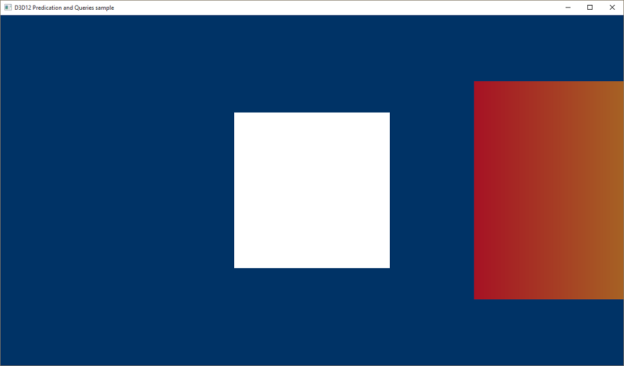
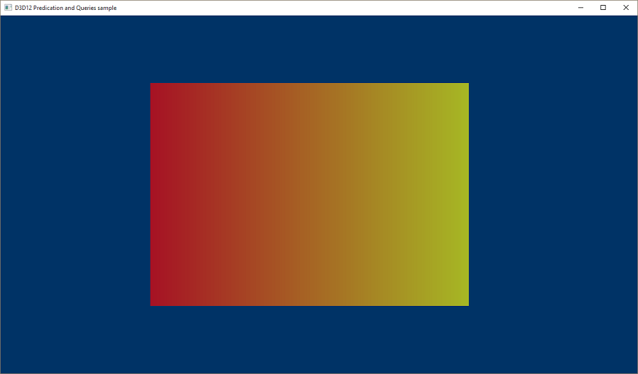
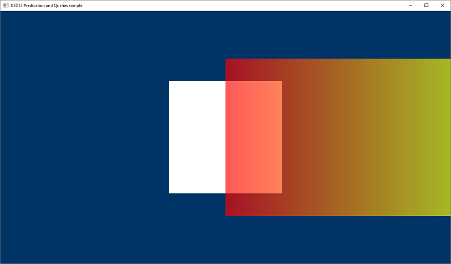

# Predication queries

The **D3D12PredicationQueries** sample demonstrates occlusion culling using DirectX 12 query heaps and predication. The walkthrough describes the additional code needed to extend the **HelloConstBuffer** sample to handle predication queries.

-   [Create a depth stencil descriptor heap and an occlusion query heap](#create-a-depth-stencil-descriptor-heap-and-an-occlusion-query-heap)
-   [Enable alpha blending](#enable-alpha-blending)
-   [Disable color and depth writes](#disable-color-and-depth-writes)
-   [Create a buffer to store the results of the query](#create-a-buffer-to-store-the-results-of-the-query)
-   [Draw the quads and perform and resolve the occlusion query](#draw-the-quads-and-perform-and-resolve-the-occlusion-query)
-   [Run the sample](#run-the-sample)
-   [Related topics](#related-topics)

## Create a depth stencil descriptor heap and an occlusion query heap

In the **LoadPipeline** method create a depth stencil descriptor heap.

``` syntax
              // Describe and create a depth stencil view (DSV) descriptor heap.
              D3D12_DESCRIPTOR_HEAP_DESC dsvHeapDesc = {};
              dsvHeapDesc.NumDescriptors = 1;
              dsvHeapDesc.Type = D3D12_DESCRIPTOR_HEAP_TYPE_DSV;
              dsvHeapDesc.Flags = D3D12_DESCRIPTOR_HEAP_FLAG_NONE;
              ThrowIfFailed(m_device->CreateDescriptorHeap(&dsvHeapDesc, IID_PPV_ARGS(&m_dsvHeap)));
```


<table>
<thead>
<tr class="header">
<th>Call flow</th>
<th>Parameters</th>
</tr>
</thead>
<tbody>
<tr class="odd">
<td><a href="/windows/desktop/api/d3d12/ns-d3d12-d3d12_descriptor_heap_desc"><strong>D3D12_DESCRIPTOR_HEAP_DESC</strong></a></td>
<td><dl><a href="/windows/desktop/api/d3d12/ne-d3d12-d3d12_descriptor_heap_type"><strong>D3D12_DESCRIPTOR_HEAP_TYPE</strong></a><br />
[<strong>D3D12_DESCRIPTOR_HEAP_FLAG</strong>](/windows/desktop/api/d3d12/ne-d3d12-d3d12_descriptor_heap_flags)<br />
</dl></td>
</tr>
<tr class="even">
<td><a href="/windows/desktop/api/d3d12/nf-d3d12-id3d12device-createdescriptorheap"><strong>CreateDescriptorHeap</strong></a></td>

</tr>
</tbody>
</table>


 

In the **LoadAssets** method create a heap for occlusion queries.

``` syntax
     // Describe and create a heap for occlusion queries.
              D3D12_QUERY_HEAP_DESC queryHeapDesc = {};
              queryHeapDesc.Count = 1;
              queryHeapDesc.Type = D3D12_QUERY_HEAP_TYPE_OCCLUSION;
              ThrowIfFailed(m_device->CreateQueryHeap(&queryHeapDesc, IID_PPV_ARGS(&m_queryHeap)));
```


| Call flow                                                 | Parameters                                                |
|-----------------------------------------------------------|-----------------------------------------------------------|
| [**D3D12\_QUERY\_HEAP\_DESC**](/windows/desktop/api/d3d12/ns-d3d12-d3d12_query_heap_desc) | [**D3D12\_QUERY\_HEAP\_TYPE**](/windows/desktop/api/d3d12/ne-d3d12-d3d12_query_heap_type) |
| [**CreateQueryHeap**](/windows/desktop/api/d3d12/nf-d3d12-id3d12device-createqueryheap)   |                                                           |


 

## Enable alpha blending

This sample draws two quads and illustrates a binary occlusion query. The quad in front animates across the screen, and the one in back will occasionally be occluded. In the **LoadAssets** method, alpha blending is enabled for this sample so that we can see at what point D3D considers the quad in back occluded.

``` syntax
     // Enable alpha blending so we can visualize the occlusion query results.
              CD3DX12_BLEND_DESC blendDesc(CD3DX12_DEFAULT);
              blendDesc.RenderTarget[0] =
              {
                     TRUE, FALSE,
                     D3D12_BLEND_SRC_ALPHA, D3D12_BLEND_INV_SRC_ALPHA, D3D12_BLEND_OP_ADD,
                     D3D12_BLEND_ONE, D3D12_BLEND_ZERO, D3D12_BLEND_OP_ADD,
                     D3D12_LOGIC_OP_NOOP,
                     D3D12_COLOR_WRITE_ENABLE_ALL,
              };
```


<table>
<thead>
<tr class="header">
<th>Call flow</th>
<th>Parameters</th>
</tr>
</thead>
<tbody>
<tr class="odd">
<td><a href="cd3dx12-blend-desc.md"><strong>CD3DX12_BLEND_DESC</strong></a></td>
<td><dl><a href="cd3dx12-default.md"><strong>CD3DX12_DEFAULT</strong></a><br />
[<strong>D3D12_BLEND</strong>](/windows/desktop/api/d3d12/ne-d3d12-d3d12_blend)<br />
[<strong>D3D12_BLEND_OP</strong>](/windows/desktop/api/d3d12/ne-d3d12-d3d12_blend_op)<br />
[<strong>D3D12_LOGIC_OP</strong>](/windows/desktop/api/d3d12/ne-d3d12-d3d12_logic_op)<br />
[<strong>D3D12_COLOR_WRITE_ENABLE</strong>](/windows/desktop/api/d3d12/ne-d3d12-d3d12_color_write_enable)<br />
</dl></td>
</tr>
</tbody>
</table>


 

## Disable color and depth writes

The occlusion query is performed by rendering a quad that covers the same area as the quad whose visibility we want to test. In more complex scenes, the query would likely be a bounding volume, rather than a simple quad. In either case, a new pipeline state is created that disables writing to the render target and the z buffer so that the occlusion query itself does not affect the visible output of the rendering pass.

In the **LoadAssets** method, disable color writes and depth writes for the occlusion query's state.

``` syntax
 // Disable color writes and depth writes for the occlusion query's state.
              psoDesc.BlendState.RenderTarget[0].RenderTargetWriteMask = 0;
              psoDesc.DepthStencilState.DepthWriteMask = D3D12_DEPTH_WRITE_MASK_ZERO;

              ThrowIfFailed(m_device->CreateGraphicsPipelineState(&psoDesc, IID_PPV_ARGS(&m_queryState)));
```


| Call flow                                                                            | Parameters                                                  |
|--------------------------------------------------------------------------------------|-------------------------------------------------------------|
| [**D3D12\_GRAPHICS\_PIPELINE\_STATE\_DESC**](/windows/desktop/api/d3d12/ns-d3d12-d3d12_graphics_pipeline_state_desc) | [**D3D12\_DEPTH\_WRITE\_MASK**](/windows/desktop/api/d3d12/ne-d3d12-d3d12_depth_write_mask) |
| [**CreateGraphicsPipelineState**](/windows/desktop/api/d3d12/nf-d3d12-id3d12device-creategraphicspipelinestate)      |                                                             |


 

## Create a buffer to store the results of the query

In the **LoadAssets** method a buffer needs to be created to store the results of the query. Each query requires 8 bytes of space in GPU memory. This sample only performs one query and for simplicity and readability creates a buffer exactly that size (even though this function call will allocate a 64K page of GPU memory - most real apps would likely create a larger buffer).

``` syntax
 // Create the query result buffer.
              CD3DX12_HEAP_PROPERTIES heapProps(D3D12_HEAP_TYPE_DEFAULT);
              auto queryBufferDesc = CD3DX12_RESOURCE_DESC::Buffer(8);
              ThrowIfFailed(m_device->CreateCommittedResource(
                     &heapProps,
                     D3D12_HEAP_FLAG_NONE,
                     &queryBufferDesc,
                     D3D12_RESOURCE_STATE_GENERIC_READ,
                     nullptr,
                     IID_PPV_ARGS(&m_queryResult)
                     ));
```


<table>
<thead>
<tr class="header">
<th>Call flow</th>
<th>Parameters</th>
</tr>
</thead>
<tbody>
<tr class="odd">
<td><a href="/windows/desktop/api/d3d12/nf-d3d12-id3d12device-createcommittedresource"><strong>CreateCommittedResource</strong></a></td>
<td><dl><a href="cd3dx12-heap-properties.md"><strong>CD3DX12_HEAP_PROPERTIES</strong></a><br />
[<strong>D3D12_HEAP_TYPE</strong>](/windows/desktop/api/d3d12/ne-d3d12-d3d12_heap_type)<br />
[<strong>D3D12_HEAP_FLAG</strong>](/windows/desktop/api/d3d12/ne-d3d12-d3d12_heap_flags)<br />
[<strong>CD3DX12_RESOURCE_DESC</strong>](cd3dx12-resource-desc.md)<br />
[<strong>D3D12_RESOURCE_STATES</strong>](/windows/desktop/api/d3d12/ne-d3d12-d3d12_resource_states)<br />
</dl></td>
</tr>
</tbody>
</table>


 

## Draw the quads and perform and resolve the occlusion query

Having done the setup, the main loop is updated in the **PopulateCommandLists** method.

<dl> 1. Draw the quads from back to front to make the transparency effect work properly. Drawing the quad in back to front is predicated on the result of the previous frame’s query and is a fairly common technique for this.  
2. Change the PSO to disable render target and depth stencil writes.  
3. Perform the occlusion query.  
4. Resolve the occlusion query.  
</dl>

``` syntax
       // Draw the quads and perform the occlusion query.
       {
              CD3DX12_GPU_DESCRIPTOR_HANDLE cbvFarQuad(m_cbvHeap->GetGPUDescriptorHandleForHeapStart(), m_frameIndex * CbvCountPerFrame, m_cbvSrvDescriptorSize);
              CD3DX12_GPU_DESCRIPTOR_HANDLE cbvNearQuad(cbvFarQuad, m_cbvSrvDescriptorSize);

              m_commandList->IASetPrimitiveTopology(D3D_PRIMITIVE_TOPOLOGY_TRIANGLESTRIP);
              m_commandList->IASetVertexBuffers(0, 1, &m_vertexBufferView);

              // Draw the far quad conditionally based on the result of the occlusion query
              // from the previous frame.
              m_commandList->SetGraphicsRootDescriptorTable(0, cbvFarQuad);
              m_commandList->SetPredication(m_queryResult.Get(), 0, D3D12_PREDICATION_OP_EQUAL_ZERO);
              m_commandList->DrawInstanced(4, 1, 0, 0);

              // Disable predication and always draw the near quad.
              m_commandList->SetPredication(nullptr, 0, D3D12_PREDICATION_OP_EQUAL_ZERO);
              m_commandList->SetGraphicsRootDescriptorTable(0, cbvNearQuad);
              m_commandList->DrawInstanced(4, 1, 4, 0);

              // Run the occlusion query with the bounding box quad.
              m_commandList->SetGraphicsRootDescriptorTable(0, cbvFarQuad);
              m_commandList->SetPipelineState(m_queryState.Get());
              m_commandList->BeginQuery(m_queryHeap.Get(), D3D12_QUERY_TYPE_BINARY_OCCLUSION, 0);
              m_commandList->DrawInstanced(4, 1, 8, 0);
              m_commandList->EndQuery(m_queryHeap.Get(), D3D12_QUERY_TYPE_BINARY_OCCLUSION, 0);

              // Resolve the occlusion query and store the results in the query result buffer
              // to be used on the subsequent frame.
              m_commandList->ResourceBarrier(1, &CD3DX12_RESOURCE_BARRIER::Transition(m_queryResult.Get(), D3D12_RESOURCE_STATE_GENERIC_READ, D3D12_RESOURCE_STATE_COPY_DEST));
              m_commandList->ResolveQueryData(m_queryHeap.Get(), D3D12_QUERY_TYPE_BINARY_OCCLUSION, 0, 1, m_queryResult.Get(), 0);
              m_commandList->ResourceBarrier(1, &CD3DX12_RESOURCE_BARRIER::Transition(m_queryResult.Get(), D3D12_RESOURCE_STATE_COPY_DEST, D3D12_RESOURCE_STATE_GENERIC_READ));
       }
```


<table>
<thead>
<tr class="header">
<th>Call flow</th>
<th>Parameters</th>
</tr>
</thead>
<tbody>
<tr class="odd">
<td><a href="cd3dx12-gpu-descriptor-handle.md"><strong>CD3DX12_GPU_DESCRIPTOR_HANDLE</strong></a></td>
<td><a href="/windows/desktop/api/d3d12/nf-d3d12-id3d12descriptorheap-getgpudescriptorhandleforheapstart"><strong>GetGPUDescriptorHandleForHeapStart</strong></a></td>
</tr>
<tr class="even">
<td><a href="/windows/desktop/api/d3d12/nf-d3d12-id3d12graphicscommandlist-iasetprimitivetopology"><strong>IASetPrimitiveTopology</strong></a></td>
<td><a href="/windows/desktop/api/d3dcommon/ne-d3dcommon-d3d_primitive_topology"><strong>D3D_PRIMITIVE_TOPOLOGY</strong></a></td>
</tr>
<tr class="odd">
<td><a href="/windows/desktop/api/d3d12/nf-d3d12-id3d12graphicscommandlist-iasetvertexbuffers"><strong>IASetVertexBuffers</strong></a></td>

</tr>
<tr class="even">
<td><a href="/windows/desktop/api/d3d12/nf-d3d12-id3d12graphicscommandlist-setgraphicsrootdescriptortable"><strong>SetGraphicsRootDescriptorTable</strong></a></td>

</tr>
<tr class="odd">
<td><a href="/windows/desktop/api/d3d12/nf-d3d12-id3d12graphicscommandlist-setpredication"><strong>SetPredication</strong></a></td>
<td><a href="/windows/desktop/api/d3d12/ne-d3d12-d3d12_predication_op"><strong>D3D12_PREDICATION_OP</strong></a></td>
</tr>
<tr class="even">
<td><a href="/windows/desktop/api/d3d12/nf-d3d12-id3d12graphicscommandlist-drawinstanced"><strong>DrawInstanced</strong></a></td>

</tr>
<tr class="odd">
<td><a href="/windows/desktop/api/d3d12/nf-d3d12-id3d12graphicscommandlist-setpredication"><strong>SetPredication</strong></a></td>
<td><a href="/windows/desktop/api/d3d12/ne-d3d12-d3d12_predication_op"><strong>D3D12_PREDICATION_OP</strong></a></td>
</tr>
<tr class="even">
<td><a href="/windows/desktop/api/d3d12/nf-d3d12-id3d12graphicscommandlist-setgraphicsrootdescriptortable"><strong>SetGraphicsRootDescriptorTable</strong></a></td>

</tr>
<tr class="odd">
<td><a href="/windows/desktop/api/d3d12/nf-d3d12-id3d12graphicscommandlist-drawinstanced"><strong>DrawInstanced</strong></a></td>

</tr>
<tr class="even">
<td><a href="/windows/desktop/api/d3d12/nf-d3d12-id3d12graphicscommandlist-setgraphicsrootdescriptortable"><strong>SetGraphicsRootDescriptorTable</strong></a></td>

</tr>
<tr class="odd">
<td><a href="/windows/desktop/api/d3d12/nf-d3d12-id3d12graphicscommandlist-setpipelinestate"><strong>SetPipelineState</strong></a></td>

</tr>
<tr class="even">
<td><a href="/windows/desktop/api/d3d12/nf-d3d12-id3d12graphicscommandlist-beginquery"><strong>BeginQuery</strong></a></td>
<td><a href="/windows/desktop/api/d3d12/ne-d3d12-d3d12_query_type"><strong>D3D12_QUERY_TYPE</strong></a></td>
</tr>
<tr class="odd">
<td><a href="/windows/desktop/api/d3d12/nf-d3d12-id3d12graphicscommandlist-drawinstanced"><strong>DrawInstanced</strong></a></td>

</tr>
<tr class="even">
<td><a href="/windows/desktop/api/d3d12/nf-d3d12-id3d12graphicscommandlist-endquery"><strong>EndQuery</strong></a></td>
<td><a href="/windows/desktop/api/d3d12/ne-d3d12-d3d12_query_type"><strong>D3D12_QUERY_TYPE</strong></a></td>
</tr>
<tr class="odd">
<td><a href="/windows/desktop/api/d3d12/nf-d3d12-id3d12graphicscommandlist-resourcebarrier"><strong>ResourceBarrier</strong></a></td>
<td><dl><a href="cd3dx12-resource-barrier.md"><strong>CD3DX12_RESOURCE_BARRIER</strong></a><br />
[<strong>D3D12_RESOURCE_STATES</strong>](/windows/desktop/api/d3d12/ne-d3d12-d3d12_resource_states)<br />
</dl></td>
</tr>
<tr class="even">
<td><a href="/windows/desktop/api/d3d12/nf-d3d12-id3d12graphicscommandlist-resolvequerydata"><strong>ResolveQueryData</strong></a></td>
<td><a href="/windows/desktop/api/d3d12/ne-d3d12-d3d12_query_type"><strong>D3D12_QUERY_TYPE</strong></a></td>
</tr>
<tr class="odd">
<td><a href="/windows/desktop/api/d3d12/nf-d3d12-id3d12graphicscommandlist-resourcebarrier"><strong>ResourceBarrier</strong></a></td>
<td><dl><a href="cd3dx12-resource-barrier.md"><strong>CD3DX12_RESOURCE_BARRIER</strong></a><br />
[<strong>D3D12_RESOURCE_STATES</strong>](/windows/desktop/api/d3d12/ne-d3d12-d3d12_resource_states)<br />
</dl></td>
</tr>
</tbody>
</table>


 

## Run the sample

Not occluded:



Occluded:



Partially occluded:



## Related topics

<dl> <dt>

[D3D12 Code Walk-Throughs](d3d12-code-walk-throughs.md)
</dt> <dt>

[Predication](predication.md)
</dt> <dt>

[Queries](queries.md)
</dt> </dl>

 

 
