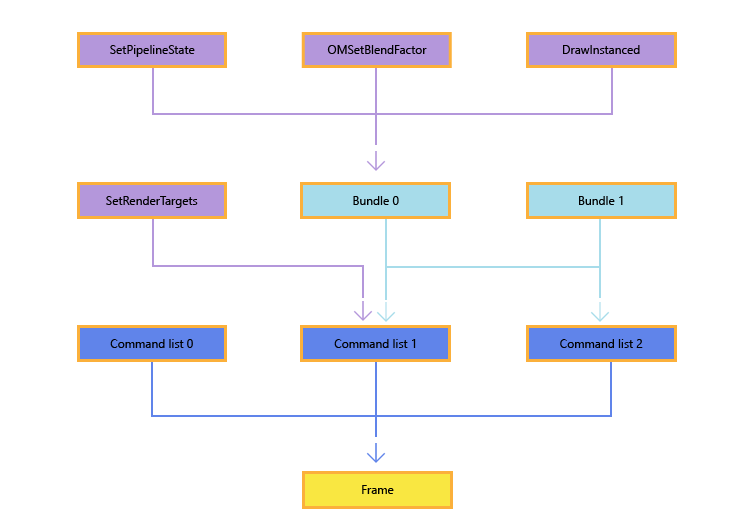

# Creating and recording command lists and bundles

This topic describes recording command lists and bundles in Direct3D 12 apps. Command lists and bundles both allow apps to record drawing or state-changing calls for later execution on the graphics processing unit (GPU).

Beyond command lists, the API exploits functionality present in GPU hardware by adding a second level of command lists, which are referred to as *bundles*. The purpose of bundles is to allow apps to group a small number of API commands together for later execution. At bundle creation time, the driver will perform as much pre-processing as is possible to make these cheap to execute later. Bundles are designed to be used and re-used any number of times. Command lists, on the other hand, are typically executed only a single time. However, a command list *can* be executed multiple times (as long as the application ensures that the previous executions have completed before submitting new executions).

Typically though, the build up of API calls into bundles, and API calls and bundles into command lists, and command lists into a single frame, is shown in the following diagram, noting the reuse of **Bundle 1** in **Command list 1** and **Command list 2**, and that the API method names in the diagram are just as examples, many different API calls can be used.



There are different restrictions for creating and executing bundles and direct command lists, and these differences are noted throughout this topic.

## Creating command lists

Direct command lists and bundles are created by calling [**ID3D12Device::CreateCommandList**](/windows/win32/api/d3d12/nf-d3d12-id3d12device-createcommandlist) or [**ID3D12Device4::CreateCommandList1**](/windows/win32/api/d3d12/nf-d3d12-id3d12device4-createcommandlist1).

Use [**ID3D12Device4::CreateCommandList1**](/windows/win32/api/d3d12/nf-d3d12-id3d12device4-createcommandlist1) to create a closed command list, rather than creating a new list and immediately closing it. This avoids the inefficiency of creating a list with an allocator and PSO but not using them.

[**ID3D12Device::CreateCommandList**](/windows/win32/api/d3d12/nf-d3d12-id3d12device-createcommandlist) takes the following parameters as input:

### D3D12\_COMMAND\_LIST\_TYPE

The [**D3D12\_COMMAND\_LIST\_TYPE**](/windows/win32/api/d3d12/ne-d3d12-d3d12_command_list_type) enumeration indicates the type of command list that is being created. It can be a direct command list, a bundle, a compute command list, or a copy command list.

### ID3D12CommandAllocator

A command allocator allows the app to manage the memory that is allocated for command lists. The command allocator is created by calling [**CreateCommandAllocator**](/windows/win32/api/d3d12/nf-d3d12-id3d12device-createcommandallocator). When creating a command list, the command list type of the allocator, specified by [**D3D12\_COMMAND\_LIST\_TYPE**](/windows/win32/api/d3d12/ne-d3d12-d3d12_command_list_type), must match the type of command list being created. A given allocator can be associated with no more than one *currently recording* command list at a time, though one command allocator can be used to create any number of [**GraphicsCommandList**](/windows/win32/api/d3d12/nn-d3d12-id3d12graphicscommandlist) objects.

To reclaim the memory allocated by a command allocator, an app calls [**ID3D12CommandAllocator::Reset**](/windows/win32/api/d3d12/nf-d3d12-id3d12commandallocator-reset). This allows the allocator to be reused for new commands, but won't reduce its underlying size. But before doing so, the app must make sure that the GPU is no longer executing any command lists which are associated with the allocator; otherwise, the call will fail. Also, note that this API is not free-threaded and therefore can't be called on the same allocator at the same time from multiple threads.

### ID3D12PipelineState

The initial pipeline state for the command list. In Microsoft Direct3D 12, most graphics pipeline state is set within a command list using the [**ID3D12PipelineState**](/windows/win32/api/d3d12/nn-d3d12-id3d12pipelinestate) object. An app will create a large number of these, typically during app initialization, and then the state is updated by changing the currently bound state object using [**ID3D12GraphicsCommandList::SetPipelineState**](/windows/win32/api/d3d12/nf-d3d12-id3d12graphicscommandlist-setpipelinestate). For more information about pipeline state objects, see [Managing graphics pipeline state in Direct3D 12](managing-graphics-pipeline-state-in-direct3d-12.md).

Note that bundles don't inherit the pipeline state set by previous calls in direct command lists that are their parents.

If this parameter is NULL, a default state is used.

## Recording command lists

Immediately after being created, command lists are in the recording state. You can also re-use an existing command list by calling [**ID3D12GraphicsCommandList::Reset**](/windows/win32/api/d3d12/nf-d3d12-id3d12graphicscommandlist-reset), which also leaves the command list in the recording state. Unlike [**ID3D12CommandAllocator::Reset**](/windows/win32/api/d3d12/nf-d3d12-id3d12commandallocator-reset), you can call **Reset** while the command list is still being executed. A typical pattern is to submit a command list and then immediately reset it to reuse the allocated memory for another command list. Note that only one command list associated with each command allocator may be in a recording state at one time.

Once a command list is in the recording state, you simply call methods of the [**ID3D12GraphicsCommandList**](/windows/win32/api/d3d12/nn-d3d12-id3d12graphicscommandlist) interface to add commands to the list. Many of these methods enable common Direct3D functionality that will be familiar to Microsoft Direct3D 11 developers; other APIs are new for Direct3D 12.

After adding commands to the command list, you transition the command list out of the recording state by calling [**Close**](/windows/win32/api/d3d12/nf-d3d12-id3d12graphicscommandlist-close).

Command allocators can grow but don't shrink - pooling and reusing allocators should be considered to maximise your app's efficiency. 
You can record multiple lists to the same allocator before it is reset, provided only one list is recording to a given allocator at one time. You can visualise each list as
owning a portion of the allocator which indicates what [**ID3D12CommandQueue::ExecuteCommandLists**](/windows/win32/api/d3d12/nf-d3d12-id3d12commandqueue-executecommandlists) will execute.

A simple allocator pooling strategy should aim for approximately `numCommandLists * MaxFrameLatency` allocators. For example, if you record 6 lists and allow up to 3 latent frames, you could reasonably expect 18-20 allocators. A more advanced pooling strategy, which reuses allocators for multiple lists on the same thread, could aim for `numRecordingThreads * MaxFrameLatency` allocators. Using the prior example, if 2 lists were recorded on thread A, 2 on thread B, 1 on thread C, and 1 on thread D, you could realistically aim for 12-14 allocators.

Use a fence to determine when a given allocator is able to be reused.

As command lists can immediately be reset after execution, they can be trivially pooled, adding them back to the pool after each call to [**ID3D12CommandQueue::ExecuteCommandLists**](/windows/win32/api/d3d12/nf-d3d12-id3d12commandqueue-executecommandlists).

## Example

The following code snippets illustrate the creation and recording of a command list. Note that this example includes the following Direct3D 12 features:

-   Pipeline state objects - These are used to set most of the state parameters of the render pipeline from within a command list. For more information, see [Managing graphics pipeline state in Direct3D 12](managing-graphics-pipeline-state-in-direct3d-12.md).
-   Descriptor heap - Apps use descriptor heaps to manage pipeline binding to memory resources.
-   Resource barrier - This is used to manage the transition of resources from one state to another, such as from a render target view to a shader resource view. For more information, see [Using resource barriers to synchronize resource states](using-resource-barriers-to-synchronize-resource-states-in-direct3d-12.md).

For example,


```C++
void D3D12HelloTriangle::LoadAssets()
{
    // Create an empty root signature.
    {
        CD3DX12_ROOT_SIGNATURE_DESC rootSignatureDesc;
        rootSignatureDesc.Init(0, nullptr, 0, nullptr, D3D12_ROOT_SIGNATURE_FLAG_ALLOW_INPUT_ASSEMBLER_INPUT_LAYOUT);

        ComPtr<ID3DBlob> signature;
        ComPtr<ID3DBlob> error;
        ThrowIfFailed(D3D12SerializeRootSignature(&rootSignatureDesc, D3D_ROOT_SIGNATURE_VERSION_1, &signature, &error));
        ThrowIfFailed(m_device->CreateRootSignature(0, signature->GetBufferPointer(), signature->GetBufferSize(), IID_PPV_ARGS(&m_rootSignature)));
    }

    // Create the pipeline state, which includes compiling and loading shaders.
    {
        ComPtr<ID3DBlob> vertexShader;
        ComPtr<ID3DBlob> pixelShader;

#if defined(_DEBUG)
        // Enable better shader debugging with the graphics debugging tools.
        UINT compileFlags = D3DCOMPILE_DEBUG | D3DCOMPILE_SKIP_OPTIMIZATION;
#else
        UINT compileFlags = 0;
#endif

        ThrowIfFailed(D3DCompileFromFile(GetAssetFullPath(L"shaders.hlsl").c_str(), nullptr, nullptr, "VSMain", "vs_5_0", compileFlags, 0, &vertexShader, nullptr));
        ThrowIfFailed(D3DCompileFromFile(GetAssetFullPath(L"shaders.hlsl").c_str(), nullptr, nullptr, "PSMain", "ps_5_0", compileFlags, 0, &pixelShader, nullptr));

        // Define the vertex input layout.
        D3D12_INPUT_ELEMENT_DESC inputElementDescs[] =
        {
            { "POSITION", 0, DXGI_FORMAT_R32G32B32_FLOAT, 0, 0, D3D12_INPUT_CLASSIFICATION_PER_VERTEX_DATA, 0 },
            { "COLOR", 0, DXGI_FORMAT_R32G32B32A32_FLOAT, 0, 12, D3D12_INPUT_CLASSIFICATION_PER_VERTEX_DATA, 0 }
        };

        // Describe and create the graphics pipeline state object (PSO).
        D3D12_GRAPHICS_PIPELINE_STATE_DESC psoDesc = {};
        psoDesc.InputLayout = { inputElementDescs, _countof(inputElementDescs) };
        psoDesc.pRootSignature = m_rootSignature.Get();
        psoDesc.VS = { reinterpret_cast<UINT8*>(vertexShader->GetBufferPointer()), vertexShader->GetBufferSize() };
        psoDesc.PS = { reinterpret_cast<UINT8*>(pixelShader->GetBufferPointer()), pixelShader->GetBufferSize() };
        psoDesc.RasterizerState = CD3DX12_RASTERIZER_DESC(D3D12_DEFAULT);
        psoDesc.BlendState = CD3DX12_BLEND_DESC(D3D12_DEFAULT);
        psoDesc.DepthStencilState.DepthEnable = FALSE;
        psoDesc.DepthStencilState.StencilEnable = FALSE;
        psoDesc.SampleMask = UINT_MAX;
        psoDesc.PrimitiveTopologyType = D3D12_PRIMITIVE_TOPOLOGY_TYPE_TRIANGLE;
        psoDesc.NumRenderTargets = 1;
        psoDesc.RTVFormats[0] = DXGI_FORMAT_R8G8B8A8_UNORM;
        psoDesc.SampleDesc.Count = 1;
        ThrowIfFailed(m_device->CreateGraphicsPipelineState(&psoDesc, IID_PPV_ARGS(&m_pipelineState)));
    }

    // Create the command list.
    ThrowIfFailed(m_device->CreateCommandList(0, D3D12_COMMAND_LIST_TYPE_DIRECT, m_commandAllocator.Get(), m_pipelineState.Get(), IID_PPV_ARGS(&m_commandList)));

    // Command lists are created in the recording state, but there is nothing
    // to record yet. The main loop expects it to be closed, so close it now.
    ThrowIfFailed(m_commandList->Close());

    // Create the vertex buffer.
    {
        // Define the geometry for a triangle.
        Vertex triangleVertices[] =
        {
            { { 0.0f, 0.25f * m_aspectRatio, 0.0f }, { 1.0f, 0.0f, 0.0f, 1.0f } },
            { { 0.25f, -0.25f * m_aspectRatio, 0.0f }, { 0.0f, 1.0f, 0.0f, 1.0f } },
            { { -0.25f, -0.25f * m_aspectRatio, 0.0f }, { 0.0f, 0.0f, 1.0f, 1.0f } }
        };

        const UINT vertexBufferSize = sizeof(triangleVertices);

        // Note: using upload heaps to transfer static data like vert buffers is not 
        // recommended. Every time the GPU needs it, the upload heap will be marshalled 
        // over. Please read up on Default Heap usage. An upload heap is used here for 
        // code simplicity and because there are very few verts to actually transfer.
        ThrowIfFailed(m_device->CreateCommittedResource(
            &CD3DX12_HEAP_PROPERTIES(D3D12_HEAP_TYPE_UPLOAD),
            D3D12_HEAP_FLAG_NONE,
            &CD3DX12_RESOURCE_DESC::Buffer(vertexBufferSize),
            D3D12_RESOURCE_STATE_GENERIC_READ,
            nullptr,
            IID_PPV_ARGS(&m_vertexBuffer)));

        // Copy the triangle data to the vertex buffer.
        UINT8* pVertexDataBegin;
        CD3DX12_RANGE readRange(0, 0);        // We do not intend to read from this resource on the CPU.
        ThrowIfFailed(m_vertexBuffer->Map(0, &readRange, reinterpret_cast<void**>(&pVertexDataBegin)));
        memcpy(pVertexDataBegin, triangleVertices, sizeof(triangleVertices));
        m_vertexBuffer->Unmap(0, nullptr);

        // Initialize the vertex buffer view.
        m_vertexBufferView.BufferLocation = m_vertexBuffer->GetGPUVirtualAddress();
        m_vertexBufferView.StrideInBytes = sizeof(Vertex);
        m_vertexBufferView.SizeInBytes = vertexBufferSize;
    }

    // Create synchronization objects and wait until assets have been uploaded to the GPU.
    {
        ThrowIfFailed(m_device->CreateFence(0, D3D12_FENCE_FLAG_NONE, IID_PPV_ARGS(&m_fence)));
        m_fenceValue = 1;

        // Create an event handle to use for frame synchronization.
        m_fenceEvent = CreateEvent(nullptr, FALSE, FALSE, nullptr);
        if (m_fenceEvent == nullptr)
        {
            ThrowIfFailed(HRESULT_FROM_WIN32(GetLastError()));
        }

        // Wait for the command list to execute; we are reusing the same command 
        // list in our main loop but for now, we just want to wait for setup to 
        // complete before continuing.
        WaitForPreviousFrame();
    }
}
```


After a command list has been created and recorded, it can be executed using a command queue. For more information, see [Executing and synchronizing command lists](executing-and-synchronizing-command-lists.md).

## Reference counting

Most D3D12 APIs continue to use reference counting following COM conventions. A notable exception to this is the D3D12 graphics command list APIs. All APIs on [**ID3D12GraphicsCommandList**](/windows/win32/api/d3d12/nn-d3d12-id3d12graphicscommandlist) do not hold references to the objects passed into those APIs. This means applications are responsible for ensuring that a command list is never submitted for execution that references a destroyed resource.

## Command list errors

Most APIs on [**ID3D12GraphicsCommandList**](/windows/win32/api/d3d12/nn-d3d12-id3d12graphicscommandlist) do not return errors. Errors encountered during command list creation are deferred until [**ID3D12GraphicsCommandList::Close**](/windows/win32/api/d3d12/nf-d3d12-id3d12graphicscommandlist-close). The one exception is DXGI\_ERROR\_DEVICE\_REMOVED, which is deferred even further. Note that this is different from D3D11, where many parameter validation errors are silently dropped and never returned to the caller.

Applications can expect to see DXGI\_DEVICE\_REMOVED errors in the following API calls:

-   Any resource creation method
-   [**ID3D12Resource::Map**](/windows/win32/api/d3d12/nf-d3d12-id3d12resource-map)
-   [**IDXGISwapChain1::Present1**](/windows/win32/api/dxgi1_2/nf-dxgi1_2-idxgiswapchain1-present1)
-   [**GetDeviceRemovedReason**](/windows/win32/api/d3d12/nf-d3d12-id3d12device-getdeviceremovedreason)

## Command list API Restrictions

Some command list APIs can only be called on certain types of command lists. The table below shows which command list APIs are valid to call on each type of command list. It also shows which APIs are valid to call in a [**D3D12 render pass**](./direct3d-12-render-passes.md). 

| API Name                                         | Graphics | Compute | Copy | Bundle | In Render Pass |
|--------------------------------------------------|:--------:|:-------:|:----:|:------:|:--------------:|
| AtomicCopyBufferUINT                             | ✓        | ✓       | ✓    |        |                |
| AtomicCopyBufferUINT64                           | ✓        | ✓       | ✓    |        |                |
| BeginQuery                                       | ✓        |         |      |        | ✓              |
| BeginRenderPass                                  | ✓        |         |      |        |                |
| BuildRaytracingAccelerationStructure             | ✓        | ✓       |      |        |                |
| ClearDepthStencilView                            | ✓        |         |      |        |                |
| ClearRenderTargetView                            | ✓        |         |      |        |                |
| ClearState                                       | ✓        | ✓       |      |        |                |
| ClearUnorderedAccessViewFloat                    | ✓        | ✓       |      |        |                |
| ClearUnorderedAccessViewUint                     | ✓        | ✓       |      |        |                |
| CopyBufferRegion                                 | ✓        | ✓       | ✓    |        |                |
| CopyRaytracingAccelerationStructure              | ✓        | ✓       |      |        |                |
| CopyResource                                     | ✓        | ✓       | ✓    |        |                |
| CopyTextureRegion                                | ✓        | ✓       | ✓    |        |                |
| CopyTiles                                        | ✓        | ✓       | ✓    |        |                |
| DiscardResource                                  | ✓        | ✓       |      |        |                |
| Dispatch                                         | ✓        | ✓       |      | ✓      |                |
| DispatchRays                                     | ✓        | ✓       |      | ✓      |                |
| DrawIndexedInstanced                             | ✓        |         |      | ✓      | ✓              |
| DrawInstanced                                    | ✓        |         |      | ✓      | ✓              |
| EmitRaytracingAccelerationStructurePostbuildInfo | ✓        | ✓       |      |        |                |
| EndQuery                                         | ✓        | ✓       | ✓    |        | ✓              |
| EndRenderPass                                    | ✓        |         |      |        | ✓              |
| ExecuteBundle                                    | ✓        |         |      |        | ✓              |
| ExecuteIndirect                                  | ✓        | ✓       |      | ✓      | ✓              |
| ExecuteMetaCommand                               | ✓        | ✓       |      |        |                |
| IASetIndexBuffer                                 | ✓        |         |      | ✓      | ✓              |
| IASetPrimitiveTopology                           | ✓        |         |      | ✓      | ✓              |
| IASetVertexBuffers                               | ✓        |         |      | ✓      | ✓              |
| InitializeMetaCommand                            | ✓        | ✓       |      |        |                |
| OMSetBlendFactor                                 | ✓        |         |      | ✓      | ✓              |
| OMSetDepthBounds                                 | ✓        |         |      | ✓      | ✓              |
| OMSetRenderTargets                               | ✓        |         |      |        |                |
| OMSetStencilRef                                  | ✓        |         |      | ✓      | ✓              |
| ResolveQueryData                                 | ✓        | ✓       | ✓    |        |                |
| ResolveSubresource                               | ✓        |         |      |        |                |
| ResolveSubresourceRegion                         | ✓        |         |      |        |                |
| ResourceBarrier                                  | ✓        | ✓       | ✓    |        | ✓              |
| RSSetScissorRects                                | ✓        |         |      |        | ✓              |
| RSSetShadingRate                                 | ✓        |         |      | ✓      | ✓              |
| RSSetShadingRateImage                            | ✓        |         |      | ✓      | ✓              |
| RSSetViewports                                   | ✓        |         |      |        | ✓              |
| SetComputeRoot32BitConstant                      | ✓        | ✓       |      | ✓      | ✓              |
| SetComputeRoot32BitConstants                     | ✓        | ✓       |      | ✓      | ✓              |
| SetComputeRootConstantBufferView                 | ✓        | ✓       |      | ✓      | ✓              |
| SetComputeRootDescriptorTable                    | ✓        | ✓       |      | ✓      | ✓              |
| SetComputeRootShaderResourceView                 | ✓        | ✓       |      | ✓      | ✓              |
| SetComputeRootSignature                          | ✓        | ✓       |      | ✓      | ✓              |
| SetComputeRootUnorderedAccessView                | ✓        | ✓       |      | ✓      | ✓              |
| SetDescriptorHeaps                               | ✓        | ✓       |      | ✓      | ✓              |
| SetGraphicsRoot32BitConstant                     | ✓        |         |      | ✓      | ✓              |
| SetGraphicsRoot32BitConstants                    | ✓        |         |      | ✓      | ✓              |
| SetGraphicsRootConstantBufferView                | ✓        |         |      | ✓      | ✓              |
| SetGraphicsRootDescriptorTable                   | ✓        |         |      | ✓      | ✓              |
| SetGraphicsRootShaderResourceView                | ✓        |         |      | ✓      | ✓              |
| SetGraphicsRootSignature                         | ✓        |         |      | ✓      | ✓              |
| SetGraphicsRootUnorderedAccessView               | ✓        |         |      | ✓      | ✓              |
| SetPipelineState                                 | ✓        | ✓       |      | ✓      | ✓              |
| SetPipelineState1                                | ✓        | ✓       |      | ✓      |                |
| SetPredication                                   | ✓        | ✓       |      |        | ✓              |
| SetProtectedResourceSession                      | ✓        | ✓       | ✓    |        |                |
| SetSamplePositions                               | ✓        |         |      | ✓      | ✓              |
| SetViewInstanceMask                              | ✓        |         |      | ✓      | ✓              |
| SOSetTargets                                     | ✓        |         |      |        | ✓              |
| WriteBufferImmediate                             | ✓        | ✓       | ✓    | ✓      | ✓              |

## Bundle restrictions

Restrictions enable Direct3D 12 drivers to do most of the work associated with bundles at record time, thus enabling the [**ExecuteBundle**](/windows/win32/api/d3d12/nf-d3d12-id3d12graphicscommandlist-executebundle) API to be run with low overhead. All pipeline state objects referenced by a bundle must have the same render target formats, depth buffer format, and sample descriptions.

The following command list API calls are not allowed on command lists created with type: D3D12\_COMMAND\_LIST\_TYPE\_BUNDLE:

-   Any Clear method
-   Any Copy method
-   [**DiscardResource**](/windows/win32/api/d3d12/nf-d3d12-id3d12graphicscommandlist-discardresource)
-   [**ExecuteBundle**](/windows/win32/api/d3d12/nf-d3d12-id3d12graphicscommandlist-executebundle)
-   [**ResourceBarrier**](/windows/win32/api/d3d12/nf-d3d12-id3d12graphicscommandlist-resourcebarrier)
-   [**ResolveSubresource**](/windows/win32/api/d3d12/nf-d3d12-id3d12graphicscommandlist-resolvesubresource)
-   [**SetPredication**](/windows/win32/api/d3d12/nf-d3d12-id3d12graphicscommandlist-setpredication)
-   [**BeginQuery**](/windows/win32/api/d3d12/nf-d3d12-id3d12graphicscommandlist-beginquery)
-   [**EndQuery**](/windows/win32/api/d3d12/nf-d3d12-id3d12graphicscommandlist-endquery)
-   [**SOSetTargets**](/windows/win32/api/d3d12/nf-d3d12-id3d12graphicscommandlist-sosettargets)
-   [**OMSetRenderTargets**](/windows/win32/api/d3d12/nf-d3d12-id3d12graphicscommandlist-omsetrendertargets)
-   [**RSSetViewports**](/windows/win32/api/d3d12/nf-d3d12-id3d12graphicscommandlist-rssetviewports)
-   [**RSSetScissorRects**](/windows/win32/api/d3d12/nf-d3d12-id3d12graphicscommandlist-rssetscissorrects)

[**SetDescriptorHeaps**](/windows/win32/api/d3d12/nf-d3d12-id3d12graphicscommandlist-setdescriptorheaps) can be called on a bundle, but the bundle descriptor heaps must match the calling command list descriptor heap.

If any of these APIs are called on a bundle, the runtime will drop the call. The debug layer will issue an error whenever this occurs.

## Related topics

[Work Submission in Direct3D 12](command-queues-and-command-lists.md)
