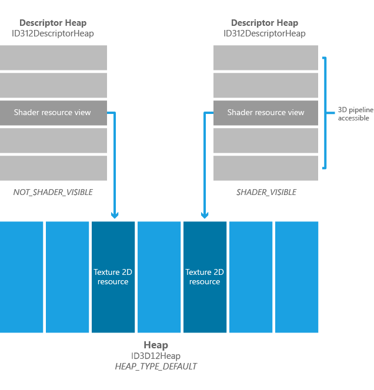

# Shader Visible Descriptor Heaps

Shader visible descriptor heaps, are descriptor heaps that can be referenced by shaders through descriptor tables.

-   [Overview](#overview)
-   [An example](#an-example)
-   [Related topics](#related-topics)

## Overview

Descriptor heaps that can be referenced by shaders through descriptor tables come in a couple of flavors: One heap type, D3D12\_SRV\_UAV\_CBV\_DESCRIPTOR\_HEAP, can hold Shader Resource Views, Unordered Access Views, and Constant Buffer Views, all intermixed. Any given location in the heap can be any one of the listed types of descriptors. Another heap type, D3D12\_DESCRIPTOR\_HEAP\_TYPE\_SAMPLER, only stores samplers, reflecting the fact that for the majority of hardware, samplers are managed separately from SRVs, UAVs, CBVs.

Descriptor heaps of these types may be requested to be shader visible or not when the heap is created (the latter – non shader visible - can be useful for staging descriptors on the CPU). When requested to be shader visible, each of the above heap types may have a hardware size limit for any individual descriptor heap allocation.

Applications can create any number of descriptor heaps , and non shader visible descriptor heaps are not constrained in size. If a shader visible descriptor heap that is created by the application is smaller than the hardware size limit, the driver may choose to sub-allocate the descriptor heap out of a larger underlying descriptor heap so that multiple API descriptor heaps fit within one hardware descriptor heap. The reason this may happen is that for some hardware, switching between hardware descriptor heaps during execution requires a GPU wait for idle (to ensure that GPU references to the previously descriptor heap are finished). If all of the descriptor heaps that an application creates fit into the applicable hardware heap's maximum capacities, then no such waits will occur when switching API descriptor heaps during rendering. Applications must allow for the possibility, however, that switching the current descriptor heap may incur a wait for idle.

To avoid being impacted by this possible wait for idle on the descriptor heap switch, applications can take advantage of breaks in rendering that would cause the GPU to idle for other reasons as the time to do descriptor heap switches, since a wait for idle is happening anyway.

The mechanism and semantics for identifying descriptor heaps to shaders during command list / bundle recording are described in the API reference.

## An example

The image below shows two descriptor heaps referencing two separate 2D textures being stored in two slots of a large default heap. The descriptor heap that is shader visible can be accessed by the graphics pipeline (including the shaders), and hence the 2D texture is available to the pipeline.

> [!Note]  
> There is often a limit on GPU hardware of the amount of GPU local memory writeable by the CPU (referred to as write-combined memory) for descriptor heaps. Typically this limit is around 96MB for all processes. A one million member descriptor heap, with 32byte descriptors, would use up 32MB, for example. The driver will fall back on system memory if needed, though it is good practice not to create large numbers of large descriptor heaps.

 

## Related topics

<dl> <dt>

[Descriptor Heaps](descriptor-heaps.md)
</dt> </dl>

 

 

