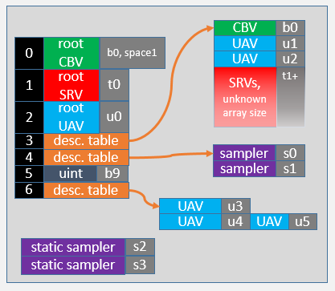

# Specifying Root Signatures in HLSL

Specifying root signatures in HLSL Shader Model 5.1 is an alternative to specifying them in C++ code.

-   [An example HLSL Root Signature](#an-example-hlsl-root-signature)
    -   [Root Signature Version 1.0](#root-signature-version-10)
    -   [Root Signature Version 1.1](#root-signature-version-11)
-   [RootFlags](#rootflags)
-   [Root Constants](#root-constants)
-   [Visibility](#visibility)
-   [Root-level CBV](#root-level-cbv)
-   [Root-level SRV](#root-level-srv)
-   [Root-level UAV](#root-level-uav)
-   [Descriptor Table](#descriptor-table)
-   [Static Sampler](#static-sampler)
-   [Compiling an HLSL root signature](#compiling-an-hlsl-root-signature)
-   [Manipulating root signatures with the FXC compiler](#manipulating-root-signatures-with-the-fxc-compiler)
-   [Notes](#notes)
-   [Related topics](#related-topics)

## An example HLSL Root Signature

A root signature can be specified in HLSL as a string. The string contains a collection of comma-separated clauses that describe root signature constituent components. The root signature should be identical across shaders for any one pipeline state object (PSO). Here is an example:

### Root Signature Version 1.0

``` syntax
#define MyRS1 "RootFlags( ALLOW_INPUT_ASSEMBLER_INPUT_LAYOUT | " \
                         "DENY_VERTEX_SHADER_ROOT_ACCESS), " \
              "CBV(b0, space = 1), " \
              "SRV(t0), " \
              "UAV(u0, visibility = SHADER_VISIBILITY_GEOMETRY), " \
              "DescriptorTable( CBV(b0), " \
                               "UAV(u1, numDescriptors = 2), " \
                               "SRV(t1, numDescriptors = unbounded)), " \
              "DescriptorTable(Sampler(s0, numDescriptors = 2)), " \
              "RootConstants(num32BitConstants=1, b9), " \
              "DescriptorTable( UAV(u3), " \
                               "UAV(u4), " \
                               "UAV(u5, offset=1)), " \

              "StaticSampler(s2)," \
              "StaticSampler(s3, " \
                             "addressU = TEXTURE_ADDRESS_CLAMP, " \
                             "filter = FILTER_MIN_MAG_MIP_LINEAR )"
```

This definition would give the following root signature, noting:

-   The use of default parameters.
-   b0 and (b0, space=1) do not conflict
-   u0 is only visible to the geometry shader
-   u4 and u5 are aliased to the same descriptor in a heap



### Root Signature Version 1.1

[Root Signature Version 1.1](root-signature-version-1-1.md) enables driver optimizations on root signature descriptors and data.

``` syntax
#define MyRS1 "RootFlags( ALLOW_INPUT_ASSEMBLER_INPUT_LAYOUT | " \
                         "DENY_VERTEX_SHADER_ROOT_ACCESS), " \
              "CBV(b0, space = 1, flags = DATA_STATIC), " \
              "SRV(t0), " \
              "UAV(u0), " \
              "DescriptorTable( CBV(b1), " \
                               "SRV(t1, numDescriptors = 8, " \
                               "        flags = DESCRIPTORS_VOLATILE), " \
                               "UAV(u1, numDescriptors = unbounded, " \
                               "        flags = DESCRIPTORS_VOLATILE)), " \
              "DescriptorTable(Sampler(s0, space=1, numDescriptors = 4)), " \
              "RootConstants(num32BitConstants=3, b10), " \
              "StaticSampler(s1)," \
              "StaticSampler(s2, " \
                             "addressU = TEXTURE_ADDRESS_CLAMP, " \
                             "filter = FILTER_MIN_MAG_MIP_LINEAR )"
```

The HLSL root signature language closely corresponds to the C++ root signature APIs and has equivalent expressive power. The root signature is specified as a sequence of clauses, separated by comma. The order of clauses is important, as the order of parsing determines the slot position in the root signature. Each clause takes one or more named parameters. The order of parameters is not important, however.

## RootFlags

The optional *RootFlags* clause takes either 0 (the default value to indicate no flags), or one or several of predefined root flags values, connected via the OR ‘\|’ operator. The allowed root flag values are defined by [**D3D12\_ROOT\_SIGNATURE\_FLAGS**](/windows/desktop/api/d3d12/ne-d3d12-d3d12_root_signature_flags).

For example:

``` syntax
RootFlags(0) // default value – no flags
RootFlags(ALLOW_INPUT_ASSEMBLER_INPUT_LAYOUT)
RootFlags(ALLOW_INPUT_ASSEMBLER_INPUT_LAYOUT | DENY_VERTEX_SHADER_ROOT_ACCESS)
```

## Root Constants

The *RootConstants* clause specifies root constants in the root signature. Two mandatory parameters are: *num32BitConstants* and *bReg* (the register corresponding to *BaseShaderRegister* in C++ APIs) of the *cbuffer*. The space (*RegisterSpace* in C++ APIs) and visibility (*ShaderVisibility* in C++) parameters are optional, and the default values are:

``` syntax
RootConstants(num32BitConstants=N, bReg [, space=0, 
              visibility=SHADER_VISIBILITY_ALL ])
```

For example:

``` syntax
RootConstants(num32BitConstants=3, b3)
```

## Visibility

Visibility is an optional parameter that can have one of the values from [**D3D12\_SHADER\_VISIBILITY**](/windows/desktop/api/d3d12/ne-d3d12-d3d12_shader_visibility).

SHADER\_VISIBILITY\_ALL broadcasts the root arguments to all shaders. On some hardware this has no cost, but on other hardware there is a cost to fork the data to all the shader stages. Setting one of the options, such as SHADER\_VISIBILITY\_VERTEX, limits the root argument to a single shader stage.

Setting root arguments to single shader stages allows the same bind name to be used at different stages. For example, an SRV binding of `t0,SHADER_VISIBILITY_VERTEX` and SRV binding of `t0,SHADER_VISIBILITY_PIXEL` would be valid. But if the visibility setting was `t0,SHADER_VISIBILITY_ALL` for one of the bindings, the root signature would be invalid.

## Root-level CBV

The `CBV` (constant buffer view) clause specifies a root-level constant buffer b-register Reg entry. Note that this is a scalar entry; it is not possible to specify a range for the root level.

``` syntax
CBV(bReg [, space=0, visibility=SHADER_VISIBILITY_ALL ])    //   Version 1.0
CBV(bReg [, space=0, visibility=SHADER_VISIBILITY_ALL,      // Version 1.1
            flags=DATA_STATIC_WHILE_SET_AT_EXECUTE ])
```

## Root-level SRV

The `SRV` (shader resource view) clause specifies a root-level SRV t-register Reg entry. Note that this is a scalar entry; it is not possible to specify a range for the root level.

``` syntax
SRV(tReg [, space=0, visibility=SHADER_VISIBILITY_ALL ])    //   Version 1.0
SRV(tReg [, space=0, visibility=SHADER_VISIBILITY_ALL,      // Version 1.1
            flags=DATA_STATIC_WHILE_SET_AT_EXECUTE ])
```

## Root-level UAV

The `UAV` (unordered access view) clause specifies a root-level UAV u-register Reg entry. Note that this is a scalar entry; it is not possible to specify a range for the root level.

``` syntax
UAV(uReg [, space=0, visibility=SHADER_VISIBILITY_ALL ])    //   Version 1.0
UAV(uReg [, space=0, visibility=SHADER_VISIBILITY_ALL,      // Version 1.1
            flags=DATA_VOLATILE ])
```

For example:

``` syntax
UAV(u3)
```

## Descriptor Table

The `DescriptorTable` clause is itself a list of comma-separated descriptor table clauses, as well as an optional visibility parameter. The *DescriptorTable* clauses include CBV, SRV, UAV, and Sampler. Note that their parameters differ from those of the root-level clauses.

``` syntax
DescriptorTable( DTClause1, [ DTClause2, … DTClauseN,
                 visibility=SHADER_VISIBILITY_ALL ] )
```

The Descriptor Table `CBV` has the following syntax:

``` syntax
CBV(bReg [, numDescriptors=1, space=0, offset=DESCRIPTOR_RANGE_OFFSET_APPEND ])   // Version 1.0
CBV(bReg [, numDescriptors=1, space=0, offset=DESCRIPTOR_RANGE_OFFSET_APPEND      // Version 1.1
          , flags=DATA_STATIC_WHILE_SET_AT_EXECUTE ])
```

For example:

``` syntax
DescriptorTable(CBV(b0),SRV(t3, numDescriptors=unbounded))
```

The mandatory parameter *bReg* specifies the start Reg of the cbuffer range. The *numDescriptors* parameter specifies the number of descriptors in the contiguous cbuffer range; the default value being 1. The entry declares a cbuffer range` [Reg, Reg + numDescriptors - 1]`, when *numDescriptors* is a number. If *numDescriptors* is equal to "unbounded", the range is `[Reg, UINT_MAX]`, which means the app must ensure it is not referencing an out-of-bounds area. The *offset* field represents the *OffsetInDescriptorsFromTableStart* parameter in the C++ APIs, that is, the offset (in descriptors) from the start of the table. If the offset is set to DESCRIPTOR\_RANGE\_OFFSET\_APPEND (the default), it means the range is directly after the previous range. However, entering specific offsets does allow for ranges to overlap each other, allowing register aliasing.

The Descriptor Table `SRV` has the following syntax:

``` syntax
SRV(tReg [, numDescriptors=1, space=0, offset=DESCRIPTOR_RANGE_OFFSET_APPEND ])    // Version 1.0
SRV(tReg [, numDescriptors=1, space=0, offset=DESCRIPTOR_RANGE_OFFSET_APPEND,      // Version 1.1
            flags=DATA_STATIC_WHILE_SET_AT_EXECUTE ])
```

This is similar to the descriptor table `CBV` entry, except the specified range is for shader resource views.

The Descriptor Table `UAV` has the following syntax:

``` syntax
UAV(uReg [, numDescriptors=1, space=0, offset=DESCRIPTOR_RANGE_OFFSET_APPEND ])    // Version 1.0
UAV(uReg [, numDescriptors=1, space=0, offset=DESCRIPTOR_RANGE_OFFSET_APPEND,      // Version 1.1
            flags=DATA_VOLATILE ])
```

This is similar to the descriptor table `CBV` entry, except the specified range is for unordered access views.

The Descriptor Table `Sampler` has the following syntax:

``` syntax
Sampler(sReg [, numDescriptors=1, space=0, offset=DESCRIPTOR_RANGE_OFFSET_APPEND ])  // Version 1.0
Sampler(sReg [, numDescriptors=1, space=0, offset=DESCRIPTOR_RANGE_OFFSET_APPEND,    // Version 1.1
                flags=0 ])
```

This is similar to the descriptor table `CBV` entry, except the specified range is for shader samplers. Note that Samplers can’t be mixed with other types of descriptors in the same descriptor table (since they are in a separate descriptor heap).

## Static Sampler

The static sampler represents the [**D3D12\_STATIC\_SAMPLER\_DESC**](/windows/desktop/api/d3d12/ns-d3d12-d3d12_static_sampler_desc) structure. The mandatory parameter for *StaticSampler* is a scalar, sampler s-register Reg. Other parameters are optional with default values shown below. Most fields accept a set of predefined enums.

``` syntax
StaticSampler( sReg,
              [ filter = FILTER_ANISOTROPIC, 
                addressU = TEXTURE_ADDRESS_WRAP,
                addressV = TEXTURE_ADDRESS_WRAP,
                addressW = TEXTURE_ADDRESS_WRAP,
                mipLODBias = 0.f,
                maxAnisotropy = 16,
                comparisonFunc = COMPARISON_LESS_EQUAL,
                borderColor = STATIC_BORDER_COLOR_OPAQUE_WHITE,
                minLOD = 0.f,         
                maxLOD = 3.402823466e+38f,
                space = 0, 
                visibility = SHADER_VISIBILITY_ALL ])
```

For example:

``` syntax
StaticSampler(s4, filter=FILTER_MIN_MAG_MIP_LINEAR)
```

The parameter options are very similar to the C++ API calls, except for *borderColor*, which is restricted to an enum in HLSL.

The filter field can be one of [**D3D12\_FILTER**](/windows/desktop/api/d3d12/ne-d3d12-d3d12_filter).

The address fields can each be one of [**D3D12\_TEXTURE\_ADDRESS\_MODE**](/windows/desktop/api/d3d12/ne-d3d12-d3d12_texture_address_mode).

The comparison function can be one of [**D3D12\_COMPARISON\_FUNC**](/windows/desktop/api/d3d12/ne-d3d12-d3d12_comparison_func).

The border color field can be one of [**D3D12\_STATIC\_BORDER\_COLOR**](/windows/desktop/api/d3d12/ne-d3d12-d3d12_static_border_color).

Visibility can be one of [**D3D12\_SHADER\_VISIBILITY**](/windows/desktop/api/d3d12/ne-d3d12-d3d12_shader_visibility).

## Compiling an HLSL root signature

There are two mechanisms to compile an HLSL root signature. First, it is possible to attach a root signature string to a particular shader via the *RootSignature* attribute (in the following example, using the **MyRS1** entry point):

``` syntax
[RootSignature(MyRS1)]
float4 main(float4 coord : COORD) : SV_Target
{
…
}
```

The compiler will create and verify the root signature blob for the shader and embed it alongside the shader byte code into the shader blob. The compiler supports root signature syntax for shader model 5.0 and higher. If a root signature is embedded in a shader model 5.0 shader and that shader is sent to the D3D11 runtime, as opposed to D3D12, the root signature portion will get silently ignored by D3D11.

The other mechanism is to create a standalone root signature blob, perhaps to reuse it with a large set of shaders, saving space. The [Effect-Compiler Tool](/windows/desktop/direct3dtools/fxc) (FXC) supports both **rootsig\_1\_0** and**rootsig\_1\_1** shader models. The name of the define string is specified via the usual /E argument. For example:

``` syntax
fxc.exe /T rootsig_1_1 MyRS1.hlsl /E MyRS1 /Fo MyRS1.fxo
```

Note that the root signature string define can also be passed on the command line, e.g, /D MyRS1=”…”.

## Manipulating root signatures with the FXC compiler

The FXC compiler creates shader byte-code from HLSL source files. There are a lot of optional parameters for this compiler, refer to the [Effect-Compiler Tool](/windows/desktop/direct3dtools/fxc).

For managing HLSL authored root signatures, the following table gives some examples of using FXC.


| Line | Command line                                                                 | Description                                                                                                                                                                                                                              |
|------|------------------------------------------------------------------------------|------------------------------------------------------------------------------------------------------------------------------------------------------------------------------------------------------------------------------------------|
| 1    | `fxc /T ps_5_1 shaderWithRootSig.hlsl /Fo rs1.fxo`                           | Compiles a shader for the pixel shader 5.1 target, the shader source is in the shaderWithRootSig.hlsl file, which includes a root signature. The shader and root signature are compiled as separate blobs in the rs1.fxo binary file.    |
| 2    | `fxc /dumpbin rs1.fxo /extractrootsignature /Fo rs1.rs.fxo`                  | Extracts the root signature from the file created by line 1, so the rs1.rs.fxo file contains just a root signature.                                                                                                                      |
| 3    | `fxc /dumpbin rs1.fxo /Qstrip_rootsignature /Fo rs1.stripped.fxo`            | Removes the root signature from the file created by line 1, so the rs1.stripped.fxo file contains a shader with no root signature.                                                                                                       |
| 4    | `fxc /dumpbin rs1.stripped.fxo /setrootsignature rs1.rs.fxo /Fo rs1.new.fxo` | Combines a shader and root signature that are in separate files into a binary file containing both blobs. In this example rs1.new.fx0 would be identical to rs1.fx0 in line 1.                                                           |
| 5    | `fxc /T rootsig_1_0 rootSigAndMaybeShaderInHereToo.hlsl /E RS1 /Fo rs2.fxo`  | Creates a stand-alone root signature binary file from a source that may contain more than just a root signature. Note the rootsig\_1\_0 target, and that RS1 is the name of the root signature (\#define) macro string in the HLSL file. |


 

The functionality available through FXC is also available programmatically using the [**D3DCompile**](/windows/desktop/direct3dhlsl/d3dcompile) function. This call compiles a shader with a root signature, or stand-alone root signature (setting the rootsig\_1\_0 target). [**D3DGetBlobPart**](/windows/desktop/direct3dhlsl/d3dgetblobpart) and [**D3DSetBlobPart**](/windows/desktop/direct3dhlsl/d3dsetblobpart) can extract and attach root signatures to an existing blob.  D3D\_BLOB\_ROOT\_SIGNATURE is used to specify the root signature blob part type. [**D3DStripShader**](/windows/desktop/direct3dhlsl/d3dstripshader) removes the root signature (using the D3DCOMPILER\_STRIP\_ROOT\_SIGNATURE flag) from the blob.

## Notes

> [!Note]  
> Whereas the offline compilation of shaders is strongly recommended, if shaders have to be compiled at runtime, refer to the remarks for [**D3DCompile2**](/windows/desktop/direct3dhlsl/d3dcompile2).

 

> [!Note]  
> Existing HLSL assets do not need to be changed to handle root signatures to be used with them.

 

## Related topics

<dl> <dt>

[Dynamic Indexing using HLSL 5.1](dynamic-indexing-using-hlsl-5-1.md)
</dt> <dt>

[HLSL Shader Model 5.1 Features for Direct3D 12](/windows/desktop/direct3dhlsl/hlsl-shader-model-5-1-features-for-direct3d-12)
</dt> <dt>

[Resource Binding](resource-binding.md)
</dt> <dt>

[Resource Binding in HLSL](resource-binding-in-hlsl.md)
</dt> <dt>

[Root Signatures](root-signatures.md)
</dt> <dt>

[Shader Model 5.1](/windows/desktop/direct3dhlsl/shader-model-5-1)
</dt> <dt>

[Shader Specified Stencil Reference Value](shader-specified-stencil-reference-value.md)
</dt> <dt>

[Typed Unordered Access View Loads](typed-unordered-access-view-loads.md)
</dt> </dl>

 

 
