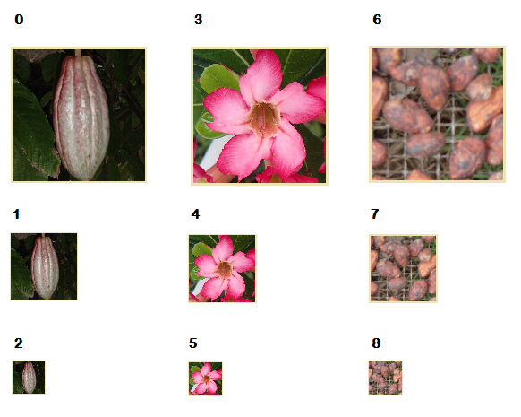
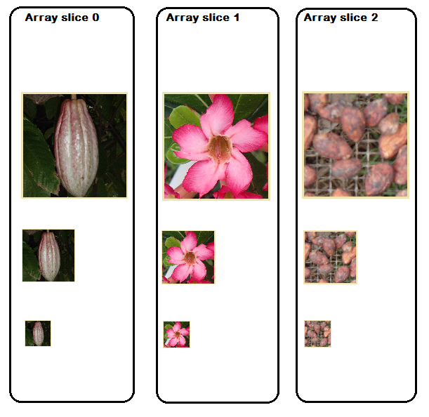
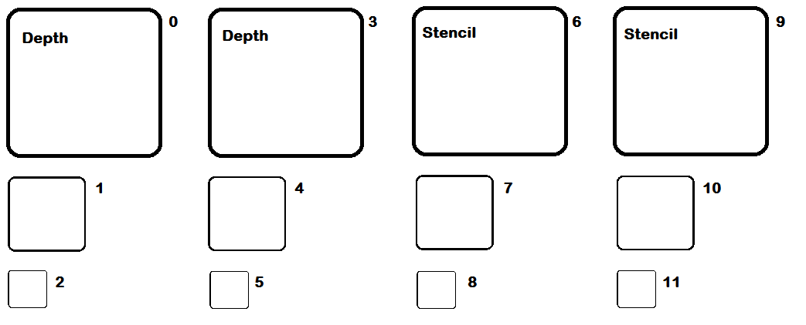
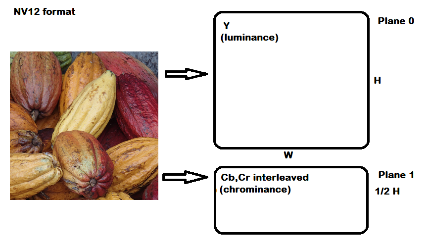
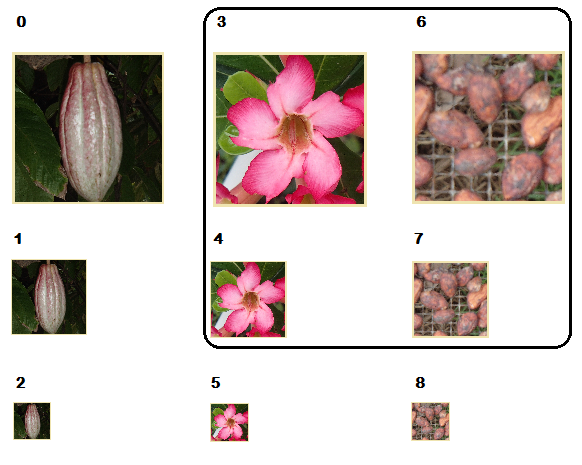

# Subresources (Direct3D 12 Graphics)

Describes how a resource is divided into subresources, and how to reference a single, multiple or slice of subresources.

-   [Example subresources](#example-subresources)
    -   [Subresource indexing](#subresource-indexing)
    -   [Mip slice](#mip-slice)
    -   [Array slice](#array-slice)
    -   [Plane slice](#plane-slice)
    -   [Multiple subresources](#multiple-subresources)
-   [Subresource APIs](#subresource-apis)
-   [Related topics](#related-topics)

## Example subresources

If a resource contains a buffer, then it simply contains one subresource with an index of 0. If the resource contains a texture (or texture array), then referencing the subresources is more complex.

Some APIs access an entire resource (such as the [**ID3D12GraphicsCommandList::CopyResource**](/windows/desktop/api/d3d12/nf-d3d12-id3d12graphicscommandlist-copyresource) method), others access a portion of a resource (for example the [**ID3D12Resource::ReadFromSubresource**](/windows/desktop/api/d3d12/nf-d3d12-id3d12resource-readfromsubresource) method). The methods that access a portion of a resource generally use a view description (such as the [**D3D12\_TEX2D\_ARRAY\_SRV**](/windows/desktop/api/d3d12/ns-d3d12-d3d12_tex2d_array_srv) structure) to specify the subresources to access. Refer to the [Subresource APIs](#subresource-apis) section for a complete list.

### Subresource indexing

To index a particular subresource, the mip levels are indexed first as each array entry is indexed.



### Mip slice

A mip slice includes one mipmap level for every texture in an array, as shown in the following image.


### Array slice

Given an array of textures, each texture with mipmaps, an array slice includes one texture and all of its mip levels, as shown in the following image.



### Plane slice

Typically planar formats are not used to store RGBA data, but in the cases where it is (perhaps 24bpp RGB data), one plane could represent the red image, one the green, and one the blue image. One plane though is not necessarily one color, two or more colors could be combined into one plane. More typically planar data is used for sub-sampled YCbCr and Depth-Stencil data. Depth-Stencil is the only format that fully supports mipmaps, arrays, and multiple planes (often plane 0 for Depth and plane 1 for Stencil).

The subresource indexing for an array of two Depth-Stencil images, each with three mip levels, is shown below.



Sub-sampled YCbCr supports arrays and has planes, but does not support mipmaps. YCbCr images have two planes, one for the luminance (Y) that the human eye is most sensitive to, and one for the chrominance (both Cb, and Cr, interleaved) which the human eye is less sensitive to. This format enables compression of the chrominance values in order to compress an image without affecting the luminance, and is a common video compression format for that reason, although it is used to compress still images. The image below shows the NV12 format, noting the chrominance has been compressed to one quarter of the resolution of the luminance, meaning the width of each plane is identical, and the chrominance plane is half the height of the luminance plane. The planes would be indexed as subresources in an identical way to the Depth-Stencil example above.



Planar formats existed in Direct3D 11, but individual planes could not be addressed individually, say for copy or mapping operations. This was changed in Direct3D 12 so that each plane received its own subresource ID. Compare the following two methods for calculating the subresource ID.

Direct3D 11

``` syntax
inline UINT D3D11CalcSubresource( UINT MipSlice, UINT ArraySlice, UINT MipLevels )
{
    return MipSlice + (ArraySlice * MipLevels); 
}
```

Direct3D 12

``` syntax
inline UINT D3D12CalcSubresource( UINT MipSlice, UINT ArraySlice, UINT PlaneSlice, UINT MipLevels, UINT ArraySize )
{ 
    return MipSlice + (ArraySlice * MipLevels) + (PlaneSlice * MipLevels * ArraySize); 
}
```

Most hardware assumes that the memory for plane N is always immediately allocated after plane N-1.

An alternative to using subresources is that an app could allocate a completely separate resource per plane. In this case, the application understands the data is planar and uses multiple resources to represent it.

### Multiple subresources

A shader-resource view can select any rectangular region of subresources, using one of the slices described above and judicious use of fields in the view structures (such as [**D3D12\_TEX2D\_ARRAY\_SRV**](/windows/desktop/api/d3d12/ns-d3d12-d3d12_tex2d_array_srv)), as shown in the image.



A render-target view can only use a single subresource or mip slice and cannot include subresources from more than one mip slice. That is, every texture in a render-target view must be the same size. A shader-resource view can select any rectangular region of subresources, as shown in the image.

## Subresource APIs

The following APIs reference and work with subresources:

Enumerations:

-   [**D3D12\_TEXTURE\_COPY\_TYPE**](/windows/desktop/api/d3d12/ne-d3d12-d3d12_texture_copy_type)

The following structures contain *PlaneSlice* indexes, most contain *MipSlice* indexes.

-   [**D3D12\_TEX2D\_RTV**](/windows/desktop/api/d3d12/ns-d3d12-d3d12_tex2d_rtv)
-   [**D3D12\_TEX2D\_ARRAY\_RTV**](/windows/desktop/api/d3d12/ns-d3d12-d3d12_tex2d_array_rtv)
-   [**D3D12\_TEX2D\_SRV**](/windows/desktop/api/d3d12/ns-d3d12-d3d12_tex2d_srv)
-   [**D3D12\_TEX2D\_ARRAY\_SRV**](/windows/desktop/api/d3d12/ns-d3d12-d3d12_tex2d_array_srv)
-   [**D3D12\_TEX2D\_UAV**](/windows/desktop/api/d3d12/ns-d3d12-d3d12_tex2d_uav)
-   [**D3D12\_TEX2D\_ARRAY\_UAV**](/windows/desktop/api/d3d12/ns-d3d12-d3d12_tex2d_array_uav)

The following structures contain *ArraySlice* indexes, most contain *MipSlice* indexes.

-   [**D3D12\_TEX1D\_ARRAY\_DSV**](/windows/desktop/api/d3d12/ns-d3d12-d3d12_tex1d_array_dsv)
-   [**D3D12\_TEX2D\_ARRAY\_DSV**](/windows/desktop/api/d3d12/ns-d3d12-d3d12_tex2d_array_dsv)
-   [**D3D12\_TEX2DMS\_ARRAY\_DSV**](/windows/desktop/api/d3d12/ns-d3d12-d3d12_tex2dms_array_dsv)
-   [**D3D12\_TEX1D\_ARRAY\_RTV**](/windows/desktop/api/d3d12/ns-d3d12-d3d12_tex1d_array_rtv)
-   [**D3D12\_TEX2D\_ARRAY\_RTV**](/windows/desktop/api/d3d12/ns-d3d12-d3d12_tex2d_array_rtv)
-   [**D3D12\_TEX2DMS\_ARRAY\_RTV**](/windows/desktop/api/d3d12/ns-d3d12-d3d12_tex2dms_array_rtv)
-   [**D3D12\_TEX1D\_ARRAY\_SRV**](/windows/desktop/api/d3d12/ns-d3d12-d3d12_tex1d_array_srv)
-   [**D3D12\_TEX2D\_ARRAY\_SRV**](/windows/desktop/api/d3d12/ns-d3d12-d3d12_tex2d_array_srv)
-   [**D3D12\_TEX2DMS\_ARRAY\_SRV**](/windows/desktop/api/d3d12/ns-d3d12-d3d12_tex2dms_array_srv)
-   [**D3D12\_TEX1D\_ARRAY\_UAV**](/windows/desktop/api/d3d12/ns-d3d12-d3d12_tex1d_array_uav)
-   [**D3D12\_TEX2D\_ARRAY\_UAV**](/windows/desktop/api/d3d12/ns-d3d12-d3d12_tex2d_array_uav)

The following structures contain *MipSlice* indexes, but neither *ArraySlice* nor *PlaneSlice* indexes.

-   [**D3D12\_TEX1D\_DSV**](/windows/desktop/api/d3d12/ns-d3d12-d3d12_tex1d_dsv)
-   [**D3D12\_TEX2D\_DSV**](/windows/desktop/api/d3d12/ns-d3d12-d3d12_tex2d_dsv)
-   [**D3D12\_TEX1D\_RTV**](/windows/desktop/api/d3d12/ns-d3d12-d3d12_tex1d_rtv)
-   [**D3D12\_TEX3D\_RTV**](/windows/desktop/api/d3d12/ns-d3d12-d3d12_tex3d_rtv)
-   [**D3D12\_TEX1D\_UAV**](/windows/desktop/api/d3d12/ns-d3d12-d3d12_tex1d_uav)
-   [**D3D12\_TEX3D\_UAV**](/windows/desktop/api/d3d12/ns-d3d12-d3d12_tex3d_uav)

The following structures also reference subresources:

-   [**D3D12\_DISCARD\_REGION**](/windows/desktop/api/d3d12/ns-d3d12-d3d12_discard_region) : a structure used in preparation for discarding a resource.
-   [**D3D12\_PLACED\_SUBRESOURCE\_FOOTPRINT**](/windows/desktop/api/d3d12/ns-d3d12-d3d12_placed_subresource_footprint) : adds an offset into a resource to the basic footprint.
-   [**D3D12\_RESOURCE\_TRANSITION\_BARRIER**](/windows/desktop/api/d3d12/ns-d3d12-d3d12_resource_transition_barrier) : describes the transition of subresources between different usages (shader resource, render target, etc.).
-   [**D3D12\_SUBRESOURCE\_DATA**](/windows/desktop/api/d3d12/ns-d3d12-d3d12_subresource_data) : subresource data includes the data itself, and the row and slice pitch.
-   [**D3D12\_SUBRESOURCE\_FOOTPRINT**](/windows/desktop/api/d3d12/ns-d3d12-d3d12_subresource_footprint) : a footprint includes the format, width, height, depth and row-pitch of the subresource.
-   [**D3D12\_SUBRESOURCE\_INFO**](/windows/desktop/api/d3d12/ns-d3d12-d3d12_subresource_info) : contains the offset, row pitch and depth pitch of the subresource.
-   [**D3D12\_SUBRESOURCE\_TILING**](/windows/desktop/api/d3d12/ns-d3d12-d3d12_subresource_tiling) : describes a tiled subresource volume (refer to [Volume Tiled Resources](volume-tiled-resources.md)).
-   [**D3D12\_TEXTURE\_COPY\_LOCATION**](/windows/desktop/api/d3d12/ns-d3d12-d3d12_texture_copy_location) : describes a portion of a texture for the purpose of copying.
-   [**D3D12\_TILED\_RESOURCE\_COORDINATE**](/windows/desktop/api/d3d12/ns-d3d12-d3d12_tiled_resource_coordinate) : describes the coordinates of a tiled resource.

Methods:

-   [**ID3D12Device::GetCopyableFootprints**](/windows/desktop/api/d3d12/nf-d3d12-id3d12device-getcopyablefootprints) : gets information on a resource, to enable a copy to be made.
-   [**ID3D12Device::GetResourceTiling**](/windows/desktop/api/d3d12/nf-d3d12-id3d12device-getresourcetiling) : gets info about how a tiled resource is broken into tiles.
-   [**ID3D12GraphicsCommandList::ResolveSubresource**](/windows/desktop/api/d3d12/nf-d3d12-id3d12graphicscommandlist-resolvesubresource) : copies a multi-sampled subresource into a non-multi-sampled subresource.
-   [**ID3D12Resource::Map**](/windows/desktop/api/d3d12/nf-d3d12-id3d12resource-map) : returns a pointer to the specified data in the resource, and denies the GPU access to the subresource.
-   [**ID3D12Resource::ReadFromSubresource**](/windows/desktop/api/d3d12/nf-d3d12-id3d12resource-readfromsubresource) : copies data from a subresource, or a rectangular region of a subresource.
-   [**ID3D12Resource::Unmap**](/windows/desktop/api/d3d12/nf-d3d12-id3d12resource-unmap) : unmaps the specified range of memory and invalidates the pointer to the resource. Reinstates GPU access to the subresource.
-   [**ID3D12Resource::WriteToSubresource**](/windows/desktop/api/d3d12/nf-d3d12-id3d12resource-writetosubresource) : copies data to a subresource, or a rectangular region of a subresource.

Textures must be in the [**D3D12\_RESOURCE\_STATE\_COMMON**](/windows/desktop/api/d3d12/ne-d3d12-d3d12_resource_states) state for CPU access through [**WriteToSubresource**](/windows/desktop/api/d3d12/nf-d3d12-id3d12resource-writetosubresource) and [**ReadFromSubresource**](/windows/desktop/api/d3d12/nf-d3d12-id3d12resource-readfromsubresource) to be legal; but buffers do not. CPU access to a resource is typically done through [**Map**](/windows/desktop/api/d3d12/nf-d3d12-id3d12resource-map)/[**Unmap**](/windows/desktop/api/d3d12/nf-d3d12-id3d12resource-unmap).

## Related topics

<dl> <dt>

[Resource Binding](resource-binding.md)
</dt> </dl>

 

 


