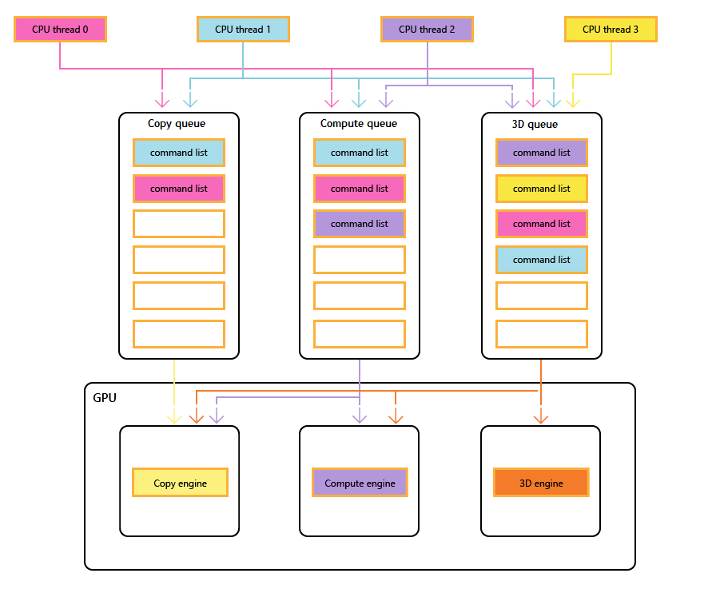
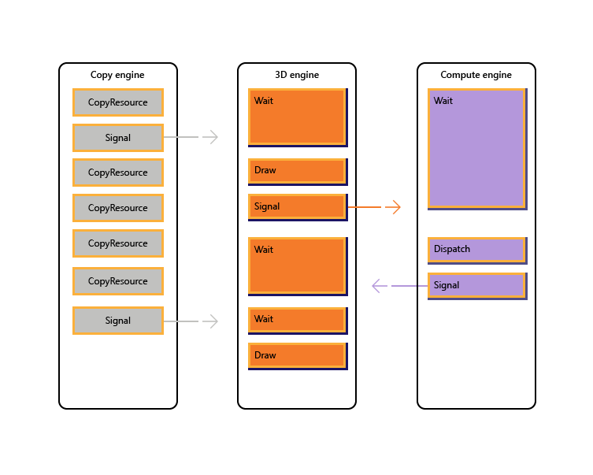

# Multi-engine synchronization

Most modern GPUs contain multiple independent engines that provide specialized functionality. Many have one or more dedicated copy engines, and a compute engine, usually distinct from the 3D engine. Each of these engines can execute commands in parallel with each other. Direct3D 12 provides fine-grained access to the 3D, compute, and copy engines, using queues and command lists.

## GPU engines

The following diagram shows a title's CPU threads, each populating one or more of the copy, compute, and 3D queues. The 3D queue can drive all three GPU engines; the compute queue can drive the compute and copy engines; and the copy queue simply the copy engine.

As the different threads populate the queues, there can be no simple guarantee of the order of execution, hence the need for synchronization mechanisms&mdash;when the title requires them.



The following image illustrate how a title might schedule work across multiple GPU engines, including inter-engine synchronization where necessary: it shows the per-engine workloads with inter-engine dependencies. In this example, the copy engine first copies some geometry necessary for rendering. The 3D engine waits for these copies to complete, and renders a pre-pass over the geometry. This is then consumed by the compute engine. The results of the compute engine [**Dispatch**](/windows/win32/api/d3d12/nf-d3d12-id3d12graphicscommandlist-dispatch), along with several texture copy operations on the copy engine, are consumed by the 3D engine for the final [**Draw**](/windows/win32/api/d3d12/nf-d3d12-id3d12graphicscommandlist-drawinstanced) call.



The following pseudo-code illustrates how a title might submit such a workload.

``` syntax
// Get per-engine contexts. Note that multiple queues may be exposed
// per engine, however that design is not reflected here.
copyEngine = device->GetCopyEngineContext();
renderEngine = device->GetRenderEngineContext();
computeEngine = device->GetComputeEngineContext();
copyEngine->CopyResource(geometry, ...); // copy geometry
copyEngine->Signal(copyFence, 101);
copyEngine->CopyResource(tex1, ...); // copy textures
copyEngine->CopyResource(tex2, ...); // copy more textures
copyEngine->CopyResource(tex3, ...); // copy more textures
copyEngine->CopyResource(tex4, ...); // copy more textures
copyEngine->Signal(copyFence, 102);
renderEngine->Wait(copyFence, 101); // geometry copied
renderEngine->Draw(); // pre-pass using geometry only into rt1
renderEngine->Signal(renderFence, 201);
computeEngine->Wait(renderFence, 201); // prepass completed
computeEngine->Dispatch(); // lighting calculations on pre-pass (using rt1 as SRV)
computeEngine->Signal(computeFence, 301);
renderEngine->Wait(computeFence, 301); // lighting calculated into buf1
renderEngine->Wait(copyFence, 102); // textures copied
renderEngine->Draw(); // final render using buf1 as SRV, and tex[1-4] SRVs
```

The following pseudo-code illustrates synchronization between the copy and 3D engines to accomplish heap-like memory allocation via a ring buffer. Titles have the flexibility to choose the right balance between maximizing parallelism (via a large buffer) and reducing memory consumption and latency (via a small buffer).

``` syntax
device->CreateBuffer(&ringCB);
for(int i=1;i++){
  if(i > length) copyEngine->Wait(fence1, i - length);
  copyEngine->Map(ringCB, value%length, WRITE, pData); // copy new data
  copyEngine->Signal(fence2, i);
  renderEngine->Wait(fence2, i);
  renderEngine->Draw(); // draw using copied data
  renderEngine->Signal(fence1, i);
}

// example for length = 3:
// copyEngine->Map();
// copyEngine->Signal(fence2, 1); // fence2 = 1  
// copyEngine->Map();
// copyEngine->Signal(fence2, 2); // fence2 = 2
// copyEngine->Map();
// copyEngine->Signal(fence2, 3); // fence2 = 3
// copy engine has exhausted the ring buffer, so must wait for render to consume it
// copyEngine->Wait(fence1, 1); // fence1 == 0, wait
// renderEngine->Wait(fence2, 1); // fence2 == 3, pass
// renderEngine->Draw();
// renderEngine->Signal(fence1, 1); // fence1 = 1, copy engine now unblocked
// renderEngine->Wait(fence2, 2); // fence2 == 3, pass
// renderEngine->Draw();
// renderEngine->Signal(fence1, 2); // fence1 = 2
// renderEngine->Wait(fence2, 3); // fence2 == 3, pass
// renderEngine->Draw();
// renderEngine->Signal(fence1, 3); // fence1 = 3
// now render engine is starved, and so must wait for the copy engine
// renderEngine->Wait(fence2, 4); // fence2 == 3, wait
```

## Multi-engine scenarios

Direct3D 12 allows you to avoid accidentally running into inefficiencies caused by unexpected synchronization delays. It also allows you to introduce synchronization at a higher level where the required synchronization can be determined with greater certainty. A second issue that multi-engine addresses is to make expensive operations more explicit, which includes transitions between 3D and video that were traditionally costly because of synchronization between multiple kernel contexts.

In particular, the following scenarios can be addressed with Direct3D 12.

-   Asynchronous and low priority GPU work. This enables concurrent execution of low priority GPU work and atomic operations that enable one GPU thread to consume the results of another unsynchronized thread without blocking.
-   High priority compute work. With background compute it is possible to interrupt 3D rendering to do a small amount of high priority compute work. The results of this work can be obtained early for additional processing on the CPU.
-   Background compute work. A separate low priority queue for compute workloads allows an application to utilize spare GPU cycles to perform background computation without negative impact on the primary rendering (or other) tasks. Background tasks may include decompression of resources or updating simulations or acceleration structures. Background tasks should be synchronized on the CPU infrequently (approximately once per frame) to avoid stalling or slowing foreground work.
-   Streaming and uploading data. A separate copy queue replaces the D3D11 concepts of initial data and updating resources. Although the application is responsible for more details in the Direct3D 12 model, this responsibility comes with power. The application can control how much system memory is devoted to buffering upload data. The app can choose when and how (CPU vs GPU, blocking vs non-blocking) to synchronize, and can track progress and control the amount of queued work.
-   Increased parallelism. Applications can use deeper queues for background workloads (e.g. video decode) when they have separate queues for foreground work.

In Direct3D 12 the concept of a command queue is the API representation of a roughly serial sequence of work submitted by the application. Barriers and other techniques allow this work to be executed in a pipeline or out of order, but the application only sees a single completion timeline. This corresponds to the immediate context in D3D11.

## Synchronization APIs

### Devices and queues

The Direct3D 12 device has methods to create and retrieve command queues of different types and priorities. Most applications should use the default command queues because these allow for shared usage by other components. Applications with additional concurrency requirements can create additional queues. Queues are specified by the command list type that they consume.

Refer to the following creation methods of [**ID3D12Device**](/windows/win32/api/d3d12/nn-d3d12-id3d12device).

-   [**CreateCommandQueue**](/windows/win32/api/d3d12/nf-d3d12-id3d12device-createcommandqueue) : creates a command queue based on information in a [**Direct3D 12\_COMMAND\_QUEUE\_DESC**](/windows/win32/api/d3d12/ns-d3d12-d3d12_command_queue_desc) structure.
-   [**CreateCommandList**](/windows/win32/api/d3d12/nf-d3d12-id3d12device-createcommandlist) : creates a command list of type [**Direct3D 12\_COMMAND\_LIST\_TYPE**](/windows/win32/api/d3d12/ne-d3d12-d3d12_command_list_type).
-   [**CreateFence**](/windows/win32/api/d3d12/nf-d3d12-id3d12device-createfence) : creates a fence, noting the flags in [**Direct3D 12\_FENCE\_FLAGS**](/windows/win32/api/d3d12/ne-d3d12-d3d12_fence_flags). Fences are used to synchronize queues.

Queues of all types (3D, compute and copy) share the same interface and are all command-list based.

Refer to the following methods of [**ID3D12CommandQueue**](/windows/win32/api/d3d12/nn-d3d12-id3d12commandqueue).

-   [**ExecuteCommandLists**](/windows/win32/api/d3d12/nf-d3d12-id3d12commandqueue-executecommandlists) : submits an array of command lists for execution. Each command list being defined by [**ID3D12CommandList**](/windows/win32/api/d3d12/nn-d3d12-id3d12commandlist).
-   [**Signal**](/windows/win32/api/d3d12/nf-d3d12-id3d12commandqueue-signal) : sets a fence value when the queue (running on the GPU) reaches a certain point.
-   [**Wait**](/windows/win32/api/d3d12/nf-d3d12-id3d12commandqueue-wait) : the queue waits until the specified fence reaches the specified value.

Note that bundles are not consumed by any queues and therefore this type cannot be used to create a queue.

### Fences

The multi-engine API provides explicit APIs to create and synchronize using fences. A fence is a synchronization construct controlled by a UINT64 value. Fence values are set by the application. A signal operation modifies the fence value and a wait operation blocks until the fence has reached the requested value or greater. An event can be fired when a fence reaches a certain value.

Refer to the methods of the [**ID3D12Fence**](/windows/win32/api/d3d12/nn-d3d12-id3d12fence) interface.

-   [**GetCompletedValue**](/windows/win32/api/d3d12/nf-d3d12-id3d12fence-getcompletedvalue) : returns the current value of the fence.
-   [**SetEventOnCompletion**](/windows/win32/api/d3d12/nf-d3d12-id3d12fence-seteventoncompletion) : causes an event to fire when the fence reaches a given value.
-   [**Signal**](/windows/win32/api/d3d12/nf-d3d12-id3d12fence-signal) : sets the fence to the given value.

Fences allow CPU access to the current fence value, and CPU waits and signals.

The [**Signal**](/windows/win32/api/d3d12/nf-d3d12-id3d12fence-signal) method on the [**ID3D12Fence**](/windows/win32/api/d3d12/nn-d3d12-id3d12fence) interface updates a fence from the CPU side. This update occurs immediately. The [**Signal**](/windows/win32/api/d3d12/nf-d3d12-id3d12commandqueue-signal) method on [**ID3D12CommandQueue**](/windows/win32/api/d3d12/nn-d3d12-id3d12commandqueue) updates a fence from the GPU side. This update occurs after all other operations on the command queue have been completed.

All nodes in a multi-engine setup can read and react to any fence reaching the right value.

Applications set their own fence values, a good starting point might be increasing a fence once per frame.

A fence *may* be *rewound*. This means that the fence value does not need to solely increment. If a **Signal** operation is enqueued on two different command queues, or if two CPU threads are both calling **Signal** on a fence, there may be a race to determine which **Signal** completes last, and therefore which fence value is the one which will remain. If a fence is rewound, any new waits (including **SetEventOnCompletion** requests) will be compared against the new lower fence value, and therefore may not be satisfied, even if the fence value had previously been high enough to satisfy them. If a race does occur, between a value which will satisfy an outstanding wait, and a lower value which will not, the wait *will* be satisfied regardless of which value remains afterwards.

The fence APIs provide powerful synchronization functionality but can create potentially difficult to debug issues. It is recommended that each fence only be used to indicate progress on one timeline to prevent races between signalers.

### Copy and compute command lists

All three types of command list use the [**ID3D12GraphicsCommandList**](/windows/win32/api/d3d12/nn-d3d12-id3d12graphicscommandlist) interface, however only a subset of the methods are supported for copy and compute.

Copy and compute command lists can use the following methods.

-   [**Close**](/windows/win32/api/d3d12/nf-d3d12-id3d12graphicscommandlist-close)
-   [**CopyBufferRegion**](/windows/win32/api/d3d12/nf-d3d12-id3d12graphicscommandlist-copybufferregion)
-   [**CopyResource**](/windows/win32/api/d3d12/nf-d3d12-id3d12graphicscommandlist-copyresource)
-   [**CopyTextureRegion**](/windows/win32/api/d3d12/nf-d3d12-id3d12graphicscommandlist-copytextureregion)
-   [**CopyTiles**](/windows/win32/api/d3d12/nf-d3d12-id3d12graphicscommandlist-copytiles)
-   [**Reset**](/windows/win32/api/d3d12/nf-d3d12-id3d12graphicscommandlist-reset)
-   [**ResourceBarrier**](/windows/win32/api/d3d12/nf-d3d12-id3d12graphicscommandlist-resourcebarrier)

Compute command lists can also use the following methods.

-   [**ClearState**](/windows/win32/api/d3d12/nf-d3d12-id3d12graphicscommandlist-clearstate)
-   [**ClearUnorderedAccessViewFloat**](/windows/win32/api/d3d12/nf-d3d12-id3d12graphicscommandlist-clearunorderedaccessviewfloat)
-   [**ClearUnorderedAccessViewUint**](/windows/win32/api/d3d12/nf-d3d12-id3d12graphicscommandlist-clearunorderedaccessviewuint)
-   [**DiscardResource**](/windows/win32/api/d3d12/nf-d3d12-id3d12graphicscommandlist-discardresource)
-   [**Dispatch**](/windows/win32/api/d3d12/nf-d3d12-id3d12graphicscommandlist-dispatch)
-   [**ExecuteIndirect**](/windows/win32/api/d3d12/nf-d3d12-id3d12graphicscommandlist-executeindirect)
-   [**SetComputeRoot32BitConstant**](/windows/win32/api/d3d12/nf-d3d12-id3d12graphicscommandlist-setcomputeroot32bitconstant)
-   [**SetComputeRoot32BitConstants**](/windows/win32/api/d3d12/nf-d3d12-id3d12graphicscommandlist-setcomputeroot32bitconstants)
-   [**SetComputeRootConstantBufferView**](/windows/win32/api/d3d12/nf-d3d12-id3d12graphicscommandlist-setcomputerootconstantbufferview)
-   [**SetComputeRootDescriptorTable**](/windows/win32/api/d3d12/nf-d3d12-id3d12graphicscommandlist-setcomputerootdescriptortable)
-   [**SetComputeRootShaderResourceView**](/windows/win32/api/d3d12/nf-d3d12-id3d12graphicscommandlist-setcomputerootshaderresourceview)
-   [**SetComputeRootSignature**](/windows/win32/api/d3d12/nf-d3d12-id3d12graphicscommandlist-setcomputerootsignature)
-   [**SetComputeRootUnorderedAccessView**](/windows/win32/api/d3d12/nf-d3d12-id3d12graphicscommandlist-setcomputerootunorderedaccessview)
-   [**SetDescriptorHeaps**](/windows/win32/api/d3d12/nf-d3d12-id3d12graphicscommandlist-setdescriptorheaps)
-   [**SetPipelineState**](/windows/win32/api/d3d12/nf-d3d12-id3d12graphicscommandlist-setpipelinestate)
-   [**SetPredication**](/windows/win32/api/d3d12/nf-d3d12-id3d12graphicscommandlist-setpredication)
-   [**EndQuery**](/windows/win32/api/d3d12/nf-d3d12-id3d12graphicscommandlist-endquery)

Compute command lists must set a compute PSO when calling [**SetPipelineState**](/windows/win32/api/d3d12/nf-d3d12-id3d12graphicscommandlist-setpipelinestate).

Bundles cannot be used with compute or copy command lists or queues.

## Pipelined compute and graphics example

This example shows how fence synchronization can be used to create a pipeline of compute work on a queue (referenced by `pComputeQueue`) that's consumed by graphics work on queue `pGraphicsQueue`. The compute and graphics work is pipelined with the graphics queue consuming the result of compute work from several frames back, and a CPU event is used to throttle the total work queued overall.

```cpp
void PipelinedComputeGraphics()
{
    const UINT CpuLatency = 3;
    const UINT ComputeGraphicsLatency = 2;

    HANDLE handle = CreateEvent(nullptr, FALSE, FALSE, nullptr);

    UINT64 FrameNumber = 0;

    while (1)
    {
        if (FrameNumber > ComputeGraphicsLatency)
        {
            pComputeQueue->Wait(pGraphicsFence,
                FrameNumber - ComputeGraphicsLatency);
        }

        if (FrameNumber > CpuLatency)
        {
            pComputeFence->SetEventOnFenceCompletion(
                FrameNumber - CpuLatency,
                handle);
            WaitForSingleObject(handle, INFINITE);
        }

        ++FrameNumber;

        pComputeQueue->ExecuteCommandLists(1, &pComputeCommandList);
        pComputeQueue->Signal(pComputeFence, FrameNumber);
        if (FrameNumber > ComputeGraphicsLatency)
        {
            UINT GraphicsFrameNumber = FrameNumber - ComputeGraphicsLatency;
            pGraphicsQueue->Wait(pComputeFence, GraphicsFrameNumber);
            pGraphicsQueue->ExecuteCommandLists(1, &pGraphicsCommandList);
            pGraphicsQueue->Signal(pGraphicsFence, GraphicsFrameNumber);
        }
    }
}
```

To support this pipelining, there must be a buffer of `ComputeGraphicsLatency+1` different copies of the data passing from the compute queue to the graphics queue. The command lists must use UAVs and indirection to read and write from the appropriate “version” of the data in the buffer. The compute queue must wait until the graphics queue has finished reading from the data for frame N before it can write frame `N+ComputeGraphicsLatency`.

Note that the amount of compute queue worked relative to the CPU does not depend directly on the amount of buffering required, however, queuing GPU work beyond the amount of buffer space available is less valuable.

An alternative mechanism to avoid indirection would be to create multiple command lists corresponding to each of the “renamed” versions of the data. The next example uses this technique while extending the previous example to allow the compute and graphics queues to run more asynchronously.

## Asynchronous compute and graphics example

This next example allows graphics to render asynchronously from the compute queue. There is still a fixed amount of buffered data between the two stages, however now graphics work proceeds independently and uses the most up-to-date result of the compute stage as known on the CPU when the graphics work is queued. This would be useful if the graphics work was being updated by another source, for example user input. There must be multiple command lists to allow the `ComputeGraphicsLatency` frames of graphics work to be in flight at a time, and the function `UpdateGraphicsCommandList` represents updating the command list to include the most recent input data and read from the compute data from the appropriate buffer.

The compute queue must still wait for the graphics queue to finish with the pipe buffers, but a third fence (`pGraphicsComputeFence`) is introduced so that the progress of graphics reading compute work versus graphics progress in general can be tracked. This reflects the fact that now consecutive graphics frames could read from the same compute result or could skip a compute result. A more efficient but slightly more complicated design would use just the single graphics fence and store a mapping to the compute frames used by each graphics frame.

```cpp
void AsyncPipelinedComputeGraphics()
{
    const UINT CpuLatency{ 3 };
    const UINT ComputeGraphicsLatency{ 2 };

    // The compute fence is at index 0; the graphics fence is at index 1.
    ID3D12Fence* rgpFences[]{ pComputeFence, pGraphicsFence };
    HANDLE handles[2];
    handles[0] = CreateEvent(nullptr, FALSE, TRUE, nullptr);
    handles[1] = CreateEvent(nullptr, FALSE, TRUE, nullptr);
    UINT FrameNumbers[]{ 0, 0 };

    ID3D12GraphicsCommandList* rgpGraphicsCommandLists[CpuLatency];
    CreateGraphicsCommandLists(ARRAYSIZE(rgpGraphicsCommandLists),
        rgpGraphicsCommandLists);

    // Graphics needs to wait for the first compute frame to complete; this is the
    // only wait that the graphics queue will perform.
    pGraphicsQueue->Wait(pComputeFence, 1);

    while (true)
    {
        for (auto i = 0; i < 2; ++i)
        {
            if (FrameNumbers[i] > CpuLatency)
            {
                rgpFences[i]->SetEventOnCompletion(
                    FrameNumbers[i] - CpuLatency,
                    handles[i]);
            }
            else
            {
                ::SetEvent(handles[i]);
            }
        }


        auto WaitResult = ::WaitForMultipleObjects(2, handles, FALSE, INFINITE);
        if (WaitResult > WAIT_OBJECT_0 + 1) continue;
        auto Stage = WaitResult - WAIT_OBJECT_0;
        ++FrameNumbers[Stage];

        switch (Stage)
        {
        case 0:
        {
            if (FrameNumbers[Stage] > ComputeGraphicsLatency)
            {
                pComputeQueue->Wait(pGraphicsComputeFence,
                    FrameNumbers[Stage] - ComputeGraphicsLatency);
            }
            pComputeQueue->ExecuteCommandLists(1, &pComputeCommandList);
            pComputeQueue->Signal(pComputeFence, FrameNumbers[Stage]);
            break;
        }
        case 1:
        {
            // Recall that the GPU queue started with a wait for pComputeFence, 1
            UINT64 CompletedComputeFrames = min(1,
                pComputeFence->GetCompletedValue());
            UINT64 PipeBufferIndex =
                (CompletedComputeFrames - 1) % ComputeGraphicsLatency;
            UINT64 CommandListIndex = (FrameNumbers[Stage] - 1) % CpuLatency;
            // Update graphics command list based on CPU input and using the appropriate
            // buffer index for data produced by compute.
            UpdateGraphicsCommandList(PipeBufferIndex,
                rgpGraphicsCommandLists[CommandListIndex]);

            // Signal *before* new rendering to indicate what compute work
            // the graphics queue is DONE with
            pGraphicsQueue->Signal(pGraphicsComputeFence, CompletedComputeFrames - 1);
            pGraphicsQueue->ExecuteCommandLists(1,
                rgpGraphicsCommandLists + PipeBufferIndex);
            pGraphicsQueue->Signal(pGraphicsFence, FrameNumbers[Stage]);
            break;
        }
        }
    }
}
```

## Multi-queue resource access

To access a resource on more than one queue an application must adhere to the following rules.

-   Resource access (refer to [**Direct3D 12\_RESOURCE\_STATES**](/windows/win32/api/d3d12/ne-d3d12-d3d12_resource_states)) is determined by queue type class not queue object. There are two type classes of queue: Compute/3D queue is one type class, Copy is a second type class. So a resource that has a barrier to the NON\_PIXEL\_SHADER\_RESOURCE state on one 3D queue can be used in that state on any 3D or Compute queue, subject to synchronization requirements which require most writes to be serialized. The resource states that are shared between the two type classes (COPY\_SOURCE and COPY\_DEST) are considered different states for each type class. So that if a resource transitions to COPY\_DEST on a Copy queue it is not accessible as a copy destination from 3D or Compute queues and vice versa.

    To summarize.

    -   A queue "object" is any single queue.
    -   A queue "type" is any one of these three: Compute, 3D, and Copy.
    -   A queue "type class" is any one of these two: Compute/3D and Copy.

-   The COPY flags (COPY\_DEST and COPY\_SOURCE) used as initial states represent states in the 3D/Compute type class. To use a resource initially on a Copy queue it should start in the COMMON state. The COMMON state can be used for all usages on a Copy queue using the implicit state transitions. 
-   Although resource state is shared across all Compute and 3D queues, it is not permitted to write to the resource simultaneously on different queues. "Simultaneously" here means unsynchronized, noting unsynchronized execution is not possible on some hardware. The following rules apply.

    -   Only one queue can write to a resource at a time.
    -   Multiple queues can read from the resource as long as they don’t read the bytes being modified by the writer (reading bytes being simultaneously written produces undefined results).
    -   A fence must be used to synchronize after writing before another queue can read the written bytes or make any write access.

-   Back buffers being presented must be in the Direct3D 12\_RESOURCE\_STATE\_COMMON state. 

## Related topics

[Direct3D 12 programming guide](directx-12-programming-guide.md)

[Using resource barriers to synchronize resource states in Direct3D 12](using-resource-barriers-to-synchronize-resource-states-in-direct3d-12.md)

[Memory management in Direct3D 12](memory-management.md)
