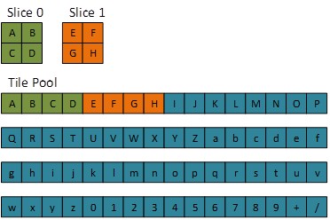
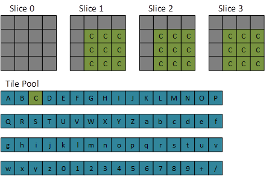

# Volume tiled resources (Direct3D 12)

Volume (3D) textures can be used as tiled resources, noting that tile resolution is three-dimensional.

## Overview

Tiled resources decouple a Direct3D resource object from its backing memory (resources in the past had a 1:1 relationship with their backing memory). This allows for a variety of interesting scenarios such as streaming in texture data and reusing or reducing memory usage.

2D texture tiled resources are supported in Direct3D 11.2. Optional support for 3D tiled textures is available for Direct3D 12 and Direct3D 11.3 (refer to [**D3D12_TILED_RESOURCES_TIER**](/windows/win32/api/d3d12/ne-d3d12-d3d12_tiled_resources_tier)).

The typical resource dimensions used in tiling are 4 x 4 tiles for 2D textures, and 4 x 4 x 4 tiles for 3D textures.

| Bits/pixel (1 sample/pixel) | Tile dimensions (pixels, w x h x d) |
|-----------------------------|-------------------------------------|
| 8                           | 64x32x32                            |
| 16                          | 32x32x32                            |
| 32                          | 32x32x16                            |
| 64                          | 32x16x16                            |
| 128                         | 16x16x16                            |
| BC 1,4                      | 128x64x16                           |
| BC 2,3,5,6,7                | 64x64x16                            |

Note the following formats are not supported with tiled resources: 96bpp formats, video formats, **R1_UNORM**, **R8G8_B8G8_UNORM**, **R8R8_G8B8_UNORM**.

In the diagrams below, dark gray represents NULL tiles.

* [Texture 3D Tiled Resource default mapping (most detailed mip)](#texture-3d-tiled-resource-default-mapping-most-detailed-mip)
* [Texture 3D Tiled Resource default mapping (second most detailed mip)](#texture-3d-tiled-resource-default-mapping-second-most-detailed-mip)
* [Texture 3D Tiled Resource (most detailed mip)](#texture-3d-tiled-resource-most-detailed-mip)
* [Texture 3D Tiled Resource (second most detailed mip)](#texture-3d-tiled-resource-second-most-detailed-mip)
* [Texture 3D Tiled Resource (Single Tile)](#texture-3d-tiled-resource-single-tile)
* [Texture 3D Tiled Resource (Uniform Box)](#texture-3d-tiled-resource-uniform-box)

### Texture 3D tiled resource default mapping (most-detailed mip)


### Texture 3D tiled resource default mapping (second-most-detailed mip)



### Texture 3D tiled resource (most-detailed mip)

The following code sets up a 3D tiled resource at the most-detailed mip.

```cpp
D3D12_TILED_RESOURCE_COORDINATE trCoord{};
trCoord.X = 1;
trCoord.Y = 0;
trCoord.Z = 0;
trCoord.Subresource = 0;

D3D12_TILE_REGION_SIZE trSize{};
trSize.bUseBox = false;
trSize.NumTiles = 63;
```


### Texture 3D tiled resource (second-most-detailed mip)

The following code sets up a 3D tiled resource, and the second most detailed mip.

```cpp
D3D12_TILED_RESOURCE_COORDINATE trCoord;
trCoord.X = 1;
trCoord.Y = 0;
trCoord.Z = 0;
trCoord.Subresource = 1;

D3D12_TILE_REGION_SIZE trSize;
trSize.bUseBox = false;
trSize.NumTiles = 6;
```


### Texture 3D tiled resource (single tile)

The following code sets up a single tile resource.

```cpp
D3D12_TILED_RESOURCE_COORDINATE trCoord;
trCoord.X = 1;
trCoord.Y = 1;
trCoord.Z = 1;
trCoord.Subresource = 0;

D3D12_TILE_REGION_SIZE trSize;
trSize.bUseBox = true;
trSize.NumTiles = 27;
trSize.Width = 3;
trSize.Height = 3;
trSize.Depth = 3;
```



### Texture 3D tiled resource (uniform box)

The following code sets up a uniform box tiled resource (note the statement `trSize.bUseBox = true;) :`

```cpp
D3D12_TILED_RESOURCE_COORDINATE trCoord;
trCoord.X = 0;
trCoord.Y = 1;
trCoord.Z = 0;
trCoord.Subresource = 0;

D3D12_TILE_REGION_SIZE trSize;
trSize.bUseBox = true;
trSize.NumTiles = 27;
trSize.Width = 3;
trSize.Height = 3;
trSize.Depth = 3;
```


## Tiled resource APIs

The same API calls are used for both 2D and 3D tiled resources.

Enums

* [**D3D12_TILED_RESOURCES_TIER**](/windows/win32/api/d3d12/ne-d3d12-d3d12_tiled_resources_tier) : determines the level of tiled resource support.
* [**D3D12_FORMAT_SUPPORT2**](/windows/win32/api/d3d12/ne-d3d12-d3d12_format_support2) : used to test for tiled resource support.
* [**D3D12_MULTISAMPLE_QUALITY_LEVEL_FLAGS**](/windows/win32/api/d3d12/ne-d3d12-d3d12_multisample_quality_level_flags) : determines tiled resource support in a multi-sampling resource.
* [**D3D12_TILE_COPY_FLAGS**](/windows/win32/api/d3d12/ne-d3d12-d3d12_tile_copy_flags) : holds flags for copying to and from swizzled tiled resources and linear buffers.

Structs

* [**D3D12_TILED_RESOURCE_COORDINATE**](/windows/win32/api/d3d12/ns-d3d12-d3d12_tiled_resource_coordinate) : holds the x, y, and z co-ordinate, and subresource reference. Note there is a helper structure: [**CD3DX12_TILED_RESOURCE_COORDINATE**](cd3dx12-tiled-resource-coordinate.md).
* [**D3D12_TILE_REGION_SIZE**](/windows/win32/api/d3d12/ns-d3d12-d3d12_tile_region_size) : specifies the size, and number of tiles, of the tiled region.
* [**D3D12_TILE_SHAPE**](/windows/win32/api/d3d12/ns-d3d12-d3d12_tile_shape) : the tile shape as a width, height and depth in texels.
* [**D3D12_FEATURE_DATA_D3D12_OPTIONS**](/windows/win32/api/d3d12/ns-d3d12-d3d12_feature_data_d3d12_options) : holds the supported tile resource tier level and a boolean, *VolumeTiledResourcesSupported*, indicated whether volume tiled resources are supported.

Methods

* [**ID3D12Device::CheckFeatureSupport**](/windows/win32/api/d3d12/nf-d3d12-id3d12device-checkfeaturesupport) : used to determine what features, and at what tier, are supported by the current hardware.
* [**ID3D12GraphicsCommandList::CopyTiles**](/windows/win32/api/d3d12/nf-d3d12-id3d12graphicscommandlist-copytiles) : copies tiles from buffer to tiled resource or vice versa.
* [**ID3D12CommandQueue::UpdateTileMappings**](/windows/win32/api/d3d12/nf-d3d12-id3d12commandqueue-updatetilemappings) : updates mappings of tile locations in tiled resources to memory locations in a resource heap.
* [**ID3D12CommandQueue::CopyTileMappings**](/windows/win32/api/d3d12/nf-d3d12-id3d12commandqueue-copytilemappings) : copies mappings from a source tiled resource to a destination tiled resource.
* [**ID3D12Device::GetResourceTiling**](/windows/win32/api/d3d12/nf-d3d12-id3d12device-getresourcetiling) : gets info about how a tiled resource is broken into tiles.

## Related topics

* [Resource binding](resource-binding.md)
