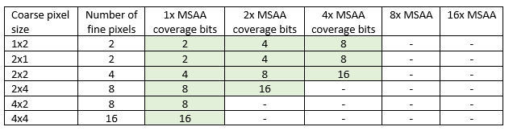

# Variable-rate shading (VRS)

## The motivation for VRS
Due to performance constraints, a graphics renderer can't always afford to deliver the same level of quality to every part of its output image. Variable-rate shading&mdash;or coarse pixel shading&mdash;is a mechanism that lets you allocate rendering performance/power at rates that vary across your rendered image.

In some cases, the shading rate can be reduced with little or no reduction in perceptible output quality; leading to a performance improvement that's essentially free of charge.

## Without VRS&mdash;multi-sample anti-aliasing with supersampling
Without variable-rate shading, the only means of controlling shading rate is with multi-sample anti-aliasing (MSAA) with sample-based execution (also known as supersampling).

MSAA is a mechanism for reducing geometric aliasing, and improving the rendering quality of an image compared with not using MSAA. The MSAA sample count, which can be 1x, 2x, 4x, 8x, or 16x, governs the number of samples allocated per render target pixel. The MSAA sample count must be known up front when the target is allocated, and it can't be changed thereafter.

Supersampling causes the pixel shader to be invoked once per sample, at a higher quality but also higher performance cost compared to per-pixel execution.

Your application can control its shading rate by choosing between per-pixel-based execution, or MSAA-with-supersampling. Those two options don't provide very fine control. Also, you might want a lower shading rate for a certain class of objects compared to the rest of the image. Such objects might include an object behind a HUD element, or a transparency, a blur (depth-of-field, motion, etc.), or an optical distortion due to VR optics. But that wouldn't be possible, because the shading quality and costs are fixed over the entire image.

## With variable-rate shading (VRS)
The variable-rate shading (VRS) model extends supersampling-with-MSAA into the opposite, "coarse pixel", direction, by adding the concept of coarse shading. This is where shading can be performed at a frequency more coarse than a pixel. In other words, a group of pixels can be shaded as a single unit, and the result is then broadcast to all samples in the group.

A coarse-shading API allows your application to specify the number of pixels that belong to a shaded group, or *coarse pixel*. You can vary the coarse pixel size after you've allocated the render target. So, different portions of the screen or different draw passes can have different shading rates.

Here's a table describing which MSAA level is supported with which coarse pixel size. Some are not supported on any platform; while others are conditionally enabled based on a capability (*AdditionalShadingRatesSupported*), indicated by "Cap".


For the feature tiers discussed in the next section, there's no coarse-pixel-size-and-sample-count combination where hardware needs to track more than 16 samples per pixel shader invocation. Those combinations are halftone-shaded in the table above.

## Feature tiers
There are two tiers to the VRS implementation, and two capabilities that you can query for. Each tier is described in greater detail after the table.


### Tier 1
- Shading rate can be specified only on a per-draw-basis; no more granular than that.
- Shading rate applies uniformly to what is drawn independently of where it lies within the render target.

### Tier 2
- Shading rate can be specified on a per-draw basis, as in Tier 1. It can also be specified by a combination of per-draw basis, and of:
  - Semantic from each provoking vertex, and
  - a screen-space image.
- Shading rates from the three sources are combined using a set of combiners.
- Screen-space image tile size is 16x16 or smaller.
- Shading rate requested by your application is guaranteed to be delivered exactly (for precision of temporal and other reconstruction filters).
- SV_ShadingRate PS input is supported.
- The per-provoking-vertex (also known as per-primitive) shading rate, is valid when one viewport is used and `SV_ViewportArrayIndex` is not written to.
- The per-provoking-vertex rate can be used with more than one viewport if the *SupportsPerVertexShadingRateWithMultipleViewports* capability is set to `true`. Additionally, in that case, that rate can be used when `SV_ViewportArrayIndex` is written to.

### List of capabilities
- *AdditionalShadingRatesSupported*
  - Boolean type.
  - Indicates whether 2x4, 4x2, and 4x4 coarse pixel sizes are supported for single-sampled rendering; and whether coarse pixel size 2x4 is supported for 2x MSAA.
- *SupportsPerVertexShadingRateWithMultipleViewports*
  - Boolean type.
  - Indicates whether more than one viewport can be used with the per-vertex (also known as per-primitive) shading rate.

## Specifying shading rate
For flexibility in applications, there are a variety of mechanisms provided to control the shading rate. Different mechanisms are available depending on the hardware feature tier.

### Command list
This is the simplest mechanism for setting the shading rate. It's available on all tiers.

Your application can specify a coarse pixel size using the [**ID3D12GraphicsCommandList5::RSSetShadingRate** method](/windows/desktop/api/d3d12/nf-d3d12-id3d12graphicscommandlist5-rssetshadingrate). That API takes a single enum argument. The API provides an overall control of the level of quality for rendering&mdash;the ability to set the shading rate on a per-draw basis.

Values for this state are expressed through the [**D3D12_SHADING_RATE**](/windows/desktop/api/d3d12/ne-d3d12-d3d12_shading_rate) enumeration.

#### Coarse pixel size support
The shading rates 1x1, 1x2, 2x2, and 2x2 are supported on all tiers.

There is a capability, *AdditionalShadingRatesSupported*, to indicate whether 2x4, 4x2, and 4x4 are supported on the device.

### Screen-space image (image-based)
On Tier 2 and higher, you can specify the pixel-shading rate with a screen-space image.

The screen-space image allows your application to create a "level-of-detail (LOD) mask" image indicating regions of varying quality, such as areas that will be covered by motion blur, depth-of-field blur, transparent objects, or HUD UI elements. The resolution of the image is in macroblocks; it's not in the resolution of the render target. In other words, the shading rate data is specified at a granularity of 8x8 or 16x16 pixel tiles, as indicated by the VRS tile size.

#### Tile size
Your application can query an API to retrieve the supported VRS tile size for its device.

Tiles are square, and the size refers to the tile's width or height in texels.

If the hardware doesn't support Tier 2 variable-rate shading, then the capability query for the tile size returns 0.

If the hardware *does* support Tier 2 variable-rate shading, then the tile size is one of these values.

- 8
- 16
- 32

#### Screen-space image size
For a render target of size {rtWidth, rtHeight}, using a given tile size named **VRSTileSize**, the screen-space image that will cover it is of these dimensions.

```cpp
{ ceil((float)rtWidth / VRSTileSize), ceil((float)rtHeight / VRSTileSize) }
```

The screen-space image's top left (0, 0) is locked to the render-target's top left (0, 0).

To look up the (x,y) coordinate of a tile that corresponds to a particular location in the render target, divide the window-space coordinates of (x, y) by the tile size, ignoring fractional bits.

If the screen-space image is larger than it needs to be for a given render target, the extra portions at the right and/or bottom are not used.

If the screen-space image is too small for a given render target, any attempted read from the image beyond its actual extents yields a default shading rate of 1x1. This is because the screen-space image's top left (0, 0) is locked to the render-target's top left (0, 0) and "reading beyond the render-target extents" means reading too-great of values for x and y.

#### Format, layout, resource properties
The format of this surface is a single-channel 8-bit surface ([**DXGI_FORMAT_R8_UINT**](/windows/desktop/api/dxgiformat/ne-dxgiformat-dxgi_format)).

The resource is dimension **TEXTURE2D**.

It can't be arrayed or mipped. It must explicitly have one mip level.

It has sample count 1, and sample quality 0.

It has texture layout **UNKNOWN**. It implicitly can't be row-major layout, because cross-adapter is not allowed.

The expected way in which the screen-space image data is populated is to either
1. Write the data using a compute shader; the screen-space image is bound as a UAV, or
2. Copy the data to the screen-space image.

When creating the screen-space image, these flags are permitted.

- NONE
- ALLOW_UNORDERED_ACCESS
- DENY_SHADER_RESOURCE

These flags are not permitted.

- ALLOW_RENDER_TARGET
- ALLOW_DEPTH_STENCIL
- ALLOW_CROSS_ADAPTER
- ALLOW_SIMULTANEOUS_ACCESS
- VIDEO_DECODE_REFERENCE_ONLY

The resource's heap type can't be UPLOAD nor READBACK.

The resource can't be SIMULTANEOUS_ACCESS. The resource is not allowed to be cross-adapter.

#### Data
Each byte of the screen-space image corresponds to a value of the [**D3D12_SHADING_RATE**](/windows/desktop/api/d3d12/ne-d3d12-d3d12_shading_rate)  enumeration.

#### Resource state
A resource needs to be transitioned into a read-only state when used as a screen-space image. A read-only state, [**D3D12_RESOURCE_STATE_SHADING_RATE_SOURCE**](/windows/desktop/api/d3d12/ne-d3d12-d3d12_resource_states), is defined for this purpose.

The image resource is transitioned out of that state to become writable again.

#### Setting the image
The screen-space image for specifying the shader rate is set on the command list.

A resource that has been set as a shading rate source can't be read or written from any shader stage.

A `null` screen-space image can be set for specifying the shader rate. This has the effect of 1x1 being consistently used as the contribution from the screen-space image. The screen-space image can initially be considered to be set to `null`.

#### Promotion and decay
A screen-space image resource doesn't have any special implications with respect to promotion or decay.

### Per-primitive attribute
A per-primitive attribute adds the ability to specify a shading rate term as an attribute from a provoking vertex. This attribute is flat-shaded&mdash;that is, it's propagated to all pixels in the current triangle or line primitive. Use of a per-primitive attribute can enable finer-grained control of image quality compared to the other shading rate specifiers.

The per-primitive attribute is a settable semantic named `SV_ShadingRate`. `SV_ShadingRate` exists as part of [HLSL Shader Model 6.4](/windows/desktop/direct3dhlsl/hlsl-shader-model-6-4-features-for-direct3d-12).

If a VS or GS sets `SV_ShadingRate`, but VRS is not enabled, then the semantic-setting has no effect. If no value for `SV_ShadingRate` is specified per-primitive, then a shading rate value of 1x1 is assumed as the per-primitive contribution.

### Combining shading rate factors
The various sources of shading rate are applied in sequence using this diagram.


Each pair of A and B is combined using a combiner.

\* When specifying a shader rate by vertex attribute.

- If a geometry shader is used, shading rate can be specified through that.
- If a geometry shader is not used, the shading rate is specified by the provoking vertex.

#### List of combiners
The following combiners are supported. Using a Combiner (C) and two inputs (A and B).

- **Passthrough**. C.xy = A.xy.
- **Override**. C.xy = B.xy.
- **Higher quality**. C.xy = min(A.xy, B.xy).
- **Lower quality**. C.xy = max(A.xy, B.xy).
- **Apply cost B relative to A**. C.xy = min(maxRate, A.xy + B.xy).

where `maxRate` is the largest permitted dimension of coarse pixel on the device. This would be

- **D3D12_AXIS_SHADING_RATE_2X** (that is, a value of 1), if AdditionalShadingRatesSupported is `false`.
- **D3D12_AXIS_SHADING_RATE_4X** (that is, a value of 2), if AdditionalShadingRatesSupported is `true`.

The choice of combiner for variable-rate shading is set on the command list through [**ID3D12GraphicsCommandList5::RSSetShadingRate**](/windows/desktop/api/d3d12/nf-d3d12-id3d12graphicscommandlist5-rssetshadingrate).

If no combiners are ever set, then they stay at the default, which is PASSTHROUGH.

If the source to a combiner is a [**D3D12_AXIS_SHADING_RATE**](/windows/desktop/api/d3d12/ne-d3d12-d3d12_axis_shading_rate), which is not allowed in the support table, then the input is sanitized to a shading rate that *is* supported.

If the output of a combiner doesn't correspond to a shading rate supported on the platform, then the result is sanitized to a shading rate that *is* supported.

### Default state, and state clearing
All shading rate sources, namely

- the pipeline state-specified rate (specified on the command list),
- the screen-space image-specified rate, and
- the per-primitive attribute

have a default of **D3D12_SHADING_RATE_1X1**. The default combiners are {PASSTHROUGH, PASSTHROUGH}.

If no screen-space image is specified, then a shading rate of 1x1 is inferred from that source.

If no per-primitive attribute is specified, then a shading rate of 1x1 is inferred from that source.

[ID3D12CommandList::ClearState](/windows/desktop/api/d3d12/nf-d3d12-id3d12graphicscommandlist-clearstate) resets the pipeline-state-specified rate to the default, and the selection of screen-space image to the default of "no screen-space image".

## Querying shading rate by using SV_ShadingRate
It's useful to know what shading rate was selected by the hardware at any given pixel shader invocation. This could enable a variety of optimizations in your PS code. A PS-only system variable, `SV_ShadingRate`, provides information about the shading rate.

### Type
The type of this semantic is uint.

### Data interpretation
The data is interpreted as a value of the [**D3D12_SHADING_RATE**](/windows/desktop/api/d3d12/ne-d3d12-d3d12_shading_rate) enumeration.

### If VRS is not being used
If coarse pixel shading is not being used, then `SV_ShadingRate` is read back as a value of 1x1, indicating fine pixels.

### Behavior under sample-based execution
A pixel shader fails compilation if it inputs `SV_ShadingRate` and also uses sample-based execution&mdash;for example, by inputting `SV_SampleIndex`, or using the sample interpolation keyword.

> ### Remarks on deferred shading
>
> A deferred shading application's lighting passes may need to know what shading rate was used for which area of the screen. This is so that lighting pass dispatches can launch at a coarser rate. The `SV_ShadingRate` variable can be used to accomplish this if it is written out to the gbuffer.

## Depth and stencil
When coarse pixel shading is used, depth and stencil and coverage are always computed and emitted at the full sample resolution.

## Using the shading rate requested
For all tiers, it's expected that if a shading rate is requested, and it's supported on the device-and-MSAA-level-combination, then that is the shading rate delivered by the hardware.

A requested shading rate means a shading rate computed as an output of the combiners (see the [Combining shading rate factors](#combining-shading-rate-factors) section in this topic).

A supported shading rate is 1x1, 1x2, 2x1, or 2x2 in a rendering operation where the sample count is less than or equal to four. If the *AdditionalShadingRatesSupported* capability is `true`, then 2x4, 4x2, and 4x4 are also supported shading rates for some sample counts (see the table in the [With variable-rate shading (VRS)](#with-variable-rate-shading-vrs) section in this topic).

## Screen-space derivatives
Calculations of pixel-to-adjacent-pixel gradients are affected by coarse pixel shading. For example, when 2x2 coarse pixels are used, a gradient will be twice the size as compared to when coarse pixels are not used. Your application may want to adjust shaders to compensate for this&mdash;or not, depending on the functionality you desire.

Because mips are chosen based on a screen-space derivative, the usage of coarse pixel shading affects mip selection. Usage of coarse pixel shading causes lesser-detailed mips to be selected compared to when coarse pixels are not used.

## Attribute interpolation
Inputs to a pixel shader may be interpolated based on their source vertices. Because variable-rate shading affects the areas of the target written by each invocation of the pixel shader, it interacts with attribute interpolation. The three types of interpolation are center, centroid, and sample.

### Center
The center interpolation location for a coarse pixel is the geometric center of the full coarse pixel area. `SV_Position` is always interpolated at the center of the coarse pixel region.

### Centroid
When coarse pixel shading is used with MSAA, for each fine pixel there will still be writes to the full number of samples allocated for the target's MSAA level. So, the centroid interpolation location will consider all samples for fine pixels within coarse pixels. That being said, the centroid interpolation location is defined as the first covered sample, in increasing order of sample index. The sample's effective coverage is AND-ed with the corresponding bit of the rasterizer state SampleMask.

> [!NOTE]
> When coarse pixel shading is used on Tier 1, SampleMask is always a full mask. If SampleMask is configured to not be a full mask, coarse pixel shading is disabled on Tier 1.

### Sample-based execution
Sample-based execution, or *supersampling*&mdash;which is caused by use of the sample interpolation feature&mdash;can be used with coarse pixel shading, and causes the pixel shader to be invoked per sample. For targets of sample count N, the pixel shader is invoked N times per fine pixel.

### EvaluateAttributeSnapped
Pull-model intrinsics are not compatible with coarse pixel shading on Tier 1. If there is an attempt to use pull-model intrinsics with coarse pixel shading on Tier 1, then coarse pixel shading is automatically disabled.

The intrinsic `EvaluateAttributeSnapped` is allowed to be used with coarse pixel shading on Tier 2. Its syntax is the same as it has always been.

```hlsl
numeric EvaluateAttributeSnapped(	
    in attrib numeric value, 
    in int2 offset);
```

For context, `EvaluateAttributeSnapped` has an offset parameter with two fields. When used without coarse pixel shading, just the lower-order four bits out of the full thirty-two are used. These four bits represent the range [-8, 7]. This range spans a 16x16 grid within a pixel. The range is such that the top and left edges of the pixel are included, and the bottom and right edges are not. Offset (-8, -8) is at the top-left corner, and offset (7, 7) is by the bottom-right corner. Offset (0, 0) is the center of the pixel.

When used with coarse pixel shading, `EvaluateAttributeSnapped`'s offset parameter is capable of specifying a wider range of locations. The offset parameter selects a 16x16 grid for each fine pixel, and there are multiple fine pixels. The expressible range and consequent number of bits used depends on the coarse pixel size. The top and left edges of the coarse pixel are included, and the bottom and right edges are not.

The table below describes the interpretation of `EvaluateAttributeSnapped`'s offset parameter for each coarse pixel size.

#### EvaluateAttributeSnapped's offset range

|Coarse pixel size  |Indexable range             |Representable range size  |Number of bits needed {x, y}  |Binary mask of usable bits          |    
|------------------:|---------------------------:|-------------------------:|-----------------------------:|-----------------------------------:|    
|1x1 (fine)         |{\[-8, 7\], \[-8, 7\]}      |{16, 16}                  |{4, 4}                        |{000000000000xxxx, 000000000000xxxx}|    
|1x2                |{\[-8, 7\], \[-16, 15\]}    |{16, 32}                  |{4, 5}                        |{000000000000xxxx, 00000000000xxxxx}|    
|2x1                |{\[-16, 15\], \[-8, 7\]}    |{32, 16}                  |{5, 4}                        |{00000000000xxxxx, 000000000000xxxx}|    
|2x2                |{\[-16, 15\], \[-16, 15\]}  |{32, 32}                  |{5, 5}                        |{00000000000xxxxx, 00000000000xxxxx}|    
|2x4                |{\[-16, 15\], \[-32, 31\]}  |{32, 64}                  |{5, 6}                        |{00000000000xxxxx, 0000000000xxxxxx}|    
|4x2                |{\[-32, 31\], \[-16, 15\]}  |{64, 32}                  |{6, 5}                        |{0000000000xxxxxx, 00000000000xxxxx}|    
|4x4                |{\[-32, 31\], \[-32, 31\]}  |{64, 64}                  |{6, 6}                        |{0000000000xxxxxx, 0000000000xxxxxx}|   

The tables below are a guide for conversion to from the fixed-point to decimal and fractional representation. The first usable bit in the binary mask is the sign bit, and the rest of the binary mask comprises the numerical portion.

The number scheme for four-bit values passed in to `EvaluateAttributeSnapped` is not specific to variable-rate shading. It's reiterated here for completeness.

For four-bit values.

| Binary value | Decimal  | Fractional |
|-------------:|---------:|-----------:|
|         1000 |-0.5f     |-8 / 16     |
|         1001 |-0.4375f  |-7 / 16|    |
|         1010 |-0.375f   |-6 / 16|    |
|         1011 |-0.3125f  |-5 / 16     |
|         1100 |-0.25f    |-4 / 16     |
|         1101 |-0.1875f  |-3 / 16     |
|         1110 |-0.125f   |-2 / 16     |
|         1111 |-0.0625f  |-1 /16      |
|         0000 |0.0f      |0 / 16      |
|         0001 |-0.0625f  |1 / 16      |
|         0010 |-0.125f   |2 / 16      |
|         0011 |-0.1875f  |3 / 16      |
|         0100 |-0.25f    |4 / 16      |
|         0101 |-0.3125f  |5 / 16      |
|         0110 |-0.375f   |6 / 16      |
|         0111 |-0.4375f  |7 / 16      |

For five-bit values.

| Binary value | Decimal  | Fractional |
|-------------:|---------:|-----------:|
|        10000 |-1        |-16 / 16    |
|        10001 |-0.9375   |-15 / 16    |
|        10010 |-0.875    |-14 / 16    |
|        10011 |-0.8125   |-13 / 16    |
|        10100 |-0.75     |-12 / 16    |
|        10101 |-0.6875   |-11 / 16    |
|        10110 |-0.625    |-10 / 16    |
|        10111 |-0.5625   |-9 / 16     |
|        11000 |-0.5      |-8 / 16     |
|        11001 |-0.4375   |-7 / 16     |
|        11010 |-0.375    |-6 / 16     |
|        11011 |-0.3125   |-5 / 16     |
|        11100 |-0.25     |-4 / 16     |
|        11101 |-0.1875   |-3 / 16     |
|        11110 |-0.125    |-2 / 16     |
|        11111 |-0.0625   |-1 / 16     |
|        00000 |0         |0 / 16      |
|        00001 |0.0625    |1 / 16      |
|        00010 |0.125     |2 / 16      |
|        00011 |0.1875    |3 / 16      |
|        00100 |0.25      |4 / 16      |
|        00101 |0.3125    |5 / 16      |
|        00110 |0.375     |6 / 16      |
|        00111 |0.4375    |7 / 16      |
|        01000 |0.5       |8 / 16      |
|        01001 |0.5625    |9 / 16      |
|        01010 |0.625     |10 / 16     |
|        01011 |0.6875    |11 / 16     |
|        01100 |0.75      |12 / 16     |
|        01101 |0.8125    |13 / 16     |
|        01110 |0.875     |14 / 16     |
|        01111 |0.9375    |15 / 16     |

For six-bit values.

| Binary value | Decimal  | Fractional |
|-------------:|---------:|-----------:|
|       100000 |-2        |-32 / 16    |
|       100001 |-1.9375   |-31 / 16    |
|       100010 |-1.875    |-30 / 16    |
|       100011 |-1.8125   |-29 / 16    |
|       100100 |-1.75     |-28 / 16    |
|       100101 |-1.6875   |-27 / 16    |
|       100110 |-1.625    |-26 / 16    |
|       100111 |-1.5625   |-25 / 16    |
|       101000 |-1.5      |-24 / 16    |
|       101001 |-1.4375   |-23 / 16    |
|       101010 |-1.375    |-22 / 16    |
|       101011 |-1.3125   |-21 / 16    |
|       101100 |-1.25     |-20 / 16    |
|       101101 |-1.1875   |-19 / 16    |
|       101110 |-1.125    |-18 / 16    |
|       101111 |-1.0625   |-17 / 16    |
|       110000 |-1        |-16 / 16    |
|       110001 |-0.9375   |-15 / 16    |
|       110010 |-0.875    |-14 / 16    |
|       110011 |-0.8125   |-13 / 16    |
|       110100 |-0.75     |-12 / 16    |
|       110101 |-0.6875   |-11 / 16    |
|       110110 |-0.625    |-10 / 16    |
|       110111 |-0.5625   |-9 / 16     |
|       111000 |-0.5      |-8 / 16     |
|       111001 |-0.4375   |-7 / 16     |
|       111010 |-0.375    |-6 / 16     |
|       111011 |-0.3125   |-5 / 16     |
|       111100 |-0.25     |-4 / 16     |
|       111101 |-0.1875   |-3 / 16     |
|       111110 |-0.125    |-2 / 16     |
|       111111 |-0.0625   |-1 / 16     |
|       000000 |0         |0 / 16      |
|       000001 |0.0625    |1 / 16      |
|       000010 |0.125     |2 / 16      |
|       000011 |0.1875    |3 / 16      |
|       000100 |0.25      |4 / 16      |
|       000101 |0.3125    |5 / 16      |
|       000110 |0.375     |6 / 16      |
|       000111 |0.4375    |7 / 16      |
|       001000 |0.5       |8 / 16      |
|       001001 |0.5625    |9 / 16      |
|       001010 |0.625     |10 / 16     |
|       001011 |0.6875    |11 / 16     |
|       001100 |0.75      |12 / 16     |
|       001101 |0.8125    |13 / 16     |
|       001110 |0.875     |14 / 16     |
|       001111 |0.9375    |15 / 16     |
|       010000 |1         |16 / 16     |
|       010001 |1.0625    |17 / 16     |
|       010010 |1.125     |18 / 16     |
|       010011 |1.1875    |19 / 16     |
|       010100 |1.25      |20 / 16     |
|       010101 |1.3125    |21 / 16     |
|       010110 |1.375     |22 / 16     |
|       010111 |1.4375    |23 / 16     |
|       011000 |1.5       |24 / 16     |
|       011001 |1.5625    |25 / 16     |
|       011010 |1.625     |26 / 16     |
|       011011 |1.6875    |27 / 16     |
|       011100 |1.75      |28 / 16     |
|       011101 |1.8125    |29 / 16     |
|       011110 |1.875     |30 / 16     |
|       011111 |1.9375    |31 / 16     |

In the same manner as with fine pixels, `EvaluateAttributeSnapped`'s grid of evaluateable locations is centered at the coarse pixel center when using coarse pixel shading.

## SetSamplePositions
When the API [**ID3D12GraphicsCommandList1::SetSamplePositions**](/windows/desktop/api/d3d12/nf-d3d12-id3d12graphicscommandlist1-setsamplepositions) is used with coarse shading, the API sets the sample positions for fine pixels.

## SV_Coverage
If `SV_Coverage` is declared as a shader input or output on Tier 1, then coarse pixel shading is disabled.

You can use the `SV_Coverage` semantic with coarse pixel shading on Tier 2, and it reflects which samples of an MSAA target are being written.

When coarse pixel shading is used&mdash;allowing multiple source pixels to comprise a tile&mdash;the coverage mask represents all samples that come from that tile.

Given coarse pixel shading's compatibility with MSAA, the number of coverage bits needed to be specified can vary. For example, with a 4x MSAA resource using [**D3D12_SHADING_RATE_2x2**](/windows/desktop/api/d3d12/ne-d3d12-d3d12_shading_rate), each coarse pixel writes to four fine pixels, and each fine pixel has four samples. This means that each coarse pixel writes to a total of 4 * 4 = 16 samples.

### Number of coverage bits needed
The following table indicates how many coverage bits are needed for each combination of coarse pixel size and MSAA level.



As indicated in the table, it isn't possible to use coarse pixels to write to more than 16 samples at a time using the variable-rate shading feature exposed through Direct3D 12. This restriction is due to Direct3D 12's constraints regarding which MSAA levels are allowed with which coarse pixel size (see the table in the [With variable-rate shading (VRS)](#with-variable-rate-shading-vrs) section in this topic).

### Ordering and format of bits in the coverage mask
The bits of the coverage mask adhere to a well-defined order. The mask consists of coverages from pixels from left to right, then top to bottom (column-major) order. Coverage bits are the low-order bits of the coverage semantic, and are densely packed together.

The table below shows the coverage mask format for supported combinations of coarse pixel size and MSAA level.


The following table portrays 2x MSAA pixels, where each pixel has two samples of indices 0 and 1.

The positioning of the labels of samples on the pixels are for illustrative purposes, and do not necessarily convey the spatial {X, Y} locations of samples on that pixel; especially given that sample positions can be programmatically changed. Samples are referred to by their 0-based index.


The following table shows 4x MSAA pixels, where each pixel has four samples of indices 0, 1, 2, and 3.


## Discard
When the HLSL semantic `discard` is used with coarse pixel shading, coarse pixels are discarded.

## Target-independent rasterization (TIR)
TIR is not supported when coarse pixel shading is used.

## Raster order views (ROVs)
ROV interlocks are specified as operating at fine pixel granularity. If shading is performed per sample, then interlocks are operating at sample granularity.

## Conservative rasterization
You can use conservative rasterization with variable-rate shading. When conservative rasterization is used with coarse pixel shading, fine pixels within coarse pixels are conservatively rasterized by being given full coverage.

### Coverage
When conservative rasterization is used, the coverage semantic contains full masks for fine pixels that are covered, and 0 for fine pixels that are not covered.

## Bundles
You can call variable-rate shading APIs on a bundle.

## Render passes
You can call variable-rate shading APIs in a [render pass](/windows/desktop/direct3d12/direct3d-12-render-passes).

## Calling the VRS APIs
This next section describes the manner in which variable-rate shading is accessible to your application through Direct3D 12.

### Capability querying

To query for the adapter's variable-rate shading capability, call [**ID3D12Device::CheckFeatureSupport**](/windows/desktop/api/d3d12/nf-d3d12-id3d12device-checkfeaturesupport) with [**D3D12_FEATURE::D3D12_FEATURE_D3D12_OPTIONS6**](/windows/desktop/api/d3d12/ne-d3d12-d3d12_feature), and provide a [**D3D12_FEATURE_DATA_D3D12_OPTIONS6** structure](/windows/desktop/api/d3d12/ns-d3d12-d3d12_feature_data_d3d12_options6) for the function to fill in for you. The **D3D12_FEATURE_DATA_D3D12_OPTIONS6** structure contains several members, including one that is of the enumerated type [**D3D12_VARIABLE_SHADING_RATE_TIER**](/windows/desktop/api/d3d12/ne-d3d12-d3d12_variable_shading_rate_tier) (D3D12_FEATURE_DATA_D3D12_OPTIONS6::VariableShadingRateTier), and one that indicates whether background processing is supported (D3D12_FEATURE_DATA_D3D12_OPTIONS6::BackgroundProcessingSupported).

To query for Tier 1 capability, for example, you can do this.

```cpp
D3D12_FEATURE_DATA_D3D12_OPTIONS6 options;
return 
    SUCCEEDED(m_device->CheckFeatureSupport(
        D3D12_FEATURE_D3D12_OPTIONS6, 
        &options, 
        sizeof(options))) && 
    options.ShadingRateTier == D3D12_VARIABLE_SHADING_RATE_TIER_1;
```

### Shading rates

The values in the [**D3D12_SHADING_RATE** enumeration](/windows/desktop/api/d3d12/ne-d3d12-d3d12_shading_rate) are organized so that shading rates are easily decomposable into two axes, where each axis's values are compactly represented in logarithmic space according to the [**D3D12_AXIS_SHADING_RATE** enumeration](/windows/desktop/api/d3d12/ne-d3d12-d3d12_axis_shading_rate).

You can author a macro to compose two axis shading rates into a shading rate like this.

```cpp
#define D3D12_MAKE_COARSE_SHADING_RATE(x,y) ((x) << 2 | (y))
D3D12_MAKE_COARSE_SHADING_RATE(
    D3D12_AXIS_SHADING_RATE_2X, 
    D3D12_AXIS_SHADING_RATE_1X)
```

The platform also provides these macros, defined in `d3d12.h`.

```cpp
#define D3D12_GET_COARSE_SHADING_RATE_X_AXIS(x) ((x) >> 2 )
#define D3D12_GET_COARSE_SHADING_RATE_Y_AXIS(y) ((y) & 3 )
```

Those can be used to dissect and understand `SV_ShaderRate`.

> [!NOTE]
> This data interpretation is geared toward describing the screen-space image, which can be manipulated by shaders. That's discussed further in the sections above. But there's no reason not to have a consistent definition of the coarse pixel sizes to be used everywhere, including when setting the command-level shading rate.

### Setting command-level shading rate and combiners
The shading rate and, optionally, combiners are specified through the [**ID3D12GraphicsCommandList5::RSSetShadingRate**](/windows/desktop/api/d3d12/nf-d3d12-id3d12graphicscommandlist5-rssetshadingrate) method. You pass a [**D3D12_SHADING_RATE**](/windows/desktop/api/d3d12/ne-d3d12-d3d12_shading_rate) value for the base shading rate, and an optional array of [D3D12_SHADING_RATE_COMBINER](/windows/desktop/api/d3d12/ne-d3d12-d3d12_shading_rate_combiner) values.

### Preparing the screen-space image
The read-only resource state designating a usable shading rate image is defined as [D3D12_RESOURCE_STATES::D3D12_RESOURCE_STATE_SHADING_RATE_SOURCE](/windows/desktop/api/d3d12/ne-d3d12-d3d12_resource_states).

### Setting the screen-space image
You specify the screen-space image through the [**ID3D12GraphicsCommandList5::RSSetShadingRateImage**](/windows/desktop/api/d3d12/nf-d3d12-id3d12graphicscommandlist5-rssetshadingrateimage) method.

```cpp
m_commandList->RSSetShadingRateImage(screenSpaceImage);
```

### Querying the tile size
You can query the tile size from the [**D3D12_FEATURE_DATA_D3D12_OPTIONS6::ShadingRateImageTileSize**](/windows/desktop/api/d3d12/ns-d3d12-d3d12_feature_data_d3d12_options6) member. See [Capability querying](#capability-querying) above.

One dimension is retrieved, since the horizontal and vertical dimensions are always the same. If the system's capability is [**D3D12_SHADING_RATE_TIER_NOT_SUPPORTED**](/windows/desktop/api/d3d12/ne-d3d12-d3d12_variable_shading_rate_tier), then the tile size returned is 0.
