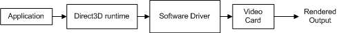
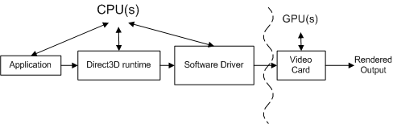
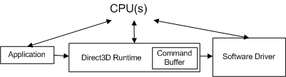
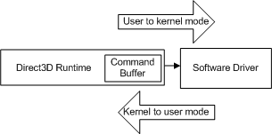

# Accurately Profiling Direct3D API Calls (Direct3D 9)

-   [Accurately Profiling Direct3D Is Difficult](#accurately-profiling-direct3d-is-difficult)
-   [How to Accurately Profile a Direct3D Render Sequence](#how-to-accurately-profile-a-direct3d-render-sequence)
-   [Profiling Direct3D State Changes](#profiling-direct3d-state-changes)
-   [Summary](#summary)
-   [Appendix](#appendix)

Once you have a functional Microsoft Direct3D application and you want to improve its performance, you generally use an off-the-shelf profiling tool or some custom measurement technique to measure the time it takes to execute one or more application programming interface (API) calls. If you have done this but are getting timing results that vary from one render sequence to the next, or you are making hypotheses that do not hold up to actual experiment results, the following information may help you to understand why.

The information provided here is based upon the assumption that you have knowledge of and experience with the following:

-   C/C++ programming
-   Direct3D API programming
-   Measuring API timing
-   The video card and its software driver
-   Possible unexplainable results from previous profiling experience

## Accurately Profiling Direct3D Is Difficult

A profiler reports on the amount of time spent in each API call. This is done to improve performance by finding and tuning away hot spots. There are different kinds of profilers and profiling techniques.

-   A sampling profiler sits idle much of the time, awakening at specific intervals to sample (or to record) the functions being executed. It returns the percentage of time spent in each call. Generally, a sampling profiler is not very invasive to the application and has minimal impact on the overhead for the application.
-   An instrumenting profiler measures the actual time it takes for a call to return. It requires compiling start and stop delimiters into an application. An instrumenting profiler is comparatively more invasive to an application than a sampling profiler.
-   It is also possible to use a custom profiling technique with a high-performance timer. This produces results very much like an instrumenting profiler.

The type of profiler or profiling technique used is only part of the challenge of generating accurate measurements.

Profiling gives you answers that help you budget performance. For instance, suppose you know that an API call averages one thousand clock cycles to execute. You can assert some conclusions about performance such as the following:

-   A 2 GHz CPU (which spends 50 percent of its time rendering) is limited to calling this API 1 million times a second.
-   To achieve 30 frames per second, you cannot call this API more than 33,000 times per frame.
-   You can only render 3.3K objects per frame (assuming 10 of these API calls for each object's render sequence).

In other words, if you had sufficient time per API call, you could answer a budgeting question such as the number of primitives that can be rendered interactively. But the raw numbers returned by an instrumenting profiler will not accurately answer the budgeting questions. This is because the graphics pipeline has complex design issues such as the number of components that need to do work, the number of processors that control how the work flows between components, and optimization strategies implemented in the runtime and in a driver that are designed to make the pipeline more efficient.

### Each API Call Goes through Several Components

Each call is processed by several components on its way from the application to the video card. For instance, consider the following render sequence containing two calls for drawing a single triangle:


```
SetTexture(...);
DrawPrimitive(D3DPT_TRIANGLELIST, 0, 1);
```


The following conceptual diagram shows the different components through which the calls must pass.



The application invokes Direct3D which controls the scene, handles user interactions, and determines how rendering is done. All of this work is specified in the render sequence, which is sent to the runtime using Direct3D API calls. The render sequence is virtually hardware independent (that is, the API calls are hardware independent but an application has knowledge of what features a video card supports).

The runtime converts these calls into a device-independent format. The runtime handles all the communication between the application and the driver, so that an application will run on more than one compatible piece of hardware (depending on the features required). When measuring a function call, an instrumenting profiler measures the time it spent in a function as well as the time for the function to return. One limitation of an instrumenting profiler is that it may not include the time it takes a driver to send the resulting work to the video card nor the time for the video card to process the work. In other words, an off-the-shelf instrumenting profiler fails to attribute all of the work associated with each function call.

The software driver uses hardware specific knowledge about the video card to convert the device-independent commands into a sequence of video card commands. Drivers may also optimize the sequence of commands that are sent to the video card, so that rendering on the video card is done efficiently. These optimizations can cause profiling problems because the amount of work done is not what it appears to be (you may need to understand the optimizations to account for them). The driver typically returns control to the runtime before the video card has finished processing all the commands.

The video card performs the majority of the rendering by combining data from the vertex and index buffers, textures, render state information, and the graphics commands. When the video card finishes rendering, the work created from the render sequence is complete.

Each Direct3D API call must be processed by each component (the runtime, the driver, and the video card) to render anything.

### There Is More than One Processor Controlling the Components

The relationship between these components is even more complex, because the application, runtime, and the driver are controlled by one processor and the video card is controlled by a separate processor. The following diagram shows two kinds of processors: a central processing unit (CPU) and a graphics processing unit (GPU).



PC systems have at least one CPU and one GPU, but can have more than one of either or both. The CPUs are located on the motherboard, and the GPUs are located either on the motherboard or on the video card. The speed of the CPU is determined by a clock chip on the motherboard, and the speed of the GPU is determined by a separate clock chip. The CPU clock controls the speed of the work done by the application, the runtime, and the driver. The application sends work to the GPU via the runtime and the driver.

The CPU and the GPU generally run at different speeds, independent of one another. The GPU may respond to the work as soon as the work is available (assuming the GPU has finished processing previous work). The GPU work is done in parallel with the CPU work as highlighted by the curved line in the figure above. A profiler generally measures the performance of the CPU, not the GPU. This makes profiling challenging, because the measurements made by an instrumenting profiler include the CPU time but may not include the GPU time.

The purpose of the GPU is to off-load processing from the CPU to a processor specifically designed for graphics work. On modern video cards, the GPU replaces much of the transform and lighting work in the pipeline from the CPU to the GPU. This greatly reduces the CPU workload, leaving more CPU cycles available for other processing. To tune a graphical application for peak performance, you need to measure the performance of both the CPU and the GPU, and balance the work between the two types of processors.

This document does not cover topics related to measuring the performance of the GPU or balancing the work between the CPU and the GPU. If you want to better understand the performance of a GPU (or a particular video card), visit the vendor's web site to look for more information about GPU performance. Instead, this document focuses on the work done by the runtime and the driver by reducing the GPU work to a negligible amount. This is, in part, based on experience that applications experiencing performance problems are generally CPU-limited.

### Runtime and Driver Optimizations Can Mask API Measurements

The runtime has a performance optimization built into it that can overwhelm the measurement of an individual call. Here's an example scenario that demonstrates this problem. Consider the following render sequence:


```
  BeginScene();
    ...
    SetTexture(...);
    DrawPrimitive(D3DPT_TRIANGLELIST, 0, 1);
    ...
  EndScene();
  Present();
```


Example 1: Simple Render Sequence

Looking at the results for the two calls in the render sequence, an instrumenting profiler could return results similar to these:


```
Number of cycles for SetTexture       : 100
Number of cycles for DrawPrimitive    : 950,500
```


The profiler returns the number of CPU cycles required to process the work associated with each call (remember that the GPU isn't included in these numbers because the GPU hasn't started working on these commands yet). Because [**IDirect3DDevice9::DrawPrimitive**](/windows/win32/api/d3d9helper/nf-d3d9helper-idirect3ddevice9-drawprimitive) required almost a million cycles to process, you could conclude that it is not very efficient. However, you'll soon see why this conclusion is incorrect and how you can generate results that can be used for budgeting.

### Measuring State Changes Requires Careful Render Sequences

All calls other than [**IDirect3DDevice9::DrawPrimitive**](/windows/win32/api/d3d9helper/nf-d3d9helper-idirect3ddevice9-drawprimitive), [**DrawIndexedPrimitive**](/windows/win32/api/d3d9helper/nf-d3d9helper-idirect3ddevice9-drawindexedprimitive), or [**Clear**](/windows/desktop/api) (such as [**SetTexture**](/windows/win32/api/d3d9helper/nf-d3d9helper-idirect3ddevice9-settexture), [**SetVertexDeclaration**](/windows/desktop/api), and [**SetRenderState**](/windows/win32/api/d3d9helper/nf-d3d9helper-idirect3ddevice9-setrenderstate)) produce a state change. Each state change sets pipeline state that controls how rendering will be done.

Optimizations in the runtime and/or the driver are designed to speed up rendering by reducing the amount of work required. The following are a couple of state change optimizations that may pollute profile averages:

-   A driver (or the runtime) could save a state change as a local state. Because the driver could operate in a "lazy" algorithm (postponing work until it is absolutely necessary), work associated with some state changes could get delayed.
-   The runtime (or a driver) may remove state changes by optimizing. An example of this might be to remove a redundant state change that disables lighting because lighting has previously been disabled.

There is no foolproof way to look at a render sequence and conclude which state changes will set a dirty bit and defer work, or will simply be removed by optimization. Even if you could identify optimized state changes in today's runtime or driver, tomorrow's runtime or driver is likely to be updated. You also don't readily know what the previous state was so it is difficult to identify redundant state changes. The only way to verify the cost of a state change is to measure the render sequence that includes the state changes.

As you can see, the complications caused by having multiple processors, commands being processed by more than one component, and optimizations built into the components make profiling difficult to predict. In the next section, each of these profiling challenges will be addressed. Sample Direct3D render sequences will be shown, with the accompanying measurement techniques. With this knowledge, you will be able to generate accurate, repeatable measurements on individual calls.

## How to Accurately Profile a Direct3D Render Sequence

Now that some of the profiling challenges have been highlighted, this section will show you techniques that will help you generate profile measurements that can be used for budgeting. Accurate, repeatable profiling measurements are possible if you understand the relationship between the components controlled by the CPU, and how to avoid performance optimizations implemented by the runtime and the driver.

To begin, you need to be able to accurately measure the execution time of a single API call.

### Pick an Accurate Measurement Tool Like QueryPerformanceCounter

The Microsoft Windows operating system includes a high-resolution timer that can be used to measure high-resolution elapsed times. The current value of one such timer can be returned using [**QueryPerformanceCounter**](/windows/win32/api/profileapi/nf-profileapi-queryperformancecounter). After invoking **QueryPerformanceCounter** to return start and stop values, the difference between the two values can be converted to the actual elapsed time (in seconds) using **QueryPerformanceCounter**.

The advantages of using [**QueryPerformanceCounter**](/windows/win32/api/profileapi/nf-profileapi-queryperformancecounter) are that it is available in Windows and it is easy to use. Simply surround the calls with a **QueryPerformanceCounter** call and save the start and stop values. Therefore, this paper will demonstrate how to use **QueryPerformanceCounter** to profile execution times, similar to the way an instrumenting profiler would measure it. Here's an example that shows how to embed **QueryPerformanceCounter** in your source code:


```
  BeginScene();
    ...
    // Start profiling
    LARGE_INTEGER start, stop, freq;
    QueryPerformanceCounter(&start);

    SetTexture(...);
    DrawPrimitive(D3DPT_TRIANGLELIST, 0, 1); 

    QueryPerformanceCounter(&stop);
    stop.QuadPart -= start.QuadPart;
    QueryPerformanceFrequency(&freq);
    // Stop profiling
    ...
  EndScene();
  Present();
```


Example 2: Custom Profiling Implementation with QPC

start and stop are two large integers that will hold the start and stop values returned by the high-performance timer. Notice that QueryPerformanceCounter(&start) is called just before [**SetTexture**](/windows/win32/api/d3d9helper/nf-d3d9helper-idirect3ddevice9-settexture) and QueryPerformanceCounter(&stop) is called just after [**DrawPrimitive**](/windows/win32/api/d3d9helper/nf-d3d9helper-idirect3ddevice9-drawprimitive). After getting the stop value, QueryPerformanceFrequency is called to return freq, which is the frequency of the high-resolution timer. In this hypothetical example, suppose you get the following results for start, stop, and freq:


| Local Variable | Number of Ticks |
|----------------|-----------------|
| start          | 1792998845094   |
| stop           | 1792998845102   |
| freq           | 3579545         |


 

You could convert these values to the number of cycles it takes to execute the API calls like this:


```
# ticks = (stop - start) = 1792998845102 - 1792998845094 = 8 ticks

# cycles = CPU speed * number of ticks / QPF
# 4568   = 2 GHz      * 8              / 3,579,545
```


In other words, it takes about 4568 clock cycles to process [**SetTexture**](/windows/win32/api/d3d9helper/nf-d3d9helper-idirect3ddevice9-settexture) and [**DrawPrimitive**](/windows/win32/api/d3d9helper/nf-d3d9helper-idirect3ddevice9-drawprimitive) on this 2 GHz machine. You could convert these values to the actual time it took to execute all the calls like this:


```
(stop - start)/ freq = elapsed time
8 ticks / 3,579,545 = 2.2E-6 seconds or between 2 and 3 microseconds.
```


Using QueryPerformanceCounter requires that you add start and stop measurements to your render sequence and use QueryPerformanceFrequency to convert the difference (number of ticks) to the number of CPU cycles or to actual time. Identifying the measurement technique is a good start for developing a custom profiling implementation. But before you jump in and start making measurements, you need to know how to deal with the video card.

### Focus on CPU Measurements

As stated earlier, the CPU and the GPU work in parallel to process the work generated by the API calls. A real world application requires profiling both types of processors to find out if your application is CPU-limited or GPU-limited. Since GPU performance is vendor specific, it would be very challenging to produce results in this paper that cover the variety of video cards available.

Instead, this paper will focus only on profiling the work performed by the CPU by using a custom technique for measuring the runtime and driver work. The GPU work will be reduced to an insignificant amount, so that CPU results are more visible. One benefit of this approach is that this technique yields results in the Appendix that you should be able to correlate with your measurements. To reduce the work required by the video card to an insignificant level, simply reduce the rendering work to the least amount possible. This can be accomplished by limiting draw calls to render a single triangle, and can be further constrained so that each triangle only contains one pixel.

The unit of measure used in this paper for measuring CPU work will be the number of CPU clock cycles rather than actual time. CPU clock cycles has the advantage that it is more portable (for CPU-limited applications) than actual elapsed time across machines with different CPU speeds. This can easily be converted to actual time if desired.

This document does not cover topics related to balancing the work load between the CPU and the GPU. Remember, the goal of this paper is not to measure the overall performance of an application, but to show you how to accurately measure the time it takes the runtime and the driver to process API calls. With these accurate measurements, you can take on the task of budgeting the CPU to understand certain performance scenarios.

### Controlling Runtime and Driver Optimizations

With a measurement technique identified, and a strategy for reducing GPU work, the next step is to understand the runtime and driver optimizations that get in the way when you are profiling.

The CPU work can be divided into three buckets: the application work, the runtime work, and the driver work. Ignore the application work since this is under programmer control. From the application's standpoint, the runtime and the driver are like black boxes, as the application has no control over what is implemented in them. The key is to understand the optimization techniques that may be implemented in the runtime and the driver. If you don't understand these optimizations, it is very easy to jump to the wrong conclusion about the amount of work the CPU is doing based on the profile measurements. In particular, there are two topics related to something called the command buffer and what it can do to obfuscate profiling. These topics are:

-   Runtime optimization with the Command Buffer. The command buffer is a runtime optimization that reduces the impact of a mode transition. To control the timing of the mode transition, see [Controlling the Command Buffer](#controlling-the-command-buffer).
-   Negating the timing effects of the Command Buffer. The elapsed time of a mode transition can have a big impact on profiling measurements. The strategy for this is to [Make the Render Sequence Large Compared to the Mode Transition](#make-the-render-sequence-large-compared-to-the-mode-transition).

### Controlling the Command Buffer

When an application makes an API call, the runtime converts the API call to a device-independent format (which we will call a command), and stores it in the command buffer. The command buffer is added to the following diagram.



Each time the application makes another API call, the runtime repeats this sequence and adds another command to the command buffer. At some point, the runtime empties the buffer (sending the commands to the driver). In Windows XP, emptying the command buffer causes a mode transition as the operating system switches from the runtime (running in user mode) to the driver (running in kernel mode), as shown in the following diagram.

-   user mode - The non-privileged processor mode that executes application code. User-mode applications cannot gain access to system data except through system services.
-   kernel mode - The privileged processor mode in which Windows-based executive code runs. A driver or thread running in kernel mode has access to all system memory, direct access to hardware, and the CPU instructions to perform I/O with the hardware.



The transition happens each time the CPU switches from user to kernel mode (and vice versa) and the number of cycles it requires is large compared to an individual API call. If the runtime sent each API call to the driver when it was invoked, every API call would incur the cost of a mode transition.

Instead, the command buffer is a runtime optimization designed to reduce the effective cost of the mode transition. The command buffer queues many driver commands in preparation for a single mode transition. When the runtime adds a command to the command buffer, control is returned to the application. A profiler has no way of knowing that the driver commands have probably not even been sent to the driver yet. As a result, the numbers returned by an off-the-shelf instrumenting profiler are misleading since it measures the runtime work but not the associated driver work.

### Profile Results without a Mode Transition

Using the render sequence from example 2, here are some typical timing measurements that illustrate the magnitude of a mode transition. Assuming that [**SetTexture**](/windows/win32/api/d3d9helper/nf-d3d9helper-idirect3ddevice9-settexture) and [**DrawPrimitive**](/windows/win32/api/d3d9helper/nf-d3d9helper-idirect3ddevice9-drawprimitive) calls do not cause a mode transition, an off-the-shelf instrumenting profiler could return results similar to these:


```
Number of cycles for SetTexture           : 100
Number of cycles for DrawPrimitive        : 900
```


Each of these numbers are the amount of time it takes for the runtime to add these calls to the command buffer. Since there is no mode transition, the driver has not done any work yet. The profiler results are accurate, but they do not measure all of the work that the render sequence will eventually cause the CPU to perform.

### Profile Results with a Mode Transition

Now, look at what happens for the same example when a mode transition occurs. This time, assume [**SetTexture**](/windows/win32/api/d3d9helper/nf-d3d9helper-idirect3ddevice9-settexture) and [**DrawPrimitive**](/windows/win32/api/d3d9helper/nf-d3d9helper-idirect3ddevice9-drawprimitive) cause a mode transition. Once again, an off-the-shelf instrumenting profiler could return results similar to these:


```
Number of cycles for SetTexture           : 98 
Number of cycles for DrawPrimitive        : 946,900
```


The time measured for [**SetTexture**](/windows/win32/api/d3d9helper/nf-d3d9helper-idirect3ddevice9-settexture) is about the same, however, the dramatic increase in the amount of time spent in [**DrawPrimitive**](/windows/win32/api/d3d9helper/nf-d3d9helper-idirect3ddevice9-drawprimitive) is due to the mode transition. Here's what is happening:

1.  Assume the command buffer has room for one command before our render sequence starts.
2.  [**SetTexture**](/windows/win32/api/d3d9helper/nf-d3d9helper-idirect3ddevice9-settexture) is converted to a device-independent format and added to the command buffer. In this scenario, this call fills the command buffer.
3.  The runtime tries to add [**DrawPrimitive**](/windows/win32/api/d3d9helper/nf-d3d9helper-idirect3ddevice9-drawprimitive) to the command buffer but cannot, because it is full. Instead, the runtime empties the command buffer. This causes the kernel-mode transition. Assume the transition takes about 5000 cycles. This time contributes to time spent in **DrawPrimitive**.
4.  The driver then processes the work associated with all the commands that were emptied from the command buffer. Assume that the driver time to process the commands that nearly filled the command buffer is about 935,000 cycles. Assume that the driver work associated with [**SetTexture**](/windows/win32/api/d3d9helper/nf-d3d9helper-idirect3ddevice9-settexture) is about 2750 cycles. This time contributes to time spent in [**DrawPrimitive**](/windows/win32/api/d3d9helper/nf-d3d9helper-idirect3ddevice9-drawprimitive).
5.  When the driver finishes its work, the user-mode transition returns control to the runtime. The command buffer is now empty. Assume the transition takes about 5000 cycles.
6.  The render sequence finishes by converting [**DrawPrimitive**](/windows/win32/api/d3d9helper/nf-d3d9helper-idirect3ddevice9-drawprimitive) and adding it to the command buffer. Assume this takes about 900 cycles. This time contributes to time spent in **DrawPrimitive**.

Summarizing the results, you see:


```
DrawPrimitive = kernel-transition + driver work    + user-transition + runtime work
DrawPrimitive = 5000              + 935,000 + 2750 + 5000            + 900
DrawPrimitive = 947,950  
```


Just like the measurement for [**DrawPrimitive**](/windows/win32/api/d3d9helper/nf-d3d9helper-idirect3ddevice9-drawprimitive) without the mode transition (900 cycles), the measurement for **DrawPrimitive** with the mode transition (947,950 cycles) is accurate but useless in terms of budgeting CPU work. The result contains the correct runtime work, the driver work for [**SetTexture**](/windows/win32/api/d3d9helper/nf-d3d9helper-idirect3ddevice9-settexture), the driver work for any commands that preceded **SetTexture**, and two mode transitions. However, the measurement is missing the **DrawPrimitive** driver work.

A mode transition could happen in response to any call. It depends on what was previously in the command buffer. You need to control the mode transition to understand how much CPU work (runtime and driver) is associated with each call. To do that, you need a mechanism for controlling the command buffer and the timing of the mode transition.

### The Query Mechanism

The query mechanism in Microsoft Direct3D 9 was designed to allow the runtime to query the GPU for progress and return certain data from the GPU. While profiling, if the GPU work is minimized so that it has a negligible impact on performance, you can return status from the GPU to help measure the driver work. After all, the driver work is complete when the GPU has seen the driver commands. Additionally, the query mechanism can be coaxed into controlling two command buffer characteristics that are important to profiling: when the command buffer empties and how much work is in the buffer.

Here's the same render sequence using the query mechanism:


```
// 1. Create an event query from the current device
IDirect3DQuery9* pEvent;
m_pD3DDevice->CreateQuery(D3DQUERYTYPE_EVENT, &pEvent);

// 2. Add an end marker to the command buffer queue.
pEvent->Issue(D3DISSUE_END);

// 3. Empty the command buffer and wait until the GPU is idle.
while(S_FALSE == pEvent->GetData( NULL, 0, D3DGETDATA_FLUSH ))
    ;

// 4. Start profiling
LARGE_INTEGER start, stop;
QueryPerformanceCounter(&start);

// 5. Invoke the API calls to be profiled.
SetTexture(...);
DrawPrimitive(D3DPT_TRIANGLELIST, 0, 1);

// 6. Add an end marker to the command buffer queue.
pEvent->Issue(D3DISSUE_END);

// 7. Force the driver to execute the commands from the command buffer.
// Empty the command buffer and wait until the GPU is idle.
while(S_FALSE == pEvent->GetData( NULL, 0, D3DGETDATA_FLUSH ))
    ;
    
// 8. End profiling
QueryPerformanceCounter(&stop);
```


Example 3: Using a Query to Control the Command Buffer

Here is a more detailed explanation of each of these lines of code:

1.  Create an event query by creating a query object with D3DQUERYTYPE\_EVENT.
2.  Add a query event marker to the command buffer by calling [**Issue**](/windows/win32/api/d3d9helper/nf-d3d9helper-idirect3dquery9-issue)([**D3DISSUE\_END**](d3dissue-end.md)). This marker tells the driver to track when the GPU finishes executing whatever commands preceded the marker.
3.  The first call empties the command buffer because calling [**GetData**](/windows/win32/api/d3d9helper/nf-d3d9helper-idirect3dquery9-getdata) with [**D3DGETDATA\_FLUSH**](d3dgetdata-flush.md) forces the command buffer to be emptied. Each subsequent call is checking the GPU to see when it finishes processing all the command-buffer work. This loop does not return S\_OK until the GPU is idle.
4.  Sample the start time.
5.  Invoke the API calls being profiled.
6.  Add a second query event marker to the command buffer. This marker will be used to track the completion of the calls.
7.  The first call empties the command buffer because calling [**GetData**](/windows/win32/api/d3d9helper/nf-d3d9helper-idirect3dquery9-getdata) with [**D3DGETDATA\_FLUSH**](d3dgetdata-flush.md) forces the command buffer to be emptied. When the GPU finishes processing all the command-buffer work, **GetData** returns S\_OK, and the loop is exited because the GPU is idle.
8.  Sample the stop time.

Here are the results measured with QueryPerformanceCounter and QueryPerformanceFrequency:


| Local Variable | Number of Ticks |
|----------------|-----------------|
| start          | 1792998845060   |
| stop           | 1792998845090   |
| freq           | 3579545         |


 

Converting ticks to cycles once again (on a 2 GHz machine):


```
# ticks  = (stop - start) = 1792998845090 - 1792998845060 = 30 ticks
# cycles = CPU speed * number of ticks / QPF
# 16,450 = 2 GHz      * 30             / 3,579,545
```


Here is the breakdown of the number of cycles per call:


```
Number of cycles for SetTexture           : 100
Number of cycles for DrawPrimitive        : 900
Number of cycles for Issue                : 200
Number of cycles for GetData              : 16,450
```


The query mechanism has allowed us to control the runtime and the driver work that is being measured. To understand each of these numbers, here's what is happening in response to each of the API calls, along with the estimated timings:

1.  The first call empties the command buffer by calling [**GetData**](/windows/win32/api/d3d9helper/nf-d3d9helper-idirect3dquery9-getdata) with [**D3DGETDATA\_FLUSH**](d3dgetdata-flush.md). When the GPU finishes processing all the command-buffer work, **GetData** returns S\_OK, and the loop is exited because the GPU is idle.
2.  The render sequence starts by converting [**SetTexture**](/windows/win32/api/d3d9helper/nf-d3d9helper-idirect3ddevice9-settexture) to a device-independent format and adding it to the command buffer. Assume this takes about 100 cycles.
3.  [**DrawPrimitive**](/windows/win32/api/d3d9helper/nf-d3d9helper-idirect3ddevice9-drawprimitive) is converted and added to the command buffer. Assume this takes about 900 cycles.
4.  [**Issue**](/windows/win32/api/d3d9helper/nf-d3d9helper-idirect3dquery9-issue) adds a query marker to the command buffer. Assume this takes about 200 cycles.
5.  [**GetData**](/windows/win32/api/d3d9helper/nf-d3d9helper-idirect3dquery9-getdata) causes the command buffer to be emptied which forces the kernel-mode transition. Assume this takes about 5000 cycles.
6.  The driver then processes the work associated with all four calls. Assume that the driver time to process [**SetTexture**](/windows/win32/api/d3d9helper/nf-d3d9helper-idirect3ddevice9-settexture) is about 2964 cycles, [**DrawPrimitive**](/windows/win32/api/d3d9helper/nf-d3d9helper-idirect3ddevice9-drawprimitive) is about 3600 cycles, [**Issue**](/windows/win32/api/d3d9helper/nf-d3d9helper-idirect3dquery9-issue) is about 200 cycles. So the total driver time for all four commands is about 6450 cycles.
    > [!Note]  
    > The driver also takes a little time to see what the status of the GPU is. Because the GPU work is trivial, the GPU should be done already. [**GetData**](/windows/win32/api/d3d9helper/nf-d3d9helper-idirect3dquery9-getdata) will return S\_OK based on the likelihood that the GPU is finished.

     

7.  When the driver finishes its work, the user-mode transition returns control to the runtime. The command buffer is now empty. Assume this takes about 5000 cycles.

The numbers for [**GetData**](/windows/win32/api/d3d9helper/nf-d3d9helper-idirect3dquery9-getdata) include:


```
GetData = kernel-transition + driver work + user-transition
GetData = 5000              + 6450        + 5000           
GetData = 16,450  

driver work = SetTexture + DrawPrimitive + Issue = 
driver work = 2964       + 3600          + 200   = 6450 cycles 
```


The query mechanism used in combination with QueryPerformanceCounter measures all of the CPU work. This is done with a combination of query markers, and query status comparisons. Start and stop query markers added to the command buffer are used to control how much work is in the buffer. By waiting until the right return code is returned, the start measurement is made just before a clean render sequence starts, and the stop measurement is made just after the driver has finished the work associated with the command buffer contents. This effectively captures the CPU work done by the runtime as well as the driver.

Now that you know about the command buffer and the effect it can have on profiling, you should know that there are a few other conditions that can cause the runtime to empty the command buffer. You need to watch out for these in your render sequences. Some of these conditions are in response to API calls, others are in response to resource changes in the runtime. Any of the following conditions will cause a mode transition:

-   When one of the lock methods ([**Lock**](/windows/win32/api/d3d9helper/nf-d3d9helper-idirect3dvertexbuffer9-lock)) is called on a vertex buffer, index buffer, or texture (under certain conditions with certain flags).
-   When a device or vertex buffer, index buffer, or texture is created.
-   When a device or vertex buffer, index buffer, or texture is destroyed by the last release.
-   When [**ValidateDevice**](/windows/win32/api/d3d9helper/nf-d3d9helper-idirect3ddevice9-validatedevice) is called.
-   When [**Present**](/windows/win32/api/d3d9helper/nf-d3d9helper-idirect3ddevice9-present) is called.
-   When the command buffer fills up.
-   When [**GetData**](/windows/win32/api/d3d9helper/nf-d3d9helper-idirect3dquery9-getdata) is called with D3DGETDATA\_FLUSH.

Be careful to watch for these conditions in your render sequences. Every time a mode transition is added, 10,000 cycles of driver work will be added to your profiling measurements. In addition, the command buffer is not statically sized. The runtime may change the buffer's size in response to the amount of work that is being generated by the application. This is yet another optimization that is dependent on a render sequence.

So be careful to control mode transitions during profiling. The query mechanism offers a robust method for emptying the command buffer so that you can control the timing of the mode transition as well as the amount of work the buffer contains. However, even this technique can be improved by reducing the mode transition time to make it insignificant with respect to the measured result.

### Make the Render Sequence Large Compared to the Mode Transition

In the previous example, the kernel-mode switch and the user-mode switch consume about 10,000 cycles that have nothing to do with runtime and driver work. Since the mode transition is built into the operating system, it cannot be reduced to zero. To make the mode transition insignificant, the render sequence needs to adjusted so that the driver and runtime work are an order of magnitude larger than the mode switches. You could try to do a subtraction to remove the transitions, but amortizing the cost over a much larger render sequence cost is more reliable.

The strategy for reducing the mode transition until it becomes insignificant is to add a loop to the render sequence. For example, let look at the profiling results if a loop is added that will repeat the render sequence 1500 times:


```
// Initialize the array with two textures, same size, same format
IDirect3DTexture* texArray[2];

CreateQuery(D3DQUERYTYPE_EVENT, pEvent);
pEvent->Issue(D3DISSUE_END);
while(S_FALSE == pEvent->GetData( NULL, 0, D3DGETDATA_FLUSH ))
    ;

LARGE_INTEGER start, stop;
// Now start counting because the video card is ready
QueryPerformanceCounter(&start);

// Add a loop to the render sequence 
for(int i = 0; i < 1500; i++)
{
  SetTexture(taxArray[i%2]);
  DrawPrimitive(D3DPT_TRIANGLELIST, i*3, 1);
}

pEvent->Issue(D3DISSUE_END);

while(S_FALSE == pEvent->GetData( NULL, 0, D3DGETDATA_FLUSH ))
    ;
QueryPerformanceCounter(&stop);
```


Example 4: Add a Loop to the Render Sequence

Here are the results measured with QueryPerformanceCounter and QueryPerformanceFrequency:


| Local Variable | Number of Tics |
|----------------|----------------|
| start          | 1792998845000  |
| stop           | 1792998847084  |
| freq           | 3579545        |


 

Using QueryPerformanceCounter measures 2,840 ticks now. Converting ticks to cycles is the same as we have already shown:


```
# ticks  = (stop - start) = 1792998847084 - 1792998845000 = 2840 ticks
# cycles    = machine speed * number of ticks / QPF
# 6,900,000 = 2 GHz          * 2840           / 3,579,545
```


In other words, it takes about 6.9 million cycles on this 2 GHz machine to process the 1500 calls in the render loop. Of the 6.9 million cycles, the amount of time in the mode transitions is approximately 10k, so now the profile results are almost entirely measuring work associated with [**SetTexture**](/windows/win32/api/d3d9helper/nf-d3d9helper-idirect3ddevice9-settexture) and [**DrawPrimitive**](/windows/win32/api/d3d9helper/nf-d3d9helper-idirect3ddevice9-drawprimitive).

Notice that the code sample requires an array of two textures. To avoid a runtime optimization that would remove [**SetTexture**](/windows/win32/api/d3d9helper/nf-d3d9helper-idirect3ddevice9-settexture) if it sets the same texture pointer every time it is called, simply use an array of two textures. That way, each time through the loop, the texture pointer changes, and the full work associated with **SetTexture** is performed. Be sure that both textures are the same size and format, so that no other state will change when the texture does.

And now you have a technique for profiling Direct3D. It relies on the high performance counter (QueryPerformanceCounter) to record the number of ticks it takes the CPU to process work. The work is carefully controlled to be the runtime and driver work associated with API calls using the query mechanism. A query provides two means of control: first to empty the command buffer before the render sequence starts, and secondly to return when the GPU work is finished.

So far, this paper has shown how to profile a render sequence. Each render sequence has been fairly simple, containing a single [**DrawPrimitive**](/windows/win32/api/d3d9helper/nf-d3d9helper-idirect3ddevice9-drawprimitive) call and a [**SetTexture**](/windows/win32/api/d3d9helper/nf-d3d9helper-idirect3ddevice9-settexture) call. This was done to focus on the command buffer and the use of the query mechanism to control it. Here is a brief summary of how to profile an arbitrary render sequence:

-   Use a high performance counter like QueryPerformanceCounter to measure the time it takes to process each API call. Use QueryPerformanceFrequency and the CPU clock rate to convert this to the number of CPU cycles per API call.
-   Minimize the amount of GPU work by rendering triangle lists, where each triangle contains one pixel.
-   Use the query mechanism to empty the command buffer before the render sequence. This guarantees that profiling will capturing the correct amount of runtime and driver work associated with the render sequence.
-   Control the amount of work added to the command buffer with query event markers. This same query detects when the GPU finishes its work. Since the GPU work is trivial, this is virtually equivalent to measuring when the driver work is completed.

All of these techniques are used to profile state changes. Assuming that you have read and understood how to control the command buffer, and have successfully completed baseline measurements on [**DrawPrimitive**](/windows/win32/api/d3d9helper/nf-d3d9helper-idirect3ddevice9-drawprimitive), you are ready to add state changes to your render sequences. There are a few additional profiling challenges when adding state changes to a render sequence. If you intend to add state changes to your render sequences, be sure to continue into the next section.

## Profiling Direct3D State Changes

Direct3D uses many render states to control almost every aspect of the pipeline. The APIs that cause state changes include any function or method other than the Draw\*Primitive calls.

State changes are tricky because you may not be able to see the cost of a state change without rendering. This is a result of the lazy algorithm that the driver and the GPU use to defer work until it absolutely has to be done. In general, you should follow these steps to measure a single state change:

1.  Profile [**DrawPrimitive**](/windows/win32/api/d3d9helper/nf-d3d9helper-idirect3ddevice9-drawprimitive) first.
2.  Add one state change to the render sequence and profile the new sequence.
3.  Subtract the difference between the two sequences to get the cost of the state change.

Naturally, everything you have learned about using the query mechanism and putting the render sequence in a loop to negate the cost of the mode transition still applies.

### Profiling a Simple State Change

Starting with a render sequence that contains [**DrawPrimitive**](/windows/win32/api/d3d9helper/nf-d3d9helper-idirect3ddevice9-drawprimitive), here is the code sequence for measuring the cost of adding [**SetTexture**](/windows/win32/api/d3d9helper/nf-d3d9helper-idirect3ddevice9-settexture):


```
// Get the start counter value as shown in Example 4 

// Initialize a texture array as shown in Example 4
IDirect3DTexture* texArray[2];

// Render sequence loop 
for(int i = 0; i < 1500; i++)
{
  SetTexture(0, texArray[i%2];
  
  // Force the state change to propagate to the GPU
  DrawPrimitive(D3DPT_TRIANGLELIST, i*3, 1);
}

// Get the stop counter value as shown in Example 4 
```


Example 5: Measuring One State Change API Call

Notice that the loop contains two calls, [**SetTexture**](/windows/win32/api/d3d9helper/nf-d3d9helper-idirect3ddevice9-settexture) and [**DrawPrimitive**](/windows/win32/api/d3d9helper/nf-d3d9helper-idirect3ddevice9-drawprimitive). The render sequence loops 1500 times and generates results similar to these:


| Local Variable | Number of Tics |
|----------------|----------------|
| start          | 1792998860000  |
| stop           | 1792998870260  |
| freq           | 3579545        |


 

Converting ticks to cycles once again yields:


```
# ticks  = (stop - start) = 1792998870260 - 1792998860000 = 10,260 ticks
# cycles    = machine speed * number of ticks / QPF
5,775,000   = 2 GHz          * 10,260         / 3,579,545
```


Dividing by the number of iterations in the loop yields:


```
5,775,000 cycles / 1500 iterations = 3850 cycles for one iteration
```


Each iteration of the loop contains a state change and a draw call. Subtracting out the result of the [**DrawPrimitive**](/windows/win32/api/d3d9helper/nf-d3d9helper-idirect3ddevice9-drawprimitive) render sequence leaves:


```
3850 - 1100 = 2750 cycles for SetTexture
```


This is the average number of cycles to add [**SetTexture**](/windows/win32/api/d3d9helper/nf-d3d9helper-idirect3ddevice9-settexture) to this render sequence. This same technique can be applied to other state changes.

Why is [**SetTexture**](/windows/win32/api/d3d9helper/nf-d3d9helper-idirect3ddevice9-settexture) called a simple state change? Because the state that is being set is constrained so that the pipeline does the same amount of work each time the state is changed. Constraining both textures to the same size and format assures the same amount of work for each **SetTexture** call.

### Profiling a State Change that Needs to Be Toggled

There are other state changes that cause the amount of work performed by the graphics pipeline to change for every iteration of the render loop. For example, if z-testing is enabled, each pixel color updates a render target only after the new pixel's z value is tested against the z-value for the existing pixel. If z-testing is disabled, this per-pixel test is not done and the output is written much faster. Enabling or disabling the z-test state dramatically changes the amount of work done (by the CPU as well as the GPU) during rendering.

[**SetRenderState**](/windows/win32/api/d3d9helper/nf-d3d9helper-idirect3ddevice9-setrenderstate) requires a particular render state and a state value to enable or disable z-testing. The particular state value is evaluated at runtime to determine how much work is necessary. It is difficult to measure this state change in a render loop and still precondition the pipeline state so that it switches. The only solution is to toggle the state change during the render sequence.

For example, the profiling technique needs to be repeated twice as follows:

1.  Start by profiling the [**DrawPrimitive**](/windows/win32/api/d3d9helper/nf-d3d9helper-idirect3ddevice9-drawprimitive) render sequence. Call this the baseline.
2.  Profile a second render sequence that toggles the state change. The render sequence loop contains:
    -   A state change to set the state into a "false" condition.
    -   [**DrawPrimitive**](/windows/win32/api/d3d9helper/nf-d3d9helper-idirect3ddevice9-drawprimitive) just like the original sequence.
    -   A state change to set the state into a "true" condition.
    -   A second [**DrawPrimitive**](/windows/win32/api/d3d9helper/nf-d3d9helper-idirect3ddevice9-drawprimitive) to force the second state change to be realized.
3.  Find the difference between the two render sequences. This is done by:
    -   Multiply the baseline [**DrawPrimitive**](/windows/win32/api/d3d9helper/nf-d3d9helper-idirect3ddevice9-drawprimitive) sequence by 2 because there are two **DrawPrimitive** calls in the new sequence.
    -   Subtract the result of the new sequence from the original sequence.
    -   Divide the result by 2 to get the average cost of both the "false" and the "true" state change.

With the looping technique used in the render sequence, the cost of changing pipeline state needs to be measured by toggling the state from a "true" to a "false" condition and vice versa, for each iteration in the render sequence. The meaning of "true" and "false" here are not literal, this simply means that the state needs to be set into opposing conditions. This causes both state changes to be measured during profiling. Of course everything you have learned about using the query mechanism and putting the render sequence in a loop to negate the cost of the mode transition still applies.

For example, here is the code sequence for measuring the cost of toggling z-testing on or off:


```
// Get the start counter value as shown in Example 4 

// Add a loop to the render sequence 
for(int i = 0; i < 1500; i++)
{
  // Precondition the pipeline state to the "false" condition
  SetRenderState(D3DRS_ZENABLE, FALSE);
  
  // Force the state change to propagate to the GPU
  DrawPrimitive(D3DPT_TRIANGLELIST, (2*i + 0)*3, 1);

  // Set the pipeline state to the "true" condition
  SetRenderState(D3DRS_ZENABLE, TRUE);

  // Force the state change to propagate to the GPU
  DrawPrimitive(D3DPT_TRIANGLELIST, (2*i + 1)*3, 1); 
}

// Get the stop counter value as shown in Example 4 
```


Example 5: Measuring a Toggling State Change

The loop toggles the state by executing two [**SetRenderState**](/windows/win32/api/d3d9helper/nf-d3d9helper-idirect3ddevice9-setrenderstate) calls. The first **SetRenderState** call disables z-testing and the second **SetRenderState** enables z-testing. Each **SetRenderState** is followed by [**DrawPrimitive**](/windows/win32/api/d3d9helper/nf-d3d9helper-idirect3ddevice9-drawprimitive) so that the work associated with the state change is processed by the driver instead of only setting a dirty bit in the driver.

These numbers are reasonable for this render sequence:


| Local Variable | Number of Ticks |
|----------------|-----------------|
| start          | 1792998845000   |
| stop           | 1792998861740   |
| freq           | 3579545         |


 

Converting ticks to cycles once again yields:


```
# ticks  = (stop - start) = 1792998861740 - 1792998845000 = 15,120 ticks
# cycles    = machine speed * number of ticks / QPF
 9,300,000  = 2 GHz          * 16,740         / 3,579,545
```


Dividing by the number of iterations in the loop yields:


```
9,300,000 cycles / 1500 iterations = 6200 cycles for one iteration
```


Each iteration of the loop contains two state changes and two draw calls. Subtracting out the draw calls (assuming 1100 cycles) leaves:


```
6200 - 1100 - 1100 = 4000 cycles for both state changes
```


This is the average number of cycles for both state changes so the average time for each state change is:


```
4000 / 2  = 2000 cycles for each state change
```


Therefore, the average number of cycles to enable or disable z-testing is 2000 cycles. It is worth noting that QueryPerformanceCounter is measuring z-enable half the time and z-disable half of the time. This technique actually measures the average of both state changes. In other words, you are measuring the time to toggle a state. Using this technique, you have no way of knowing if the enable and disable times are equivalent since you have measured the average of both of them. Nevertheless, this is a reasonable number to use when budgeting a toggling state as an application that causes this state change can only do so by toggling this state.

So now you can apply these techniques and profile all the state changes you want, right? Not quite. You still need to be careful about optimizations that are designed to reduce the amount of work that needs to be done. There are two types of optimizations that you should be aware of when designing your render sequences.

### Watch Out for State Change Optimizations

The previous section show how to profile both kinds of state changes: a simple state change that is constrained to generate the same amount of work for each iteration, and a toggling state change that dramatically changes the amount of work done. What happens if you take the previous render sequence and add another state change to it? For instance, this example takes the z>-enable render sequence and adds a z-func comparison to it:


```
// Add a loop to the render sequence 
for(int i = 0; i < 1500; i++)
{
  // Precondition the pipeline state to the opposite condition
  SetRenderState(D3DRS_ZFUNC, D3DCMP_NEVER);

  // Precondition the pipeline state to the opposite condition
  SetRenderState(D3DRS_ZENABLE, FALSE);
  
  // Force the state change to propagate to the GPU
  DrawPrimitive(D3DPT_TRIANGLELIST, (2*i + 0)*3, 1);

  // Now set the state change you want to measure
  SetRenderState(D3DRS_ZFUNC, D3DCMP_ALWAYS);

  // Now set the state change you want to measure
  SetRenderState(D3DRS_ZENABLE, TRUE);

  // Force the state change to propagate to the GPU
  DrawPrimitive(D3DPT_TRIANGLELIST, (2*i + 1)*3, 1); 
}
```


The z-func state sets the comparison level when writing to the z-buffer (between the z-value of a current pixel with the z-value of a pixel in the depth buffer). D3DCMP\_NEVER turns off the z-testing comparison while D3DCMP\_ALWAYS sets the comparison to happen every time z-testing is done.

Profiling either one of these state changes in a render sequence with [**DrawPrimitive**](/windows/win32/api/d3d9helper/nf-d3d9helper-idirect3ddevice9-drawprimitive) generates results similar to these:


| Single State Change | Average Number of Cycles |
|---------------------|--------------------------|
| D3DRS\_ZENABLE only | 2000                     |


 

or


| Single State Change | Average Number of Cycles |
|---------------------|--------------------------|
| D3DRS\_ZFUNC only   | 600                      |


 

But, if you profile both D3DRS\_ZENABLE and D3DRS\_ZFUNC in the same render sequence you could see results like these:


| Both State Changes            | Average Number of Cycles |
|-------------------------------|--------------------------|
| D3DRS\_ZENABLE + D3DRS\_ZFUNC | 2000                     |


 

You could expect the result to be to be the sum of 2000 and 600 (or 2600) cycles because the driver is doing all the work associated with setting both render states. Instead, the average is 2000 cycles.

This result reflects a state change optimization implemented in the runtime, the driver, or the GPU. In this case, the driver could see the first [**SetRenderState**](/windows/win32/api/d3d9helper/nf-d3d9helper-idirect3ddevice9-setrenderstate) and set a dirty state which would postpone the work until later. When the driver sees the second **SetRenderState**, the same dirty state could be redundantly set and the same work would be postponed once again. When [**DrawPrimitive**](/windows/win32/api/d3d9helper/nf-d3d9helper-idirect3ddevice9-drawprimitive) is called, the work associated with the dirty state is finally processed. The driver executes the work one time, which means that the first two state changes are effectively consolidated by the driver. Similarly, the third and fourth state changes are effectively consolidated by the driver into a single state change when the second **DrawPrimitive** is called. The net result is that the driver and the GPU process a single state change for each draw call.

This is a good example of a sequence-dependent driver optimization. The driver postponed work twice by setting a dirty state, and then performed the work once to clear the dirty state. This is a good example of the kind of efficiency improvement that can take place when work is deferred until absolutely necessary.

How do you know which state changes set a dirty state internally and therefore postpone work until later? Only by testing render sequences (or talking to driver writers). Drivers are updated and improved periodically so the list of optimizations is not static. There is only one way to absolutely know what a state change costs in a given render sequence, on a particular set of hardware; and that is to measure it.

### Watch Out for DrawPrimitive Optimizations

In addition to state change optimizations, the runtime will attempt to optimize the number of draw calls that the driver has to process. For example, consider these back to back draw calls:


```
DrawPrimitive(D3DPT_TRIANGLELIST, 0, 3); // Draw 3 primitives, vertices 0 - 8
DrawPrimitive(D3DPT_TRIANGLELIST, 9, 4); // Draw 4 primitives, vertices 9 - 20
```


Example 5a: Two Draw Calls

This sequence contains two draw calls, which the runtime will consolidate into a single call equivalent to:


```
DrawPrimitive(D3DPT_TRIANGLELIST, 0, 7); // Draw 7 primitives, vertices 0 - 20
```


Example 5b: A Single Concatenated Draw Call

The runtime will concatenate both of these particular draw calls into a single call, which reduces the driver work by 50 percent because the driver will now only need to process one draw call.

In general, the runtime will concatenate two or more back-to-back [**DrawPrimitive**](/windows/win32/api/d3d9helper/nf-d3d9helper-idirect3ddevice9-drawprimitive) calls when:

1.  The primitive type is a triangle list (D3DPT\_TRIANGLELIST).
2.  Each successive [**DrawPrimitive**](/windows/win32/api/d3d9helper/nf-d3d9helper-idirect3ddevice9-drawprimitive) call must reference consecutive vertices within the vertex buffer.

Similarly, the right conditions for concatenating two or more back-to-back [**DrawIndexedPrimitive**](/windows/win32/api/d3d9helper/nf-d3d9helper-idirect3ddevice9-drawindexedprimitive) calls are:

1.  The primitive type is a triangle list (D3DPT\_TRIANGLELIST).
2.  Each successive [**DrawIndexedPrimitive**](/windows/win32/api/d3d9helper/nf-d3d9helper-idirect3ddevice9-drawindexedprimitive) call must sequential reference consecutive indices within the index buffer.
3.  Each successive [**DrawIndexedPrimitive**](/windows/win32/api/d3d9helper/nf-d3d9helper-idirect3ddevice9-drawindexedprimitive) call must use the same value for BaseVertexIndex.

To prevent concatenation during profiling, modify the render sequence so that the primitive type is not a triangle list, or modify the render sequence so that there are no back-to-back draw calls that use consecutive vertices (or indices). More specifically, the runtime will also concatenate draw calls that meet both of the following conditions:

-   When the previous call is [**DrawPrimitive**](/windows/win32/api/d3d9helper/nf-d3d9helper-idirect3ddevice9-drawprimitive), if the next draw call:
    -   uses a triangle list, AND
    -   specifies the StartVertex = previous StartVertex + previous PrimitiveCount \* 3
-   When using [**DrawIndexedPrimitive**](/windows/win32/api/d3d9helper/nf-d3d9helper-idirect3ddevice9-drawindexedprimitive), if the next draw call:
    -   uses a triangle list, AND
    -   specifies the StartIndex = previous StartIndex + previous PrimitiveCount \* 3, AND
    -   specifies the BaseVertexIndex = previous BaseVertexIndex

Here is a more subtle example of draw call concatenation that is easy to overlook when you are profiling. Assume the render sequence looks like this:


```
  for(int i = 0; i < 1500; i++)
  {
    SetTexture(...);
    DrawPrimitive(D3DPT_TRIANGLELIST, i*3, 1);
  }
```


Example 5c: One State Change and One Draw Call

The loop iterates through 1500 triangles, setting a texture and drawing each triangle. This render loop takes approximately 2750 cycles for [**SetTexture**](/windows/win32/api/d3d9helper/nf-d3d9helper-idirect3ddevice9-settexture) and 1100 cycles for [**DrawPrimitive**](/windows/win32/api/d3d9helper/nf-d3d9helper-idirect3ddevice9-drawprimitive) as shown in previous sections. You might intuitively expect that moving **SetTexture** outside the render loop should reduce the amount of work done by the driver by 1500 \* 2750 cycles, which is the amount of work associated with calling **SetTexture** 1500 times. The code snippet would look like this:


```
  SetTexture(...); // Set the state outside the loop
  for(int i = 0; i < 1500; i++)
  {
//    SetTexture(...);
    DrawPrimitive(D3DPT_TRIANGLELIST, i*3, 1);
  }
```


Example 5d: Example 5c with the State Change Outside the Loop

Moving [**SetTexture**](/windows/win32/api/d3d9helper/nf-d3d9helper-idirect3ddevice9-settexture) outside the render loop does reduce the amount of work associated with **SetTexture** since it is called once instead of 1500 times. A less obvious secondary effect is that the work for [**DrawPrimitive**](/windows/win32/api/d3d9helper/nf-d3d9helper-idirect3ddevice9-drawprimitive) is also reduced from 1500 calls to 1 call because all of the conditions for concatenating draw calls are satisfied. When the render sequence is processed, the runtime will process 1500 calls into a single driver call. By moving this one line of code, the amount of driver work has been reduced dramatically:


```
total work done = runtime + driver work

Example 5c: with SetTexture in the loop:
runtime work = 1500 SetTextures + 1500 DrawPrimitives 
driver  work = 1500 SetTextures + 1500 DrawPrimitives 

Example 5d: with SetTexture outside of the loop:
runtime work = 1 SetTexture + 1 DrawPrimitive + 1499 Concatenated DrawPrimitives 
driver  work = 1 SetTexture + 1 DrawPrimitive 
```


These results are entirely correct, but are very misleading in the context of the original question. The draw call optimization has caused the amount of driver work to be dramatically reduced. This is a common problem when doing custom profiling. When eliminating calls from a render sequence, be careful to avoid draw call concatenation. In fact, this scenario is a powerful example of the amount of improvement in driver performance possible by this runtime optimization.

So now you know how to measure state changes. Start by profiling [**DrawPrimitive**](/windows/win32/api/d3d9helper/nf-d3d9helper-idirect3ddevice9-drawprimitive). Then add each additional state change to the sequence (in some cases adding one call and in other cases adding two calls) and measure the difference between the two sequences. You can convert the results to ticks or cycles or time. Just like measuring render sequences with QueryPerformanceCounter, measuring individual state changes relies on the query mechanism to control the command buffer, and putting the state changes in a loop to minimize the impact of the mode transitions. This technique measures the cost of toggling a state, since the profiler returns the average of enabling and disabling the state.

With this capability, you can start generating arbitrary rendering sequences and accurately measuring the associated runtime and driver work. The numbers can then be used to answer budgeting questions like "how many more of these calls" can be made in the render sequence while still maintaining a reasonable frame rate, assuming CPU-limited scenarios.

## Summary

This paper demonstrates how to control the command buffer so that individual calls can be accurately profiled. The profiling numbers can be generated in ticks, cycles, or absolute time. They represent the amount of runtime and driver work associated with each API call.

Start by profiling a Draw\*Primitive call in a render sequence. Remember to:

1.  Use QueryPerformanceCounter to measure the number of ticks per API call. Use QueryPerformanceFrequency to convert the results to cycles or time if you like.
2.  Use the query mechanism to empty the command buffer before starting.
3.  Include the render sequence in a loop to minimize the impact of the mode transition.
4.  Use the query mechanism to measure when the GPU has completed its work.
5.  Watch out for runtime concatenation that will have a major impact on the amount of work done.

This gives you a baseline performance for [**DrawPrimitive**](/windows/win32/api/d3d9helper/nf-d3d9helper-idirect3ddevice9-drawprimitive) that can be used to build from. To profile one state change, follow these additional tips:

1.  Add the state change to a known render sequence profile the new sequence. Since the testing is done in a loop, this requires setting the state twice into opposite values (like enable and disable for instance).
2.  Compare the difference in cycle times between the two sequences.
3.  For state changes that significantly change the pipeline (like [**SetTexture**](/windows/win32/api/d3d9helper/nf-d3d9helper-idirect3ddevice9-settexture)), subtract the difference between the two sequences to get the time for state change.
4.  For state changes that significantly change the pipeline (and therefore require toggling states like [**SetRenderState**](/windows/win32/api/d3d9helper/nf-d3d9helper-idirect3ddevice9-setrenderstate)), subtract the difference between the render sequences and divide by 2. This will generate the average number of cycles for each state change.

But be careful of optimizations that cause unexpected results when profiling. State change optimizations may set dirty states which causes work to be deferred. This can cause profile results which are not as intuitive as expected. Draw calls that are concatenated will dramatically reduce driver work which can lead to misleading conclusions. Carefully planned render sequences are used to prevent state change and draw call concatenations from occurring. The trick is to prevent the optimizations from happening during profiling so that the numbers you generate are reasonable budgeting numbers.

> [!Note]  
> Duplicating this profiling strategy in an application without the query mechanism is more difficult. Prior to Direct3D 9 the only predictable way to empty the command buffer is to lock an active surface (such as a render target) to wait until the GPU is idle. This is because locking a surface forces the runtime to empty the command buffer in case there are any rendering commands in the buffer that should update the surface before it gets locked, in addition to waiting for the GPU to finish. This technique is functional, although it is more obtrusive that using the query mechanism introduced in Direct3D 9.

 

## Appendix

The numbers in this table are a range of approximations for the amount of runtime and driver work associated with each of these state changes. The approximations are based on actual measurements made on drivers using the techniques shown in the paper. These numbers were generated using the Direct3D 9 runtime and are driver-dependent.

The techniques in this paper are designed to measure runtime and driver work. In general, it is impractical to provide results that match the performance of the CPU and the GPU in every application as this would require an exhaustive array of render sequences. In addition, it is particularly difficult to benchmark performance of the GPU because it is highly dependent on the state setup in the pipeline before the render sequence. For instance, enabling alpha blending does little to affect the amount of CPU work necessary, but can have a big impact on the amount of work done by the GPU. Therefore, the techniques in this paper constrain the GPU work to the minimum amount possible by limiting the amount of data that needs to be rendered. This means that the numbers in the table will most closely match the results attained from applications that are CPU limited (as opposed to an application that is limited by the GPU).

You are encouraged to use the techniques presented to cover the scenarios and configurations most important to you. The values in the table can be used to compare with the numbers you generate. Since each driver varies, the only way to generate the actual numbers you will see is to generate profiling results using your scenarios.


| API Call                             | Average number of Cycles |
|--------------------------------------|--------------------------|
| SetVertexDeclaration                 | 6500 - 11250             |
| SetFVF                               | 6400 - 11200             |
| SetVertexShader                      | 3000 - 12100             |
| SetPixelShader                       | 6300 - 7000              |
| SPECULARENABLE                       | 1900 - 11200             |
| SetRenderTarget                      | 6000 - 6250              |
| SetPixelShaderConstant (1 Constant)  | 1500 - 9000              |
| NORMALIZENORMALS                     | 2200 - 8100              |
| LightEnable                          | 1300 - 9000              |
| SetStreamSource                      | 3700 - 5800              |
| LIGHTING                             | 1700 - 7500              |
| DIFFUSEMATERIALSOURCE                | 900 - 8300               |
| AMBIENTMATERIALSOURCE                | 900 - 8200               |
| COLORVERTEX                          | 800 - 7800               |
| SetLight                             | 2200 - 5100              |
| SetTransform                         | 3200 - 3750              |
| SetIndices                           | 900 - 5600               |
| AMBIENT                              | 1150 - 4800              |
| SetTexture                           | 2500 - 3100              |
| SPECULARMATERIALSOURCE               | 900 - 4600               |
| EMISSIVEMATERIALSOURCE               | 900 - 4500               |
| SetMaterial                          | 1000 - 3700              |
| ZENABLE                              | 700 - 3900               |
| WRAP0                                | 1600 - 2700              |
| MINFILTER                            | 1700 - 2500              |
| MAGFILTER                            | 1700 - 2400              |
| SetVertexShaderConstant (1 Constant) | 1000 - 2700              |
| COLOROP                              | 1500 - 2100              |
| COLORARG2                            | 1300 - 2000              |
| COLORARG1                            | 1300 - 1980              |
| CULLMODE                             | 500 - 2570               |
| CLIPPING                             | 500 - 2550               |
| DrawIndexedPrimitive                 | 1200 - 1400              |
| ADDRESSV                             | 1090 - 1500              |
| ADDRESSU                             | 1070 - 1500              |
| DrawPrimitive                        | 1050 - 1150              |
| SRGBTEXTURE                          | 150 - 1500               |
| STENCILMASK                          | 570 - 700                |
| STENCILZFAIL                         | 500 - 800                |
| STENCILREF                           | 550 - 700                |
| ALPHABLENDENABLE                     | 550 - 700                |
| STENCILFUNC                          | 560 - 680                |
| STENCILWRITEMASK                     | 520 - 700                |
| STENCILFAIL                          | 500 - 750                |
| ZFUNC                                | 510 - 700                |
| ZWRITEENABLE                         | 520 - 680                |
| STENCILENABLE                        | 540 - 650                |
| STENCILPASS                          | 560 - 630                |
| SRCBLEND                             | 500 - 685                |
| Two\_Sided\_StencilMODE              | 450 - 590                |
| ALPHATESTENABLE                      | 470 - 525                |
| ALPHAREF                             | 460 - 530                |
| ALPHAFUNC                            | 450 - 540                |
| DESTBLEND                            | 475 - 510                |
| COLORWRITEENABLE                     | 465 - 515                |
| CCW\_STENCILFAIL                     | 340 - 560                |
| CCW\_STENCILPASS                     | 340 - 545                |
| CCW\_STENCILZFAIL                    | 330 - 495                |
| SCISSORTESTENABLE                    | 375 - 440                |
| CCW\_STENCILFUNC                     | 250 - 480                |
| SetScissorRect                       | 150 - 340                |


 

## Related topics

<dl> <dt>

[Advanced Topics](advanced-topics.md)
</dt> </dl>

 

 
