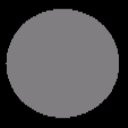
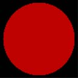
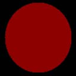

# Ambient Lighting (Direct3D 9)

Ambient lighting provides constant lighting for a scene. It lights all object vertices the same because it is not dependent on any other lighting factors such as vertex normals, light direction, light position, range, or attenuation. It is the fastest type of lighting but it produces the least realistic results. Direct3D contains a single global ambient light property that you can use without creating any light. Alternatively, you can set any light object to provide ambient lighting. The ambient lighting for a scene is described by the following equation.

Ambient Lighting = Cₐ\*\[Gₐ + sum(Atten<sub>i</sub>\*Spot<sub>i</sub>\*L<sub>ai</sub>)\]

Where:


| Parameter         | Default value | Type          | Description                                                                                                                    |
|-------------------|---------------|---------------|--------------------------------------------------------------------------------------------------------------------------------|
| Cₐ                | (0,0,0,0)     | D3DCOLORVALUE | Material ambient color                                                                                                         |
| Gₐ                | (0,0,0,0)     | D3DCOLORVALUE | Global ambient color                                                                                                           |
| Atten<sub>i</sub> | (0,0,0,0)     | D3DCOLORVALUE | Light attenuation of the ith light. See [Attenuation and Spotlight Factor (Direct3D 9)](attenuation-and-spotlight-factor.md). |
| Spot<sub>i</sub>  | (0,0,0,0)     | D3DVECTOR     | Spotlight factor of the ith light. See [Attenuation and Spotlight Factor (Direct3D 9)](attenuation-and-spotlight-factor.md).  |
| sum               | N/A           | N/A           | Sum of the ambient light                                                                                                       |
| L<sub>ai</sub>    | (0,0,0,0)     | D3DVECTOR     | Light ambient color of the ith light                                                                                           |


 

The value for Cₐ is either:

-   vertex color1, if AMBIENTMATERIALSOURCE = D3DMCS\_COLOR1, and the first vertex color is supplied in the vertex declaration.
-   vertex color2, if AMBIENTMATERIALSOURCE = D3DMCS\_COLOR2, and the second vertex color is supplied in vertex declaration.
-   material ambient color.

> [!Note]  
> If either AMBIENTMATERIALSOURCE option is used, and the vertex color is not provided, then the material ambient color is used.

 

To use the material ambient color, use SetMaterial as shown in the example code below.

Gₐ is the global ambient color. It is set using SetRenderState(D3DRS\_AMBIENT). There is one global ambient color in a Direct3D scene. This parameter is not associated with a Direct3D light object.

L<sub>ai</sub> is the ambient color of the ith light in the scene. Each Direct3D light has a set of properties, one of which is the ambient color. The term, sum(L<sub>ai</sub>) is a sum of all the ambient colors in the scene.

## Example

In this example, the object is colored using the scene ambient light and a material ambient color.


```
#define GRAY_COLOR  0x00bfbfbf

// create material
D3DMATERIAL9 mtrl;
ZeroMemory(&mtrl, sizeof(mtrl));
mtrl.Ambient.r = 0.75f;
mtrl.Ambient.g = 0.0f;
mtrl.Ambient.b = 0.0f;
mtrl.Ambient.a = 0.0f;
m_pd3dDevice->SetMaterial(&mtrl);
m_pd3dDevice->SetRenderState(D3DRS_AMBIENT, GRAY_COLOR);
```


According to the equation, the resulting color for the object vertices is a combination of the material color and the light color.

The following two illustrations show the material color, which is gray, and the light color, which is bright red.



The resulting scene is shown in the following illustration. The only object in the scene is a sphere. Ambient light lights all object vertices with the same color. It is not dependent on the vertex normal or the light direction. As a result, the sphere looks like a 2D circle because there is no difference in shading around the surface of the object.



To give objects a more realistic look, apply diffuse or specular lighting in addition to ambient lighting.

## Related topics

<dl> <dt>

[Mathematics of Lighting](mathematics-of-lighting.md)
</dt> </dl>

 

 


