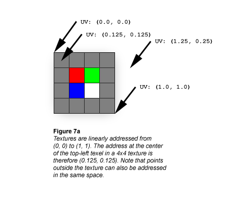
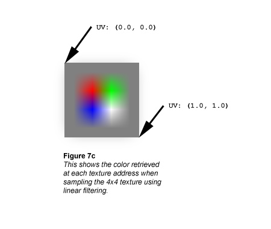

# Bilinear Texture Filtering (Direct3D 9)

Textures are always linearly addressed from (0.0, 0.0) at the top-left corner to (1.0, 1.0) at the bottom-right corner, as shown in the following illustration.



Textures are usually represented as if they were composed of solid blocks of color, but it's actually more correct to think of textures the same way you should think of the raster display: Each texel is defined at the exact center of a grid cell, as shown in the following illustration.


If you ask the texture sampler for this texture's color at UV coordinates (0.375, 0.375) you'll get solid red (255, 0, 0). That makes perfect sense because the exact center of the red texel cell is at UV (0.375, 0.375). What if you ask the sampler for the texture's color at UV (0.25, 0.25)? That's not quite as easy, because the point at UV (0.25, 0.25) lies at the exact corner of 4 texels.

The simplest scheme is simply to have the sampler return the color of the closest texel; this is called Point filtering (see [Nearest-Point Sampling (Direct3D 9)](nearest-point-sampling.md)), and is usually undesirable due to grainy or blocky results. Point-sampling our texture at UV (0.25, 0.25) shows another subtle problem with nearest-point filtering: there are four texels equidistant from the sampling point, so there's no single nearest texel. One of those four texels will be chosen as the returned color, but the selection depends on how the coordinate is rounded, which may introduce tearing artifacts (see the Nearest-Point Sampling article in the SDK).

A slightly more accurate and more common filtering scheme is to calculate the weighted average of the 4 texels closest to the sampling point; this is called Bilinear filtering, and the extra computational cost is usually negligible because this routine is implemented in modern graphics hardware. Here are the colors we get at a few different sample points using bilinear filtering:


```
UV: (0.5, 0.5)
```


This point is at the exact border between red, green, blue, and white texels. The color the sampler returns is gray:


```
  0.25 * (255, 0, 0)
  0.25 * (0, 255, 0) 
  0.25 * (0, 0, 255) 
## + 0.25 * (255, 255, 255) 
------------------------
= (128, 128, 128)
```


```
UV: (0.5, 0.375)
```


This point is at the midpoint of the border between red and green texels. The color the sampler returns is yellow-gray (note that the contributions of the blue and white texels are scaled to 0):


```
  0.5 * (255, 0, 0)
  0.5 * (0, 255, 0) 
  0.0 * (0, 0, 255) 
## + 0.0 * (255, 255, 255) 
------------------------
= (128, 128, 0)
```


```
UV: (0.375, 0.375)
```


This is the address of the red texel, which is the returned color (all other texels in the filtering calculation are weighted to 0):


```
  1.0 * (255, 0, 0)
  0.0 * (0, 255, 0) 
  0.0 * (0, 0, 255) 
## + 0.0 * (255, 255, 255) 
------------------------
= (255, 0, 0)
```


Compare these calculations against the following illustration, which shows what happens if the bilinear filtering calculation is performed at every texture address across the 4x4 texture.



## Related topics

<dl> <dt>

[Texture Filtering](texture-filtering.md)
</dt> </dl>

 

 


