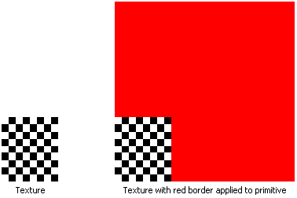

# Border Color Texture Address Mode (Direct3D 9)

The border color texture address mode, identified by the D3DTADDRESS\_BORDER member of the [**D3DTEXTUREADDRESS**](direct3d9.d3dtextureaddress) enumerated type, causes Direct3D to use an arbitrary color, known as the border color, for any texture coordinates outside the range of 0.0 through 1.0, inclusive.

In the following illustration, the application specifies that the texture be applied to the primitive using a red border.

Applications set the border color by calling [**IDirect3DDevice9::SetSamplerState**](idirect3ddevice9--setsamplerstate.md). Set the first parameter for the call to the desired texture stage identifier, the second parameter to the D3DSAMP\_BORDERCOLOR stage state value, and the third parameter to the new RGBA border color.

## Related topics

<dl> <dt>

[Texture Addressing Modes](texture-addressing-modes.md)
</dt> </dl>

 

 

