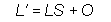

# Bump Mapping Formulas (Direct3D 9)

Direct3D applies the following formulas to the DU and DV components in each bump map pixel.

In these formulas, the DU and DV variables are taken directly from a bump map pixel and transformed by a 2x2 matrix to produce the output delta values DU' and DV'. The system uses the output values to modify the texture coordinates that address the environment map in the next texture stage. The coefficients of the transformation matrix are set though the D3DTSS\_BUMPENVMAT00, D3DTSS\_BUMPENVMAT10, D3DTSS\_BUMPENVMAT01, and D3DTSS\_BUMPENVMAT11 texture stage states.

In addition to the u and v delta values, the system can compute a luminance value that it uses to modulate the color of the environment map in the next blending stage, as shown in the following formula.

In this formula, L' is the output luminance being computed. The L variable is the luminance value taken from a bump map pixel, which is multiplied by the scaling factor, S, and offset by the value in the variable O. The D3DTSS\_BUMPENVLSCALE and D3DTSS\_BUMPENVLOFFSET texture stage states control the values for the S and O variables in the formula. This formula is only applied when the texture blending operation for the stage that contains the bump map is set to D3DTOP\_BUMPENVMAPLUMINANCE. When using D3DTOP\_BUMPENVMAP, the system uses a value of 1.0 for L'.

After computing the output delta values DU' and DV', the system adds them to the texture coordinates in the next texture stage, and modulates the chosen color by the luminance to produce the color applied to the polygon.

## Related topics

<dl> <dt>

[Bump Mapping](bump-mapping.md)
</dt> </dl>

 

 

