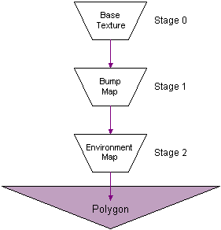

# Bump Mapping (Direct3D 9)

Bump mapping is a special form of specular or diffuse environment mapping that simulates the reflections of finely tessellated objects without requiring extremely high polygon counts. Bump mapping implemented by Direct3D can be accurately described as per-pixel texture coordinate perturbation of specular or diffuse environment maps, because you provide information about the contour of the bump map in terms of delta values, which the system applies to the u and v texture coordinates of an environment map in the next texture stage. The delta values are encoded in the pixel format of the bump map surface (see [Bump Map Pixel Formats](bump-map-pixel-formats.md)).

Bump mapping relies on blending multiple textures. This means the device must support at least two blending stages; one for the bump map and another for an environment map. A minimum of three texture blending stages are required to apply an additional base texture map, which is the most common case. The following diagram shows the relationships between the base texture, the bump map, and the environment map in the texture blending cascade.

You must prepare the texture stages appropriately to enable bump mapping. The following topics introduce bump mapping, and provide details about how you can use it in your applications:

-   [Bump Map Pixel Formats](bump-map-pixel-formats.md)
-   [Bump Mapping Formulas](bump-mapping-formulas.md)
-   [Using Bump Mapping](using-bump-mapping.md)

Direct3D does not natively support height maps; they are merely a convenient format in which to store and visualize contour data. Your application can store contour information in any format, or even generate a procedural bump map.

## Related topics

<dl> <dt>

[Pixel Pipeline](pixel-pipeline.md)
</dt> </dl>

 

 

