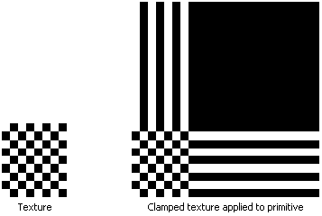

# Clamp Texture Address Mode (Direct3D 9)

The clamp texture address mode, identified by the D3DTADDRESS\_CLAMP member of the [**D3DTEXTUREADDRESS**](./d3dtextureaddress.md) enumerated type, causes Direct3D to clamp your texture coordinates to the \[0.0, 1.0\] range. That is, it applies the texture once, then smears the color of edge pixels. For example, suppose that your application creates a square primitive and assigns texture coordinates of (0.0,0.0), (0.0,3.0), (3.0,3.0), and (3.0,0.0) to the primitive's vertices. Setting the texture addressing mode to D3DTADDRESS\_CLAMP results in the texture being applied once. The pixel colors at the top of the columns and the end of the rows are extended to the top and right of the primitive respectively.

The following illustration shows a clamped texture.

## Related topics

<dl> <dt>

[Texture Addressing Modes](texture-addressing-modes.md)
</dt> </dl>

 

 
