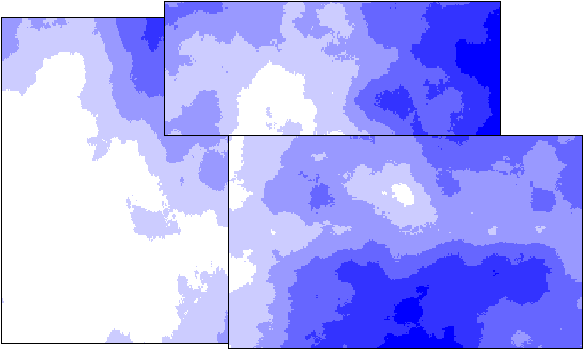
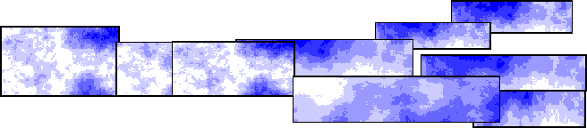

# Clouds, Smoke, and Vapor Trails (Direct3D 9)

Clouds, smoke, and vapor trails can all be created by an extension of the billboarding technique. See [Billboarding (Direct3D 9)](billboarding.md). By rotating the billboard on two axes instead of one, your application can enable the user to view a billboard from any angle. Typically, an application rotates the billboard on the horizontal and vertical axes.

To make a simple cloud, your application can rotate a rectangular primitive on one or two axes so that the primitive faces the user. A cloud-like texture can then be applied to the primitive with transparency. For details on applying transparent textures to primitives, see [Texture Blending (Direct3D 9)](texture-blending.md). You can animate the cloud by applying a series of textures over time.

An application can create more complex clouds by forming them from a group of primitives. Each part of the cloud is a rectangular primitive. The primitives can be moved independently over time to give the appearance of a dynamic mist. The following illustration shows this concept.

The appearance of smoke is displayed in a manner similar to clouds. It typically requires multiple billboards, like complex clouds. Smoke usually billows and rises over time, so the billboards that make up the smoke plume need to move accordingly. You may need to add more billboards as the plume rises and disperses.

A vapor trail is a smoke plume that doesn't rise. However, like a smoke plume, it disperses over time. The following illustration shows the technique of using billboards to simulate a vapor trail.

## Related topics

<dl> <dt>

[Alpha Examples](alpha-examples.md)
</dt> </dl>

 

 

