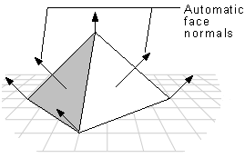

# Comparing Shading Modes (Direct3D 9)

In flat shading mode, the following pyramid is displayed with a sharp edge between adjoining faces. In Gouraud shading mode, however, shading values are interpolated across the edge, and the final appearance is of a curved surface.

Gouraud shading lights flat surfaces more realistically than flat shading. A face in the flat shading mode is a uniform color, but Gouraud shading enables light to fall across a face more correctly. This effect is particularly obvious if there is a nearby point source.

Gouraud shading smoothes the sharp edges between polygons that are visible with flat shading. However, it can result in mach bands, which are bands of color or light that are not smoothly blended across adjacent polygons. Your application can reduce the appearance of Mach bands by increasing the number of polygons in an object, increasing screen resolution, or increasing the color depth of the application.

Gouraud shading can miss some details. For example, in the following illustration, a spotlight is completely contained within a polygon face.

In this case, Gouraud shading, which interpolates between vertices, would miss the spotlight altogether; the face would be rendered as though the spotlight did not exist.

## Related topics

<dl> <dt>

[Shading](shading.md)
</dt> </dl>

 

 

