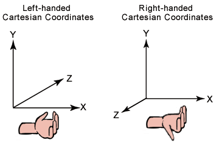

# Coordinate Systems (Direct3D 9)

Typically 3D graphics applications use two types of Cartesian coordinate systems: left-handed and right-handed. In both coordinate systems, the positive x-axis points to the right, and the positive y-axis points up. You can remember which direction the positive z-axis points by pointing the fingers of either your left or right hand in the positive x-direction and curling them into the positive y-direction. The direction your thumb points, either toward or away from you, is the direction that the positive z-axis points for that coordinate system. The following illustration shows these two coordinate systems.

Direct3D uses a left-handed coordinate system. If you are porting an application that is based on a right-handed coordinate system, you must make two changes to the data passed to Direct3D.

-   Flip the order of triangle vertices so that the system traverses them clockwise from the front. In other words, if the vertices are v0, v1, v2, pass them to Direct3D as v0, v2, v1.
-   Use the view matrix to scale world space by -1 in the z-direction. To do this, flip the sign of the \_31, \_32, \_33, and \_34 member of the [**D3DMATRIX**](d3dmatrix.md) structure that you use for your view matrix.

To obtain what amounts to a right-handed world, use the [**D3DXMatrixPerspectiveRH**](d3dxmatrixperspectiverh.md) and [**D3DXMatrixOrthoRH**](d3dxmatrixorthorh.md) functions to define the projection transform. However, be careful to use the corresponding [**D3DXMatrixLookAtRH**](d3dxmatrixlookatrh.md) function, reverse the backface-culling order, and lay out the cube maps accordingly.

Although left-handed and right-handed coordinates are the most common systems, there is a variety of other coordinate systems used in 3D software. For example, it is not unusual for 3D modeling applications to use a coordinate system in which the y-axis points toward or away from the viewer, and the z-axis points up.

Formally, the orientation of a set of basis vectors (i.e. a coordinate system) can be found by the computing the determinant of the matrix defined by the particular set of basis vectors. If the determinant is positive, the basis is said to be "positively" oriented (or right-handed). If the determinant is negative, the basis is said to be "negatively" oriented (or left-handed). For an explanation of what a determinant is, see any linear algebra resource.

Informally, you can use the "right/left hand rule" to determine if a given set of basis vectors form either a right or left handed coordinate system.

The essential operations performed on objects defined in a 3D coordinate system are translation, rotation, and scaling. You can combine these basic transformations to create a transform matrix. For details, see [Transforms (Direct3D 9)](transforms.md).

When you combine these operations, the results are not commutative; the order in which you multiply matrices is important.

## Related topics

<dl> <dt>

[Coordinate Systems and Geometry](coordinate-systems-and-geometry.md)
</dt> </dl>

 

 

