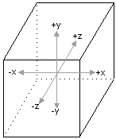
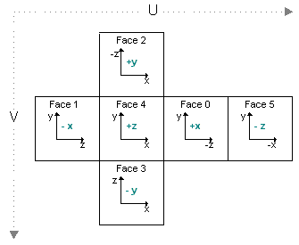
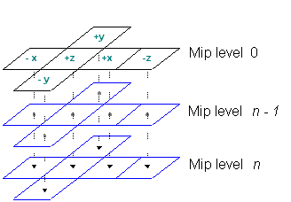
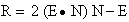
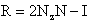

# Cubic Environment Mapping (Direct3D 9)

Cubic environment maps - sometimes referred to as cube maps - are textures that contain image data representing the scene surrounding an object, as if the object were in the center of a cube. Each face of the cubic environment map covers a 90-degree field of view in the horizontal and vertical, and there are six faces per cube map. The orientation of the faces is shown in the following illustration.



Each face of the cube is oriented perpendicular to the x/y, y/z, or x/z plane, in world space. The following illustration shows how each plane corresponds to a face.



Cubic environment maps are implemented as a series of texture objects. Applications can use static images for cubic environment mapping, or they can render into the faces of the cube map to perform dynamic environment mapping. This technique requires that the cube-map surfaces be valid render-target surfaces, created with the D3DUSAGE\_RENDERTARGET flag set.

The faces of a cube map don't need to contain extremely detailed renderings of the surrounding scene. In most cases, environment maps are applied to curved surfaces. Given the amount of curvature used by most applications, the resulting reflective distortion makes extreme detail in the environment map wasteful in terms of memory and rendering overhead.

## Mipmapped Cubic Environment Maps

Cube maps can be mipmapped. To create a mipmapped cube map, set the Levels parameter of the [**CreateCubeTexture**](/windows/win32/api/d3d9helper/nf-d3d9helper-idirect3ddevice9-createcubetexture) method to the number of levels that you want. You can envision the topography of these surfaces as shown in the following diagram.



Applications that create mipmapped cubic environment maps can access each face by calling the [**GetCubeMapSurface**](/windows/desktop/api) method. Start by setting the appropriate value from the [**D3DCUBEMAP\_FACES**](./d3dcubemap-faces.md) enumerated type, as discussed in [Creating Cubic Environment Map Surfaces (Direct3D 9)](creating-cubic-environment-map-surfaces.md). Next, select the level to retrieve by setting the **GetCubeMapSurface** level parameter to the mipmap level that you want. Remember that 0 corresponds with the top-level image.

## Texture Coordinates for Cubic Environment Maps

Texture coordinates that index a cubic environment map aren't simple u, v style coordinates, as used when standard textures are applied. In fact, cubic environment maps don't use texture coordinates at all. In place of a set of texture coordinates, cubic environment maps require a 3D vector. You must take care to specify a proper vertex format. In addition to telling the system how many sets of texture coordinates your application uses, you must provide information about how many elements are in each set. Direct3D offers the [**D3DFVF\_TEXCOORDSIZEN**](d3dfvf-texcoordsizen.md) set of macros for this purpose. These macros accept a single parameter, identifying the index of the texture coordinate set for which the size is being described. In the case of a 3D vector, you include the bit pattern created by the D3DFVF\_TEXCOORDSIZE3 macro. The following code example shows how this macro is used.


```
// Create a flexible vertex format descriptor for a vertex that contains
//   a position, normal, and one set of 3D texture coordinates.

DWORD dwFVF = D3DFVF_XYZ | D3DFVF_NORMAL | D3DFVF_TEX1 | D3DFVF_TEXCOORDSIZE3(0); 
```


In some cases, such as diffuse light mapping, you use the camera-space vertex normal for the vector. In other cases, like specular environment mapping, you use a reflection vector. Because transformed vertex normals are widely understood, the information here concentrates on computing a reflection vector.

Computing a reflection vector on your own requires understanding of the position of each vertex, and of a vector from the viewpoint to that vertex. Direct3D can automatically compute the reflection vectors for your geometry. Using this feature saves memory because you don't need to include texture coordinates for the environment map. It also reduces bandwidth and, in the case of a T&L HAL Device, it can be significantly faster than the computations that your application can make on its own. To use this feature, in the texture stage that contains the cubic environment map, set the D3DTSS\_TEXCOORDINDEX texture stage state to a combination of the D3DTSS\_TCI\_CAMERASPACEREFLECTIONVECTOR member of [**D3DTEXTURESTAGESTATETYPE**](./d3dtexturestagestatetype.md) and the index of a texture coordinate set. In some situations, like diffuse light mapping, you might use the D3DTSS\_TCI\_CAMERASPACENORMAL member of **D3DTEXTURESTAGESTATETYPE**, which causes the system to use the transformed, camera-space, vertex normal as the addressing vector for the texture. The index is only used by the system to determine the wrapping mode for the texture.

The following code example shows how this value is used.


```
// The m_d3dDevice variable is a valid pointer
// to an IDirect3DDevice9 interface.

// Automatically generate texture coordinates for stage 2.
// This assumes that stage 2 is assigned a cube map.
// Use the wrap mode from the texture coordinate set at index 1.

m_d3dDevice->SetTextureStageState( 2, D3DTSS_TEXCOORDINDEX,
                                   D3DTSS_TCI_CAMERASPACEREFLECTIONVECTOR | 1); 
```


When you enable automatic texture coordinate generation, the system uses one of two formulas to compute the reflection vector for each vertex. When the D3DRS\_LOCALVIEWER render state is set to **TRUE**, the following formula is used.



In the preceding formula, R is the reflection vector being computed, E is the normalized position-to-eye vector, and N is the camera-space vertex normal.

When the D3DRS\_LOCALVIEWER render state is set to **FALSE**, the system uses the following formula.



The R and N elements in this formula are identical to the previous formula. The N<sub>Z</sub> element is the world-space z of the vertex normal, and I is the vector (0,0,1) of an infinitely distant viewpoint. The system uses the reflection vector from either formula to select and address the appropriate face of the cube map.

> [!Note]  
> In most cases, applications should enable automatic normalization of vertex normals. To do this, set D3DRS\_NORMALIZENORMALS to **TRUE**. If you do not enable this render state, the appearance of the environment map will be drastically different than you might expect.

 

Additional information is contained in the following topic.

-   [Creating Cubic Environment Map Surfaces (Direct3D 9)](creating-cubic-environment-map-surfaces.md)

## Related topics

<dl> <dt>

[Environment Mapping](environment-mapping.md)
</dt> </dl>

 

 
