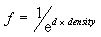
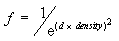
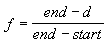

# D3DFOGMODE enumeration

Defines constants that describe the fog mode.

## Syntax


```C++
typedef enum D3DFOGMODE { 
  D3DFOG_NONE         = 0,
  D3DFOG_EXP          = 1,
  D3DFOG_EXP2         = 2,
  D3DFOG_LINEAR       = 3,
  D3DFOG_FORCE_DWORD  = 0x7fffffff
} D3DFOGMODE, *LPD3DFOGMODE;
```


## Constants

<dl> <dt>

<span id="D3DFOG_NONE"></span><span id="d3dfog_none"></span>**D3DFOG\_NONE**
</dt> <dd>

No fog effect.

</dd> <dt>

<span id="D3DFOG_EXP"></span><span id="d3dfog_exp"></span>**D3DFOG\_EXP**
</dt> <dd>

Fog effect intensifies exponentially, according to the following formula.



</dd> <dt>

<span id="D3DFOG_EXP2"></span><span id="d3dfog_exp2"></span>**D3DFOG\_EXP2**
</dt> <dd>

Fog effect intensifies exponentially with the square of the distance, according to the following formula.



</dd> <dt>

<span id="D3DFOG_LINEAR"></span><span id="d3dfog_linear"></span>**D3DFOG\_LINEAR**
</dt> <dd>

Fog effect intensifies linearly between the start and end points, according to the following formula.



This is the only fog mode currently supported.

</dd> <dt>

<span id="D3DFOG_FORCE_DWORD"></span><span id="d3dfog_force_dword"></span>**D3DFOG\_FORCE\_DWORD**
</dt> <dd>

Forces this enumeration to compile to 32 bits in size. Without this value, some compilers would allow this enumeration to compile to a size other than 32 bits. This value is not used.

</dd> </dl>

## Remarks

The values in this enumerated type are used by the D3DRS\_FOGTABLEMODE and D3DRS\_FOGVERTEXMODE render states.

Fog can be considered a measure of visibility: the lower the fog value produced by a fog equation, the less visible an object is.

## Requirements


| Requirement | Value |
|-------------------|----------------------------------------------------------------------------------------|
| Header<br/> | <dl> <dt>D3D9Types.h</dt> </dl> |


## See also

<dl> <dt>

[Direct3D Enumerations](dx9-graphics-reference-d3d-enums.md)
</dt> <dt>

[**D3DRENDERSTATETYPE**](./d3drenderstatetype.md)
</dt> </dl>

 

 
