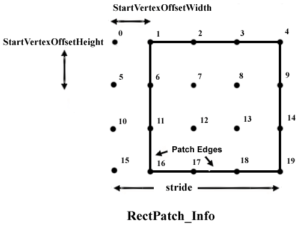

# D3DRECTPATCH\_INFO structure

Describes a rectangular high-order patch.

## Syntax


```C++
typedef struct D3DRECTPATCH_INFO {
  UINT          StartVertexOffsetWidth;
  UINT          StartVertexOffsetHeight;
  UINT          Width;
  UINT          Height;
  UINT          Stride;
  D3DBASISTYPE  Basis;
  D3DDEGREETYPE Degree;
} D3DRECTPATCH_INFO, *LPD3DRECTPATCH_INFO;
```


## Members

<dl> <dt>

**StartVertexOffsetWidth**
</dt> <dd>

Type: **[**UINT**](../winprog/windows-data-types.md)**

</dd> <dd>

Starting vertex offset width, in number of vertices.

</dd> <dt>

**StartVertexOffsetHeight**
</dt> <dd>

Type: **[**UINT**](../winprog/windows-data-types.md)**

</dd> <dd>

Starting vertex offset height, in number of vertices.

</dd> <dt>

**Width**
</dt> <dd>

Type: **[**UINT**](../winprog/windows-data-types.md)**

</dd> <dd>

Width of each vertex, in number of vertices.

</dd> <dt>

**Height**
</dt> <dd>

Type: **[**UINT**](../winprog/windows-data-types.md)**

</dd> <dd>

Height of each vertex, in number of vertices.

</dd> <dt>

**Stride**
</dt> <dd>

Type: **[**UINT**](../winprog/windows-data-types.md)**

</dd> <dd>

Width of the imaginary two-dimensional vertex array, which occupies the same space as the vertex buffer. For an example, see the diagram below.

</dd> <dt>

**Basis**
</dt> <dd>

Type: **[**D3DBASISTYPE**](./d3dbasistype.md)**

</dd> <dd>

Member of the [**D3DBASISTYPE**](./d3dbasistype.md) enumerated type, defining the basis type for the rectangular high-order patch.


| Value                 | Order supported            | Width and height                  |
|-----------------------|----------------------------|-----------------------------------|
| D3DBASIS\_BEZIER      | Linear, cubic, and quintic | Width = height = (DWORD)order + 1 |
| D3DBASIS\_BSPLINE     | Linear, cubic, and quintic | Width = height > (DWORD)order  |
| D3DBASIS\_INTERPOLATE | Cubic                      | Width = height > (DWORD)order  |


 

</dd> <dt>

**Degree**
</dt> <dd>

Type: **[**D3DDEGREETYPE**](./d3ddegreetype.md)**

</dd> <dd>

Member of the [**D3DDEGREETYPE**](./d3ddegreetype.md) enumerated type, defining the degree for the rectangular patch.

</dd> </dl>

## Remarks

The following diagram identifies the parameters that specify a rectangle patch.



Each of the vertices in the vertex buffer is shown as a black dot. In this case, the vertex buffer has 20 vertices in it, 16 of which are in the rectangle patch. The stride is the number of vertices in the width of the vertex buffer, in this case five. The x offset to the first vertex is called the StartIndexVertexWidth and is in this case 1. The y offset to the first patch vertex is called the StartIndexVertexHeight and is in this case 0.

To render a stream of individual rectangular patches (non-mosaic), you should interpret your geometry as a long narrow (1 x N) rectangular patch. The **D3DRECTPATCH\_INFO** structure for such a strip (cubic Bézier) would be set up in the following manner.


```
    
D3DRECTPATCH_INFO RectInfo;

RectInfo.Width = 4;
RectInfo.Height = 4;
RectInfo.Stride = 4;
RectInfo.Basis = D3DBASIS_BEZIER;
RectInfo.Order = D3DORDER_CUBIC;
RectInfo.StartVertexOffsetWidth = 0;
RectInfo.StartVertexOffsetHeight = 4*i;  // The variable i is the index of the 
//   patch you want to render.
```


## Requirements


| Requirement | Value |
|-------------------|----------------------------------------------------------------------------------------|
| Header<br/> | <dl> <dt>D3D9Types.h</dt> </dl> |


## See also

<dl> <dt>

[Direct3D Structures](dx9-graphics-reference-d3d-structures.md)
</dt> <dt>

[**DrawRectPatch**](/windows/win32/api/d3d9helper/nf-d3d9helper-idirect3ddevice9-drawrectpatch)
</dt> <dt>

[**D3DXTessellateRectPatch**](d3dxtessellaterectpatch.md)
</dt> </dl>

 

 
