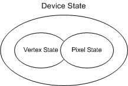

# D3DSTATEBLOCKTYPE enumeration

Predefined sets of pipeline state used by state blocks (see [State Blocks Save and Restore State (Direct3D 9)](state-blocks-save-and-restore-state.md)).

## Syntax


```C++
typedef enum _D3DSTATEBLOCKTYPE { 
  D3DSBT_ALL          = 1,
  D3DSBT_PIXELSTATE   = 2,
  D3DSBT_VERTEXSTATE  = 3,
  D3DSBT_FORCE_DWORD  = 0x7fffffff
} D3DSTATEBLOCKTYPE;
```


## Constants

<dl> <dt>

<span id="D3DSBT_ALL"></span><span id="d3dsbt_all"></span>**D3DSBT\_ALL**
</dt> <dd>

Capture the current [device state](saving-all-device-states-with-a-stateblock.md).

</dd> <dt>

<span id="D3DSBT_PIXELSTATE"></span><span id="d3dsbt_pixelstate"></span>**D3DSBT\_PIXELSTATE**
</dt> <dd>

Capture the current [pixel state](saving-pixel-states-with-a-stateblock.md).

</dd> <dt>

<span id="D3DSBT_VERTEXSTATE"></span><span id="d3dsbt_vertexstate"></span>**D3DSBT\_VERTEXSTATE**
</dt> <dd>

Capture the current [vertex state](saving-vertex-states-with-a-stateblock.md).

</dd> <dt>

<span id="D3DSBT_FORCE_DWORD"></span><span id="d3dsbt_force_dword"></span>**D3DSBT\_FORCE\_DWORD**
</dt> <dd>

Forces this enumeration to compile to 32 bits in size. Without this value, some compilers would allow this enumeration to compile to a size other than 32 bits. Do not use this value.

</dd> </dl>

## Remarks

As the following diagram shows, vertex and pixel state are both subsets of device state.



There are only a few states that are considered both vertex and pixel state. These states are:

-   Render state: D3DRS\_FOGDENSITY
-   Render state: D3DRS\_FOGSTART
-   Render state: D3DRS\_FOGEND
-   Texture state: D3DTSS\_TEXCOORDINDEX
-   Texture state: D3DTSS\_TEXTURETRANSFORMFLAGS

## Requirements


| Requirement | Value |
|-------------------|----------------------------------------------------------------------------------------|
| Header<br/> | <dl> <dt>D3D9Types.h</dt> </dl> |


## See also

<dl> <dt>

[Direct3D Enumerations](dx9-graphics-reference-d3d-enums.md)
</dt> <dt>

[**IDirect3DDevice9::CreateStateBlock**](/windows/win32/api/d3d9helper/nf-d3d9helper-idirect3ddevice9-createstateblock)
</dt> <dt>

**IDirect3DDevice9::CreateStateBlock**
</dt> </dl>

 

 
