# D3DTEXTUREOP enumeration

Defines per-stage texture-blending operations.

## Syntax


```C++
typedef enum D3DTEXTUREOP { 
  D3DTOP_DISABLE                    = 1,
  D3DTOP_SELECTARG1                 = 2,
  D3DTOP_SELECTARG2                 = 3,
  D3DTOP_MODULATE                   = 4,
  D3DTOP_MODULATE2X                 = 5,
  D3DTOP_MODULATE4X                 = 6,
  D3DTOP_ADD                        = 7,
  D3DTOP_ADDSIGNED                  = 8,
  D3DTOP_ADDSIGNED2X                = 9,
  D3DTOP_SUBTRACT                   = 10,
  D3DTOP_ADDSMOOTH                  = 11,
  D3DTOP_BLENDDIFFUSEALPHA          = 12,
  D3DTOP_BLENDTEXTUREALPHA          = 13,
  D3DTOP_BLENDFACTORALPHA           = 14,
  D3DTOP_BLENDTEXTUREALPHAPM        = 15,
  D3DTOP_BLENDCURRENTALPHA          = 16,
  D3DTOP_PREMODULATE                = 17,
  D3DTOP_MODULATEALPHA_ADDCOLOR     = 18,
  D3DTOP_MODULATECOLOR_ADDALPHA     = 19,
  D3DTOP_MODULATEINVALPHA_ADDCOLOR  = 20,
  D3DTOP_MODULATEINVCOLOR_ADDALPHA  = 21,
  D3DTOP_BUMPENVMAP                 = 22,
  D3DTOP_BUMPENVMAPLUMINANCE        = 23,
  D3DTOP_DOTPRODUCT3                = 24,
  D3DTOP_MULTIPLYADD                = 25,
  D3DTOP_LERP                       = 26,
  D3DTOP_FORCE_DWORD                = 0x7fffffff
} D3DTEXTUREOP, *LPD3DTEXTUREOP;
```


## Constants

<dl> <dt>

<span id="D3DTOP_DISABLE"></span><span id="d3dtop_disable"></span>**D3DTOP\_DISABLE**
</dt> <dd>

Disables output from this texture stage and all stages with a higher index. To disable texture mapping, set this as the color operation for the first texture stage (stage 0). Alpha operations cannot be disabled when color operations are enabled. Setting the alpha operation to D3DTOP\_DISABLE when color blending is enabled causes undefined behavior.

</dd> <dt>

<span id="D3DTOP_SELECTARG1"></span><span id="d3dtop_selectarg1"></span>**D3DTOP\_SELECTARG1**
</dt> <dd>

Use this texture stage's first color or alpha argument, unmodified, as the output. This operation affects the color argument when used with the D3DTSS\_COLOROP texture-stage state, and the alpha argument when used with D3DTSS\_ALPHAOP.

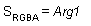

</dd> <dt>

<span id="D3DTOP_SELECTARG2"></span><span id="d3dtop_selectarg2"></span>**D3DTOP\_SELECTARG2**
</dt> <dd>

Use this texture stage's second color or alpha argument, unmodified, as the output. This operation affects the color argument when used with the D3DTSS\_COLOROP texture stage state, and the alpha argument when used with D3DTSS\_ALPHAOP.

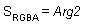

</dd> <dt>

<span id="D3DTOP_MODULATE"></span><span id="d3dtop_modulate"></span>**D3DTOP\_MODULATE**
</dt> <dd>

Multiply the components of the arguments.

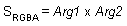

</dd> <dt>

<span id="D3DTOP_MODULATE2X"></span><span id="d3dtop_modulate2x"></span>**D3DTOP\_MODULATE2X**
</dt> <dd>

Multiply the components of the arguments, and shift the products to the left 1 bit (effectively multiplying them by 2) for brightening.


</dd> <dt>

<span id="D3DTOP_MODULATE4X"></span><span id="d3dtop_modulate4x"></span>**D3DTOP\_MODULATE4X**
</dt> <dd>

Multiply the components of the arguments, and shift the products to the left 2 bits (effectively multiplying them by 4) for brightening.

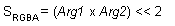

</dd> <dt>

<span id="D3DTOP_ADD"></span><span id="d3dtop_add"></span>**D3DTOP\_ADD**
</dt> <dd>

Add the components of the arguments.

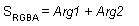

</dd> <dt>

<span id="D3DTOP_ADDSIGNED"></span><span id="d3dtop_addsigned"></span>**D3DTOP\_ADDSIGNED**
</dt> <dd>

Add the components of the arguments with a - 0.5 bias, making the effective range of values from - 0.5 through 0.5.

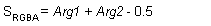

</dd> <dt>

<span id="D3DTOP_ADDSIGNED2X"></span><span id="d3dtop_addsigned2x"></span>**D3DTOP\_ADDSIGNED2X**
</dt> <dd>

Add the components of the arguments with a - 0.5 bias, and shift the products to the left 1 bit.

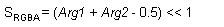

</dd> <dt>

<span id="D3DTOP_SUBTRACT"></span><span id="d3dtop_subtract"></span>**D3DTOP\_SUBTRACT**
</dt> <dd>

Subtract the components of the second argument from those of the first argument.

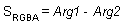

</dd> <dt>

<span id="D3DTOP_ADDSMOOTH"></span><span id="d3dtop_addsmooth"></span>**D3DTOP\_ADDSMOOTH**
</dt> <dd>

Add the first and second arguments; then subtract their product from the sum.

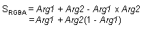

</dd> <dt>

<span id="D3DTOP_BLENDDIFFUSEALPHA"></span><span id="d3dtop_blenddiffusealpha"></span>**D3DTOP\_BLENDDIFFUSEALPHA**
</dt> <dd>

Linearly blend this texture stage, using the interpolated alpha from each vertex.

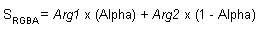

</dd> <dt>

<span id="D3DTOP_BLENDTEXTUREALPHA"></span><span id="d3dtop_blendtexturealpha"></span>**D3DTOP\_BLENDTEXTUREALPHA**
</dt> <dd>

Linearly blend this texture stage, using the alpha from this stage's texture.


</dd> <dt>

<span id="D3DTOP_BLENDFACTORALPHA"></span><span id="d3dtop_blendfactoralpha"></span>**D3DTOP\_BLENDFACTORALPHA**
</dt> <dd>

Linearly blend this texture stage, using a scalar alpha set with the D3DRS\_TEXTUREFACTOR render state.


</dd> <dt>

<span id="D3DTOP_BLENDTEXTUREALPHAPM"></span><span id="d3dtop_blendtexturealphapm"></span>**D3DTOP\_BLENDTEXTUREALPHAPM**
</dt> <dd>

Linearly blend a texture stage that uses a premultiplied alpha.

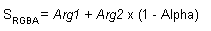

</dd> <dt>

<span id="D3DTOP_BLENDCURRENTALPHA"></span><span id="d3dtop_blendcurrentalpha"></span>**D3DTOP\_BLENDCURRENTALPHA**
</dt> <dd>

Linearly blend this texture stage, using the alpha taken from the previous texture stage.


</dd> <dt>

<span id="D3DTOP_PREMODULATE"></span><span id="d3dtop_premodulate"></span>**D3DTOP\_PREMODULATE**
</dt> <dd>

D3DTOP\_PREMODULATE is set in stage n. The output of stage n is arg1. Additionally, if there is a texture in stage n + 1, any D3DTA\_CURRENT in stage n + 1 is premultiplied by texture in stage n + 1.

</dd> <dt>

<span id="D3DTOP_MODULATEALPHA_ADDCOLOR"></span><span id="d3dtop_modulatealpha_addcolor"></span>**D3DTOP\_MODULATEALPHA\_ADDCOLOR**
</dt> <dd>

Modulate the color of the second argument, using the alpha of the first argument; then add the result to argument one. This operation is supported only for color operations (D3DTSS\_COLOROP).

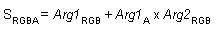

</dd> <dt>

<span id="D3DTOP_MODULATECOLOR_ADDALPHA"></span><span id="d3dtop_modulatecolor_addalpha"></span>**D3DTOP\_MODULATECOLOR\_ADDALPHA**
</dt> <dd>

Modulate the arguments; then add the alpha of the first argument. This operation is supported only for color operations (D3DTSS\_COLOROP).

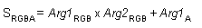

</dd> <dt>

<span id="D3DTOP_MODULATEINVALPHA_ADDCOLOR"></span><span id="d3dtop_modulateinvalpha_addcolor"></span>**D3DTOP\_MODULATEINVALPHA\_ADDCOLOR**
</dt> <dd>

Similar to D3DTOP\_MODULATEALPHA\_ADDCOLOR, but use the inverse of the alpha of the first argument. This operation is supported only for color operations (D3DTSS\_COLOROP).

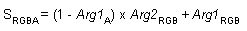

</dd> <dt>

<span id="D3DTOP_MODULATEINVCOLOR_ADDALPHA"></span><span id="d3dtop_modulateinvcolor_addalpha"></span>**D3DTOP\_MODULATEINVCOLOR\_ADDALPHA**
</dt> <dd>

Similar to D3DTOP\_MODULATECOLOR\_ADDALPHA, but use the inverse of the color of the first argument. This operation is supported only for color operations (D3DTSS\_COLOROP).

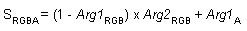

</dd> <dt>

<span id="D3DTOP_BUMPENVMAP"></span><span id="d3dtop_bumpenvmap"></span>**D3DTOP\_BUMPENVMAP**
</dt> <dd>

Perform per-pixel bump mapping, using the environment map in the next texture stage, without luminance. This operation is supported only for color operations (D3DTSS\_COLOROP).

</dd> <dt>

<span id="D3DTOP_BUMPENVMAPLUMINANCE"></span><span id="d3dtop_bumpenvmapluminance"></span>**D3DTOP\_BUMPENVMAPLUMINANCE**
</dt> <dd>

Perform per-pixel bump mapping, using the environment map in the next texture stage, with luminance. This operation is supported only for color operations (D3DTSS\_COLOROP).

</dd> <dt>

<span id="D3DTOP_DOTPRODUCT3"></span><span id="d3dtop_dotproduct3"></span>**D3DTOP\_DOTPRODUCT3**
</dt> <dd>

Modulate the components of each argument as signed components, add their products; then replicate the sum to all color channels, including alpha. This operation is supported for color and alpha operations.

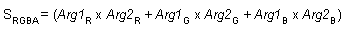

In DirectX 6 and DirectX 7, multitexture operations the above inputs are all shifted down by half (y = x - 0.5) before use to simulate signed data, and the scalar result is automatically clamped to positive values and replicated to all three output channels. Also, note that as a color operation this does not updated the alpha it just updates the RGB components.

However, in DirectX 8.1 shaders you can specify that the output be routed to the .rgb or the .a components or both (the default). You can also specify a separate scalar operation on the alpha channel.

</dd> <dt>

<span id="D3DTOP_MULTIPLYADD"></span><span id="d3dtop_multiplyadd"></span>**D3DTOP\_MULTIPLYADD**
</dt> <dd>

Performs a multiply-accumulate operation. It takes the last two arguments, multiplies them together, and adds them to the remaining input/source argument, and places that into the result.

S<sub>RGBA</sub> = Arg1 + Arg2 \* Arg3

</dd> <dt>

<span id="D3DTOP_LERP"></span><span id="d3dtop_lerp"></span>**D3DTOP\_LERP**
</dt> <dd>

Linearly interpolates between the second and third source arguments by a proportion specified in the first source argument.

S<sub>RGBA</sub> = (Arg1) \* Arg2 + (1- Arg1) \* Arg3.

</dd> <dt>

<span id="D3DTOP_FORCE_DWORD"></span><span id="d3dtop_force_dword"></span>**D3DTOP\_FORCE\_DWORD**
</dt> <dd>

Forces this enumeration to compile to 32 bits in size. Without this value, some compilers would allow this enumeration to compile to a size other than 32 bits. This value is not used.

</dd> </dl>

## Remarks

The members of this type are used when setting color or alpha operations by using the D3DTSS\_COLOROP or D3DTSS\_ALPHAOP values with the [**IDirect3DDevice9::SetTextureStageState**](/windows/win32/api/d3d9helper/nf-d3d9helper-idirect3ddevice9-settexturestagestate) method.

In the above formulas, S<sub>RGBA</sub> is the RGBA color produced by a texture operation, and Arg1, Arg2, and Arg3 represent the complete RGBA color of the texture arguments. Individual components of an argument are shown with subscripts. For example, the alpha component for argument 1 would be shown as Arg1<sub>A</sub>.

## Requirements


| Requirement | Value |
|-------------------|----------------------------------------------------------------------------------------|
| Header<br/> | <dl> <dt>D3D9Types.h</dt> </dl> |


## See also

<dl> <dt>

[Direct3D Enumerations](dx9-graphics-reference-d3d-enums.md)
</dt> <dt>

[**D3DTEXTURESTAGESTATETYPE**](./d3dtexturestagestatetype.md)
</dt> </dl>

 

 
