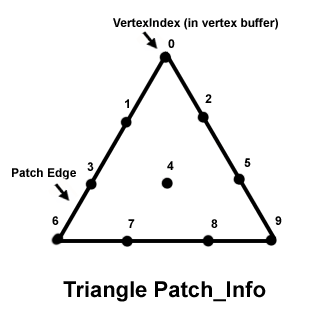

# D3DTRIPATCH\_INFO structure

Describes a triangular high-order patch.

## Syntax


```C++
typedef struct D3DTRIPATCH_INFO {
  UINT          StartVertexOffset;
  UINT          NumVertices;
  D3DBASISTYPE  Basis;
  D3DDEGREETYPE Degree;
} D3DTRIPATCH_INFO, *LPD3DTRIPATCH_INFO;
```


## Members

<dl> <dt>

**StartVertexOffset**
</dt> <dd>

Type: **[**UINT**](../winprog/windows-data-types.md)**

</dd> <dd>

Starting vertex offset, in number of vertices.

</dd> <dt>

**NumVertices**
</dt> <dd>

Type: **[**UINT**](../winprog/windows-data-types.md)**

</dd> <dd>

Number of vertices.

</dd> <dt>

**Basis**
</dt> <dd>

Type: **[**D3DBASISTYPE**](./d3dbasistype.md)**

</dd> <dd>

Member of the [**D3DBASISTYPE**](./d3dbasistype.md) enumerated type, which defines the basis type for the triangular high-order patch. The only valid value for this member is D3DBASIS\_BEZIER.

</dd> <dt>

**Degree**
</dt> <dd>

Type: **[**D3DDEGREETYPE**](./d3ddegreetype.md)**

</dd> <dd>

Member of the [**D3DDEGREETYPE**](./d3ddegreetype.md) enumerated type, defining the degree type for the triangular high-order patch.


| Value                | Number of vertices |
|----------------------|--------------------|
| D3DDEGREE\_CUBIC     | 10                 |
| D3DDEGREE\_LINEAR    | 3                  |
| D3DDEGREE\_QUADRATIC | N/A                |
| D3DDEGREE\_QUINTIC   | 21                 |


 

N/A - Not available. Not supported.

</dd> </dl>

## Remarks

For example, the following diagram identifies the vertex order and segment numbers for a cubic Bézier triangle patch. The vertex order determines the segment numbers used by [**DrawTriPatch**](/windows/win32/api/d3d9helper/nf-d3d9helper-idirect3ddevice9-drawtripatch). The offset is the number of bytes to the first triangle patch vertex in the vertex buffer.



## Requirements


| Requirement | Value |
|-------------------|----------------------------------------------------------------------------------------|
| Header<br/> | <dl> <dt>D3D9Types.h</dt> </dl> |


## See also

<dl> <dt>

[Direct3D Structures](dx9-graphics-reference-d3d-structures.md)
</dt> <dt>

[**DrawTriPatch**](/windows/win32/api/d3d9helper/nf-d3d9helper-idirect3ddevice9-drawtripatch)
</dt> <dt>

[**D3DXTessellateTriPatch**](d3dxtessellatetripatch.md)
</dt> </dl>

 

 
