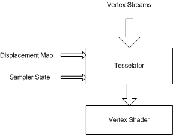

# Displacement Mapping (Direct3D 9)

Displacement maps are similar to texture maps but are accessed by the vertex engine.

## Block Diagram

An additional sampler stage is present in the early part of the vertex pipe, as shown in the following diagram, which can sample a displacement map to provide vertex displacement data.

The displacement map sampler state can be set by the [**SetSamplerState**](/windows/desktop/api) using stage number 256, which is a new stage number. The displacement map texture is set by [**SetTexture**](/windows/win32/api/d3d9helper/nf-d3d9helper-idirect3ddevice9-settexture).

The map can be presampled or not, which means that it can be ordered in a way that enables the lookup of the displacement values without filtering.

-   Displacement maps are analogous to texture maps but are accessed by the vertex engine.
-   An additional sampler stage is present in the early part of the vertex pipe that can sample a displacement map. This stage is accessed by the usual SetSamplerState API but the stage number is D3DDMAPSAMPLER = 256.
-   The displacement map sampler state can be set by the SetSamplerState(D3DDMAPSAMPLER, ...) API.
-   The displacement map texture is set by the SetTexture(D3DDMAPSAMPLER, texture) API.
-   The map can be pre-sampled or not. This means that it can be ordered in a particular way that enables the lookup of the displacement values without filtering.
-   The changes in the declaration structure allow the specification of the texture coordinate used to look up the texture map. For example, Stream0, Offset, FLOAT2, LOOKUP, Displacement\_value. This tells the tessellator to use the 2D float vector in stream0 at a certain offset as a texture coordinate to look up the displacement map and associate the Displacement\_value usage semantic to it. The vertex shader declaration would contain a line similar to {dcl\_texture0, v0} indicating that the texture0 semantic is to be associated with the v0 input register. The displacement value looked up is copied into input register v0.
-   There is a special type of displacement mapping, when the texture map is pre-sampled. Sequential index of generated vertices is used as a texture coordinate to a texture map. For example, 0,0,(D3DDECLTYPE)0,D3DDECLMETHOD\_LOOKUPPRESAMPLED, Usage, UsageIndex.
-   The output of the lookup is 4 floats.
-   Displacement mapping is supported only with N-patches.
-   Drivers need to ignore D3DDMAPSAMPLER in SetTextureStageState if they do not handle displacement maps.
-   D3DTEXF\_ANISOTROPIC filter mode is not supported.
-   When D3DSAMP\_MIPFILTER in the displacement map sampler is not D3DTEXF\_NONE, the level of detail is computed as follows (Note that the adaptive tessellation state is used even if the D3DRS\_ENABLEADAPTIVETESSELLATION is **FALSE**): Tmax = render state D3DRS\_MAXTESSELLATIONLEVEL
-   Compute tessellation level Te for a vertex Vi: (Xi, Yi, Zi) the same way as described in the "Adaptive tessellation" section. Level of detail L = log2(Tmax) - log2 (Te).
-   Texture filtering and sampling operations follow the same rules as the pixel pipeline (level of detail (LOD) bias is applied, etc.).
-   Not all formats can be used as displacement maps but only those that support the D3DUSAGE\_DMAP. The application can query that with the CheckDeviceFormat [**CheckDeviceFormat**](/windows/win32/api/d3d9/nf-d3d9-idirect3d9-checkdeviceformat).
-   D3DUSAGE\_DMAP must be specified in [**CreateTexture**](/windows/win32/api/d3d9helper/nf-d3d9helper-idirect3ddevice9-createtexture) to notify the driver that this texture is to be used as a displacement map.
-   D3DUSAGE\_DMAP can only be used with textures. It cannot be used with cube maps or volumes.
-   Textures and render targets created with D3DUSAGE\_DMAP can be set at regular sampler stages and as render targets.
-   The render states to set the wrap mode for the texture coordinates are ignored in displacement mapping. In general, there are no wrap modes for the tessellator engine.
-   A displacement map sampler has behavior identical to that of the pixel texture samplers. If a texture with less than four channels (like R32f) is looked up, the looked-up values go to the appropriate channels of the destination register (the vertex shader input register tagged with the \_sample semantic), while the other channels default to (1, 1, 1). When looked up, D3DFMT\_L8 gets broadcast into the R, G, B channels and A defaults to 1. The reference rasterizer has the full implementation details.

## Pre-Sampled Displacement Mapping

-   New sampler state is introduced: D3DSAMP\_DMAPOFFSET (DWORD) - offset (in vertices) in a pre-sampled displacement map.
-   New declaration method is introduced: D3DDECLMETHOD\_LOOKUPPRESAMPLED.
-   Adaptive tessellation should be disabled.
-   Texture filter settings are ignored. Point sampling is done. The mip texture filter is assumed to be D3DTEXF\_NONE. All other texture filter modes are assumed to be D3DTEXF\_POINT.
-   Texture coordinates are computed as: U = (Index % TextureWidthInPixeles) / (float)(TextureWidthInPixeles) V = (Index / TextureWidthInPixeles) / (float)(TextureHeightInPixeles) where Index is a sequential index of generated vertices plus TSS\[D3DSAMP\_DMAPOFFSET\]. The sequential index is set to zero at the start of each primitive and is increased after a vertex is generated.

These are the API changes that support displacement mapping.

-   A single channel format added, D3DFMT\_L16.
-   A new usage flag, D3DUSAGE\_DMAP.
-   A special texture stage, used to set a displacement map texture, D3DDMAPSAMPLER.
-   New hardware caps have been added, D3DDEVCAPS2\_DMAPNPATCH and D3DDEVCAPS2\_PRESAMPLEDDMAPNPATCH. See [D3DDEVCAPS2](d3ddevcaps2.md).

## Related topics

<dl> <dt>

[Vertex Pipeline](vertex-pipeline.md)
</dt> </dl>

 

 
