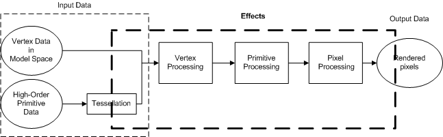

# Effects (Direct3D 9)

A Microsoft DirectX effect enables the integration of vertex and pixel shaders with pipeline state to render objects. Effects are the next logical step in combining shaders to produce unique render conditions.

Effects also provide a convenient way to write shaders for different hardware versions. Because different video cards support different functionalities, an application can write several techniques that will run on a variety of devices. This way, if the application is running on the latest and greatest hardware, the application can run the most sophisticated effect technique. On the other hand, less sophisticated effect techniques can automatically be chosen to run on less-expensive or less-capable hardware.

An effect can replace the vertex processing and part of the pixel processing performed by the graphics pipeline. An example of an effect that uses a vertex shader and a pixel shader is in the BasicHLSL Sample. You can get this sample and learn about it from the DirectX SDK. For info about the DirectX SDK, see [Where is the DirectX SDK?](../directx-sdk--august-2009-.md).

For more information about effects, see these topics:

-   [Writing an Effect](writing-an-effect.md)
-   [Using an Effect](using-an-effect.md)

## Effects and the 3D Pipeline

The following diagram shows the pipeline.

The pipeline transforms input data into output pixels that fill the frame buffer. The input data comes from objects that are made up of vertices in object space, or higher-order surfaces created from N-patches, rectangle patches, and triangle patches. Once the input data has been tessellated, the pipeline performs vertex processing, primitive processing, and pixel processing before generating the final pixel colors.

Vertex and pixel processing can be performed by the fixed function pipeline, or can be implemented with programmable shaders. The input data tessellation, primitive processing, and data outputs are controlled by pipeline state. All this can be integrated into an effect. An effect sets the state that controls how the pipeline functions. Effects manage programmable shaders as well as fixed function state.

Effects can save and restore state, leaving the device in the same state as before the effect was run. The types of state that an effect can manage include:

-   Shader state. This includes creating and deleting shaders, setting shader constants, setting shader state, and rendering with shaders.
-   Texture and sampler state. This includes specifying texture files, initializing texture stages, creating sampler objects, and setting sampler state.
-   Other pipeline state. This includes states for setting transformations, lighting, materials, and rendering options. These can be global or local variables. The variables can be set by either the effect itself or by the application.

Effects contain multiple rendering options called techniques. Each technique encapsulates global variables, pipeline state, texture and sampler state, and shader state. A single style is implemented in a rendering pass. One or more passes can be encapsulated in a technique. All of the passes and techniques can be validated to see if the effect code will run on the hardware device.

## Effects Save and Restore State

Effects manage state. The word state is used very broadly here as it includes all kinds of information that the pipeline needs to specify the render conditions. This includes nearly all the functional areas of the pipeline.

Rendering options are controlled by techniques and passes. An application renders an effect by setting one active technique, and rendering one or more passes. All rendering in an effect is done within a matching pair of [**Begin**](id3dxeffect--begin.md) and [**End**](id3dxeffect--end.md) calls. When **Begin** is called, a stateblock is created and device state is saved (unless you specify otherwise). After a technique renders the passes that the application specifies to render, **End** is called to end the active technique. The effect system responds by automatically restoring the pipeline state that was captured in the state block (unless you choose to disable this save and restore functionality).

When programming multiple-pass rendering sequences, each of which requires its own state setup, effects can reduce the housekeeping required for tracking state changes. To see more information about the states that can be saved and restored by effects, see [Effect States (Direct3D 9)](effect-states.md).

## Effects Can Share Parameters

Effect parameters are all the non-static variables declared in an effect. This can include global variables and annotations. Effect parameters can be shared between different effects by declaring parameters with the shared keyword and then creating the effect with an effect pool.

Cloned effects use the same effect pool as the effect from which they are cloned. Cloning an effect makes an exact copy of an effect, including global variables, techniques, passes, and annotations.

## Related topics

<dl> <dt>

[Programming Guide for Direct3D 9](dx9-graphics-programming-guide.md)
</dt> </dl>

 

 
