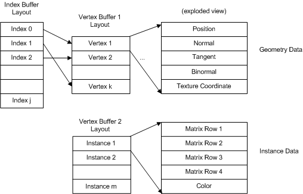
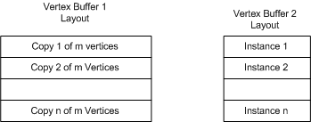

# Efficiently Drawing Multiple Instances of Geometry (Direct3D 9)

Given a scene that contains many objects that use the same geometry, you can draw many instances of that geometry at different orientations, sizes, colors, and so on with dramatically better performance by reducing the amount of data you need to supply to the renderer.

This can be accomplished through the use of two techniques: the first for drawing indexed geometry and the second for non-indexed geometry. Both techniques use two vertex buffers: one to supply geometry data and one to supply per-object instance data. The instance data can be a wide variety of information such as a transform, color data, or lighting data - basically anything that you can describe in a vertex declaration. Drawing many instances of geometry with these techniques can dramatically reduce the amount of data sent to the renderer.

-   [Drawing Indexed Geometry](#drawing-indexed-geometry)
    -   [Indexed Geometry Performance Comparison](#indexed-geometry-performance-comparison)
-   [Drawing Non-Indexed Geometry](#drawing-non-indexed-geometry)
    -   [Non-Indexed Geometry Performance Comparison](#non-indexed-geometry-performance-comparison)
-   [Related topics](#related-topics)

## Drawing Indexed Geometry

The vertex buffer contains per-vertex data that is defined by a vertex declaration. Suppose that part of each vertex contains geometry data, and part of each vertex contains per-object instance data, as shown in the following diagram.



This technique requires a device that supports the 3\_0 vertex shader model. This technique works with any programmable shader but not with the fixed function pipeline.

For the vertex buffers shown above, here are the corresponding vertex buffer declarations:


```
const D3DVERTEXELEMENT9 g_VBDecl_Geometry[] =
{
{0,  0, D3DDECLTYPE_FLOAT3, D3DDECLMETHOD_DEFAULT, D3DDECLUSAGE_POSITION, 0},
{0, 12, D3DDECLTYPE_FLOAT3, D3DDECLMETHOD_DEFAULT, D3DDECLUSAGE_NORMAL,   0},
{0, 24, D3DDECLTYPE_FLOAT3, D3DDECLMETHOD_DEFAULT, D3DDECLUSAGE_TANGENT,  0},
{0, 36, D3DDECLTYPE_FLOAT3, D3DDECLMETHOD_DEFAULT, D3DDECLUSAGE_BINORMAL, 0},
{0, 48, D3DDECLTYPE_FLOAT2, D3DDECLMETHOD_DEFAULT, D3DDECLUSAGE_TEXCOORD, 0},
D3DDECL_END()
};

const D3DVERTEXELEMENT9 g_VBDecl_InstanceData[] =
{
{1, 0,  D3DDECLTYPE_FLOAT4, D3DDECLMETHOD_DEFAULT, D3DDECLUSAGE_TEXCOORD, 1},
{1, 16, D3DDECLTYPE_FLOAT4, D3DDECLMETHOD_DEFAULT, D3DDECLUSAGE_TEXCOORD, 2},
{1, 32, D3DDECLTYPE_FLOAT4, D3DDECLMETHOD_DEFAULT, D3DDECLUSAGE_TEXCOORD, 3},
{1, 48, D3DDECLTYPE_FLOAT4, D3DDECLMETHOD_DEFAULT, D3DDECLUSAGE_TEXCOORD, 4},
{1, 64, D3DDECLTYPE_FLOAT4, D3DDECLMETHOD_DEFAULT, D3DDECLUSAGE_COLOR,    0},
D3DDECL_END()
};
```


These declarations define two vertex buffers. The first declaration (for stream 0, indicated by the zeros in column 1) defines the geometry data which consists of: position, normal, tangent, binormal, and texture coordinate data.

The second declaration (for stream 1, indicated by the ones in column 1) defines the per-object instance data. Each instance is defined by four four-component floating point numbers, and a four-component color. The first four values could be used to initialize a 4x4 matrix, which means that this data will uniquely size, position, and rotate each instance of the geometry. The first four components use a texture coordinate semantic which, in this case, means "this is a general four-component number." When you use arbitrary data in a vertex declaration, use a texture coordinate semantic to mark it. The last element in the stream is used for color data. This could be applied in the vertex shader to give each instance a unique color.

Before rendering, you need to call [**SetStreamSourceFreq**](/windows/win32/api/d3d9helper/nf-d3d9helper-idirect3ddevice9-setstreamsourcefreq) to bind the vertex buffer streams to the device. Here is an example that binds both vertex buffers:


```
// Set up the geometry data stream
pd3dDevice->SetStreamSourceFreq(0,
    (D3DSTREAMSOURCE_INDEXEDDATA | g_numInstancesToDraw));
pd3dDevice->SetStreamSource(0, g_VB_Geometry, 0,
    D3DXGetDeclVertexSize( g_VBDecl_Geometry, 0 ));

// Set up the instance data stream
pd3dDevice->SetStreamSourceFreq(1,
    (D3DSTREAMSOURCE_INSTANCEDATA | 1));
pd3dDevice->SetStreamSource(1, g_VB_InstanceData, 0, 
    D3DXGetDeclVertexSize( g_VBDecl_InstanceData, 1 ));
```


[**SetStreamSourceFreq**](/windows/win32/api/d3d9helper/nf-d3d9helper-idirect3ddevice9-setstreamsourcefreq) uses [D3DSTREAMSOURCE\_INDEXEDDATA](other-direct3d-constants.md) to identify the indexed geometry data. In this case, stream 0 contains the indexed data that describes the object geometry. This value is logically combined with the number of instances of the geometry to draw.

Note that D3DSTREAMSOURCE\_INDEXEDDATA and the number of instances to draw must always be set in stream zero.

In the second call, [**SetStreamSourceFreq**](/windows/win32/api/d3d9helper/nf-d3d9helper-idirect3ddevice9-setstreamsourcefreq) uses [D3DSTREAMSOURCE\_INSTANCEDATA](other-direct3d-constants.md) to identify the stream containing the instance data. This value is logically combined with 1 since each vertex contains one set of instance data.

The last two calls to [**SetStreamSource**](/windows/win32/api/d3d9helper/nf-d3d9helper-idirect3ddevice9-setstreamsource) bind the vertex buffer pointers to the device.

When you are finished rendering the instance data, be sure to reset the vertex stream frequency back to its default state (which does not use instancing). Because this example used two streams, set both streams as shown below:


```
pd3dDevice->SetStreamSourceFreq(0,1);
pd3dDevice->SetStreamSourceFreq(1,1);
```


### Indexed Geometry Performance Comparison

While it is not possible to make a single conclusion about how much this technique could reduce the render time in every application, consider the difference in the amount of data streamed into the runtime and the number of state changes that will be reduced if you use the instancing technique. This render sequence takes advantage of drawing multiple instances of the same geometry:


```
if( SUCCEEDED( pd3dDevice->BeginScene() ) )
{
    // Set up the geometry data stream
    pd3dDevice->SetStreamSourceFreq(0,
                (D3DSTREAMSOURCE_INDEXEDDATA | g_numInstancesToDraw));
    pd3dDevice->SetStreamSource(0, g_VB_Geometry, 0,
                D3DXGetDeclVertexSize( g_VBDecl_Geometry, 0 ));

    // Set up the instance data stream
    pd3dDevice->SetStreamSourceFreq(1,
                (D3DSTREAMSOURCE_INSTANCEDATA | 1));
    pd3dDevice->SetStreamSource(1, g_VB_InstanceData, 0, 
                D3DXGetDeclVertexSize( g_VBDecl_InstanceData, 1 ));

    pd3dDevice->SetVertexDeclaration( ... );
    pd3dDevice->SetVertexShader( ... );
    pd3dDevice->SetIndices( ... );

    pd3dDevice->DrawIndexedPrimitive( D3DPT_TRIANGLELIST, 0, 0, 
                g_dwNumVertices, 0, g_dwNumIndices/3 );
    
    pd3dDevice->EndScene();
}
```


Notice that the render loop is called once, the geometry data is streamed once, and n instances are streamed once. This next render sequence is identical in functionality, but does not take advantage of instancing:


```
if( SUCCEEDED( pd3dDevice->BeginScene() ) )
{
    for(int i=0; i < g_numObjects; i++)
    {
        pd3dDevice->SetStreamSource(0, g_VB_Geometry, 0,
                D3DXGetDeclVertexSize( g_VBDecl_Geometry, 0 ));


        pd3dDevice->SetVertexDeclaration( ... );
        pd3dDevice->SetVertexShader( ... );
        pd3dDevice->SetIndices( ... );

        pd3dDevice->DrawIndexedPrimitive( D3DPT_TRIANGLELIST, 0, 0, 
                g_dwNumVertices, 0, g_dwNumIndices/3 );
    }                             
    
    pd3dDevice->EndScene();
}
```


Notice that the entire render loop is wrapped by a second loop to draw each object. Now the geometry data is streamed into the renderer n times (instead of once) and any pipeline states may also be set redundantly for each object drawn. This render sequence is very likely to be significantly slower. Notice also that the parameters to [**DrawIndexedPrimitive**](/windows/win32/api/d3d9helper/nf-d3d9helper-idirect3ddevice9-drawindexedprimitive) have not changed between the two render loops.

## Drawing Non-Indexed Geometry

In [Drawing Indexed Geometry](#drawing-indexed-geometry), vertex buffers were configured to draw multiple instances of indexed geometry with greater efficiency. You can also use [**SetStreamSourceFreq**](/windows/win32/api/d3d9helper/nf-d3d9helper-idirect3ddevice9-setstreamsourcefreq) to draw non-indexed geometry. This requires a different vertex buffer layout and has different constraints. To draw non-indexed geometry, prepare your vertex buffers like the following diagram.



This technique is not supported by hardware acceleration on any device. It is only supported by software vertex processing and will work only with [vs\_3\_0](../direct3dhlsl/dx9-graphics-reference-asm-vs-3-0.md) shaders.

Because this technique works with non-indexed geometry, there is no index buffer. As the diagram shows, the vertex buffer that contains geometry contains n copies of the geometry data. For each instance drawn, the geometry data is read from the first vertex buffer and the instance data is read from the second vertex buffer.

Here are the corresponding vertex buffer declarations:


```
const D3DVERTEXELEMENT9 g_VBDecl_Geometry[] =
{
{0,  0, D3DDECLTYPE_FLOAT3, D3DDECLMETHOD_DEFAULT, D3DDECLUSAGE_POSITION, 0},
{0, 12, D3DDECLTYPE_FLOAT3, D3DDECLMETHOD_DEFAULT, D3DDECLUSAGE_NORMAL,   0},
{0, 24, D3DDECLTYPE_FLOAT3, D3DDECLMETHOD_DEFAULT, D3DDECLUSAGE_TANGENT,  0},
{0, 36, D3DDECLTYPE_FLOAT3, D3DDECLMETHOD_DEFAULT, D3DDECLUSAGE_BINORMAL, 0},
{0, 48, D3DDECLTYPE_FLOAT2, D3DDECLMETHOD_DEFAULT, D3DDECLUSAGE_TEXCOORD, 0},
D3DDECL_END()
};

const D3DVERTEXELEMENT9 g_VBDecl_InstanceData[] =
{
{1, 0,  D3DDECLTYPE_FLOAT4, D3DDECLMETHOD_DEFAULT, D3DDECLUSAGE_TEXCOORD, 1},
{1, 16, D3DDECLTYPE_FLOAT4, D3DDECLMETHOD_DEFAULT, D3DDECLUSAGE_TEXCOORD, 2},
{1, 32, D3DDECLTYPE_FLOAT4, D3DDECLMETHOD_DEFAULT, D3DDECLUSAGE_TEXCOORD, 3},
{1, 48, D3DDECLTYPE_FLOAT4, D3DDECLMETHOD_DEFAULT, D3DDECLUSAGE_TEXCOORD, 4},
{1, 64, D3DDECLTYPE_FLOAT4, D3DDECLMETHOD_DEFAULT, D3DDECLUSAGE_COLOR,    0},
D3DDECL_END()
};
```


These declarations are identical to the declarations made in the indexed geometry example. Once again, the first declaration (for stream 0) defines the geometry data and the second declaration (for stream 1) defines the per-object instance data. When you create the first vertex buffer, be sure to load it with the number of instances of the geometry data that you will be drawing.

Before rendering, you need to set up the divider which tells the runtime how to divide up the first vertex buffer into n instances. Then set the divider using [**SetStreamSourceFreq**](/windows/win32/api/d3d9helper/nf-d3d9helper-idirect3ddevice9-setstreamsourcefreq) like this:


```
// Set the divider
pd3dDevice->SetStreamSourceFreq(0, 1);
// Bind the stream to the vertex buffer
pd3dDevice->SetStreamSource(0, g_VB_Geometry, 0,
        D3DXGetDeclVertexSize( g_VBDecl_Geometry, 0 ));

// Set up the instance data stream
pd3dDevice->SetStreamSourceFreq(1, verticesPerInstance);
pd3dDevice->SetStreamSource(1, g_VB_InstanceData, 0, 
        D3DXGetDeclVertexSize( g_VBDecl_InstanceData, 1 ));
```


The first call to [**SetStreamSourceFreq**](/windows/win32/api/d3d9helper/nf-d3d9helper-idirect3ddevice9-setstreamsourcefreq) says that stream 0 contains n instances of m vertices. [**SetStreamSource**](/windows/win32/api/d3d9helper/nf-d3d9helper-idirect3ddevice9-setstreamsource) then binds stream 0 to the geometry vertex buffer.

In the second call, [**SetStreamSourceFreq**](/windows/win32/api/d3d9helper/nf-d3d9helper-idirect3ddevice9-setstreamsourcefreq) identifies stream 1 as the source of the instance data. The second parameter is the number of vertices in each object (m). Remember that the instance data stream must always be declared as the second stream. [**SetStreamSource**](/windows/win32/api/d3d9helper/nf-d3d9helper-idirect3ddevice9-setstreamsource) then binds stream 1 to the vertex buffer that contains the instance data.

When you are finished rendering the instance data, be sure to reset the vertex stream frequency back to its default state. Because this example used two streams, set both streams as shown below:


```
pd3dDevice->SetStreamSourceFreq(0,1);
pd3dDevice->SetStreamSourceFreq(1,1);
```


### Non-Indexed Geometry Performance Comparison

The major advantage of this instancing style is that it can be used on non-indexed geometry. While it is not possible to make a single conclusion about how much this technique could reduce the render time in every application, consider the difference in the amount of data streamed into the runtime, and the number of state changes that will be reduced for the following render sequence:


```
if( SUCCEEDED( pd3dDevice->BeginScene() ) )
{
    // Set the divider
    pd3dDevice->SetStreamSourceFreq(0, 1);
    pd3dDevice->SetStreamSource(0, g_VB_Geometry, 0,
                D3DXGetDeclVertexSize( g_VBDecl_Geometry, 0 ));

    // Set up the instance data stream
    pd3dDevice->SetStreamSourceFreq(1, verticesPerInstance));
    pd3dDevice->SetStreamSource(1, g_VB_InstanceData, 0, 
                D3DXGetDeclVertexSize( g_VBDecl_InstanceData, 1 ));

    pd3dDevice->SetVertexDeclaration( ... );
    pd3dDevice->SetVertexShader( ... );
    pd3dDevice->SetIndices( ... );

    pd3dDevice->DrawIndexedPrimitive( D3DPT_TRIANGLELIST, 0, 0, 
                g_dwNumVertices, 0, g_dwNumIndices/3 );
    
    pd3dDevice->EndScene();
}
```


Notice that the render loop is called once. The geometry data is streamed once although there are n instances of the geometry being streamed. The data from the instance vertex buffer is streamed once. This next render sequence is identical in functionality, but does not take advantage of instancing:


```
if( SUCCEEDED( pd3dDevice->BeginScene() ) )
{
    for(int i=0; i < g_numObjects; i++)
    {
        pd3dDevice->SetStreamSource(0, g_VB_Geometry, 0,
                D3DXGetDeclVertexSize( g_VBDecl_Geometry, 0 ));

        pd3dDevice->SetVertexDeclaration( ... );
        pd3dDevice->SetVertexShader( ... );
        pd3dDevice->SetIndices( ... );

        pd3dDevice->DrawIndexedPrimitive( D3DPT_TRIANGLELIST, 0, 0, 
                g_dwNumVertices, 0, g_dwNumIndices/3 );
    }
    
    pd3dDevice->EndScene();
}
```


Without instancing, the render loop needs to be wrapped by a second loop to draw each object. By eliminating the second render loop, you should expect better performance due to fewer render state changes that are called inside the loop.

Overall, it is reasonable to expect the indexed technique ([Drawing Indexed Geometry](#drawing-indexed-geometry)) to perform better than the non-indexed technique ([Drawing Non-Indexed Geometry](#drawing-non-indexed-geometry)) because the indexed technique only streams one copy of the geometry data. Notice that the parameters to [**DrawIndexedPrimitive**](/windows/win32/api/d3d9helper/nf-d3d9helper-idirect3ddevice9-drawindexedprimitive) have not changed for any of the render sequences.

## Related topics

<dl> <dt>

[Advanced Topics](advanced-topics.md)
</dt> <dt>

[Instancing Sample](https://msdn.microsoft.com/library/Ee418269(v=VS.85).aspx)
</dt> </dl>

 

 
