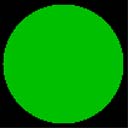
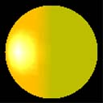

# Emissive Lighting (Direct3D 9)

Emissive lighting is described by a single term.

Emissive Lighting = Cₑ

Where:


| Parameter | Default value | Type          | Description     |
|-----------|---------------|---------------|-----------------|
| Cₑ        | (0,0,0,0)     | D3DCOLORVALUE | Emissive color. |


 

The value for Cₑ is either:

-   vertex color1, if EMISSIVEMATERIALSOURCE = D3DMCS\_COLOR1, and the first vertex color is supplied in the vertex declaration.
-   vertex color2, if EMISSIVEMATERIALSOURCE = D3DMCS\_COLOR2, and the second vertex color is supplied in the vertex declaration.
-   material emissive color

> [!Note]  
> If either EMISSIVEMATERIALSOURCE option is used, and the vertex color is not provided, the material emissive color is used.

 

## Example

In this example, the object is colored using the scene ambient light and a material ambient color. The code is shown below.


```
// create material
D3DMATERIAL9 mtrl;
ZeroMemory( &mtrl, sizeof(mtrl) );
mtrl.Emissive.r = 0.0f;
mtrl.Emissive.g = 0.75f;
mtrl.Emissive.b = 0.0f;
mtrl.Emissive.a = 0.0f;
m_pd3dDevice->SetMaterial( &mtrl );
m_pd3dDevice->SetRenderState(D3DRS_EMISSIVEMATERIALSOURCE, D3DMCS_MATERIAL);
```


According to the equation, the resulting color for the object vertices is the material color.

The following illustration shows the material color, which is green. Emissive light lights all object vertices with the same color. It is not dependent on the vertex normal or the light direction. As a result, the sphere looks like a 2D circle because there is no difference in shading around the surface of the object.



The following illustration shows how the emissive light blends with the other three types of lights, from the previous examples. On the right side of the sphere, there is a blend of the green emissive and the red ambient light. On the left side of the sphere, the green emissive light blends with red ambient and diffuse light producing a red gradient. The specular highlight is white in the center and creates a yellow ring as the specular light value falls off sharply leaving the ambient, diffuse and emissive light values which blend together to make yellow.



## Related topics

<dl> <dt>

[Mathematics of Lighting](mathematics-of-lighting.md)
</dt> </dl>

 

 


