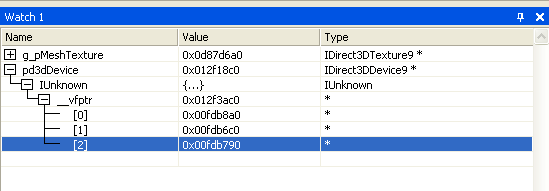
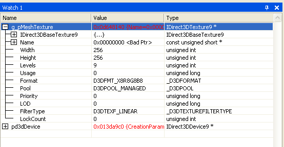

# Enabling Direct3D Debug Information (Direct3D 9)

Are you trying to find out more information about Direct3D objects during debug? For instance, the following screen shot shows what you typically see when you look at a Direct3D interface in the watch window.



You can enable the core debug objects so that a mirrored object which contains all of the properties of the object can be viewed in the watch window. Simply include the following \#define in your code before the D3D9.h file:


```
#define D3D_DEBUG_INFO
```


To enable debug information, the \#define must get built before the D3D9.h file (Any program using DXUT will automatically enable D3D\_DEBUG\_INFO when the program is compiled for debug). If you are running a SDK sample, you can see this in DXStdAfx.h (which affects all the C++ samples). You must also be running the debug Direct3D runtime (which can be enabled from the Control Panel if necessary).

Here's an example using the [BasicHLSL Sample](https://msdn.microsoft.com/library/Ee416223(v=VS.85).aspx).

1.  Add the \#define to the Dxstdafx.h file before line 37.
2.  Build a debug project.
3.  Set a breakpoint at line 307 in BasicHLSL.cpp
4.  Run the debugger.

The following screen shot shows the kind of detailed information you can get about a Direct3D texture object from the watch window.



> [!Note]
>
> The object property names are visible and the values are correct only when the debug runtime is enabled. When running against the retail runtime, the values are invalid.

 

## Use the Call Stack for Extended Debug

With Direct3D debug enabled, you can also look at a call stack each time an object is created. This will make your application very slow, but can be used to check for resource leaks. To write out the call stack, set the following registry key to 1:


```
\\HKEY_LOCAL_MACHINE\\SOFTWARE\\Microsoft\\Direct3D\\
D3D9Debugging\\EnableCreationStack
```


Building your application with debug enabled will give you access to this additional variable:


```
  LPCWSTR CreationCallStack;
```


This variable will store the call stack each time that an object is created. This will make your application very slow, but can be used to debug resource leaks.

## Related topics

<dl> <dt>

[Programming Tips](programming-tips.md)
</dt> </dl>

 

 


