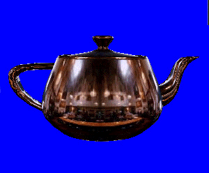

# Environment Mapping (Direct3D 9)

Environment mapping is a technique that simulates highly reflective surfaces without using ray tracing. In practice, environment mapping applies a special texture map that contains an image of the scene surrounding an object to the object itself. The result approximates the appearance of a reflective surface, close enough to fool the eye, without incurring any of the complex computations involved in ray tracing.

The following illustration demonstrates a type of environment mapping called spherical environment mapping. For details, see [Spherical Environment Mapping](spherical-environment-mapping.md).

The teapot in this image appears to reflect its surroundings; this is actually a texture being applied to the object. Because environment mapping uses a texture, combined with specially computed texture coordinates, it can be performed in real-time.

This section provides information about performing two common types of environment mapping with Direct3D. There are many types of environment mapping in use throughout the graphics industry, but the following topics target the two most common forms: cubic environment mapping and spherical environment mapping.

-   [Cubic Environment Mapping](cubic-environment-mapping.md)
-   [Spherical Environment Mapping](spherical-environment-mapping.md)

## Related topics

<dl> <dt>

[Pixel Pipeline](pixel-pipeline.md)
</dt> </dl>

 

 

